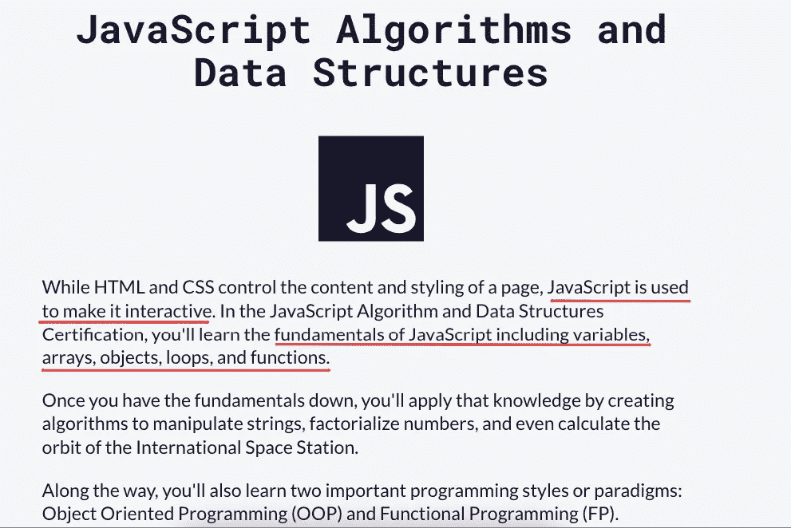

# 如何在 2022 年开始成为一名前端 Web 开发人员(免费资源的完整路线图)

> 原文：<https://javascript.plainenglish.io/front-end-web-developer-roadmap-97ee759c5a9d?source=collection_archive---------1----------------------->

## 2022 年如何成为前端 web 开发者指南？


Photo by [Kevin Ku](https://unsplash.com/@ikukevk?utm_source=medium&utm_medium=referral) on [Unsplash](https://unsplash.com?utm_source=medium&utm_medium=referral)

在 2022 年成为一名自学成才的 web 开发人员比以往任何时候都容易。周围有大量的免费资源，也有容易跟进的资源可以帮助你保持正确的方向。

首先。有很多令人惊奇的免费资源可供你学习。当然，你可以在 Udemy、Coursera 等网站上购买大量课程。而且一堆都挺好的。酪我在这里告诉你，有几个免费课程一样好，如果不是更好的话。

让我们冲一杯新鲜的咖啡，然后开始吧。

# 第一步。熟悉命令行

无论你选择哪种编程语言。

不管你的电脑运行的是什么操作系统。

熟悉命令行(或您的终端)是必须的。你需要在这里一遍又一遍地做事情。


您将在这里做的大多数事情都相当普通，例如，安装 Node.js，准备好您的开发环境，等等。

酪随着您在编程之旅中的进一步发展，您会发现自己越来越多地使用终端。

所以从一开始就掌握它是有意义的。

好消息是什么？这并不难，你很快就会习惯你的终端。所以为什么不去做呢？

如果你喜欢视频，FreeCodeCamp.org 有一个不错的小视频:

如果你更喜欢文本内容丰富的教程，这里有几个选择:

1.  [新手命令行](https://ubuntu.com/tutorials/command-line-for-beginners)(Ubuntu 提供)
2.  [命令行的完整介绍指南](https://learntocodewith.me/learn/command-line/)
3.  [学习命令行](https://www.codecademy.com/learn/learn-the-command-line)(通过 Codecademy)
4.  命令行速成班(由 Mozilla 提供)

你应该关注的是学会如何做基本的事情。例如，创建目录、文件等。，在目录间导航，删除目录，安装软件包。您可以使用命令行做更多的事情，但是首先，这些将满足您的大部分需求。

如果需要的话，你总是可以得到更高级的东西。

# 第二步。熟悉 Git

Git 是一个版本控制系统。

它帮助你保持你的代码有组织，跟踪你在你的代码中所做的任何改变，甚至可以作为你代码的备份。

您可以使用多个 git 提供程序:

*   [GitHub](https://github.com/)
*   [GitLab](https://gitlab.com/)
*   [比特桶](https://bitbucket.org/)

你可以选择其中任何一个。我开始使用 GitHub，从那时起，我就一直坚持使用它。


与命令行非常相似，在 git 中您可以做很多事情，但是要开始您的 web 开发之旅，您需要学习一些事情:

1.  如何将您的本地开发环境(您的计算机)连接到您的 git 帐户
2.  如何创建新的存储库
3.  如何将您的代码推送到 git repo ( *这是您最常做的事情*
4.  如何将代码从 git repo 中提取到您的计算机中

从这个视频中你可以很快学会 Git:

Brad Traversy 创建了一系列对开发者学习过程中各个阶段都有帮助的精彩内容。如果你发现自己掉进了兔子洞，疯狂地观看他的视频，这是完全可以理解的。😁

# 第三步。选择代码编辑器。(Pssst。直接下载 VSCode)

你需要一个代码编辑器。

这是您编写代码的地方。这是你会用得最多的一款软件，而且会花你大部分的时间。用你最新的代码库更新你的 git repo。将您的网站部署到生产环境中(一个 web URL)。所有这些，你都可以在你的代码编辑器中完成。

VSCode 是一个免费的代码编辑器，功能非常强大，可以通过添加主题和扩展使其更加强大。你可以从这里[下载。](https://code.visualstudio.com/)

FreeCodeCamp 有一个关于 VSCode 的速成视频，你可以用它来了解更多。不过，提醒一句，它差不多有 1.5 个小时长。如果你正在寻找一些花费较少时间的东西，稍后会有 Brad 视频的链接。

Brad 在 VSCode 上的视频:

1.  [VSCode 简介和设置](https://www.youtube.com/watch?v=fnPhJHN0jTE) (38 分钟)
2.  [面向前端开发人员的 VSCode 扩展](https://www.youtube.com/watch?v=LdF2RcelRg0) (28 分钟)
3.  [VSCode 快捷键](https://www.youtube.com/watch?v=4xA5JePvCJc) (17 分钟)

# 第四步。通过创建一个简单的网站来熟悉部署过程

我非常喜欢边做边学。让我们这样做吧。

*   在您的 GitHub 帐户中创建一个空回购
*   向其中添加一个简单的 index.html 文件。
*   将以下代码添加到您的 index.html 文件中

```
<html><head></head><body><h1>Hello World<h1></body></html>
```

> 提示:只需输入“！”就可以在 VSCode 中创建一个样本 html 文件并选择 emmet 缩写。VSCode 将为您创建文件。现在，您需要做的就是在 VSCode 刚刚为您插入的 标记中写入“Hello world”。

*   将您的代码推送到您的 git repo ( *一旦您熟悉了 GitHub，您应该知道如何做了*

这是最难的部分。

将其部署到 web URL 很容易。

在 [Vercel](https://vercel.com/) 上创建一个免费账户。将您的 GitHub 帐户连接到您的 Vercel 帐户。

一旦您连接了这两个项目，您将能够在 Vercel 中创建一个新项目，并选择您刚刚创建 index.html 文件的 GitHub repo。

按“部署”。

就是这样。几分钟内，Vercel 将部署您的网站，并给你一个网址，你可以看到自己。

更重要的是:

1.  任何时候你对你的文件进行修改，只要你把它推送到你的 GitHub repo，Vercel 就会自动在你的网站上进行修改
2.  index.html 将会出现在 https://your domain . ver cel . app 上。如果您创建了一个 about.html，它将可以在[https://yourdomain.vercel.app/about.html](https://yourdomain.vercel.app/about.html)上访问
3.  Vercel 将为您的域处理 SSL 证书。你所有的网站在浏览器的地址栏里都会有一个甜绿的锁，表示一个安全的网站。
4.  通过将您拥有的任何域添加到项目的域设置中，您将能够更改看到您网站的 URL。免费的！

有一堆其他的主机可供您选择。从 [Heroku](https://heroku.com/) 到 [Netlify](https://www.netlify.com/) 。从谷歌的 [Firebase](https://firebase.google.com/) 到 [GitHub 页面](https://pages.github.com/)。以我的经验来看，Vercel 是其中最容易最简单的，所以一旦开始使用，就再也没有回头过。

# 第五步。开始创建网站

好吧。这将是一个有争议的步骤，但这是我自己遵循的，也是我推荐的。

你会看到许多文章倡导你一种不同的方法，从一种有意义的基础的和理论的方法。

他们的方法分为五个步骤:

1.  学习 HTML 和 CSS 的基础知识
2.  学习 JavaScript 的基础知识
3.  学习一个 CSS 框架(顺风，引导，布尔玛等)。)
4.  学习一个 JS 框架(React.js，Vue.js， [Svelte](https://svelte.dev/) 等)。)
5.  练习，练习，再练习。

我发现自己陷入了教程地狱。外面有太多的内容，在你开始取得任何进展之前，你可以学习几个星期，几个月，几个月。

在即时满足的世界里，几周和几个月对我来说是不够的。

所以我开始挑选项目并开发它们。这就是我向你推荐的方法。

## 这种方法的好处是:

*   它更快
*   它更简单
*   更令人欣慰的是

## 这种方法的缺点是:

*   你会更频繁地面对问题
*   你会偶尔发现更好的做事方法
*   你会学到新的东西，如果你知道得越早，你之前的项目会变得更容易、更快

## 这一切的最大好处是:

你可以开始使用这种方法，一周之内你就会有第一个完全响应的 HTML 模板在 Gumroad、Themeforest 或者任何你想卖主题的地方出售。

## 如何开始使用这种方法:

1.  花两天时间学习 HTML 的基础知识，一些 CSS，和一些 JavaScript。你不应该花太多时间去学习你能学到的一切。你需要学习足够多的语言来让你理解。
2.  花 2 天时间学习 Vue.js 的基础知识，用 Vue 搭建一个简单的 webapp。*跟随任何基本的 youtube 教程。做什么都行。没关系。你只是让自己熟悉框架。*
3.  访问 https://nuxtjs.org/docs/get-started/installation[创建你的第一个 Nuxt.js 项目。(Nuxt 是 Vue 的一个框架，Vue 本身就是 JavaScript 的一个框架。使用 Nuxt 将加速你的开发过程，从长远来看对你更好。)](https://nuxtjs.org/docs/get-started/installation)
4.  开始创建简单的应用程序和组件。例如，(1)创建一个简单的网站，其中包含您喜欢的网站的菜单，(2)创建一个待办事项应用程序，(3)创建一个使用天气 API 显示天气的网站，(4)创建一个页面登录受保护的网站，即您需要登录才能访问该页面。

你创建的每一个网站(或网络应用)都会帮助你问多个问题，所有问题都遵循相同的格式:“我该怎么做？”

找出那个问题的答案。在您的项目中使用该解决方案。你最终会学到更多的东西，并且比简单地跟着一个又一个教程学习更容易记住。

你练习得越多，你就能越好地建造你能想到的任何东西。

但是如果你不想遵循这种非常规的方法呢？

如果你倾向于用传统的方式做事，你应该那样做。我们都应该遵循最适合我们的方法，也是我们最习惯的方法。

核心目标是一样的。帮助您学习成为一名出色的前端开发人员所需的核心基础知识。

# 这里有一个网站和资源列表，会给你很大的帮助:

## 1. [freeCodeCamp](https://www.freecodecamp.org/)

你可能已经听说过 freeCodeCamp。如果你没有，今天就去[看看吧](https://www.freecodecamp.org/learn/responsive-web-design/)！


由[昆西·拉森](https://medium.com/u/17756313f41a?source=post_page-----97ee759c5a9d--------------------------------)创办的媒体出版物如今已经成为网络开发者的首选目标之一。

无论你能想到什么，他们都有相应的课程。


## 2. [#100DaysOfCode](https://www.100daysofcode.com/)

> 如果你想走得快，那就一个人走。但如果你想走远，那就一起走。

[100DaysOfCode 就是这么回事](https://www.100daysofcode.com/faq/)。

学习 web 开发，就像学习任何新技能一样，一开始是一项挑战，随着时间的推移会变得更容易。

问题是，许多人在早期就放弃了。进来，#100DaysOfCode。

顾名思义，这是一个 Twitter 标签，它经受住了时间的考验。每天都有越来越多的 web 开发人员加入这一挑战。


It is all about the community with this one ([https://www.100daysofcode.com/rules/](https://www.100daysofcode.com/rules/))

这个想法不仅仅是帮助你学习，通过与你周围的每个人分享你的进步来确保你对自己负责，同时，帮助你认识到:

a.你并不孤单。无数其他人正在艰难跋涉。有时候，这种单一的团结感是你所需要的。

b.你是比你自己更大的东西的一部分。您将不断地发现自己与开发人员面对面，他们正在与您几周前所面临的问题进行斗争。你是让他们知道事情变得更容易的最佳人选。你是告诉他们坚持下去的最佳人选。

c.寻求帮助是可以的。很多时候，你会面临你无法独自应对的挑战。在那些时候，你应该积极寻求他人的帮助和指导。就像你愿意帮助别人一样，你会发现有无数人愿意帮助你。

你可以在他们的官方网站上了解更多关于挑战的信息。

## 3.[尾翼 CSS](https://tailwindcss.com/)

如果你刚刚开始 web 开发，我希望你忘记学习 CSS。

我希望你忘记这个事实，其他 CSS 框架甚至存在。

我只是想让你抓住顺风，并坚持下去。


它将使你的 web 开发变得如此轻松和快速，以至于一旦你开始使用 Tailwind，你会发现甚至很难去考虑任何其他的 CSS 框架。

哦，你的 CSS 文件呢？最终编译出的可用 CSS 文件足够小，可以让你的站点快速加载。但是因为我们才刚刚开始，我们现在不会太担心这个。

当你开始时，你会发现自己经常参考[他们的文档](https://tailwindcss.com/docs/installation)来找出你需要使用的实用程序类。他们详细的文档使这个过程非常顺利，没有压力。

随着您继续使用 Tailwind 开发越来越多的网站和组件，您会发现参考它们的文档的需求会随着时间的推移而减少。

下面是用 100 秒解释的顺风:

既然你已经爱上了顺风，那么请看[亚当·瓦森](https://medium.com/u/2bdb4734b294?source=post_page-----97ee759c5a9d--------------------------------)(顺风的创始人)用顺风在一个实时流中构建了 Vercel 仪表盘:

或者，如果你正在寻找一个简短而甜蜜的教程，这里有一个由 Fireship:

PS:我不打算在这里包括两个教程，但后来我在 Fireship 视频上看到了这些评论。


即使在阅读完这些内容后，如果不把视频包括进来，那将是一种罪过。

总之。如果你还想先玩玩顺风，[他们专门为你做了点东西](https://play.tailwindcss.com/)。

## 4.Java Script 语言

可以使用 FreeCodeCamp 学习 JavaScript 的[基础。](https://www.freecodecamp.org/learn/javascript-algorithms-and-data-structures/)



## 5.反应还是逃避

当谈到选择一个 javascript 框架开始时，无论是选择 [React](https://reactjs.org/) 还是 [Vue](https://vuejs.org/) 都不会错。两者都很强大，多才多艺，有自己的一套追随者。


我从 Vue 开始，我喜欢它的每一秒钟。如果那是你想要的，你不会后悔你的选择。

然而，React 更受欢迎。所以，如果你的目标是从事 web 开发，我想你会发现对 React 开发人员的需求要高得多。

所以，根据你的目标，选择你的框架。

## 6.Next.js 或 Nuxt.js

有 JavaScript 框架，也有框架的框架。


[Next.js](https://nextjs.org/) 是 React 的一个框架(由 Vercel 的家伙开发的)。

而 [Nuxt.js](https://nuxtjs.org/) 是 Vue 的一个框架。

这些为您的开发过程带来的主要好处是使您的应用程序的服务器端呈现成为可能。众所周知，Javascript 框架是在客户端呈现的(在用户的浏览器上)，因此存在严重的 SEO 限制。Next 和 Nuxt 帮助解决这个问题。

除此之外，它们确实使开发 web 应用程序的速度快得惊人，超过了它们所支持的已经很快的框架。

就是这样。今天就开始吧，很快你就会发现自己正在开发惊人的网站。

除了上面提到的网站和资源之外，这里还有一些会给你很大的帮助:

1.  让你所有的网络应用在互联网上拥有自己的空间
2.  [Firebase](https://firebase.google.com/) —完全无服务器的基础设施。从 NoSQL 数据库到用户登录管理，Firebase 将用很少的代码处理所有这些。所有这些都是免费的。你需要输入你的信用卡信息来使用云功能(我推荐)，但是现在，我们可以忽略它。【*我们将在稍后讨论云功能及其威力。* ]
3.  这些网站将帮助你开始优秀的网站设计。在这里找到一些令人惊叹的登录页面设计，并使用 TailwindCSS 来看看您是否可以将这些设计变成功能齐全的网页。
4.  [ThemeForest](https://themeforest.net/) ， [TemplateMonster](https://www.templatemonster.com/) ，[gum road](https://gumroad.com/)——制作精美的网页和模板，并把它们放出来出售。没有什么比从刚学到的东西中赚到第一美元更好的了。它给你的努力和辛勤工作带来了巨大的推动力和能量。

这篇文章有帮助吗？

你还想让我在这里报道什么？

你想让我在未来报道什么话题？

请在下面的评论中告诉我，我会尽我所能去行动。👊

我将在这个领域为前端和后端开发者分享更多的内容。关注我的最新帖子。

2022 年你打算学什么？我迫不及待地想看看你有什么要分享的。

直到下一次，保持安全，保持充满活力。干杯！

*更多内容看* [*说白了。报名参加我们的*](http://plainenglish.io/) [*免费每周简讯*](http://newsletter.plainenglish.io/) *。在我们的* [*社区*](https://discord.gg/GtDtUAvyhW) *获得独家写作机会和建议。*