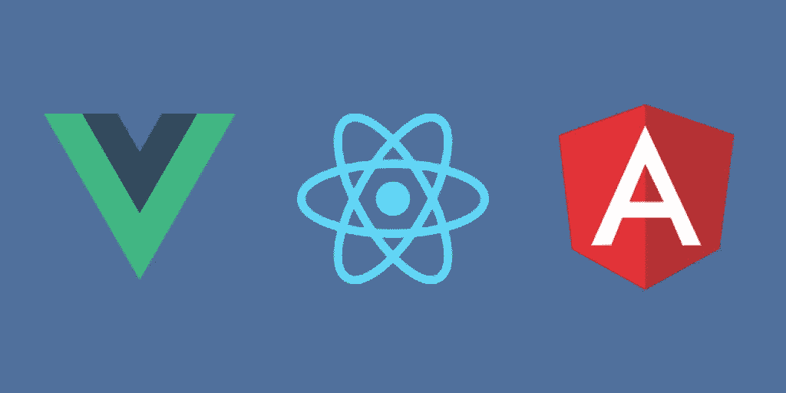
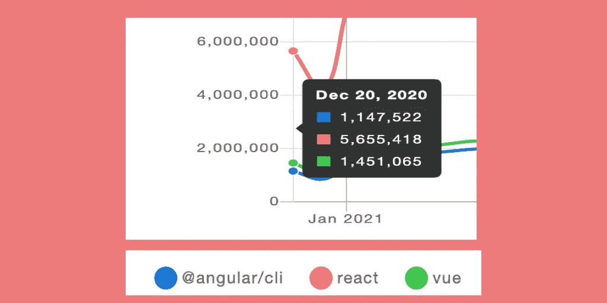
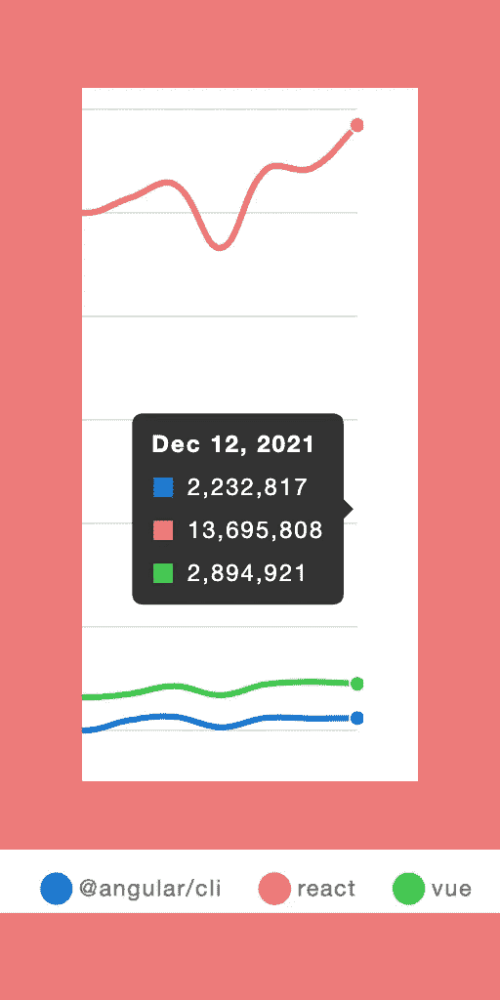

# 2022 年前端框架/库的未来会是什么样子

> 原文：<https://javascript.plainenglish.io/front-end-web-pattern-for-2022-fe53284ca93a?source=collection_archive---------11----------------------->

## 2022 年的前端 Web 模式

这是又一个疫情遭灾的一年。😢我们大多数人仍然在家或远程工作。随着越来越多的公司数字化他们的业务以保持他们的业务继续发展，软件开发继续处于高需求状态。网站和基于网络的应用程序仍然是许多业务的先导。📊

今天，我们将看看前端框架/库在过去一年中的表现，我将给出我个人对 2022 年前景的看法。如果你还没有决定深入研究哪些前端框架/库，我鼓励你阅读这篇文章，希望它能为你和你的 2022 年新年决心提供一些方向。

Vue.js、React 和 Angular 继续成为 web 应用前端开发框架/库的领导者。

根据 2020 年 12 月 npmtrends.com 的数据，由脸书创建的 React 以 560 万次的下载量稳居市场首位。去年的亚军是 vue . js——它是由一名曾在 AngularJS 工作的谷歌员工创建的，下载量约为 140 万次。而科技巨头谷歌的框架 Angular 有大约 110 万次下载。

现在让我们看看 1 年后的 2021 年 12 月，趋势是如何演变的？

React 以大约 1370 万次的下载量继续占据主导地位。Vue.js 有大约 290 万次下载。Angular 拥有约 220 万次下载。我们可以看到，自 2020 年 12 月以来，所有框架/库的采用都增长了 50%以上。

我的观点是，对于任何懂 JavaScript 的人来说，React 库是简单且易于采用的*。它有最少的与库相关的功能和配置供人们学习。它还拥有巨大的社区插件，支持您在 React 项目中可能需要的任何特性或用例，从而使它成为大多数人学习和在他们的公司中采用的首选。*

*另一方面，Vue.js 作为一个 ***轻量级和渐进式*** 的框架获得了很多关注。它和其他框架/库有相似的语法，可以很快地跳到上面，不需要太多的文档和 YouTube 教程。*

*棱角分明， ***有史以来最全面的前端框架*** 。毫无疑问，对于没有任何前端库或类型脚本知识的开发人员来说，这是最困难和最复杂的前端框架。Angular 框架几乎拥有您需要的一切，再加上一些其他流行的库，如 Angular Material 和 RxJS，使它成为有史以来最自给自足的框架。我的个人观点是 Angular 很棒，但似乎因为其缓慢的编译器和框架上社区插件的不灵活性而名声不好，这使得它不受需要灵活性或支持其遗留 JS 系统的人/公司的欢迎。*

# *那么，在 2022 年，我应该学些什么？谁将成为潮流领袖？*

*基于我们之前看到的趋势，React 将凭借其灵活性和受欢迎程度继续占据前端市场并不令人惊讶，特别是随着 React 18 在 2022 年初的到来。Vue.js v3 将继续在 Angular 之上蓬勃发展，但社区似乎更喜欢 React 而不是 Vue。Angular 将继续得到喜欢严格约定和结构的开发人员的支持，而且自 Angular 9(目前是 v13)以来，已经有了一个向支持 Ivy 的重大转变，从而使 Angular 项目的编译更快、更有效，并且包的大小更小。或许能赢回一些前端开发者的心。*

*所以，如果你想知道你应该看什么，我会说先拿起**反应**。请确保您了解前端实用程序的完整流程，并尝试在 TypeScript 中使用 React，以了解 TypeScript 是什么。如果你对它感到满意，可以随时跳到 Vue.js 和 Angular 上试一试。如果你来自 AngularJS 背景，我会建议你选择 Angular 框架，并在做出反应之前继续深入了解你的角度知识。*

# *摘要*

*对于那些铁杆 jQuery 粉丝来说，网络上总有你的一席之地。如果您对这些框架或库不感兴趣，请继续使用 jQuery、HTML、CSS，我向您保证，您的网站将继续运行，到目前为止，您和您的公司不会遇到任何问题。😎请在下面的评论中告诉我你正在使用哪个前端框架/库，以及为什么。我也很想收到你的来信。*

* [## vue . j

### 已经会 HTML，CSS，JavaScript 了？阅读指南，立即开始制作物品！可增量采用的…

vuejs.org](https://vuejs.org/)  [## react——用于构建用户界面的 JavaScript 库

### React 使得创建交互式 ui 变得不那么痛苦。为应用程序中的每个状态设计简单的视图，并反应…

reactjs.org](https://reactjs.org/)  [## 有角的

### Angular 是一个构建移动和桌面 web 应用程序的平台。加入数百万开发者的社区…

angular.io](https://angular.io/)  [## 用我的推荐链接- DevJo 加入媒体

### 作为一个媒体会员，你的会员费的一部分会给你阅读的作家，你可以完全接触到每一个故事…

medium.com](https://medium.com/@devjo/membership) 

*更多内容看* [*说白了. io*](http://plainenglish.io/) *。报名参加我们的* [*免费每周简讯*](http://newsletter.plainenglish.io/) *。在我们的* [*社区*](https://discord.gg/GtDtUAvyhW) *获得独家写作机会和建议。**