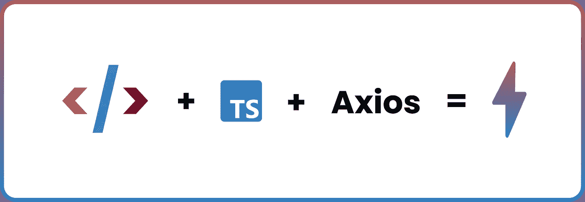
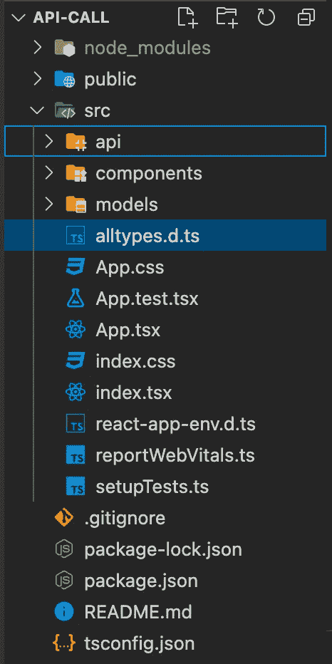
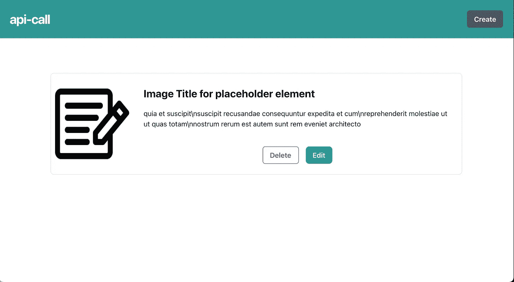
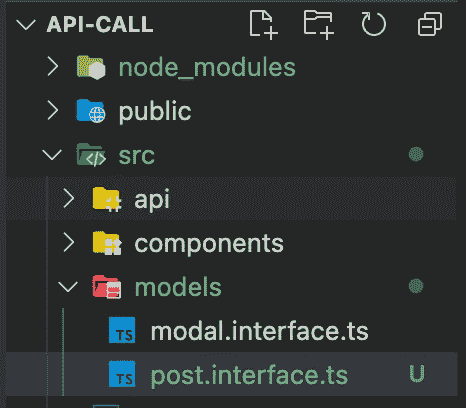
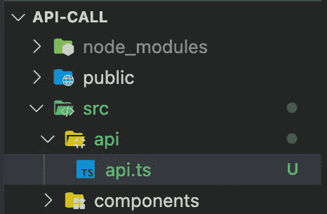
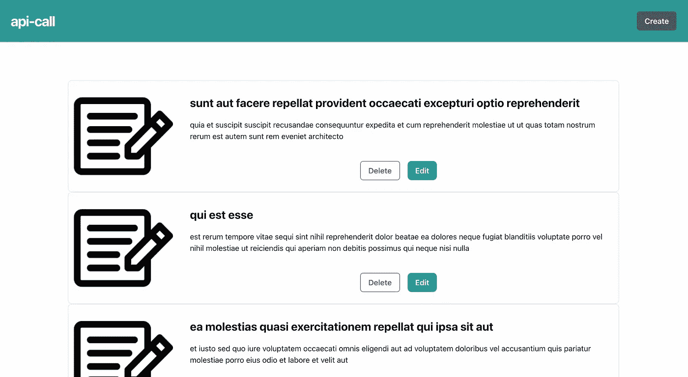

# 使用 TypeScript 和 Axios 的前端 API 调用

> 原文：<https://javascript.plainenglish.io/frontend-api-calls-with-typescript-and-axios-68792d1e63c2?source=collection_archive---------0----------------------->

## 用 TypeScript 和 Axios 增强前端 API 调用的自以为是的方法

Cover image

许多开发人员采用了将后端服务与前端应用程序分离的方法。这种方法允许它们独立成长和进化。

在前端开发中，了解如何向后端服务发出动态请求是很重要的。

在本教程中，我们将使用 React 和 TypeScript 开发我们的前端应用程序。(*注意:您可以在其他前端库/框架上使用相同的方法。*)

对于后端服务，我们将使用 [**JSONPlaceholder**](http://jsonplaceholder.typicode.com/) 。一个免费的在线 API 服务。

您可以通过克隆这个存储库来编写代码(**主分支**)
[https://github.com/Mr-Malomz/api-call](https://github.com/Mr-Malomz/api-call)
)(如果您更喜欢查看完整的代码，请检查同一个存储库的 **dev** 分支。)

在本教程中，我们将只关注 API 调用。项目 UI 已经设置了 [**脉轮 UI**](https://chakra-ui.com/)

# 文件夹结构

project folder structure

让我们看看上面的一些关键目录和文件:

*   `api:`存储 API 调用相关文件的文件夹。
*   `components:`一个文件夹，用于存储我们应用程序的构建模块。
*   `models:`存储描述响应类型的文件的文件夹。
*   `App.tsx:`连接所有组件的文件。

# 运行项目

导航到项目位置，打开您的终端并安装项目依赖项

install project dependency

然后使用下面的命令运行项目

Start project

> 你的项目应该在`[http://localhost:3000](http://localhost:3000/)`上弹出

Project running on `[http://localhost:3000](http://localhost:3000/)`

# 模型

在利用 TypeScript 自带的其他打字系统时，我们需要创建一个模型来描述 API 响应[**JSONPlaceholder**](http://jsonplaceholder.typicode.com/posts/1)**的返回。**

**jsonplaceholder response**

**有了来自[**JSONPlaceholder**](http://jsonplaceholder.typicode.com/posts/1)的响应，现在让我们创建一个模型来表示响应类型。**

## ****第一步****

**在**模型**文件夹中创建一个新文件`post.interface.ts`。**

****

**Updated folder structure**

## ****第二步****

**创建一个接口来描述响应属性(userId、Id、title 和 body)。*在* ***id*** *和****userId****key 前面的问号告诉 TypeScript 这些属性是可选的，因为它是由*[***JSONPlaceholder***](http://jsonplaceholder.typicode.com/posts/1)*自动生成的。***

**post.interface.ts**

# ****API 调用****

**包装好模型后，我们现在可以开始对[**JSONPlaceholder**](http://jsonplaceholder.typicode.com/posts)端点进行 API 调用。我们将在这个应用程序中使用 [**axios**](https://github.com/axios/axios) 进行 API 调用。Axios 是一个基于 promise 的 HTTP 客户端，用于浏览器和 node.js。**

## ****第一步****

**在 **api** 文件夹中创建一个新文件`api.ts`。**

****

**updated folder structure**

## ****第二步****

**我们需要配置 **axios、** create **Requests** 和 **Post** 对象来处理创建、读取、更新和删除(CRUD ),如下所示**

**api.ts**

**让我们解释一下这段代码。我们遵循以下步骤:**

*   **进口 **axios** 和 AxiosResponse。AxiosResponse 是 axios 提供的类型脚本响应类型。我们还导入了 PostType，这是我们之前创建的响应类型。**
*   **将 **axios** 配置为使用[**JSONPlaceholder**](http://jsonplaceholder.typicode.com/)作为我们请求的基本 URL 和 15 秒超时。**
*   **析构 **axios** 并从其响应对象获得数据响应。**
*   **创建了一个请求对象来处理 CRUD，并返回了之前创建的被析构的 **axios** 体。**
*   **创建并导出一个 **Post** 对象，该对象使用之前创建的请求对象来处理使用请求对象的 CRUD 操作。**

# ****消费终点****

****获取所有帖子** 要获取所有帖子，我们需要使用之前在`api.ts`中创建的 Post 对象的 getPosts 函数进行 API 调用**

**updated app.tsx**

**我们在上面的代码中采取了以下步骤:**

*   **导入的`useEffect`、`useState`、`PostType`(响应类型)、和`Post` (API 对象)。**
*   **创建了状态来分别管理和更新帖子和错误。我们还为 post(post type 类型的数组)和 isError(boolean)定义了响应类型。**
*   **使用`useEffect`钩子内的 **Post.getPosts** 函数进行 API 调用。然后，我们用 post 和 catch 错误(如果有的话)更新了应用程序状态。**
*   **设置一个错误界限，并显示一条适当的消息(如果有的话)。然后我们遍历卡片组件，将密钥和 post 作为参数传递。**

***TypeScript 会抱怨卡片组件没有****post****属性。我们会解决的。***

**要解决这个问题，导航到组件文件夹并编辑`Card.tsx`，如下所示**

**Updated Card.tsx**

**注意，在上面的代码中，我们向 CardProps 添加了 **post** 属性，并在 Card 组件中对其进行了析构。**

**最后，我们在`Card.tsx`元素中显示了**标题**和**正文**属性。**

**你的结果应该如下图所示。**

****

**List of posts**

****创建帖子** 要创建帖子，我们需要将`posts`和`setPosts`状态作为参数传递给**创建组件**。我们还需要更新`CreateProps`界面来反映这些变化。这些属性将帮助我们从**创建** **组件**中更新我们的 UI。**

**Updated App.tsx. Posts and setPosts Added to Create component**

**我们还需要用之前传递给它的`posts`和`setPosts` 状态更新`Create.tsx` 。**

**Create.tsx**

**完成后，我们可以向 API 发出 post 请求。**

**Updated Create.tsx**

**让我们解释一下这段代码。**

*   **首先，我们添加了一个状态来管理创建表单时的错误。**
*   **其次，我们通过使用 **Post.createPost()** 函数进行 API 调用来更新 **handleSubmit** 函数，更新状态，并相应地关闭模态。**
*   **最后，我们有条件地处理了创建表单时可能出现的错误。**

***由于我们的 API 调用没有保存在数据库中，当我们刷新浏览器时，它会被删除。***

## ****更新帖子****

**更新一篇文章和创建一篇文章几乎是一回事。我们需要将`posts`和`setPosts`状态作为参数传递给**编辑组件**。我们还需要更新 **EditProps** 接口来反映这些变化。这些属性将帮助我们从**编辑组件**中更新我们的 UI。
除此之外，我们还需要创建一个新的状态，以便在每次点击编辑按钮时跟踪选中的**文章 id** 。**

**Updated App.tsx**

**我们将更新`Card.tsx`组件，使我们能够更新 postID。**

**Updated Card.tsx**

> ****PS:** 砰(！)在 **setPostID(post.id！)**告诉编译器放松非空约束错误(意味着参数不能为空或未定义)**

**接下来，我们需要在**编辑组件**中进行如下修改。**

**Updated Edit.tsx**

**有了这些变化，我们现在可以调用 API 来获取一篇文章的细节，然后进行相应的编辑。**

**Updated Edit.tsx**

**让我们解释一下这段代码。**

*   **我们对端点进行了 API 调用，以获取特定的帖子，并分别更新表单标题和正文。**
*   **我们通过使用 **Post.updatePost()** 函数进行 API 调用来更新 **handleSubmit** 函数，更新状态，并相应地关闭模态。**

## ****删除一个帖子****

**要删除一篇文章，我们需要用 **handleDelete** 函数更新`Card.tsx`组件，并对我们的删除端点进行 API 调用。**

**我们还需要用 **Posts** 和 **setPosts** 状态更新`Card.tsx`和`App.tsx`组件。这将允许我们相应地更新应用程序状态。**

**Updated App.tsx**

**我们还需要修改`Card.tsx`并调用 API 来删除帖子**

**Updated Card.tsx**

## ****结论****

**这种将 axios 与 TypeScript 结合使用的方法使得代码易于测试、可重用并且更加简洁。**

****参考文献** [https://github.com/axios/axios](https://github.com/axios/axios)
[https://chakra-ui.com/](https://chakra-ui.com/)
[https://www.typescriptlang.org/](https://www.typescriptlang.org/)
[https://reactjs.org/](https://reactjs.org/)**