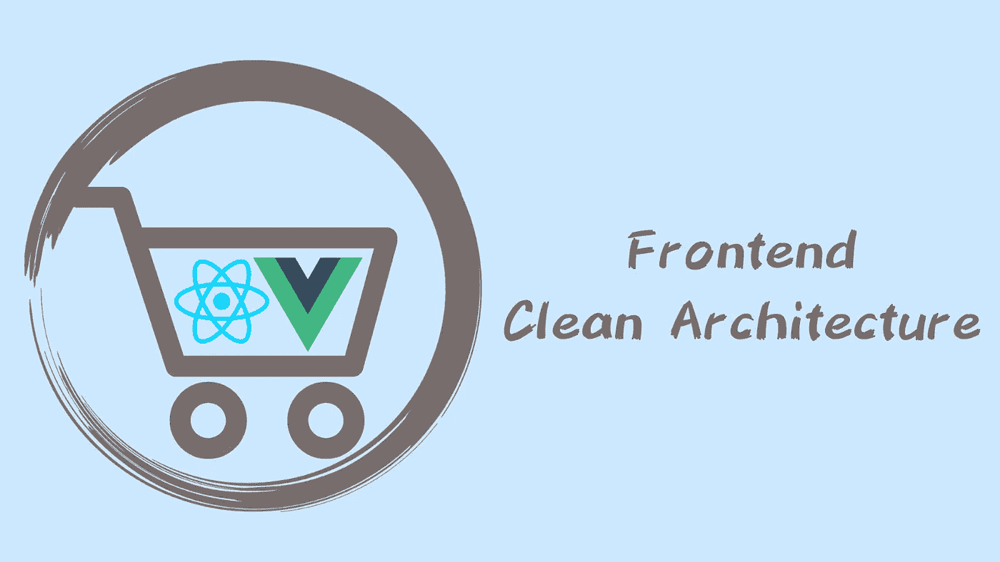

# 远离 React 和 Vue.js

> 原文：<https://javascript.plainenglish.io/frontend-clean-architecture-ca2592bd9d58?source=collection_archive---------1----------------------->

## 使用干净的架构在前端摆脱 React 和 Vue.js



front-end Clean Architecture

本文是我博客中原文的英文翻译:[alejándonos de react js y vue js en El front end usando Clean Architecture](http://xurxodev.com/frontend-clean_architecture/)。

使用 Clean Architecture 的优势之一是能够将我们的应用程序的交付机制与用户分离，也就是说，与 UI 框架或库分离。

这种在长期应用中的优势允许我们在未来适应库和框架中必然会发生的变化。

在本文中，我们将通过应用两种交付机制:React 和 Vue.js，在前端将干净的架构发挥到极致。

我们将在两个实现之间尽可能多地重用代码。

这可以通过创建 React 和 Vue.js 的域、数据和远程显示逻辑来实现。

# 为什么要脱离框架？

我开发了不同的技术应用清洁建筑，如。Net，Android，iOS，和 Flutter。很长一段时间，我也是在前端编程，写这方面的东西。

发展应用程序的最大问题之一是与 UI 框架的耦合。

在前端，随着时间的推移，这种类型的应用程序的责任逐渐增加，以更结构化的方式开发越来越有意义，要解决的问题与后端或移动开发等其他前端存在的问题非常相似。

像 React 和 Vue.js 这样的框架让我们在前端迎接这些挑战变得更加容易。

今天的前端应用程序在许多情况下是后端的独立应用程序，因此需要有自己的架构。

此外，这种架构必须在以下几点上帮助我们:

*   独立于 UI、框架、API rest 和持久性、第三方服务的数据库。
*   逃避现实。
*   可测试性。

这意味着，如果我们改变拥有 ReactJs 或 VueJs 应用程序的愿景，拥有一个使用 ReactJs 或 VueJs 进行渲染的前端应用程序，这将使我们未来的生活更加轻松。

因此，例如，将您的 ReactJS 应用程序从以前使用的类发展到现在使用的函数和钩子，就简单多了。如果在 VueJS 中从使用 options API 切换到 composition API，也会发生同样的情况。

它更琐碎，因为您只在绝对必要的情况下使用框架，比如渲染，因此您不会过度使用它，使它远离任何类型的逻辑，无论是它的域、数据还是表示逻辑。

> 框架会发展，你不能控制它，但是你能控制的是你与它们的耦合以及它们的变化如何影响你。

但在这种情况下，我们将超越如何适应框架中可能发生的变化，我们将看到当我们使用干净的体系结构和分离的职责来修改 VueJS 的 ReactJS 时，不会改变的代码量。


Clean architecture

如果您使用 **Clean Architecture** 进行开发，这就是您要记住的画面。

如果你还不清楚干净架构的概念，我推荐你阅读这篇[文章](http://xurxodev.com/por-que-utilizo-clean-architecture-en-mis-proyectos/)。

最重要的部分是依赖规则，所以如果你不知道我在说什么，我推荐你阅读这篇[文章](http://xurxodev.com/por-que-utilizo-clean-architecture-en-mis-proyectos/)。

我们将要看到的例子基于我们在这篇[文章](http://xurxodev.com/el-patron-bloc-junto-a-clean-architecture-en-reactjs/)中看到的例子。

# 我们的场景

这是一个功能齐全的购物车，看起来就像一个真实的例子。我们将有一个全局状态，非全局状态，我们将模拟对远程服务的调用。


Shopping Cart Example

# 体系结构

在项目结构层面，我们将使用 monorepo，使用 [yarn workspaces](https://classic.yarnpkg.com/en/docs/workspaces/) ，这样我们可以将项目分割成模块或包，在它们之间共享代码。

我们有几个套餐:

*   核心:在这个包中，我们将拥有 ReactJS 呈现的应用程序和 VueJs 呈现的应用程序之间的所有共享代码。
*   React:在这个包中可以找到 react 应用程序版本。
*   Vue:在这个包中可以找到 Vue 的应用程序版本。

# 什么代码被重用？

我们将重用我们必须从 UI 框架中分离出来的所有代码，因为作为同一应用程序的不同版本，这些代码是共享的，而不是重复编写。

这是一个展示 Clean Architecture 潜力的练习，但是这种 UI 框架的解耦是必要的，即使当我们开发一个真正的应用程序时。

使用 UI 框架是绝对必要的，这允许我们更好地适应框架未来版本的变化。

这是因为包含应用程序逻辑的代码是最重要的部分，随着时间的推移变化很小，并且是潜在的在同一个应用程序的两个版本之间共享的代码，如本例所示，它是不依赖于 UI 框架的非耦合的。

在干净的架构中，领域层是企业和应用程序业务逻辑所在的地方。

数据层是我们与持久性进行通信的地方。

表示逻辑决定显示什么数据，是否应该显示什么，是否应该向用户显示我们正在加载数据，或者是否应该显示错误。它是管理组件状态的地方。

这 3 个部分中的每一个都包含我们必须解耦的逻辑，并且在核心包中找到。


Front-end Clean architecture packages

# 畴层

领域层是企业和应用程序业务逻辑所在的地方。

## 用例

用例是意图，包含应用程序的业务逻辑，它们是操作，在本例中，我们有下一个:

*   GetProductsUseCase
*   GetCartUseCase
*   AddProductToCartUseCase
*   EditQuantityOfCartItemUseCase
*   RemoveItemFromCartUseCase

让我们看看 GetProductsUseCase 的例子:

```
export class GetProductsUseCase {
    private productRepository: ProductRepository;constructor(productRepository: ProductRepository) {
        this.productRepository = productRepository;
    }execute(filter: string): Promise<Either<DataError, Product[]>> {
        return this.productRepository.get(filter);
    }
}
```

这个用例很简单，因为它由一个对数据层的简单调用组成，在其他上下文中，例如，当创建一个产品时，我们必须验证不再有一个具有相同 SKU 的产品，将会有更多的逻辑。

用例返回任一类型，如果你不确定它是什么，那么我推荐你阅读这篇[文章](http://xurxodev.com/either-en-typescript/)和这篇[文章](http://xurxodev.com/either-asincrono-con-promesas-en-typescript/)。

这样，错误处理不是使用承诺的 catch 来完成的，而是承诺本身的 result 对象告诉您结果是否成功。

与传统的试捕法相比，这两种方法都有几个优点:

*   发生错误时，执行流程更容易跟踪，而不会在调用方之间跳转。
*   明确指出可能会出错。
*   可能出现的错误被明确指出。
*   使用[穷举开关](http://xurxodev.com/either-en-typescript)，如果你将来添加了更多的错误，TypeScript 会警告你在哪里没有考虑这个新的错误。

错误的类型如下:

```
export interface UnexpectedError {
    kind: "UnexpectedError";
    message: Error;
}export type DataError = UnexpectedError;
```

在未来，它可能会发展成这样:

```
export interface ApiError {
    kind: "ApiError";
    error: string;
    statusCode: number;
    message: string;
}export interface UnexpectedError {
    kind: "UnexpectedError";
    message: Error;
}export interface Unauthorized {
    kind: "Unauthorized";
}export interface NotFound {
    kind: "NotFound";
}export type DataError = ApiError | UnexpectedError | Unauthorized;
```

在表示层，如果我使用穷举开关，Typescript 会警告我，我应该为每个新错误添加更多的事例。

## 实体

实体包含企业业务逻辑。

让我们看一下 Cart 的例子:

```
type TotalPrice = number;
type TotalItems = number;export class Cart {
    items: readonly CartItem[];
    readonly totalPrice: TotalPrice;
    readonly totalItems: TotalItems;constructor(items: CartItem[]) {
        this.items = items;
        this.totalPrice = this.calculateTotalPrice(items);
        this.totalItems = this.calculateTotalItems(items);
    }static createEmpty(): Cart {
        return new Cart([]);
    }addItem(item: CartItem): Cart {
        const existedItem = this.items.find(i => i.id === item.id);if (existedItem) {
            const newItems = this.items.map(oldItem => {
                if (oldItem.id === item.id) {
                    return { ...oldItem, quantity: oldItem.quantity + item.quantity };
                } else {
                    return oldItem;
                }
            });return new Cart(newItems);
        } else {
            const newItems = [...this.items, item];return new Cart(newItems);
        }
    }removeItem(itemId: string): Cart {
        const newItems = this.items.filter(i => i.id !== itemId);return new Cart(newItems);
    }editItem(itemId: string, quantity: number): Cart {
        const newItems = this.items.map(oldItem => {
            if (oldItem.id === itemId) {
                return { ...oldItem, quantity: quantity };
            } else {
                return oldItem;
            }
        });return new Cart(newItems);
    }private calculateTotalPrice(items: CartItem[]): TotalPrice {
        return +items
            .reduce((accumulator, item) => accumulator + item.quantity * item.price, 0)
            .toFixed(2);
    }private calculateTotalItems(items: CartItem[]): TotalItems {
        return +items.reduce((accumulator, item) => accumulator + item.quantity, 0);
    }
}
```

在这个例子中，实体是简单的，具有基本类型的属性，但是在一个真实的例子中，我们可以将实体和 V[value 对象](http://xurxodev.com/como-crear-value-object-en-typescript/)定义为类，并使用工厂方法来执行验证。我们使用要么返回错误，要么返回结果。

## 边界

边界是适配器的抽象，例如，在六边形架构中，它们被称为端口。它们在领域中的用例层中定义，并指示我们将如何与适配器通信

例如，为了与数据层通信，我们使用存储库模式。

```
export interface ProductRepository {
    get(filter: string): Promise<Either<DataError, Product[]>>;
}
```

# 数据层

数据层是找到适配器的地方，适配器负责在域和外部系统之间转换信息。

外部系统可能是 web 服务、数据库等…

在这个简单的例子中，我在表示层、域层和数据层之间使用相同的实体来表示产品、购物车和购物车商品。

在实际应用中，通常每一层都有不同的数据结构，甚至有数据传输对象(dto)在层间传递数据。

在这个例子中，我们有返回存储在内存中的数据的存储库。

```
const products = [
  ...
];export class ProductInMemoryRepository implements ProductRepository {
    get(filter: string): Promise<Either<DataError, Product[]>> {
        return new Promise((resolve, _reject) => {
            setTimeout(() => {
                try {
                    if (filter) {
                        const filteredProducts = products.filter((p: Product) => {
                            return p.title.toLowerCase().includes(filter.toLowerCase());
                        });resolve(Either.right(filteredProducts));
                    } else {
                        resolve(Either.right(products));
                    }
                } catch (error) {
                    resolve(Either.left(error));
                }
            }, 100);
        });
    }
}
```

重要的是要理解存储库是一个适配器，它的抽象或端口是在域中定义的，所以传统的依赖方向是颠倒的。


Dependency inversion

这是干净架构中最重要的部分，**域不应该依赖于任何外部层**，这样它就被解耦了，并且在将来用另一个适配器替换另一个适配器甚至是为了测试的目的，都变得更加容易。

这样，如果我们用调用 web 服务的适配器实现替换适配器实现，域不会受到影响，因此我们隐藏了实现细节。

# 表示层—适配器

表示层的适配器是我们核心包的最后一个重用部分，它是我们挂接 UI React 或 Vue 层的地方。

这些适配器也可以在两个版本的应用程序之间重用，它们是 UI 组件和域层之间的中介。

它们包含表示逻辑，决定显示什么信息，什么应该可见，等等

**状态管理由该层**执行，不依赖于 React 或 Vue。

我们可以使用不同的表示模式。在这种情况下，我使用 BLoC 模式，因为它非常适合 React 和 Vue 等声明性框架。


BLoC Pattern

如果你想深入研究集团模式，我推荐你阅读这篇[文章](http://xurxodev.com/introduccion-al-patron-bloc/)。

正如我在那篇文章中所讨论的，当您将 BLoC 与 Clean Architecture 一起使用时，称它们为 PLoC、**表示逻辑组件**更有意义。所以在这个例子中，它们是这样命名的。

让我们看看购物车示例:

```
export class CartPloc extends Ploc<CartState> {
    constructor(
        private getCartUseCase: GetCartUseCase,
        private addProductToCartUseCase: AddProductToCartUseCase,
        private removeItemFromCartUseCase: RemoveItemFromCartUseCase,
        private editQuantityOfCartItemUseCase: EditQuantityOfCartItemUseCase
    ) {
        super(cartInitialState);
        this.loadCart();
    }closeCart() {
        this.changeState({ ...this.state, open: false });
    }openCart() {
        this.changeState({ ...this.state, open: true });
    }removeCartItem(item: CartItemState) {
        this.removeItemFromCartUseCase
            .execute(item.id)
            .then(cart => this.changeState(this.mapToUpdatedState(cart)));
    }editQuantityCartItem(item: CartItemState, quantity: number) {
        this.editQuantityOfCartItemUseCase
            .execute(item.id, quantity)
            .then(cart => this.changeState(this.mapToUpdatedState(cart)));
    }addProductToCart(product: Product) {
        this.addProductToCartUseCase
            .execute(product)
            .then(cart => this.changeState(this.mapToUpdatedState(cart)));
    }private loadCart() {
        this.getCartUseCase
            .execute()
            .then(cart => this.changeState(this.mapToUpdatedState(cart)))
            .catch(() =>
                this.changeState({
                    kind: "ErrorCartState",
                    error: "An error has ocurred loading products",
                    open: this.state.open,
                })
            );
    }mapToUpdatedState(cart: Cart): CartState {
        const formatOptions = { style: "currency", currency: "EUR" };return {
            kind: "UpdatedCartState",
            open: this.state.open,
            totalItems: cart.totalItems,
            totalPrice: cart.totalPrice.toLocaleString("es-ES", formatOptions),
            items: cart.items.map(cartItem => {
                return {
                    id: cartItem.id,
                    image: cartItem.image,
                    title: cartItem.title,
                    price: cartItem.price.toLocaleString("es-ES", formatOptions),
                    quantity: cartItem.quantity,
                };
            }),
        };
    }
}
```

所有 PLoCs 的基类负责存储状态，并在状态改变时发出通知。

```
type Subscription<S> = (state: S) => void;export abstract class Ploc<S> {
    private internalState: S;
    private listeners: Subscription<S>[] = [];constructor(initalState: S) {
        this.internalState = initalState;
    }public get state(): S {
        return this.internalState;
    }changeState(state: S) {
        this.internalState = state;if (this.listeners.length > 0) {
            this.listeners.forEach(listener => listener(this.state));
        }
    }subscribe(listener: Subscription<S>) {
        this.listeners.push(listener);
    }unsubscribe(listener: Subscription<S>) {
        const index = this.listeners.indexOf(listener);
        if (index > -1) {
            this.listeners.splice(index, 1);
        }
    }
}
```

UI 组件需要的所有信息都必须从状态、要在表或列表中呈现的元素中进行解释，还必须解释某些东西是否应该可见，比如购物车、装载或要显示的错误。

```
export interface CommonCartState {
    open: boolean;
}export interface LoadingCartState {
    kind: "LoadingCartState";
}export interface UpdatedCartState {
    kind: "UpdatedCartState";
    items: Array<CartItemState>;
    totalPrice: string;
    totalItems: number;
}export interface ErrorCartState {
    kind: "ErrorCartState";
    error: string;
}export type CartState = (LoadingCartState | UpdatedCartState | ErrorCartState) & CommonCartState;export interface CartItemState {
    id: string;
    image: string;
    title: string;
    price: string;
    quantity: number;
}export const cartInitialState: CartState = {
    kind: "LoadingCartState",
    open: false,
};
```

在这种情况下，通过 typescript 的 union 类型，我们可以使用 [sum 代数数据类型](https://xurxodev.com/tipos-de-datos-algebraicos-sum-en-typescript/)更安全和功能性地建模我们的状态。

这种建模方式不容易出错，因为您指出了一种非常清晰的形式，即状态有 3 种主要可能性:

*   加载信息
*   出现了一个错误
*   更新的数据

# 表示层—用户界面

在这一层中是组件以及与 React 或 Vue 相关的一切，如组件、挂钩、应用程序等。

这些组件非常简单和轻便，因为它们可以自由地管理任何类型的逻辑或状态管理，这是核心包中每一层的责任。

## React 应用

在 react 中，我们将拥有呈现产品列表的组件、显示购物车中产品数量的应用程序栏，以及呈现为侧边栏的产品购物车。

让我们看看呈现购物车内容的组件示例。

```
import React from "react";
import { makeStyles, Theme } from "[@material](http://twitter.com/material)-ui/core/styles";
import { List, Divider, Box, Typography, CircularProgress } from "[@material](http://twitter.com/material)-ui/core";
import CartContentItem from "./CartContentItem";
import { CartItemState } from "[@frontend](http://twitter.com/frontend)-clean-architecture/core";
import { useCartPloc } from "../app/App";
import { usePlocState } from "../common/usePlocState";const useStyles = makeStyles((theme: Theme) => ({
    totalPriceContainer: {
        display: "flex",
        alignItems: "center",
        padding: theme.spacing(1, 0),
        justifyContent: "space-around",
    },
    itemsContainer: {
        display: "flex",
        alignItems: "center",
        padding: theme.spacing(1, 0),
        justifyContent: "space-around",
        minHeight: 150,
    },
    itemsList: {
        overflow: "scroll",
    },
    infoContainer: {
        display: "flex",
        alignItems: "center",
        justifyContent: "center",
        height: "100vh",
    },
}));const CartContent: React.FC = () => {
    const classes = useStyles();
    const ploc = useCartPloc();
    const state = usePlocState(ploc);const cartItems = (items: CartItemState[]) => (
        <List className={classes.itemsList}>
            {items.map((item, index) => (
                <CartContentItem key={index} cartItem={item} />
            ))}
        </List>
    );const emptyCartItems = () => (
        <React.Fragment>
            <Typography variant="h6" component="h2">
                Empty Cart :(
            </Typography>
        </React.Fragment>
    );switch (state.kind) {
        case "LoadingCartState": {
            return (
                <div className={classes.infoContainer}>
                    <CircularProgress />
                </div>
            );
        }
        case "ErrorCartState": {
            return (
                <div className={classes.infoContainer}>
                    <Typography display="inline" variant="h5" component="h2">
                        {state.error}
                    </Typography>
                </div>
            );
        }
        case "UpdatedCartState": {
            return (
                <React.Fragment>
                    <Box flexDirection="column" className={classes.itemsContainer}>
                        {state.items.length > 0 ? cartItems(state.items) : emptyCartItems()}
                    </Box>
                    <Divider />
                    <Box flexDirection="row" className={classes.totalPriceContainer}>
                        <Typography variant="h6" component="h2">
                            Total Price
                        </Typography>
                        <Typography variant="h6" component="h2">
                            {state.totalPrice}
                        </Typography>
                    </Box>
                </React.Fragment>
            );
        }
    }
};export default CartContent;
```

## 钩住

使用干净的架构，钩子不用？是的，他们被使用，但是为了严格必要的东西。

状态不会被钩子管理，副作用不会被钩子触发，这是核心包中 PloCs 的责任。

但是我们将使用它们来存储 PloC 返回给我们的组件的最终状态，并且我们将使用它们来共享组件之间的上下文，或者对 PloC 返回给我们的状态变化做出反应。

让我们看看我们在组件中使用的 usePLocState 挂钩是如何定义的:

```
export function usePlocState<S>(ploc: Ploc<S>) {
    const [state, setState] = useState(ploc.state);useEffect(() => {
        const stateSubscription = (state: S) => {
            setState(state);
        };ploc.subscribe(stateSubscription);return () => ploc.unsubscribe(stateSubscription);
    }, [ploc]);return state;
}
```

这个定制钩子负责订阅 PloC 状态变化并存储最终状态。

## Vue 应用程序

在 Vue 中，我们也将拥有与 React 版本相同的组件。

现在让我们看看在 Vue 版本中呈现购物车内容的组件:

```
<template>
    <div id="info-container" v-if="state.kind === 'LoadingCartState'">
        <ProgressSpinner />
    </div>
    <div id="info-container" v-if="state.kind === 'ErrorCartState'">Error</div>
    <div id="items-container" v-if="state.kind === 'UpdatedCartState'">
        <div v-if="state.items.length > 0" style="overflow: scroll">
            <div v-for="item in state.items" v-bind:key="item.id">
                <CartContenttItem v-bind="item" />
            </div>
        </div>
        <h2 v-if="state.items.length === 0">Empty Cart :(</h2>
    </div>
    <Divider />
    <div id="total-price-container">
        <h3>Total Price</h3>
        <h3>{{ state.totalPrice }}</h3>
    </div>
</template><script lang="ts">
import { defineComponent, inject } from "vue";
import { CartPloc } from "[@frontend](http://twitter.com/frontend)-clean-architecture/core";
import { usePlocState } from "../common/usePlocState";
import CartContenttItem from "./CartContenttItem.vue";export default defineComponent({
    components: {
        CartContenttItem,
    },
    setup() {
        const ploc = inject<CartPloc>("cartPloc") as CartPloc;
        const state = usePlocState(ploc);return { state };
    },
});
</script><style scoped>
#info-container {
    display: flex;
    align-items: center;
    justify-content: center;
    height: 100vh;
}
#items-container {
    display: flex;
    flex-direction: column;
    align-items: center;
    min-height: 150px;
    justify-content: space-around;
}
#total-price-container {
    display: flex;
    align-items: center;
    padding: 8px 0px;
    justify-content: space-around;
}
</style>
```

如你所见，它看起来很像使用 composition API 的 React 版本。

## 组合 API

在 Vue 版本中，我们还将有挂钩，例如管理 PLoC 状态更改订阅的挂钩:

```
import { Ploc } from "[@frontend](http://twitter.com/frontend)-clean-architecture/core";import { DeepReadonly, onMounted, onUnmounted, readonly, Ref, ref } from "vue";export function usePlocState<S>(ploc: Ploc<S>): DeepReadonly<Ref<S>> {
    const state = ref(ploc.state) as Ref<S>;const stateSubscription = (newState: S) => {
        state.value = newState;
    };onMounted(() => {
        ploc.subscribe(stateSubscription);
    });onUnmounted(() => {
        ploc.unsubscribe(stateSubscription);
    });return readonly(state);
}
```

# 依赖注入

从 React 和 Vue 应用程序中，我们必须为每个组件创建或重用 PloC 结构:用例和存储库。

如果这些概念是在核心包中定义的，那么负责创建它们的部分也可能在核心包中。

这次我静态地使用服务定位器模式:

```
function provideProductsPloc(): ProductsPloc {
    const productRepository = new ProductInMemoryRepository();
    const getProductsUseCase = new GetProductsUseCase(productRepository);
    const productsPloc = new ProductsPloc(getProductsUseCase);return productsPloc;
}function provideCartPloc(): CartPloc {
    const cartRepository = new CartInMemoryRepository();
    const getCartUseCase = new GetCartUseCase(cartRepository);
    const addProductToCartUseCase = new AddProductToCartUseCase(cartRepository);
    const removeItemFromCartUseCase = new RemoveItemFromCartUseCase(cartRepository);
    const editQuantityOfCartItemUseCase = new EditQuantityOfCartItemUseCase(cartRepository);
    const cartPloc = new CartPloc(
        getCartUseCase,
        addProductToCartUseCase,
        removeItemFromCartUseCase,
        editQuantityOfCartItemUseCase
    );return cartPloc;
}export const dependenciesLocator = {
    provideProductsPloc,
    provideCartPloc,
};
```

我们也可以使用[动态服务定位器和组合根](http://xurxodev.com/inyeccion-de-dependencias-typescript-service-locator/)或依赖注入库。

在 React 应用中，有一个全局状态必须共享，它就是购物车。因此，管理这个状态的 CartPloc 必须由所有组件共享和访问。

## 反应

在 React 中，我们使用 createContext 和 useContext 来解决这个问题。

```
export function createContext<T>() {
    const context = React.createContext<T | undefined>(undefined);function useContext() {
        const ctx = React.useContext(context);
        if (!ctx) throw new Error("context must be inside a Provider with a value");
        return ctx;
    }
    return [context, useContext] as const;
}const [blocContext, usePloc] = createContext<CartPloc>();export const useCartPloc = usePloc;const App: React.FC = () => {
    return (
        <blocContext.Provider value={dependenciesLocator.provideCartPloc()}>
            <MyAppBar />
            <ProductList />
            <CartDrawer />
        </blocContext.Provider>
    );
};export default App;
```

使用自定义的 useCartPloc，我们可以从任何组件访问这个 Ploc 及其状态。

## Vue 应用程序

在 Vue 中，我们通过使用 provide 特性来解决这个问题。

```
<template>
    <div id="app">
        <MyAppBar />
        <ProductList searchTerm="Element" />
        <CartSidebar />
    </div>
</template><script lang="ts">
import { dependenciesLocator } from "[@frontend](http://twitter.com/frontend)-clean-architecture/core";
import { defineComponent } from "vue";
import MyAppBar from "./appbar/MyAppBar.vue";
import ProductList from "./products/ProductList.vue";
import CartSidebar from "./cart/CartSidebar.vue";export default defineComponent({
    name: "App",
    components: {
        ProductList,
        MyAppBar,
        CartSidebar,
    },
    provide: {
        cartPloc: dependenciesLocator.provideCartPloc(),
    },
});
</script>
```

稍后，我们可以从任何组件访问 PLoC 及其状态，方法是:

```
const cartPloc = inject <CartPloc> (“cartPloc”) as CartPloc;
```

# 源代码

源代码可以在这里找到:[前端-清理-架构](https://github.com/xurxodev/frontend-clean-architecture)。

相关文章和资源

*   [干净的架构:软件结构和设计的工匠指南](https://www.amazon.es/gp/product/0134494164?tag=xurxodev0e-21)
*   [清洁建筑课程](http://xurxodev.com/curso-clean-architecture)。
*   为什么要在我的项目中使用 I Clean 架构？
*   [清洁建筑中的集团模式](http://xurxodev.com/el-patron-bloc-en-clean-architecture/)
*   [反应堆清洁建筑中的阻塞模式](http://xurxodev.com/el-patron-bloc-junto-a-clean-architecture-en-reactjs/)
*   T [清洁建筑中的阻挡图案在颤动](http://xurxodev.com/el-patron-bloc-junto-a-clean-architecture-en-flutter/)
*   [干净的架构:代码气味。第一部分](http://xurxodev.com/clean-architecture-code-smells-parte-1/)
*   [干净的架构:代码气味。第二部分](http://xurxodev.com/clean-architecture-code-smells-parte-2/)
*   [我超现实地购买了《清洁建筑》这本书](http://xurxodev.com/mi-surrealista-compra-del-libro-clean-architecture/)

# 结论

在本文中，我们看到了一个干净的前端架构实现。

我们有一个版本的 React 和 Vue 应用程序，在两者之间尽可能多地重用代码，并将其放在一个核心包中。

通过拥有一个所有逻辑都从框架中分离出来的核心包，我们可以体会到 Clean Architecture 可以在前端为我们提供的强大功能。

在这个例子中，将项目组织成一个 monorepo 并拥有一个核心包是必要的，但是在开发一个应用程序 React 或 Vue 时，这是不必要的。

然而，强迫您脱离 UI 框架是一个有趣的练习，因为有时很难看出您正在耦合，尤其是在开始的时候。

*多内容于* [***浅显易懂***](http://plainenglish.io/)