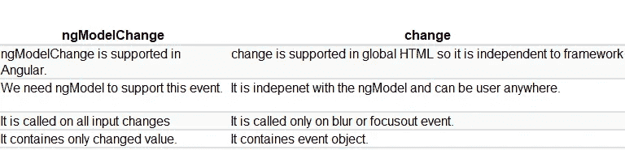

# 角度面试问题:‘改变’和‘ngModelChange’有什么区别？

> 原文：<https://javascript.plainenglish.io/frontend-interview-question-what-is-the-difference-between-change-vs-ngmodelchange-f6bb3cb26dbc?source=collection_archive---------17----------------------->

## 最常见的前端面试问题 2021


Photo by [Aziz Acharki](https://unsplash.com/@acharki95?utm_source=medium&utm_medium=referral) on [Unsplash](https://unsplash.com?utm_source=medium&utm_medium=referral)

这是面试官在你参加任何基于你的前端发展技能的面试时最常问的问题之一。

乍一看，`change` 和`ngModelChange` 的唯一区别似乎是 ngModel。但是作为一名前端开发人员，您应该知道一些不同之处。

## 让我们先了解基础知识，然后再讨论差异

*`*(change)*`*绑定到 HTML onchange 事件**

*简而言之，元素发生任何变化都会触发该事件。*

**"* `*(ngModelChange)*` *绑定到我们添加到元素中的 ngmodel。"**

*简单地说，ngmodel 变量发生任何变化都会触发该事件。*

*来源:[https://www.w3schools.com/jsref/event_onchange.asp](https://www.w3schools.com/jsref/event_onchange.asp)*

## ***让我们看一个例子来更好地理解这一点***

```
*change : <input type="text" [(ngModel)]="val" (change)="onChange($event.target.value)">ngModelChange: <input type="text" [(ngModel)]="val" (ngModelChange)="ngModelChange($event)"><p>Value of the Field - {{ val }}</p>*
```

***组件看起来会像这样，***

```
*val;
onChange(value) {
    console.log('change called');
}ngModelChange(value) {
    console.log('ngmodel change called');
}*
```

*这里，当用户改变输入标签中的值时，onChange 方法将在`blur event`之后被调用。*

*而 ngModelChange 会在 `blur event`之前调用。*

*你可以在这个 StackBlitz 中查看。*

## *让我们来看看`change` 和`ngModelChange`的区别*

**

***参考文献:***

# *准备面试？查看角度面试问题 2021*

*[](/top-100-questions-you-must-prepare-for-your-next-angular-interview-1-10-3e13d5fefab9) [## 你必须为下一次角度面试准备的 100 个问题(1-10)

### 最常见的角度面试问题 2021

javascript.plainenglish.io](/top-100-questions-you-must-prepare-for-your-next-angular-interview-1-10-3e13d5fefab9) [](/top-100-questions-you-must-prepare-for-to-ace-your-next-angular-interview-10-20-c3f5ab854be) [## 为赢得下一次面试，你必须准备的 100 个问题(10-20)

### 最常见的角度面试问题 2021

javascript.plainenglish.io](/top-100-questions-you-must-prepare-for-to-ace-your-next-angular-interview-10-20-c3f5ab854be) 

## *更多内容请看*[*plain English . io*](http://plainenglish.io/)*