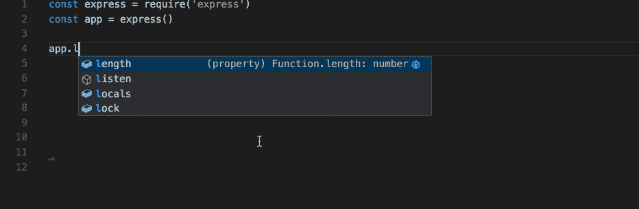

# 帮助您更快编码的前端技巧

> 原文：<https://javascript.plainenglish.io/frontend-tips-to-code-faster-2c46a271c3d6?source=collection_archive---------20----------------------->


Photo by [Nubelson Fernandes](https://unsplash.com/@nublson?utm_source=medium&utm_medium=referral) on [Unsplash](https://unsplash.com?utm_source=medium&utm_medium=referral)

你是否曾经厌倦了一遍又一遍地编写相同模式的代码，尤其是在使用 CSS 或用 JavaScript 调试代码时？如果是的话，那么你来对地方了。这里有一些帮助你更快编码的技巧。

# 使用片段

我发现当对许多元素应用相同的规则时，编写一些 CSS 真的很乏味。您可以在 VSCode 中创建自己的代码片段，方法是单击齿轮图标，选择'*用户代码片段'*选项，然后选择'*新全局代码片段文件'。在新文件中，会有一些例子让你创建自己的代码片段前缀。*

```
{"flexBox Display": {"prefix": "getflex","body": "display : flex; align-items : center; justify-content: center;"}}
```

*flexBox 显示*只是一种代码片段的名称。*前缀*是你在编码的时候会写的东西，*主体*是你通过输入*前缀*得到的东西。我建议你为前缀写一个简单的关键字，这样就可以了。

# 智能感知

我觉得它对我帮助很大，尤其是当我用一种不熟悉的语言编码时，比如 PHP 或 Node.js。默认情况下，VSCode 为 JavaScript、TypeScript、JSON、HTML、CSS、SCSS 等语言提供智能感知，但它可以通过安装语言扩展来扩展。



Gift from documentation

你也可以在这里查看他们的文档。

# 实时服务器

这是一个由 VSCode 提供的扩展/插件，使我们能够在本地开发中查看网站的实时预览。直接进入左侧面板的扩展选项卡，或者按下`Ctrl + Shift + X`，然后像这样搜索“Live Server”，然后安装。


成功安装后，屏幕右下方会出现一个小按钮，标题为“Go Live ”,如下所示。


如果您按下该按钮，它将立即支持一个基于当前 HTML 文件的浏览器窗口。

就是这样！希望这篇文章看完对你有帮助。更多我在 Medium 上的文章，请点击此[链接](https://tulusibrahim.medium.com/)查看。

*更多内容请看*[***plain English . io***](http://plainenglish.io/)