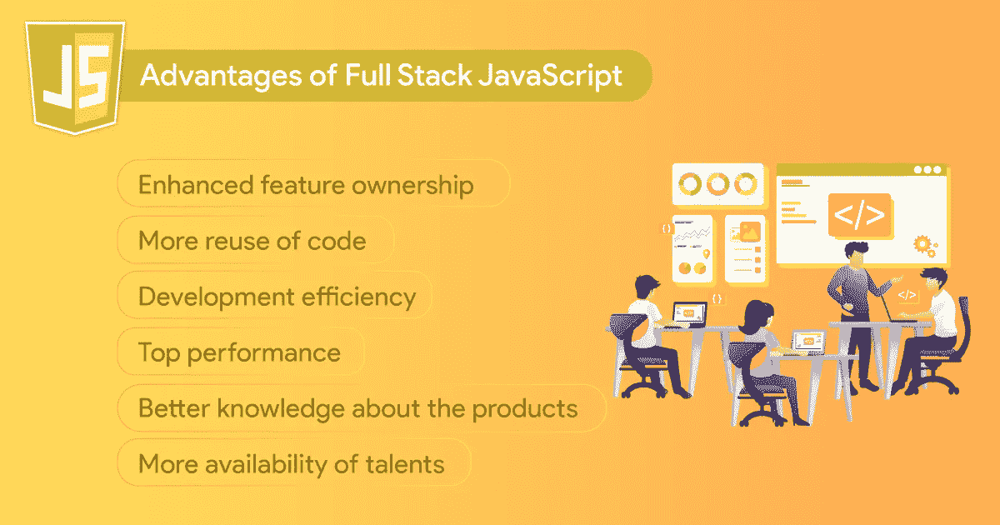
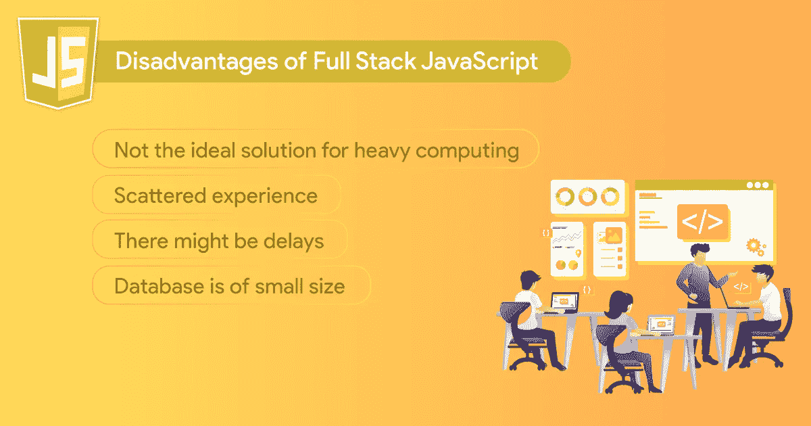

# 全栈 JavaScript 开发:利弊

> 原文：<https://javascript.plainenglish.io/full-stack-javascript-development-pros-and-cons-64dd9cc63265?source=collection_archive---------11----------------------->

毫无疑问，JavaScript 现在是一种非常流行的编程语言。原因是 JavaScript 似乎无处不在，尤其是推动了万维网的发展。除了作为许多 web 应用程序的核心组件之外，它还支持 web 上的交互元素。

最初用于**前端工程，现在可以将 JavaScript 集成到服务器端，这有助于它随着时间的推移变得更加流行**。现在，您可能会想到一个问题，是否有可能在整个项目中使用 JavaScript，因为它现在可以在前端和后端使用。简单来说， [**雇佣一个全栈开发人员**](https://www.rlogical.com/hire-dedicated-developers/hire-full-stack-developer/) 来做一个网络项目是一个明智的想法吗？

# **全栈 JavaScript 开发是什么意思？**

> 对于术语“技术栈”，我们指的是开发软件产品所必需的一组技术和功能。这些包括框架、库、数据库、服务器等。反过来，软件产品包括几个大的组件，前端和后端。

作为客户端，一旦页面被加载，用户就可以看到前端。另一方面，**后端恰好是服务器端，由所有发生在服务器端的程序组成，对用户不可见；但是，它的结果支持与站点的交互。**

结合前端和后端开发有可能得到一个**全栈开发。**因此，全面的 JavaScript 开发恰好是通过使用 JavaScript 进行后端和前端的应用程序或网站的开发。

专业人士精通创建一个强大网站所需的许多程序(HTML、JavaScript、CSS、PHP 等等)。此外，他们将与动画和图形互动，使网站充满活力，并创造适当的用户体验。因此，全栈 JavaScript 开发创建了独特的代码，无需再次创建即可创建和重用。

# **你说的全栈 JavaScript 开发者是什么意思？**

能够开发前端和后端应用程序的工程师被称为**全栈 JavaScript 开发人员。这意味着他们必须了解 CSS 和 HTML，他们还必须拥有构建服务器、浏览器和数据库的技能。**这些开发人员有一个非常著名的堆栈来完成这项工作，称为 MEAN，由 MongoDB、Express、AngularJS 和 Node.js 组成。****

这些组件基于 JavaScript 编程语言，它支持使用同一种语言管理 web 项目所有层的概念。由于这个原因，这个堆栈在全堆栈开发人员中变得非常有名。

**的流行并不意味着这个特殊的栈恰好是 JavaScript 程序员使用的唯一的完整栈。**相反，你会遇到很多其他的技术来替代那些**组件，包括 Restify、Koa、React、MySQL、Vue.js 等等**。

# **全栈 JavaScript 优点**

## **1。增强的功能所有权**

全栈开发人员倾向于从头到尾实现特性。他们通常为应用和测试这些功能开发更好的概念，因为他们对生产结果 100%负责。

他们**意识到系统组件的交互过程，并看到项目中受影响的大部分区域可能会中断并需要修改。如果某些东西不工作，那将是他们的代码，他们将能够在不打扰其他人的情况下调试它。由于这种类型的关注和承诺，产品的质量提高了很多，故障的数量也减少了。**

## **2。更多代码重用**

事实上，前端和后端都使用 JavaScript，因此，按照相同的实现和逻辑重用代码是可能的。出于这个原因，从长远来看，任何在全栈 [**JavaScript 开发公司**](https://www.rlogical.com/web-development/javascript/) 工作的程序员都需要编写更少的代码。

正因为如此， [**全栈开发**](https://www.rlogical.com/web-development/full-stack-development/) **变得更加有效，开发者发现更新加维护产品变得相当简单。**

## **3。开发效率**

事实上，在较小的团队中工作的程序员碰巧更有效率。由于交流减少、阻碍性任务减少和计划减少，个人会更专注于工作。对于全筹码团队来说，情况正是如此。在获得独立的特性之后，开发人员从头到尾并行地实现这些特性，同时进行必要的修改。

相反，**一个专业团队中的每一个特性都是从 API 前端团队需求的简单同步开始的，它应该如何工作，最有效的数据表示，需要什么字段，等等。**虽然 API 有时可能会单独工作，并且前端功能会作用于模拟数据，但完全集成不会。随着同步会议数量的增加和解决问题时间的增加，两个团队都应该调试这种情况。

如果后端继续，会发生什么情况？他们不能独立于应用程序的其余部分创建更多的功能。它们中的许多将根据来自用户界面交互的反馈而改变。

前端团队盲目地在模拟上实现一切同样是不可行的。它不会作为实际的应用程序运行，也不允许测试边缘情况。**模拟将逐渐变得越来越复杂，开发者将被要求在多余的代码上投入更多的精力。集成后端将需要大量额外的工作。**

## **4。顶级性能**

**全栈 JavaScript 开发者可以充分利用非阻塞编程，创建 100%异步的应用，这要归功于 Node JS。通过这种方式，最终的应用程序将能够同时运行几个独立的程序。**

反过来，这将**提高用 JavaScript 编写的 web 应用程序的效率，带来更高质量的产品和 UX。**

## **5。更好地了解产品**

事实上，**全栈开发人员将开发所有产品组件，因此，他们将增强对整个系统的了解。**这将让他们看到每个创新功能可能会出现哪些问题，他们还可以就如何解决这些问题提出建议；然而，他们可能会从产品的角度对应用程序提供有用的反馈。

理解每一个特性和它给用户带来的优势，将允许他们在应用它们之前，创建关于增强创新特性的显著提示。**全栈开发人员将观察潜在的好处以及与应用程序其余部分的一致性，并允许设计人员和产品经理改进他们的初步设想。**

## **6。更多可用人才**

根据 **2020 堆栈溢出开发者调查，JavaScript 恰好是最受欢迎的技术，70%的受访者声称他们以某种方式使用它。**

这意味着有很多人理解这种编程语言并经常使用它。因此，你将有可能从一个巨大的人才库中挑选新的人才来改进你的全栈项目。

# **全栈 JavaScript 缺点**

尽管有很多好处，全栈 JavaScript 也有一些缺点，我们在下面已经提到了。

## **1。不是繁重计算的理想解决方案**

在开发高级应用时，JavaScript 框架**将是最有效的。此外，它对于复杂的计算应用程序来说并不理想。**

例如，由于计算过程的原因，传入的请求可能会被阻止，**这使得应用程序很难平稳运行。**然而，如果您没有创建这些类型的解决方案，您可以忽略这个缺点。

## **2。零散经验**

一个前端开发人员必须知道 CSS，HTML，以及几个前端包。另一方面，**后端开发人员必须知道节点 JS、消息队列、各种数据库、GCP 或 AWS，以及许多其他后端包。**

另一方面，一个全栈开发者需要知道上面提到的所有这些。只有当我们考虑两个有着相同经验的程序员时，一个专业开发人员才会花更多的时间在他的技术上。

专家们学习了 CSS 技巧、数据库和 AWS 的深度，或者试验了各种组件库。他们将能够为项目的每一个单独的部分编写更好质量的代码，因为他们有更深刻的知识。

## **3。可能会有延迟**

应用程序**可能会变慢，因为全栈 JavaScript 开发将涉及大量的数据处理。**幸运的是，你会遇到几种解决这些问题的方法，比如创建子过程，将计算过程分成几个阶段，等等。

## **4。数据库很小**

全栈开发及其数据库是一项相对年轻的技术。然而，由于顶级公司的使用，这种情况正在改变。

尽管有一些缺点，全栈 JavaScript 开发的好处要明显得多。简而言之，人们可以用它来创建一个动态的、高质量的应用程序。此外，考虑到**开源代码，我们可以假设这种技术栈将有助于使整个开发过程变得负担得起。**

# **结论**

全栈开发不能认为是一个神奇的解决方案。选择合适的团队将取决于应用程序的类型。大公司走向专业化有很多原因。他们已经带来了复杂的项目、不同的技术堆栈和雇佣大型团队的宝贵时间。

相反，**初创公司将从通用开发者中获益。**他们需要小而高效的团队来跟上步伐，并感谢所有关于产品的反馈。简而言之，**全栈 JavaScript 开发将是物联网产品、金融科技应用、电子商务平台、P2P 服务以及基于网络的企业应用等项目的理想选择。**

*更多内容请看*[***plain English . io***](http://plainenglish.io/)