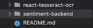
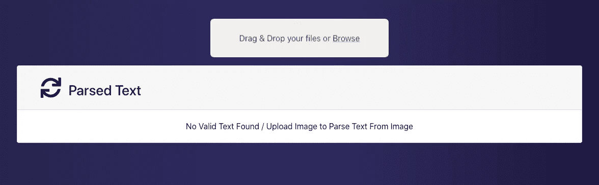
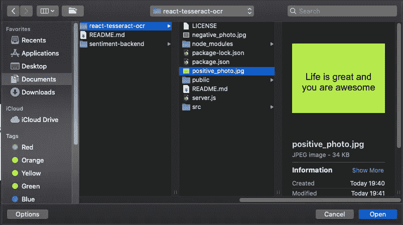
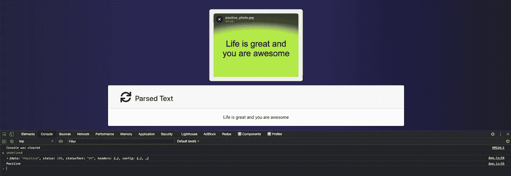
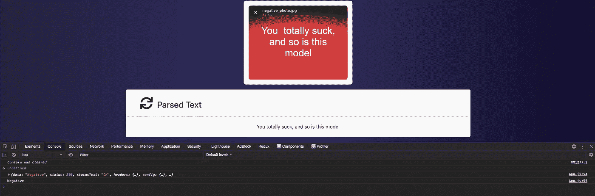

# 使用 React、Flask 和 Tesseract 构建情感分析应用程序

> 原文：<https://javascript.plainenglish.io/full-stack-sentiment-analysis-application-with-react-flask-and-tesseract-ea2de9200169?source=collection_archive---------14----------------------->

## 一个全栈的基于人工智能的 web 应用，有一个 React 前端和一个 Flask 后端

大家好，在这篇文章中，我将尝试用 React 前端和 Flask 后端演示一个基于全栈人工智能的 web 应用程序。这个项目几乎所有的前端代码都来自[这个](https://github.com/stacksapien/react-tesseract-ocr)库，所以不要忘记继续下去，并在项目的原始 OCR React 代码上打个星号。实际上，正如你所看到的项目的[最终版本](https://github.com/eren23/react-tesseract-ocr)也是 React repo 的一个分支，我只是添加了后端和情绪分析，改变了文件夹结构，并重新构建了项目。

这个项目的最终目标是向你展示，你可以使用来自牛逼社区的完美设计的开发人员友好的工具来解决 CS 中一些真正困难的问题，如果你基本上不想的话，你不必弄脏你的手。

我不会在本教程中逐行解释代码，相反，我会简单解释每个部分是如何工作的，然后你就会有一个在 AI 支持下创建类似图像基础情感分析应用程序的基础图像。

# 反应和镶嵌

正如我在上面解释的那样，我不会带您完成应用程序的每一步，但是，我将解释如何获得这些代码并让它在您自己的本地环境中运行。

首先，我们需要克隆回购协议，我们可以从这里的[最终版本](https://github.com/eren23/react-tesseract-ocr)链接获得它(同上)，然后我们可以下载 zip 版本或者你可以通过 git 克隆它。

之后，文件夹结构应该如下图所示。

我们应该先安装 npm 包，因为我们可以进入“react-tesseract-ocr”文件夹并运行以下命令:

`npm install`

之后，如果一切正常，我们应该会看到如下所示的页面。

实际上，在这个页面上，我们可以对任何我们想尝试的图像运行 OCR(光学字符识别)。OCR 作为一个概念实际上相当复杂，从头开始运行这样一个项目绝对是一场噩梦(至少如果你像我一样没有太多经验的话)。我们分叉的回购使用谷歌的宇宙魔方库，这基本上为我们自动化了所有的 OCR 过程，实际上是原始宇宙魔方的 JS 端口。

我们将为教程改变的唯一地方是下面的这一部分。

这部分是 React 项目的原作者用来打印从图片中提取的文本的地方。为了提取，我们使用 Google 的 Tesseract 库的 JS 版本。如果你想了解更多关于 tesseract.js 的信息，你可以点击这里的链接。

我们用对端口 8080 的给定端点的“POST”请求替换了这一部分，并将提取的文本添加到请求体中。

从那时起，我们可以快速转移到我们的后端。

# Flask 和朴素贝叶斯

为了简单起见，我还移到了我们通常获取数据和训练模型的部分。通常，这应该是这样一个项目的痛苦部分，我并不想用我的方法来否认这个事实。事实上，你可以通过使用[链接](https://www.digitalocean.com/community/tutorials/how-to-perform-sentiment-analysis-in-python-3-using-the-natural-language-toolkit-nltk)中的教程来训练你自己的模型。我个人前段时间也是这么做的。

所以为了运行后端，我们在 Python 环境中安装了两个依赖项， [nltk](https://anaconda.org/anaconda/nltk) 和 [Flask](https://anaconda.org/anaconda/flask) 来自以下链接(它们是 conda 指南，因为我在本地环境中使用 Anaconda。如果你想了解更多关于蟒蛇的信息

正如你所看到的，我们的模型位于“情绪-后端”文件夹的根目录下。当我们拥有了所有的依赖项之后，运行服务器就非常容易了。我们所需要做的就是运行“python server.py ”,我们的服务器就应该启动并运行了。

我现在将带您浏览我们的服务器代码。

# **进口**

这是我们导入的服务器代码，前两行是 Flask 服务器需要的，但第三行稍微复杂一点，因为我们要发送一个 POST 请求，我们需要通过从 flask_cors 导入 CORS 来启用跨源资源共享。Pickle 是用来读取我们的模块的，remove_noise 是一个从传入的文本中删除不必要甚至危险无用数据的功能，它将帮助我们更好地做出决定。work_tokenize 是一个用于标记输入文本的模块，是一个非常常用的机器学习实践，如果你想了解更多信息，可以查看这里的。

# **Inits**

我们导入 ML 模型，创建 Flask app 对象并启用 CORS。

# **端点和服务器运行**

在我们用前面的步骤准备好一切之后，现在我们可以用 Flask 装饰器创建我们的 API 端点。这个装饰器主要做的是把我们的“home”函数变成一个 API 端点，在我们的例子中，同一个地址接受 GET 和 POST 请求。

当一个请求到达我们的端点时，我们检查它是否是 POST 请求，如果是，我们现在尝试从请求体中获取我们的句子。

由于上面解释的原因，在我们有了句子之后，我们去除噪音并标记它们。

我们现在可以检查句子的上下文是否定的还是肯定的，然后返回结果。

我们现在可以运行必要的代码，用 run 和 keep_alive 函数运行我们的 Flask 服务器。

# 测试我们的系统

我在前端目录中添加了 1 个正面和 1 个负面的包含图像的文本。我们现在可以直接从 UI 中选择其中一个。

在我们选择我们的图像应用 OCR 和情感分析后，我们的 React 应用程序自动开始进行 OCR，在一切都解决后，如果我们的系统可以提供一个有意义的文本，我们就可以收到服务器的响应。

正如我们在下面看到的，我们的系统能够理解我们的图像包含一个正面的文本。现在我们来试试一个不好的。

它说它是阴性的，我同意。我的意思是，我可能会吸，但不是这个模型迄今为止:p。

*注:我故意使用我制作的那些简单图像，因为我不想处理任何侵犯版权的事情。请随意继续，并尝试用更复杂的图像。*

就这些大家，希望这个教程对你有帮助，我真的相信这次会对很多人很有用。

下次再见，保重。:)

*最初发表于*[T5【https://blog.akbuluteren.com】](https://blog.akbuluteren.com/blog/fullstack-sentiment-analysis-app-react-flask-tesseract)*。*

*在*[*https://margin.io/blogs*](https://margin.io/blogs)结账加密相关物品