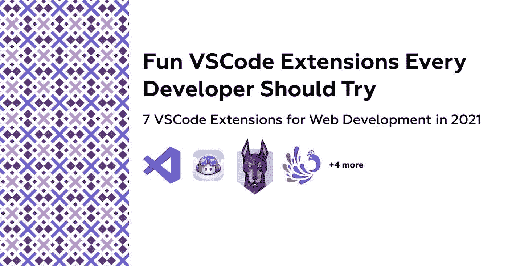
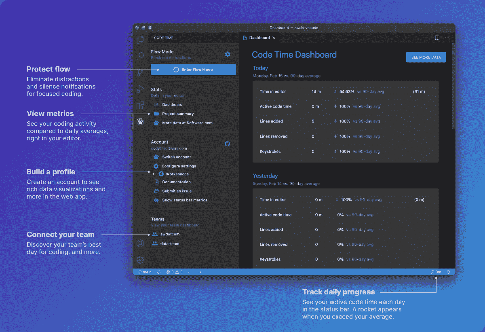
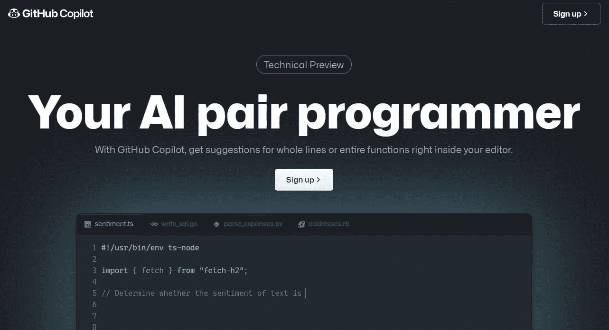
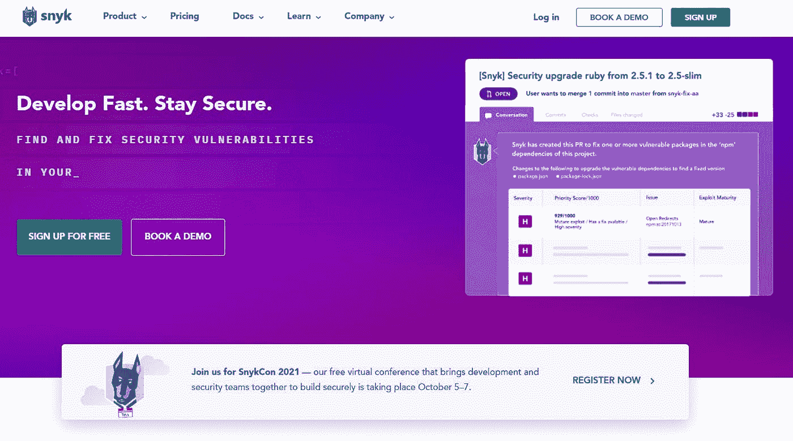
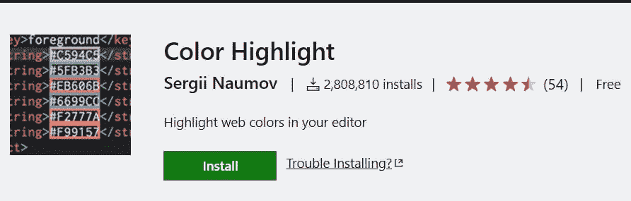
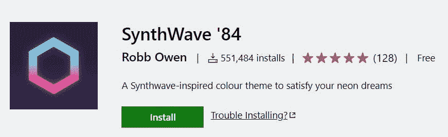
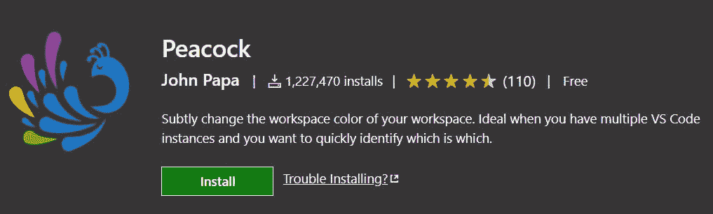
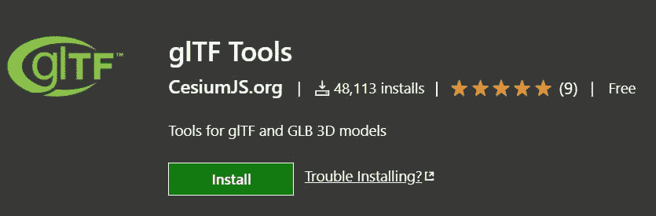

# 每个开发人员都应该尝试的有趣的 VSCode 扩展

> 原文：<https://javascript.plainenglish.io/fun-vscode-extensions-every-developer-should-try-7846508bc804?source=collection_archive---------1----------------------->

# 2021 年 Web 开发的 7 个 VSCode 扩展

VSCode 是一个非常棒并且非常受欢迎的代码编辑器，但是让它如此神奇的是它允许的扩展生态系统和它真正的可定制性。我将列出一些我经常使用的扩展，并将其视为我工作流程中的一个重要部分。

# 1.[代码时间](https://marketplace.visualstudio.com/items?itemName=softwaredotcom.swdc-vscode)

允许在 VSCode 中监控编程指标和跟踪时间，虽然其标准版本是免费使用的，但您可以创建一个帐户来访问更高级的仪表板，并定制您的配置文件以满足您的编码需求。我主要用它来了解我一天中花了多少有效小时来编码。

# 2. [Github 副驾驶](https://marketplace.visualstudio.com/items?itemName=GitHub.copilot)

Github 以 VSCode 插件的形式发布了最新的基于人工智能的 pair 程序员测试版。其基于 GPT-3 的模型在 Github 上的所有公共存储库中进行了训练，可以给出从一行到几十行完整代码的建议。它在很多情况下都会派上用场，查看关于它的更深入的教程[这里](https://alexstreza.hashnode.dev/master-github-copilot)。

# 3. [Snyk 漏洞扫描器](https://marketplace.visualstudio.com/items?itemName=snyk-security.snyk-vulnerability-scanner)

鲜为人知但功能强大的代码安全弱点检查器，它是 Snyk 平台的 VSCode 集成，是安全爱好者的另一个伟大工具。启用后，它会扫描项目中使用相同技术的其他项目中发现的常见漏洞，并通知您漏洞的程度。

# 4.[颜色高亮](https://marketplace.visualstudio.com/items?itemName=naumovs.color-highlight)

如果你正在处理 CSS/SCSS 变量，这可以让你先睹为快，而不必访问定义变量的文件。

# 5.[合成波 84](https://marketplace.visualstudio.com/items?itemName=RobbOwen.synthwave-vscode)

有没有想过用夸张的赛博朋克风格的 VSCode 主题来欺骗你的工作伙伴？现在 SynthWave '84 来了，每当你使用一个对象或函数时，它都会提供一种明亮的紫色效果，尽管这种发光对眼睛来说并不友好，所以你可以在 settings.json 中用“synth wave 84 . disable glow”:true 轻松地禁用它。

# 6.[孔雀](https://marketplace.visualstudio.com/items?itemName=johnpapa.vscode-peacock)

在多个项目上工作可能会很快变得混乱，因此发明了 VSCode 工作区，作为它们的扩展，Peacock 允许对每个工作区进行颜色编码，以便轻松识别项目。

# 7. [glTF 工具](https://marketplace.visualstudio.com/items?itemName=cesium.gltf-vscode)

3D 体验在 2021 年风靡一时，随着基于 Three.js 和 WebGL 的库的普及，越来越多的开发人员不得不在现代前端框架中使用 3D 模型，但仅为单个模型设置场景可能需要一段时间。使用 glTF 工具，您可以直接在 VSCode 中查看模型，甚至在需要时编辑它们。

> *我希望你喜欢这个我最喜欢的 VSCode 扩展的简短列表，如果你把💜这就去。*

*更多内容尽在*[***plain English . io***](http://plainenglish.io/)