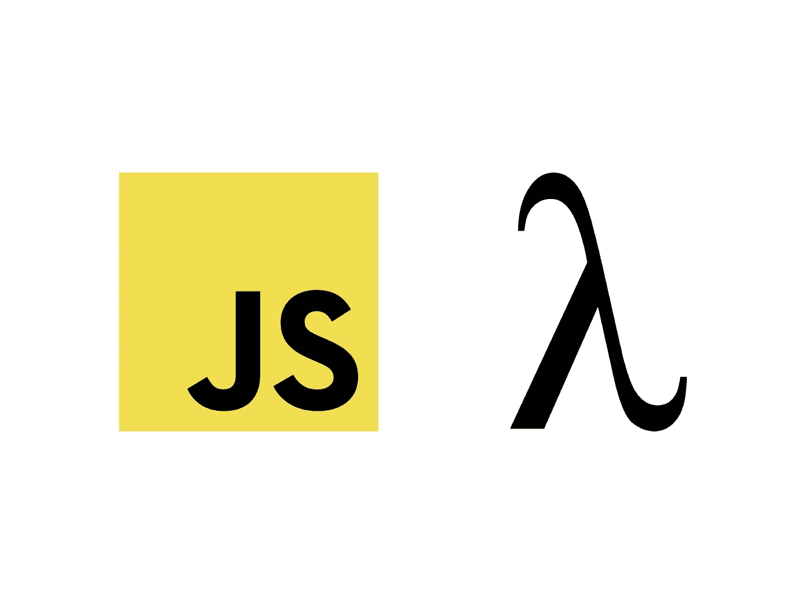
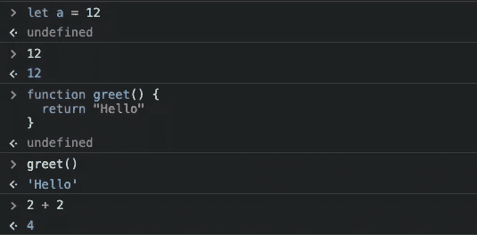

# 函数式 JavaScript——一篇文章中的所有重要概念

> 原文：<https://javascript.plainenglish.io/functional-javascript-17032a113930?source=collection_archive---------1----------------------->

## 了解原因和方式



JavaScript 给了我们很大的自由。

例如，改变初始化变量类型的自由。
但也有尝试不同范例的自由。JavaScript 没有固定的范例——我们可以编写面向对象的、命令式的、甚至是函数式的代码。

虽然我看到了很多面向对象的和命令式的 JS 代码，但后者似乎被低估了。函数式编程并不容易，而且容易被误解。

是时候用 JavaScript 向初学者介绍这种范式了。以下是解释的主要概念。当然，你不会变成一个成熟的函数式程序员。但是希望这篇介绍能给你一个概述和为什么和如何的答案。

由于这是一篇很长的文章，这里有一个小目录:

```
**·** [**Understanding the Philosophy of Functional Code**](#0175)**·** [**Securing your Data — Understanding Immutability**](#9515)**·** [**Focusing on What Matters — Pure Functions**](#23f2)**·** [**Transforming Data — Map, Reduce and Filter**](#d941)**·** [**Swallowing Functions — High Order Functions**](#9a1b)**·** [**Looping the Functional Way — Recursion**](#3ae2)**·** [**Functions That Aren’t Mutating**](#7a59)**·** [**Currying**](#e857)**·** [**Miscellaneous**](#4493)**·** [**More Tools for Functional JavaScript**](#4296)
```

# 理解功能代码的哲学

理解是申请的基础。正确的动机对学习很有帮助。

许多人认为函数式编程意味着编写尽可能多的函数。我认为编写大量函数是函数式编程的结果。让我们揭开它的神秘面纱，了解这种编程范式的目标。

函数式编程主要解决表达式问题。由于函数调用是表达式，所以编写函数在函数式编程中是必不可少的。但是等等——表情？那是什么意思？

## 陈述和表达

我们写的代码可以分为两组:语句和表达式。

表达式是可以被求值的语法实体。你可以把一个表达式想象成当它被执行时会返回一些东西。比如调用一个函数返回某个东西就是一个表达式。此外，调用变量是一个表达式，因为我们接收它的值。

在 chrome 开发工具中，我们可以很好地看出区别:



初始化变量“a”是一个语句。因此，控制台不会为我们返回任何内容。如下图所示，在控制台中输入“12”是一个表达式。

接下来是初始化函数“greet”——这是一个语句。语句大多是初始化或声明变量，也有像“for”或“while”这样的关键字。

调用函数“greet”是一个表达式，就像将两个数字相加一样。

语句是典型的*命令式*编程范例。
我们有下一个词要澄清。命令式风格围绕着编写指令(陈述)。另一方面，函数式编程是关于描述我们的数据。

这里有一个简单的例子。

目标是接收包含在`numbers`中的所有偶数(2，4)的数组。

```
let numbers = [1, 2, 3, 4]let evenNumbers = []*for* (let i = 0; i < numbers.length; i++) {
  let number = numbers[i]

  *if* (number % 2 === 0) {
    evenNumbers.push(number)
  }
}console.log(evenNumbers)
```

这段代码是必不可少的——它只由语句组成，并且依赖于变化的数据(甚至是一个全局变量)。

现在，功能示例:

```
let numbers = [1, 2, 3, 4]console.log(
  numbers.filter((number) => {
    *return* number % 2 === 0
  })
)
```

在神奇发生的地方，我们使用表情。filter 函数被调用并返回一些东西——就像函数一样，我们传递给它。作为使用表达式的副作用，我们编写和调用函数——我们甚至将函数传递给其他函数。

与命令式代码相比，这段代码不会改变任何数据。这是函数式编程背后的主要思想之一:尽量不要改变任何数据。如果你想知道为什么:改变其他函数依赖的全局数据可能会导致不必要的错误。

想象一下，你不小心改变了一个很多函数在计算中使用的常数——这将导致很多地方出现错误。现在想象一下故意改变全球数据的风险**。**

**说到不变性，这个概念经常被误解——尤其是在 JavaScript 中。我们来澄清一下。**

# **保护您的数据—了解不变性**

**如果一个对象的状态在初始化后不能改变，那么它就是不可变的。尽管听起来很简单，但这个概念对于函数式编程来说是必不可少的。而且有必要在 JavaScript 中理解它，因为它经常被误解。**

**JavaScript 对象不是不可变的。而 const-keyword 并没有改变这一点。const-关键字禁止重新分配变量，而不是改变它。
另一方面，用“const”关键字初始化的原始类型(数字、布尔等)是不可变的。**

**可变性最糟糕的地方是它所允许的错误场景。
让我们看一个例子。**

```
const person = { name: 'Max' }let copy = person
copy.name = 'Carl'console.log(person)
```

**是的，“Carl”将被记录在这里——改变对象的副本会改变原始对象本身。因此，即使我们不能重新分配人-对象，我们也可以改变它的状态。不变性是函数式编程中的一个基本主题，因此，理解 JavaScript 在这方面的问题和解决方案是必要的。**

**让 JavaScript 更加不可变的解决方案:**

*   **[TypeScript 中的不可变对象](/typescript-immutability-b52bece7b9ea)**
*   **[不可变. js](/immutable-js-efe6b42e122f)**
*   **类似`Object.freeze(obj)`的功能**

**既然我们已经理解了不可变数据，我们可以把注意力放在函数上了。下面是如何用函数的方式编写函数。**

# **专注于重要的东西——纯粹的功能**

**让我们直入主题吧。**

**如果满足以下条件，则函数是纯函数:**

1.  **给定相同的输入，该函数每次都返回相同的输出**
2.  **该函数不会产生副作用(改变任何全局状态)**

**当你读到第一点时，你可能会提出一个问题:“那么，当我的函数依赖于一个全局状态时，它是纯的吗？”。**

**如果你的纯函数依赖于一个全局变量，它的行为可能还是像纯函数一样。只要这个全局变量不变，函数将始终为相同的输入产生相同的结果。
然而，这并不能保证。这里有一个小例子。**

```
let globalNum = 10function add(num) {
  return num + globalNum
}
```

**因为`globalNum`可能随时改变，所以不能保证函数`add`总是为相同的输入产生相同的回报。
函数`add`不纯。**

**当谈到作为全局状态`globalNum`的不可变数据时，有人可能会说这个函数是纯函数。然而，避免依赖全局状态通常是一个好主意。**

# **转换数据-映射、简化和过滤**

**这三个属于 JavaScript 中最强大的函数。它们的共同点是:它们不会改变我们应用它们的数组。
对，这三个都是数组函数。此外，它们是高阶函数(我们一会儿会阐明这一点)。**

**让我们把它们分解开来。**

## **地图——全方位**

**可以将`array.map`功能想象为`forEach`的替代功能。我们迭代一个数组，并提供一个函数来处理数组的值和索引。例如，我们可以使用映射将数组中的每个数字加倍:**

```
let nums = [1, 2, 3]nums.map((num) => {
  return num * 2
})
// [2, 4, 6]
```

## **减少—将数组减少到一个值**

**这可能是三个中最被误解的。Reduce 将我们的数组缩减为一个值，这个值被返回。这是通过一个通常被称为“减速器”的功能来实现的。**

```
let nums = [1, 2, 3, 4]nums.reduce((prevVal, val) => {
  return prevVal + val
})
```

**reduce 函数将返回“10”，因为 1 + 2 + 3 + 4 是 10。**

## **Filter —返回经过筛选的数组**

**对于过滤器，我们提供一个模式作为函数。对于应该包含在筛选数组中的每个元素，pattern 函数应该返回“true”。**

**下面是一个示例，返回[2，4]，因为它们是唯一的偶数:**

```
let nums = [1, 2, 3, 4]nums.filter((val) => {
  return val % 2 === 0
})
```

**有了这三个强大的功能就够了。通过数据转换和使用索引，您可以做更多的事情。然而，这应该只是一个介绍。**

# **吞咽功能—高阶功能**

**正如我在开始时所说的，函数式编程解决了很多关于函数的问题。如你所知，函数可以被调用，它们可以返回一些东西等等。我们没有做的是用它们改变全局数据——通常情况下，应该避免改变数据。**

**因此，当遇到纯函数式编程时，许多人会问:“我能用这种语言做我能用(Python、Java、C++、JS)做的一切事情吗？”。**

**这是一个相关的问题，通常被更具体地表述为:“这种语言是完整的吗？”。由于纯粹的函数式编程不允许我们做几件事情，许多人感到疑惑。**

**好消息是，我们可以补偿许多我们在函数式编程中没有做的事情。在我们的例子中，函数帮助我们做到这一点。我们不仅可以调用它们并返回数据，我们甚至可以嵌套它们。**

**函数式编程中更复杂结构的一个例子是高阶函数。高阶函数是返回函数或接收函数作为参数(或两者兼有)的函数。**

**同样，举个例子可能最有帮助。因为我们已经讨论了映射、过滤和减少，所以您应该理解这里发生了什么:**

```
const nums = [1, 2, 3]function double(item) {
  *return* item * 2
}console.log(nums.map(double))
*// [2, 4, 6]*
```

**这就是我们的地图，让价值再次翻倍。但这一次，我们用一个全局函数代替了匿名箭头函数，叫做“double”。由于`map`是高阶函数，我们可以将函数传入其中。**

**这使得我们的代码可读性更好，并且“double”函数可以重用。**

# **循环函数方式——递归**

**任何编程语言都不应该缺少循环。大多数程序在某些时候依赖于 for 循环、while 循环或 for-each 循环。然而，这些都是语句——而且语句在函数式编程中很少见。**

**那么，这仅仅是风格的问题吗？这就是我们在函数式编程中不使用 for-loops 和 co .的原因吗？不，这不仅仅是因为风格。**

**另一个原因是，像 for 循环一样，循环依赖于一个变异的变量。除此之外，函数式编程不需要我们从大多数编程语言中了解到的那种循环。我们可以用递归代替一切。有时，我们可以使用内置的替代功能，比如我刚才展示的地图功能。**

**TL；DR:在函数式编程中，我们不需要 for 或 forEach 循环。**

**为了充分装备自己，你需要理解递归。**

**这个想法并不难:一个在执行过程中调用自身的函数。正如您可能注意到的，这可能会导致无限循环。好吧，至少我们得到了我们的循环。玩笑归玩笑，这就是递归函数中条件发挥作用的地方。有条件的部分被称为**基础案例**。另一部分是**递归案例**。**

```
function coutdown(number) {
  // base case 
  *if* (number === 0) {
    console.log(0)
    *return* 0
  } console.log(number)
  // recursive case 
  coutdown(number — 1)
}
```

**如你所见，基本情况是终止我们的递归。递归的例子是为了重新调用我们的函数。**

**所有迭代函数都可以转换成递归。然而，这并不意味着你应该用它做任何事情。递归是有代价的。**

**所谓的调用堆栈存储函数调用、它们的参数、局部变量和其他计算函数执行所需的数据。调用堆栈中不再需要的东西会被移除。问题:当使用递归时，在彼此之间建立调用。只有当整个递归完成后，调用堆栈才会被清理。因此，这个堆栈的负载是巨大的。**

**上面显示的递归在 12000 崩溃，传递到我的机器上。递归不如“for”或“while”这样的经典循环高效。**

**然而，对于大多数计算来说，使用递归应该不成问题。**

**为了实践这个概念，看一看它优雅地解决的问题是有意义的。有几件事，在本质上是递归的。层次结构，比如文件系统，就是一个很好的例子。其他领域的问题也可以用递归很好地解决——图形和一些数学问题，如斐波那契数列。**

# **没有变异的功能**

**正如我之前所说，当试图编写函数式 JavaScript 时，目标是编写尽可能多的纯函数。当谈到变异数据时，你可能会问自己一个问题:“如果一个函数根据输入变异了一个局部变量，它还是纯的吗？”。这里有一个简单的例子:**

```
function add(a, b) {
  let result = 0
  result = a + b *return* result
}
```

**尽管这是可怕的代码，但该函数在技术上是纯粹的。它确实变异了一个局部变量，但这并不违背纯函数的定义。
尽管如此，函数式程序员完全避免变异变量——不管在什么地方，什么类型的变量。**

**因此，了解 JavaScript 中不可变函数的工具箱是一个好主意。例如，仅仅对于数组来说，就有大量的函数可以使用——有些是变异的，比如`push`，有些不是，比如`slice`。**

**你喜欢一个简单的例子吗？**

```
function addNum(arr, newNum) {
  return […arr, newNum]
}addNum([1, 2, 3], 4) 
*// [1, 2, 3, 4]*
```

**由于 spread 操作符，我们可以使用一个纯函数来返回数组的一个修改过的副本，而不是推送到数组并对其进行变异。**

# **Currying**

**可化函数是一个接受多个参数的函数，但被转换成一系列接受每个参数的函数。
一开始听起来很难吧？这里有一个例子。**

```
function add(a) {
  return function(b) {
    return a + b
  }
}add(2)(3) // 5
```

**正如你所看到的，我们有一个函数`add`——但是这个函数没有调用它`add(2, 3)`，而是返回一个函数，所以我们把两个函数调用放在一行中。**

**但是为什么呢？事实上，我不太喜欢奉承。然而，我想在这篇文章中讨论它。有好处。一个是您的函数现在逐步接收参数，以便您可以保存不同的函数调用:**

```
const greet = (time) => (firstname) => (lastname) =>
  `Good ${time}, ${firstname} ${lastname}`const time = greet('Morning')const firstname = time('John')console.log(firstname('Doe'))
```

**有些人声称 curried 函数使测试更容易。**

# **多方面的**

**是的，我知道你读过所有这些关于 JavaScript 中 arrow 与普通函数的文章。最后一次，当谈到函数式编程时，让我们来谈谈这两者。你能行的。**

**这里就不赘述了。除了关于 ***这个*** 绑定的区别之外，箭头函数还有一个区别。**

**箭头函数允许隐式返回。正如您在下面的示例中看到的，没有 return 关键字。然而，我们回报了一些东西。**

```
const addOne = x => x + 1;
addOne(1); // -> 2
```

**此外，使用这种语法返回某些内容，您以前不能编写任何语句。正如您在这里看到的,“普通”函数中的情况并非如此:**

```
function addOne(x) {
  <some-statement>
  return x + 1
}
```

**我不想过多强调这一点，因为我发现这主要是视觉上的差异。然而，有些人称赞它是编写函数的一种更具功能性和声明性的方式。**

# **用于函数式 JavaScript 的更多工具**

**现在我们谈了很多关于函数式编程的内容。然而，我们仍然使用 JavaScript。我们曾经不使用库或框架做一些事情吗？绝对不行。说到函数式编程，有很多工具。**

## **不可变的. js**

**从本文开始，我们讨论了不变性。有一个著名的库叫做 immutable.js，我在这里对它做了更扩展的介绍[。
该库有助于创建不可变的类型，如数组、映射和集合。不可变的. js 还替换了默认函数，比如最初改变数据的`Map.set`。不可变的. js 改变了它们，所以函数返回改变的数据，但不改变原始数据。](/immutable-js-efe6b42e122f)**

## **其他图书馆**

**我不想过多地谈论函数式 JavaScript 的库。原因是我一个都没用。此外，库之间的差异正在变小，因为它们都集成了 ask 特性。除了 Immutable.js 之外，还有一场非常著名的 Lodash 和 Underscore.js 之战。两者都为 JavaScript 中的函数式编程提供了功能。由于两者都在不断变化，我建议你做你的研究。**

**Ramda 不如下划线、Lodash 和 Immutable.js 出名。然而，许多函数式程序员喜欢它。**

## **纯脚本**

**[PureScript](/bringing-powerful-functional-programming-to-the-web-with-purescript-3ee759ce05aa) 不是一个库，也不是一个框架。PureScript 是一种完全不同的基于 Haskell 的编程语言。更有趣的是，PureScript 是一种纯函数式编程语言。然而，最终，代码被编译成 JavaScript。**

**如果你想写 100%功能性的代码，试试 PureScript。因为它以模块化的方式导出到 JavaScript，所以现有的项目可以用它来扩展。**

**感谢您的阅读！**

****万一你想同时加入 Medium 和支持我:
你可以在这里** ***购买订阅** [**。**](https://louispetrik.medium.com/membership)**

****附属链接。如果你使用这些链接购买东西，我会赚取佣金，但没有额外的费用给你。非常感谢！***

**想了解更多关于函数式编程的知识吗？我支持你:**

**[](/javascript-functional-vs-oop-fb5fbf15a35d) [## JavaScript 中的函数式编程与面向对象编程

### 对两者利弊的介绍

javascript.plainenglish.io](/javascript-functional-vs-oop-fb5fbf15a35d) [](/purescript-3ee759ce05aa) [## 用 PureScript 为 Web 带来强大的函数式编程

### 就像 JavaScript 的 Haskell

javascript.plainenglish.io](/purescript-3ee759ce05aa) 

*更多内容看* [*说白了。报名参加我们的*](http://plainenglish.io/) [*免费每周简讯*](http://newsletter.plainenglish.io/) *。在我们的* [*社区*](https://discord.gg/GtDtUAvyhW) *获得独家写作机会和建议。***