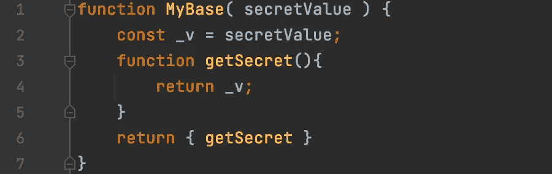

# 函数式 JavaScript:没有“class”关键字的类

> 原文：<https://javascript.plainenglish.io/functional-javascript-classes-without-the-class-keyword-6e2de50a3698?source=collection_archive---------5----------------------->



几年前，我开始使用迈克·博斯托克的 D3 . js([https://d3js.org](https://d3js.org))作为一些内部图表应用程序的基础。让我印象深刻的不是令人惊叹的图形质量，而是代码风格。代码没有使用传统意义上的类。D3 返回一个 JavaScript 对象，该对象由一组跨越实例私有数据的闭包组成。我这么说是什么意思？

首先，我们定义一个返回空地图的函数。

```
function MyObject(){
    return {}; 
}
```

上面看起来不怎么像，但却是最核心的积木。在我的代码中，我可以创建这个空地图的“实例”。

```
const obj = MyObject();
```

这个“对象”没有做太多，但是我们可以添加一个方法。

```
function MyObject(){
    function hello(){
        return “Hello World”;
    }
    return { hello };
 }
```

我们现在有一个只有一个方法的对象，用法如下。

```
const obj = MyObject();
let msg = obj.hello();
```

我们可以用其他方法继续扩展它。有两种方法可以给这个对象添加状态。第一，我发现最有帮助的是支持一个私有国家。

```
function MyObject(){
    let msg = “World”;
    function hello(){
        return “Hello “ + msg;
    }
    return { hello };
 }
```

同样，除了返回“Hello World”之外，这没有什么作用，而且没有办法改变 msg 的状态。为此，我们添加了一个方法。

```
function MyObject(){
    let msg = “World”;
    function hello(){
        return “Hello “ + msg;
    }
    function setMessgage( m ) {
        msg = m;
    }
    return { hello, setMessage };
}
```

现在，我可以通过调用对象实例上的 setMessage 方法来更改消息。这里发生了什么？每个函数都不是简单的函数；它是在构造函数的作用域中定义的闭包。每个闭包共享同一个“msg”变量实例。我可以根据需要向构造函数范围添加任意数量的变量，并将其作为闭包引用。

这个私有国家有一个核心财产:外部观察者看不到该状态；这是真正的隐私。允许状态的访问或突变需要一个显式的方法。对状态使用闭包意味着我可以安全地更改我的实现或者添加和删除状态，同时保留我的对象的公共接口。

第二种方法仍然使用闭包，但是闭包作用于返回的 map。为此，我们首先重写我们的构造函数来定义实例对象。

```
function MyObject(){
    var obj = {}
    obj.state = “World”;
    function hello() {
        return “Hello “ + obj.state;
    }
    obj.hello = hello;
    return obj;
}
```

注意，我们显式地将函数 hello 分配给地图 obj。我们也可以在使用匿名函数定义 hello()函数的过程中这样做。

```
function MyObject(){
    var obj = {}
    obj.state = “World”;
    obj.hello = function() {
        return “Hello “ + obj.state;
    }
    return obj;
}
```

我们现在可以直接改变状态，而不是在对象上使用方法。

```
const obj = MyObject();
let msg1 = obj.hello(); // Returns Hello World
obj.state = “Mars”;
let msg2 = obj.hello(); // Returns Hello Mars
```

我的总体偏好是私有国家形式，但也有第二种感觉更好的时候。

按照惯例，定义 setters 和 getters 很简单。

```
function MyX(){
    let _x = 0;
    function setX(){
        _x = x;
    }
    function getX(){
        return _x;
    }
    return { setX, getX }
}
```

这种模式的一个好的副作用是不需要“新”关键字；这只是函数调用。

大多数对象都有带参数的构造函数。我们可以在代码中添加一个简单的构造函数。

```
function MyX( x ){
    let _x = x;
    function setX(){
        _x = x;
    }
    function getX(){
        return _x;
    }
    return { setX, getX }
}
```

这可以按如下方式使用:

```
const obj = MyX( 1 );
const x = obj.getX(); // returns the number 1
```

让我们假设我们接受这比使用 ES6 类语法定义类更好。有问题；我们缺少任何形式的继承或功能组合。

考虑下面的“基本对象”,它只在构造时保存一个秘密集合。

```
function MyBase( secretValue ) {
    const _v = secretValue;
    function getSecret(){
        return _v;
    }
    return { getSecret }
}
```

现在我们可以定义一个组成这个秘密功能的对象。

```
function MyObject( x ) {
    const base = MyBase( 1234 );
    let _x = x;
    function setX(){
        _x = x;
    }
    function getX(){
        return _x;
    }
    function useBase(){
        return base.getSecret() * _x;
    }
    return {getX,setX,useBase, ...base}
 }
```

MyObject 导出方法“setX”、“getX”和“getSecret”。我们也根本不需要导出基方法。我们可以去掉…底座

也没有只拥有一个基本对象的限制！

```
return {getX,SetX,…base1, …base2, …base3 }
```

您需要注意方法屏蔽；最后一个赢了。您可能需要反转 return 语句。

```
return {,…base1, …base2, …base3, getX,SetX }
```

最后，我们可以切换到使用 ES6 箭头功能。我们不需要一个“这个”来支持这些对象。

```
const arrowObject = (x) => {
    let _x = x;
    const getX = () => _x;
    const setX = (x) => _x = x;
    return { getX, setX }; 
 }
```

这种策略有一些限制；例如，要在对象上重载“toString”方法，仍然需要重写原型。

通过对核心语言进行一些小的添加，您可以按照下面的方式定义一个对象。不幸的是，这似乎不是 JavaScript 的发展方向。

```
// THIS CODE DOES NOT WORK ON CURRENT JAVASCRIPT
const FutureObject = () => {
    ... methods 
    const toString = () => {
        return “Future Objects Rock”;
    }
    return { method1, method2, [[toString]] : toString }
}
```

考虑到这种表达能力和现有的简洁语法，我不禁要问为什么 JavaScript 需要“类”语法？