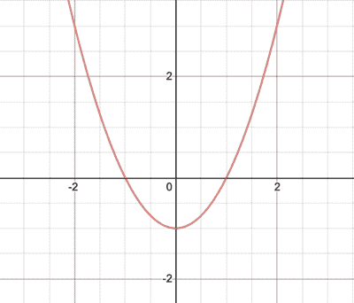

# 功能 JavaScript 基础

> 原文：<https://javascript.plainenglish.io/functional-javascript-fundamentals-469859265014?source=collection_archive---------10----------------------->

## 函数式编程的基础，同时主要涉及它们在 JavaScript 中的应用

# 介绍

*函数式编程*是利用*函数*的代码风格吗？要是有那么简单就好了！函数确实是*函数式编程*的核心，但是这是我们*如何使用*那些函数来使我们的实现*起作用*。

本文旨在奠定*函数式编程*的一些基础，同时主要涉及它们在`JavaScript`中的应用，这将帮助您理解:

1.  **功能**是什么？
2.  **功能***vs***程序**
3.  **说明性***vs***命令性**编程
4.  理解功能**输入**和**输出**

这些基础将极大地帮助你掌握*函数式 JavaScript* 的更多概念，如果这有帮助的话，将在以后的文章中涉及。

下一篇文章将涉及:

1.  **函数纯度**(纯*对*不纯函数)
2.  **副作用**
3.  提取并容纳**杂质**
4.  所有这些如何共同定义*什么是* **功能编程**，以及*为什么使用*
5.  `JavaScript`是不是一种*函数式编程*语言？
6.  为什么为你的代码考虑 ***函数式编程*** 风格？

敬请期待！

# 1.什么是功能？

嗯，就像任何介绍性编程类会告诉你的那样，函数是一段*可重用的代码，它在执行时执行一些任务*。虽然这个定义是合理的，但是它忽略了一个重要的观点，这个观点是函数应用于函数式编程的核心。

让我们以非常基础的数学为例，试着更完整地理解**函数**。

你可能记得在学校里读到过`f(x)`，或者方程式`y = f(x)`。让我们假设等式`f(x) = x2- 1`。那是什么意思？把那个方程画成图是什么意思？这是图表:

这相当于:

你可以注意到，对于`x`的任意值，比如说`1`，如果你把它代入方程，你会得到`0`。然而什么是`0`？它是`f(x)`函数的返回值，我们之前说过它代表一个`y`值。

在数学中，函数总是接受输入，并且总是给出输出。围绕 FP 你会经常听到的一个术语是“态射”；这是一种描述映射到另一组值的一组值的奇特方式，就像一个函数的输入与该函数的输出相关。

然而，在我们的代码中，我们可以定义具有各种输入和输出的函数，即使它们很少被解释为图形上直观绘制的曲线。

因此，更完整的函数定义应该是:

> **函数是输入和计算输出之间的语义关系。**
> 
> *还要注意* `*function*` *和*函数*在本文中的用法。而*功能*是我们正在讨论的概念，* `*function*` *只是* `*JavaScript keyword*` *。*

从本质上来说，*函数式编程*是关于在这个数学意义上包含使用`functions`作为*函数。*

# 2.功能 vs 程序？

术语**功能**和**程序**经常互换使用，但它们实际上指的是不同的东西。

**程序**是功能的任意集合。它可能有输入，也可能没有。它可能有输出(作为一个`return`值)，也可能没有。

然而，**函数**接受输入，并且肯定总是有一个`return`值。

对于**功能编程**，我们尽可能使用*功能*，尽可能避免*程序*。你所有的*函数*应该接受输入并返回输出。

基于这些知识，让我们考虑下面的例子:

试评估`function`和`addPokémon`是*功能*还是*程序*？

以下是一些基本观察结果:

1.  `addPokémon`有定义的输入，但没有由`return`指定的输出。应该是一个*程序*。
2.  `countPokémon`有定义的输入和定义的`return`，所以应该是*函数*？

我们关于`addPokémon`是一个*过程*的说法是正确的，但是`countPokémon`也是一个*过程*，而不是一个*函数*，因为它在自身内部调用了一个*过程*。

总而言之:

> *注意，一个* `*function*` *在自身内部调用一个*过程*，也是一个*过程*。一个*程序*的* ***【杂质】*** *，这是一个要进一步往下解释的概念，涓滴而下，“污染”所有直接或间接称呼它的人。*

现在，我们可能想知道如何将最后一个例子的*过程*转换成*函数*？

基于上一节提到的*函数*的更完整定义，在寻找许多可能的解决方案之前，尝试对最后一个例子进行修改。对于这个例子，它应该非常简单。

让我们再看一个区分*程序*和*功能*的例子。

这个片段有效地返回了一个神奇宝贝的近邻的 pokédex ID，给出了它自己的 ID。

显然，`neighbouringPokémonID`是一个*函数*，因为它有一个输入，而`return`是基于它的一个输出。

另外，`generateNeighboursForTeam`是一个*程序*，因为它不`return`任何东西。

同样，我们可以修改这个例子，使两者都是*函数*。

# 3.声明式编程还是命令式编程？

另一个要熟悉的基本概念是，**声明式**和**命令式**编码风格之间的区别，老实说，这在它的意义上是相对的。

没有绝对**陈述性**或绝对**命令性**的风格。*本身就是一个谱。*

也就是说，让我们介绍一个常见的简单定义。

> *“*命令式*编程就像*你如何*做某事，而*声明式*编程更像*你做什么*。”*

有点模棱两可，开放式，就举个小例子吧。

假设，你正试图帮助你的小弟弟学习最新的神奇宝贝游戏的基础知识。具体来说，关于抓野生神奇宝贝。

> 宣示性*:在神奇宝贝虚弱的时候扔一个神奇球。*(做什么)
> 
> 命令式*:当神奇宝贝的生命值低于 30%时，按 X 键投掷一个神奇宝贝球。*(具体怎么做)

一般来说，明确地逐一列出所有步骤是**必须的**。理解起来相当机械，需要一行一行地浏览。

并且利用某种程度的抽象和可信助手功能，以仅呈现基本思想的方式列出步骤，是**声明性的**。这很容易理解，因为我们不需要关心事情是如何发生的，而是关心事情是如何发生的。

正如 ***什么*** 和 ***如何*** 可以相当主观，我们不能围绕什么是*陈述性*或*命令性*画出一个硬性的界限。

例如，对于一个用机器语言编程的人来说，这是非常必要的，Java 看起来更像是声明性的。或者对于一个从事纯函数式语言工作的人来说，比如 Haskell 或 Clojure，甚至 JavaScript 中的函数式实现也会感觉相当必要。

我们目前关心的是为**函数式编程**和**函数式 JavaScript** 奠定基础，我们需要明白，我们应该通过利用 ***函数*** ，尽可能使我们的代码成为**声明式**。

继续，让我们多了解一点关于 ***功能输入和输出*** 。

# 4.功能输入

本节涵盖了*功能输入*的更多方面，主要是:

*   自变量和参数
*   默认参数
*   计数输入
*   参数数组
*   参数析构
*   声明式风格的好处
*   命名参数
*   无序参数

让我们开始吧。

# a.自变量和参数

关于**参数**和**参数**之间的区别，经常会有一点混淆。

简单地说，**参数**是您传递给`function`的值，而**参数**是接收这些值的`function`内部的命名变量。

> *注意:在 JavaScript 中，*实参的数量不需要和*形参的数量相匹配。如果您传递的参数比您声明用来接收它们的参数要多，那么这些值就可以很好地传入。*
> 
> *这些额外的参数可以通过几种方式访问，包括* `*args*` *对象。如果传递的参数较少，那么每个不匹配的参数都被赋值为* `*undefined*` *。*

# b.默认参数

参数可以声明默认值。如果该参数的参数没有被传递，或者已经传递了值`undefined`，那么默认的赋值表达式将被替换。

考虑任何有助于函数可用性的默认情况总是一个好习惯。

# c.Arity，即输入计数

a `function`“期望”的参数数量由声明的参数数量决定。

`f(..)`需要`4`个参数，因为它有`4`个声明的参数。这个计数有一个特殊术语: **Arity** ，它是一个`function`声明中参数的数量。`f(..)`的**号**是`4`。

此外，一个具有 **arity** 1 的`function`也称为**一元**，一个具有 **arity** 2 的`function`也称为**二元**，一个具有 **arity** 3 或更高的`function`称为 **n 元**。

那个`function`引用的`length`属性返回它的 **arity** 。

虽然这听起来很简单，但意义深远。

在执行期间确定 **arity** 的一个原因是，如果一段代码从多个源接收到函数引用，并且必须根据每个源的 **arity** 发送不同的值。

例如，假设一个`fn`函数引用可以有一个、两个或三个参数，但是你总是想在最后一个位置传递一个变量`x`:

> ***提示:*** *函数的* `*length*` *属性是只读的，它是在声明函数时确定的。它本质上应该被认为是一段元数据，描述了函数的预期用途。*
> 
> *需要注意的一个问题是，某些类型的参数列表变化会使函数的* `*length*` *属性报告与您预期的不同:*

计算当前函数调用收到的参数数量怎么样？这曾经是微不足道的，但现在情况稍微复杂一些。每个函数都有一个可用的`arguments`对象(类似数组),它保存了对每个传入参数的引用。然后，您可以检查`arguments`的`length`属性，以计算出实际通过了多少:

从 ES5 开始(特别是严格模式)，`arguments`被一些人认为是过时的；许多人尽可能避免使用它。然而，`arguments.length`，也只有它，可以继续用于那些需要关心传递的参数数量的情况。

> *接受不确定数量参数的函数签名被称为* **变量** *函数。*

假设您确实需要以类似位置数组的方式访问参数，可能是因为您访问的参数在那个位置没有形参。我们怎么做呢？

ES6 来救援了！让我们用`...`操作符来声明我们的函数，称为“spread”、“rest”或“gather”:

参数列表中的`...args`是一个 ES6 声明形式，它告诉引擎收集所有未分配给命名参数的剩余参数(如果有)，并将它们放入名为`args`的真实数组中。永远是一个数组，即使它是空的。但是它**不会**包括分配给`x`、`y`和`z`参数的值，只包括除了前三个值之外传入的任何其他值。

所以，如果你想设计一个函数，可以考虑任意数量的参数，使用`...args`。

即使没有声明其他形式参数，也可以在参数列表中使用`...`操作符。

`args`现在将是参数的完整数组，不管它们是什么，并且您可以使用`args.length`来精确地知道有多少个参数被传入。

# d.参数数组

如果您想将一组值作为函数调用的参数传递，该怎么办呢？

我们的新朋友，这里使用了`...`操作符，但现在不仅仅是在参数列表中；它也用在调用点的参数列表中。

它在这个上下文中有相反的行为。在一个参数列表中，我们说它*将*个参数聚集在一起。在一个参数列表中，它*展开*它们。因此，`arr`的内容实际上是作为`f(..)`调用的单独参数展开的。

此外，多个值和`...`扩展可以根据需要进行交织:

> *在这种对称的意义上考虑* `*...*` *:在值列表位置，它*展开*。在赋值位置——像一个参数列表，因为实参把*赋值给*形参——它*聚集*。*
> 
> `*...*` *使得处理参数数组变得更加容易。*

# e.参数析构

考虑上一节的变量`f(..)`:

如果我们想改变这种交互，让函数的调用者传入一组值，而不是单个的参数值，会怎么样呢？只需去掉两个`...`用法:

很简单。但是，如果现在我们想给传入数组中的前两个值都指定一个参数名，会怎么样呢？我们不再声明单独的参数，所以看起来我们失去了这种能力。

谢天谢地，ES6 **析构**就是答案。**析构**是为某种结构(对象、数组等)声明*模式*的一种方式。)以及如何分解(分配)它的各个部分。

考虑:

你现在发现参数列表周围的`[ .. ]`括号了吗？这被称为**数组参数析构**。

在这个例子中，析构告诉引擎在这个赋值位置应该有一个数组(又名参数)。该模式要求将数组的第一个值赋给一个名为`x`的局部参数变量，第二个值赋给`y`，剩下的值由*收集*到`args`。

# f.声明式风格的好处

考虑到我们刚刚看到的析构的`f(..)`，我们可以手动处理参数:

但是这里我们强调一个原则，即**声明性**代码比**命令性**代码更有效地沟通。

**声明性**代码(例如，前面的`f(..)`片段中的**析构**，或者`...`操作符用法)关注的是一段代码的结果应该是什么。

**命令式**代码(比如后面代码片段中的手动赋值)更关注如何获得结果。结果是*编码*在那里，但它并不清楚，因为它被*如何*我们到达那里的细节所充斥。

早期的`f(..)`被认为更具可读性，因为**析构**隐藏了*如何*管理参数输入的不必要细节。

只要有可能，我们应该努力编写声明性的、自我解释的代码。

# g.命名参数

正如我们可以析构数组参数一样，我们也可以析构对象参数:

我们传入一个对象作为单个参数，它被析构成两个独立的参数变量`x`和`y`，它们被赋予来自传入对象的相应属性名的值。属性不在对象上也没关系；正如你所料，它只是以一个带`undefined`的变量结束。

对于像`f(undefined,3)`、**这样的普通调用点，位置**用于从实参映射到形参；我们将`3`放在第二个位置，将其分配给一个`y`参数。

但是在这个涉及参数析构的调用点，一个简单的**对象属性**指示实参值`3`应该赋给哪个参数(`y`)。

有些语言对此有一个明确的特性: ***命名参数*** 。换句话说，在调用点，标记一个输入值来指示它映射到哪个参数。JavaScript 没有命名参数，但是参数对象析构是下一个最好的方法。

# h.无序参数

另一个重要的好处是，命名参数由于被指定为对象属性，所以基本上不是有序的。这意味着我们可以按照我们想要的任何顺序指定输入:

调用点不再被像`undefined`这样的有序占位符弄得乱七八糟，以跳过一个参数。

# 功能输出

本节涵盖了*功能输出*的更多方面。

在 JavaScript 中，`functions`总是`return`一个值。这三个函数都有相同的`return`行为:

如果没有`return`或者只有一个空的`return;`，那么`undefined`值就是隐含的`returned`。

但是尽可能保持**函数式编程函数**定义的精神——使用函数而不是过程——我们的函数应该总是有输出，这意味着它们应该显式地`return`一个值，通常不是`undefined`。

一个`return`语句只能返回一个值。因此，如果您的函数需要返回多个值，您唯一可行的选择是将它们收集到一个复合值中，如数组或对象:

然后，我们将从从`f()`返回的数组中的两个项目中分别分配`x`和`y`:

将多个值收集到要返回的数组(或对象)中，然后将这些值析构回不同的赋值，这是一种透明地表示函数的多个输出的方法。

让我们介绍一些与*功能输出*相关的概念，主要是:

*   早期回报
*   未编辑的输出
*   高阶函数(HOFs 或函数的函数)

# a.早期回报

`return`语句不只是从`function`返回一个值。这也是一个流量控制结构；它在该点结束`function`的执行。

具有多个`return`语句的`function`因此有多个可能的出口点，这意味着如果有许多路径可以产生输出，那么阅读一个函数来理解它的输出行为可能会更加困难。

考虑:

首先，`f(x)`很难读懂，也很难理解。在你的头脑中预演这个是非常乏味的。这是因为我们使用`return`不仅仅是为了返回不同的值，也是为了在某些情况下作为一个流控制结构提前退出函数的执行。

考虑这个版本的代码:

这个版本无疑更加冗长。但是它遵循的逻辑稍微简单一些，因为每一个`retValue`可以被置位的分支都由条件*保护*，条件检查它是否已经被置位。

我们使用正常的流程控制(`if`逻辑)来确定`retValue`的赋值，而不是提前从函数中退出。最后，我们简单地称之为`return retValue`。

总之，结尾只有一个`return`更具可读性。尝试找出最明确的方式来表达逻辑。

# b.未激活的输出

您可能在自己编写的大部分代码中使用过一个技术，可能甚至没有考虑太多，就是通过简单地改变函数外部的变量，让函数输出它的部分或全部值。

还记得我们之前的函数吗？我们可以在 JS 中这样定义它:

我们可以很容易地用`return` d 值，而不是从函数内部将它设置为`y`:

两个函数完成相同的任务，那么我们有理由选择一个版本而不是另一个吗？

解释差异的一种方式是，后一版本中的`return`表示一个**显式输出**，而前一版本中的`y`赋值是一个**隐式输出**。

但是在外部作用域中改变变量，就像我们在`f(..)`内部对`y`赋值一样，只是实现隐式输出的一种方式。一个更微妙的例子是通过引用修改非本地值。

考虑:

这个函数最明显的输出是 sum `124`，我们明确地对其进行了`return`运算。但是位置`4`中没有`undefined`空槽值，现在有了一个`0`。

看起来无害的`list[i] = 0`操作最终影响了外部的数组值，即使我们操作的是一个局部`list`参数变量。

为什么？因为`list`保存的是`nums`引用的引用副本，而不是`[1,3,9,..]`数组值的值副本。JavaScript 使用数组、对象和函数的引用和引用副本，所以我们很容易从函数中创建一个意外的输出。

这种隐函数输出在 FP 界有个特别的名字:**副作用**。而一个*没有副作用*的函数也有一个特殊的名字:**纯函数**。这两个概念将在下一篇文章中讨论。

# c.高阶函数(HOFs 或函数的函数)

函数可以接收和返回任何类型的值。接收或返回一个或多个其他函数值的函数有一个特殊的名字: ***高阶函数*** 。

考虑:

`forEach(..)`是高阶函数，因为它接收一个函数作为参数。

高阶函数也可以输出另一个函数，比如:

`return`不是“输出”一个内部函数的唯一方式:

将其他函数视为值的函数根据定义是**高阶函数**。这些对于函数式编程都是非常关键的！

# 摘要

我们在本文中介绍了以下概念:

1.  **功能**是什么？
2.  **声明式** *与* **命令式**编程
3.  功能**输入**

*   自变量和参数
*   默认参数
*   计数输入
*   参数数组
*   参数析构
*   声明式风格的好处
*   命名参数
*   无序参数

4.功能**输出**

*   早期回报
*   联合国`return`的产出
*   高阶函数(HOFs 或函数的函数)

下一篇文章将涉及:

1.  **函数纯度**(纯*对*不纯函数)
2.  **副作用**
3.  提取并容纳**杂质**
4.  所有这些如何共同定义*什么是* **功能编程**，以及*为什么使用*
5.  `JavaScript`是不是一种*函数式编程*语言？
6.  为什么要为你的代码考虑 ***函数式编程*** 风格？

# 非常感谢你的阅读！❤️

【https://anmshpndy.com/functional-javascript-fundamentals】最初发表于: