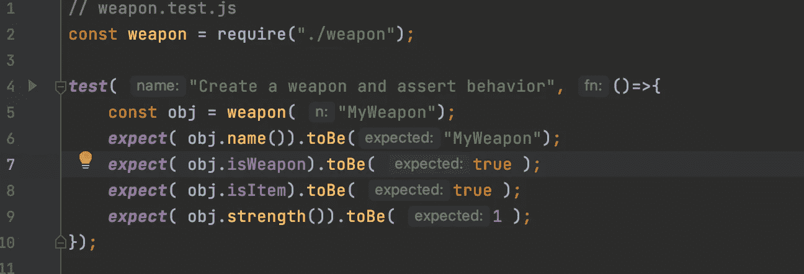

# 函数式 JavaScript:编写简单的命令行游戏(第 3 部分)

> 原文：<https://javascript.plainenglish.io/functional-javascript-writing-a-simple-comand-line-game-part-3-1aca1178e5b8?source=collection_archive---------7----------------------->



在本系列的第一部分中，我开玩笑说如果这是生产代码，我将如何编写测试。嗯，测试是我所需要的；漏掉的代码中有几个错误。我们跳回第 2 部分的代码，为游戏中的物品添加测试。

为了执行测试，我将使用 Jest 测试框架([https://Jest js . io](https://jestjs.io))；它易于安装，有助于构建一个干净的节点环境。还有许多其他的测试框架，但是我发现 Jest 使用起来又快又简单。

第一步是将代码分解成单独的文件。

首先是物品。

```
// item.js
const item = function( n ) {
    const _name = n;
    function name() {
        return _name;
    }
    return { name, isItem : true };
}

module.exports = item;
```

接下来是武器。

```
// weapon.js
const item = require( "./item");
const weapon = function( n, s ) {
    const _item = item( n );
    const _strength = s || 1;

    function strength() {
        return _strength;
    }
    return { ..._item, strength, isWeapon : true }
}
module.exports = weapon;
```

最后，包。

```
// bag.js
const item = require( "./item");

const bag = function( n, capacity ) {
    const _item = item( n );
    const _size = capacity || 5; // 1 is the minimum size
    const _items = {};
    function stash( item ) {
        if ( size() >=  _size ) {
            return "Your bag is full, you have to drop an item first";
        }
        if ( !item.isItem ) {
            return "A bag can only be filled with items not " + typeof item + "'s";
        }
        _items[item.name()] = item;
        return null;
    }
    function drop( itemName ) {
        return fetch( itemName)
    }
    function fetch( itemName ) {
        let item = _items[itemName]
        if (item == null ) {
            return null;         }
        delete _items[itemName];
        return item;
    }
    function items( ) {
        return ***Object***.keys( _items );
    }
    function size() {
        return ***Object***.keys( _items ).length
    }

    return { ..._item, stash, drop, fetch, items, size, isBag : true}
}

module.exports = bag;
```

分割成文件不是测试的要求；将测试分开有利于将来代码的可维护性。

首先，我们为 item.js 编写最简单的测试

```
// item.test.js
const item = require( "./item");

***test***( "Create a weapon and assert behavior", ()=>{
    const myItem = item( "MyItem");
    ***expect***( myItem.name()).toBe("MyItem");
    ***expect***( myItem.isItem).toBe( true );
    ***expect***( myItem.isWeapon).toBeUndefined();
});
```

测试代码应该非常明显；一件物品做不了多少事。我们可以在这里添加一些更多的防御测试；例如，当我们不为项目指定名称时会发生什么？我们能添加一个随机的名字吗？此外，对于稍后会被捕获的不同名称的项目，没有测试。

接下来，我们为武器添加一个测试。

```
// weapon.test.js
const weapon = require("./weapon");

***test***( "Create a weapon and assert behavior", ()=>{
    const obj = weapon( "MyWeapon");
    ***expect***( obj.name()).toBe("MyWeapon");
    ***expect***( obj.isWeapon).toBe( true );
    ***expect***( obj.isItem).toBe( true );
    ***expect***( obj.strength()).toBe( 1 );
});

***test***( "Create a powerful weapon", ()=>{
    const obj = weapon( "LongSword", 5);
    ***expect***( obj.name()).toBe("LongSword");
    ***expect***( obj.isWeapon).toBe( true );
    ***expect***( obj.isItem).toBe( true );
    ***expect***( obj.strength()).toBe( 5 );
});
```

同样，这是一个相当清晰的测试用例。我们增加了一个武器强度的测试，以及当没有力量提供给建造者时会发生什么。如果您将本文中的代码与上一篇文章中的代码进行比较，您会注意到在以前的版本中没有检查默认值。这是编写测试的价值之一。

最后，我们为这个包添加一个测试。这就复杂多了。

```
// bag.test.js
const bag = require("./bag");
const weapon = require("./weapon");
const item = require("./item");

***test***( "Create a bag and assert behavior", ()=>{
    const obj = bag( "MyBag");
    ***expect***( obj.name()).toBe("MyBag");
    ***expect***( obj.isBag).toBe( true );
    ***expect***( obj.isItem).toBe( true );
    ***expect***( obj.isWeapon).toBeUndefined();
    ***expect***( obj.items()).toStrictEqual( [] );
    ***expect***( obj.size()).toBe( 0 );
});

***test***( "test stash", ()=>{
    const obj = bag( "Bag of Holding", 2);
    ***expect***( obj.name()).toBe("Bag of Holding");
    const paper = item( "paper");
    ***expect***( obj.size()).toBe( 0 );
    ***expect***( obj.stash( paper )).toBeNull(); // Returns null on success, error message on fail
    ***expect***( obj.size()).toBe( 1 );
    ***expect***( obj.items()).toStrictEqual( ["paper"]);
    ***expect***( typeof obj.stash( "unknown")).toBe( "string" );
    ***expect***( obj.size()).toBe( 1 );
    // Same item just succeeds
    ***expect***( obj.stash( paper )).toBeNull();
    ***expect***( obj.size()).toBe( 1 );
    const rock = item( "rock");
    ***expect***( obj.stash( rock )).toBeNull();
    ***expect***( obj.size()).toBe( 2 );
    ***expect***( obj.items()).toStrictEqual( ["paper", "rock"]);
});

***test***( "test fetch", ()=>{
    const obj = bag( "Bag of Holding", 2);
    ***expect***( obj.name()).toBe("Bag of Holding");
    const paper = item( "paper");
    ***expect***( obj.size()).toBe( 0 );
    ***expect***( obj.stash( paper )).toBeNull(); // Returns null on success, error message on fail
    ***expect***( obj.size()).toBe( 1 );
    ***expect***( obj.items()).toStrictEqual( ["paper"]);
    ***expect***( obj.fetch( "paper")).toBe( paper );
    ***expect***( obj.size()).toBe( 0 );
    ***expect***( obj.items()).toStrictEqual( []);
    ***expect***( obj.fetch( "item")).toBeNull();
});

***test***( "capacity", ()=>{
    const obj = bag( "Bag of little Holding", 1 );
    const paper = item( "paper");
    ***expect***( obj.size()).toBe( 0 );
    ***expect***( obj.stash( paper )).toBeNull();
    ***expect***( obj.size()).toBe( 1 );
    const rock = item( "rock");
    ***expect***( typeof obj.stash( paper )).toBe( "string");
    ***expect***( obj.size()).toBe( 1 );
});
```

我们必须检查几个箱包尺寸的边缘情况，以及当我们两次添加相同的物品时会发生什么。最初，当我们对袋子做一些事情时，我们在控制台上打印出一条消息。打印使得测试更加困难，所以我们切换到为每个调用返回已知的错误值。

这段文字比较短，但是希望有助于展示测试的价值，并使代码变得更好。

[](/functional-javascript-writing-a-simple-command-line-game-335ab9fcc005) [## 函数式 JavaScript:编写简单的命令行游戏(第 1 部分)

### 使用 JavaScript 和功能对象模型，我们为 Node.js 创建了一个简单命令行游戏的第一部分。

javascript.plainenglish.io](/functional-javascript-writing-a-simple-command-line-game-335ab9fcc005) [](/functional-javascript-classes-without-the-class-keyword-6e2de50a3698) [## 函数式 JavaScript:没有“class”关键字的类

### 了解如何在不使用 class 关键字的情况下使用函数式 JavaScript 来定义类。根据…中使用的样式

javascript.plainenglish.io](/functional-javascript-classes-without-the-class-keyword-6e2de50a3698) 

[*更多内容看 plainenglish.io*](http://plainenglish.io/)