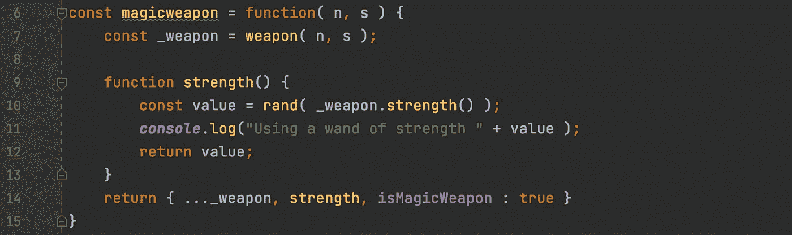

# 函数式 JavaScript:编写简单的命令行游戏(第 4 部分)

> 原文：<https://javascript.plainenglish.io/functional-javascript-writing-a-simple-comand-line-game-part-3-26c73a15b0d0?source=collection_archive---------8----------------------->



在这一节中，我们将重温最初在第 1 部分中发布的代码。我们已经做了大量的重构工作，并且编写了一些测试。现在我们必须修改角色对象来使用物品和武器。希望您会看到代码更容易阅读，更不容易出错。

我们能够修复一些潜在的问题，并确保我们已经涵盖了许多边缘情况。更重要的是，我们可以重温战斗逻辑，并添加一个神奇的武器。

让我们回顾一下一个角色的代码以及它是如何进化的。

```
// character.js
const ***weapons*** = require("./weapons");
const bag = require("./bag");

const character = function(who, attrib) {
    attrib = attrib || {};
    const _name = who;
    const dv = (value,def ) => (typeof value === "undefined")?def:value;
    let _hp = dv( attrib.hp, 10 );
    let _level = dv( attrib.level, 1 );
    const _bag = bag("Bag of Holding",5);
    let _weapon =  dv( attrib.weapon, ***weapons***.hand);

    function name() {
        return _name;
    }
    function hit() {
        return _hp -= 1;
    }
    function dead() {
        return _hp === 0
    }
    function stash( item ) {
        let err = _bag.stash(item)
        if ( err == null) {
            ***console***.log("You found the " + item.name() + " and stashed it away");
        } else {
            ***console***.log("You can only stash items and not " + typeof item );
        }
    }
    function use( itemName ) {
        const item = _bag.fetch( itemName );
        if (item && item.isWeapon) {
            ***console***.log( "You grab the " + item.name() + " and get ready to fight");
            _weapon = item;
        } else {
            ***console***.log( "You use the " + item.name() + " it doesn't seem to do much")
            _bag.stash( item );
        }
        return true;
    }
    function getBag() {
        return _bag;
    }
    function getWeapon() {
        return _weapon;
    }
    function level() {
        return _level;
    }
    function levelUp() {
        _hp += 1;
        return _level += 1;
    }
    return { name, stash, getBag, use, getWeapon, hit, dead, level, levelUp, isCharacter : true }
}

module.exports = character;
```

这里需要指出几个项目，控制台的输出现在在角色对象中，我们已经从其他组件中删除了消息。我们已经将更复杂的功能抽象成更小的单元，支持正式测试。我已经省略了这些新对象的测试代码，但是它看起来与前面的例子非常相似。我会在系列的最后把所有代码发布在 github 上。

这个策略强调了封装的价值，特别是组件中“私有”数据的不可访问性。在我们最初的版本中，为了修改这个包，我们必须知道它使用了一个数组。在我们重构的例子中，我们在内部切换到使用一个对象。将来，我们可以转而使用地图或其他数据结构，而消费者不会意识到这种变化。

```
_bag.push( item );
```

相对

```
bag.stash( item );
```

这个简单的改变隐藏了很多功能。包括错误处理、限制袋子大小的容量以及确保袋子只能容纳物品。

```
function stash( item ) {
    if ( size() >= _size ) {
        return “Your bag is full, you have to drop an item first”;
    }
    if ( !item.isItem ) {
        return “A bag can only be filled with items not “ + typeof item + “‘s”;
    }
    _items[item.name()] = item;
    return null;
}
```

继续战斗！

```
// fight.js
// dieroll simulates a die roll, d12 + a modifier
function dieroll( level )
{
    const rand = ( num ) => ***Math***.floor( ***Math***.random() * num )
    return rand( 12 ) + rand( level );
}

function fight( char1, char2 ) {
    while (true) {
        const c1roll = dieroll(char1.level()) + char1.getWeapon().strength();
        const c2roll = dieroll(char2.level()) + char2.getWeapon().strength();

        if (c1roll < c2roll) {
            char1.hit();
            ***console***.log( char2.name() + " strikes the " + char1.name());
        } else if ( c1roll > c2roll ) {
            char2.hit()
            ***console***.log( char1.name() + " strikes the " + char2.name());
        } else {
            ***console***.log( "Both missed" );
        }

        if (char1.dead()) {
            ***console***.log( char1.name() + " is dead, killed by the " + char2.name());
            return true;
        }
        if (char2.dead()) {
            ***console***.log( char2.name() + " is dead, killed by the " + char1.name());
            return false;
        }
    }
}

module.exports = fight;
```

这段代码看起来与我们的原始版本非常相似，尽管我们不再“神奇地”获得我们现在称之为方法的武器的力量。在这个简单的例子中，它似乎没有增加很多，但是让我们想象我们想要定义一个“法宝”来选择一个随机的强度。

```
// magicweapon.js
const weapon = require( "./weapon");

const rand = ( num ) => ***Math***.floor( ***Math***.random() * num )

const magicweapon = function( n, s ) {
    const _weapon = weapon( n, s );

    function strength() {
        const value = rand( _weapon.strength() );
        ***console***.log("Using a wand of strength " + value );
        return value;
    }
    return { ..._weapon, strength, isMagicWeapon : true }
}
module.exports = magicweapon;
```

我们可以组合现有的武器并覆盖力量方法，从 1 到基础力量中随机选择。

最后，我们需要一种方法来运行这些代码；让我们安排一些比赛。

```
const character = require( "../character");
const fight = require( "../fight");
const ***weapons*** = require( "../weapons");
const magic = require( "../magicweapon");

const wand = magic( "wand", 20 );

function round1() {
    ***console***.log( "Round 1")
    const you = character("Rogue");
    const npc = character("Grump Ork", {hp: 5, weapon: ***weapons***.hammer});

    fight(you, npc);
}

function round2() {
    ***console***.log( "Round 2")
    const you = character("Fighter");
    const npc = character("Grump Ork 2", {hp: 5, weapon: ***weapons***.hammer});
    you.stash( ***weapons***.long_sword );
    you.use( ***weapons***.long_sword.name());
    fight(you, npc);
}

function round3() {
    ***console***.log( "Round 3")
    const you = character("Wizard");
    const npc = character("Grump Ork 3", {hp: 5, weapon: ***weapons***.hammer});
    you.stash( wand );
    you.use( wand.name());
    fight(you, npc);
}

round1();
round2();
round3();
```

巫师的最后一轮看起来像下面这样。

```
Round 3
You found the wand and stashed it away
You grab the wand and get ready to fight
Using a wand of strength 17
Wizard strikes the Grump Ork 3
Using a wand of strength 8
both missed
Using a wand of strength 12
Wizard strikes the Grump Ork 3
Using a wand of strength 7
Wizard strikes the Grump Ork 3
Using a wand of strength 13
Wizard strikes the Grump Ork 3
Using a wand of strength 0
Grump Ork 3 strikes the Wizard
Using a wand of strength 11
Wizard strikes the Grump Ork 3
Grump Ork 3 is dead, killed by the Wizard
```

大多数时候，玩家赢了；有时候，Ork 会走运。

```
Round 1
Grump Ork strikes the Rogue
Both missed
Grump Ork strikes the Rogue
Grump Ork strikes the Rogue
Grump Ork strikes the Rogue
Grump Ork strikes the Rogue
Both missed
Grump Ork strikes the Rogue
Grump Ork strikes the Rogue
Grump Ork strikes the Rogue
Rogue strikes the Grump Ork
Grump Ork strikes the Rogue
Grump Ork strikes the Rogue
Rogue is dead, killed by the Grump Ork
```

这一节到此为止；下一次，我们将从制造迷宫的房间开始。

[](/functional-javascript-writing-a-simple-command-line-game-335ab9fcc005) [## 函数式 JavaScript:编写简单的命令行游戏(第 1 部分)

### 使用 JavaScript 和功能对象模型，我们为 Node.js 创建了一个简单命令行游戏的第一部分。

javascript.plainenglish.io](/functional-javascript-writing-a-simple-command-line-game-335ab9fcc005) [](/functional-javascript-classes-without-the-class-keyword-6e2de50a3698) [## 函数式 JavaScript:没有“class”关键字的类

### 了解如何在不使用 class 关键字的情况下使用函数式 JavaScript 来定义类。根据…中使用的样式

javascript.plainenglish.io](/functional-javascript-classes-without-the-class-keyword-6e2de50a3698) 

[*更多内容尽在 plainenglish.io*](http://plainenglish.io/)