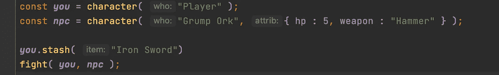

# 函数式 JavaScript:编写简单的命令行游戏(第 1 部分)

> 原文：<https://javascript.plainenglish.io/functional-javascript-writing-a-simple-command-line-game-335ab9fcc005?source=collection_archive---------10----------------------->


Photo by [Ilya Pavlov](https://unsplash.com/@ilyapavlov?utm_source=medium&utm_medium=referral) on [Unsplash](https://unsplash.com?utm_source=medium&utm_medium=referral)



如果您读过我以前的一篇关于使用闭包在 JavaScipt 中定义对象的文章，我认为一个可行的例子可能会有所帮助。这是基于我和我儿子一起写的一些代码，帮助他理解编程，并使之成为一种有趣的体验。他选择建立一个简单的命令行冒险，非常 80 年代风格，你必须逃离一个迷宫，同时寻找物品和与怪物战斗。

首先，我们定义一个玩家对象。玩家有一个经验等级，一个装物品的袋子，并且携带一件武器。最初，武器是他们的手——玩家最好不要碰到任何危险的东西！我们也定义了一些武器以及它们的威力。

```
const character = function(who, attrib) {
    attrib = attrib || {};
    const _name = who;
    const dv = (value,def ) 
           => (typeof value === "undefined")?def:value;
    let _hp = dv( attrib.hp, 10 );
    let _level = dv( attrib.level, 1 );
    const _bag = [];
    let _weapon =  dv( attrib.weapon, "hand");

    const weapons = {
        "hand": 1,
        "Iron Sword" : 2,
        "Diamond Sword" : 5,
        "Hammer" : 2
    }

    function name() {
        return _name;
    }
    function hit() {
        _hp -= 1;
    }
    function dead() {
        return _hp === 0
    }
    function stash( item ) {
        if( weapons[item])
        {
            ***console***.log( "You found the " + item );
            setWeapon( item )
        }
        else {
            ***console***.log("You found the " + item 
                + " and placed it in your bag");
            _bag.push( item );
        }
    }
    function has( item ) {
        return _bag.includes( item );
    }
    function getWeapon() {
        return _weapon;
    }
    function getWeaponStat() {
        return weapons[_weapon]
    }
    function setWeapon( item ) {
        if (weapons[_weapon] < weapons[item]) {
            ***console***.log("You use the " + item);
            _weapon = item;
        }
    }
    function level() {
        return _level;
    }
    function levelUp() {
        _level += 1;
    }
    return { name, stash, has, getWeapon, getWeaponStat, 
             hit, dead, level, levelUp }
}
```

我们还实现了几个助手方法；我们可以问玩家:“你死了吗？”，“你什么水平？”，我们可以“隐藏”一个物品，我们可以通过调用 hit 来造成一些伤害。如果藏起来的东西碰巧是武器，我们会检查它是否比我们的旧武器“更好”,然后换掉它。还有几个助手，我们稍后会讲到。

如果我在这里编写生产代码，我也会编写一组测试用例来证明逻辑工作正常，同样重要的是，代码处理糟糕的输入。

由于我们不希望所有的字符都有相同的属性，我们将通过构造函数来设置这些属性。为此，我们将传递一个结构。您会注意到，我定义了一个小的帮助者匿名函数(lambda)来检查 attrib 结构是否提供了覆盖。这就是这段代码的顶部所做的。我也默认为空属性的情况。

```
const character = function(who, attrib) {
    attrib = attrib || {};
    const _name = who;
    const dv = (value,def ) => 
          (typeof value === "undefined")?def:value;
    let _hp = dv( attrib.hp, 10 );
```

现在我们可以创建几个角色。

```
const person = character( “You” );
const npc = character( “Grump Ork”, { hp : 5, weapon : “Hammer” } );
```

让我们假设你不喜欢“坏脾气的 Ork”，或者他们可能会攻击你。我们需要一套格斗套路。

我们创建了一个模拟掷骰子的小例程，d12 +修改器

```
// dieroll simulates a die roll, d12 + a modifier
function dieroll( level )
{
    const rand = ( num ) => ***Math***.floor( ***Math***.random() * num )
    return rand( 12 ) + rand( level );
}
```

接下来，我们定义一个函数，给定两个角色模拟他们之间的战斗。

```
function fight( char1, char2 ) {
    while (true) {
        const c1roll = dieroll(char1.level()) + char1.getWeaponStat();
        const c2roll = dieroll(char2.level()) + char2.getWeaponStat();

        if (c1roll < c2roll) {
            char1.hit();
            ***console***.log( char2.name() 
                   + " strikes the " + char1.name());
        } else if ( c1roll > c2roll ) {
            char2.hit()
            ***console***.log( char1.name() 
                   + " strikes the " + char2.name());
        } else {
            ***console***.log( " again " );
        }

        if (char1.dead()) {
            ***console***.log( char1.name() 
                   + " is dead, killed by the " + char2.name());
            return true;
        }
        if (char2.dead()) {
            ***console***.log( char2.name() 
                   + " is dead, killed by the " + char1.name());
            return false;
        }
    }
}
```

最后一步是创建几个角色并让他们战斗。

```
const ***you*** = character( “Player” );
const ***npc*** = character( “Grump Ork”, { hp : 5, weapon : “Hammer” } );
fight( ***you***, ***npc*** );
```

将所有这些代码放在一个脚本中，并在 Node.js 下运行。

```
Grump Ork strikes the PlayerPlayer strikes the Grump OrkPlayer strikes the Grump OrkPlayer strikes the Grump OrkPlayer strikes the Grump OrkGrump Ork strikes the PlayerGrump Ork strikes the PlayerPlayer strikes the Grump OrkGrump Ork is dead, killed by the Player
```

如果你想确定自己更有可能赢，那就给自己一个更好的武器。

```
***you***.stash( “Iron Sword”);
fight( ***you***, ***npc*** );
```

并再次运行；你仍然可能会输。

```
You found the Iron SwordPlayer strikes the Grump OrkGrump Ork strikes the PlayerPlayer strikes the Grump OrkagainPlayer strikes the Grump OrkPlayer strikes the Grump OrkGrump Ork strikes the PlayerGrump Ork strikes the PlayerPlayer strikes the Grump OrkGrump Ork is dead, killed by the Player
```

暂时就这样了；在下一期，我们将添加一个迷宫，并开始构建游戏的其他交互。

*更多内容尽在*[*plain English . io*](http://plainenglish.io/)

有关所用样式的介绍

[](/functional-javascript-classes-without-the-class-keyword-6e2de50a3698) [## 函数式 JavaScript:没有“class”关键字的类

### 了解如何在不使用 class 关键字的情况下使用函数式 JavaScript 来定义类。根据…中使用的样式

javascript.plainenglish.io](/functional-javascript-classes-without-the-class-keyword-6e2de50a3698)