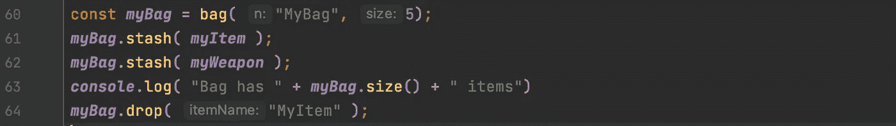

# 函数式 JavaScript:编写简单的命令行游戏(第 2 部分)

> 原文：<https://javascript.plainenglish.io/functional-javascript-writing-a-simple-command-line-game-part-2-79a6a51a4b24?source=collection_archive---------13----------------------->


Photo by [Florian Olivo](https://unsplash.com/@florianolv?utm_source=medium&utm_medium=referral) on [Unsplash](https://unsplash.com?utm_source=medium&utm_medium=referral)



在第一节中，我们定义了一个“人”对象；我们在这个物体中嵌入了武器的概念，这有点欺骗。我们也回避了武器是否是物品的问题。在这一部分，我们将使用对象合成来派生物品和武器。

首先，我们用经典的面向对象语言定义一个项目对象；这将是基类。

```
const item = function( n ) {
    const _name = n;
    function name() {
        return _name;
    }
    return { name, isItem : true };
}
```

这个小对象保存了事物的名称，还将 isItem 标志设置为 true。然后我们可以用武器组合物品:

```
const weapon = function( n, s ) {
    const _item = item( n );
    const _strength = s;

    function strength() {
        return _strength;
    }
    return { ..._item, strength, isWeapon : true }
}
```

慢慢地走过去，

在第一行，我们有一个 item 对象的实例。初始化“base”对象是通过将名称传递给其构造函数来执行的。然后，我们为武器声明一个常量变量“强度”和一个返回强度的辅助函数。该函数的倒数第二行用新方法组成该物品，并设置一个标志来表明这是一件武器。我们可以这样使用它。

```
const ***myItem*** = item( "MyItem");
***console***.log( "Item " + ***myItem***.name() )
```

和

```
const ***myWeapon*** = weapon( "MyWeapon", 100 );

if( ***myWeapon***.isWeapon ) {
    ***console***.log("Weapon " + ***myWeapon***.name())
}
```

我们可以通过添加额外的物品来扩展这一点，例如可以容纳物品的袋子。

```
const bag = function( n, capacity ) {
    const _item = item( n );
    const _size = capacity;
    const _items = {};
    function stash( item ) {
        if ( size() >=  _size ) {
            ***console***.log( "Your bag is full, you have to drop an item first");
        }
        if ( item.isItem ) {
            _items[item.name()] = item;
            ***console***.log( "you stashed the " + item.name() + " in " + _item.name())
        } else {
            ***console***.error( "A bag can only be filled with items not " + typeof item + "'s");
        }

    }
    function drop( itemName ) {
        let item = _items[itemName]
        if (item == null ) {
            ***console***.error( "You can't drop an item you don't have!")
        }
        delete _items[itemName];
        return item;
    }
    function items( ) {
        return ***Object***.keys( _items );
    }
    function size() {
        return ***Object***.keys( _items ).length
    }
    return { ..._item, stash, drop, items, size, isBag : true }
}
```

好吧，这里还有很多事情要做。包也是一种物品。我们可以把一个袋子放在一个袋子里(我可以看到地平线上的“袋子”。)我们也可以把其他物品藏在包里，包括我们的武器。这个包的容量是固定的，所以我们只能装一定数量的东西。我们已经定义了删除和列出我们包中所有物品的方法。

用这个怎么样？假设我们还有“我的武器”和“我的物品”我们可以创建一个包的实例，并将它们放入其中。

```
const ***myBag*** = bag( "MyBag", 5);
***myBag***.stash( ***myItem*** );
***myBag***.stash( ***myWeapon*** );

***myBag***.drop( "something")
***console***.log( "Bag has " + ***myBag***.size() + " items")
***myBag***.drop( "MyItem" );
***console***.log( "Bag has " + ***myBag***.size() + " items")
***console***.log( ***myBag***.items() )
```

我们可以列出包里的物品。

```
***console***.log( ***myBag***.items() )
```

我们可以尝试添加一个不是项目的项目。

```
***myBag***.stash( “hello”);
// Prints : A bag can only be filled with items not string’s
```

我们也可以从包里丢一件东西。

```
***myBag***.drop( “MyItem” );
```

我可以查看我包里有多少东西。

```
***console***.log( “Bag has “ + ***myBag***.size() + “ items”)
```

下一次，我们将修改我们的人携带一个单一的项目，一个袋子，拖着所有的宝藏，他们可能会发现。我们还需要一个功能，只列出我们包里的武器，你能添加吗？

[](/functional-javascript-writing-a-simple-command-line-game-335ab9fcc005) [## 函数式 JavaScript:编写简单的命令行游戏(第 1 部分)

### 使用 JavaScript 和功能对象模型，我们为 Node.js 创建了一个简单命令行游戏的第一部分。

javascript.plainenglish.io](/functional-javascript-writing-a-simple-command-line-game-335ab9fcc005) [](/functional-javascript-classes-without-the-class-keyword-6e2de50a3698) [## 函数式 JavaScript:没有“class”关键字的类

### 了解如何在不使用 class 关键字的情况下使用函数式 JavaScript 来定义类。根据…中使用的样式

javascript.plainenglish.io](/functional-javascript-classes-without-the-class-keyword-6e2de50a3698) 

*更多内容尽在*[*plain English . io*](http://plainenglish.io/)