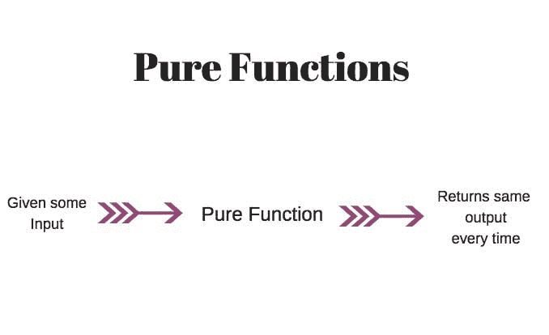
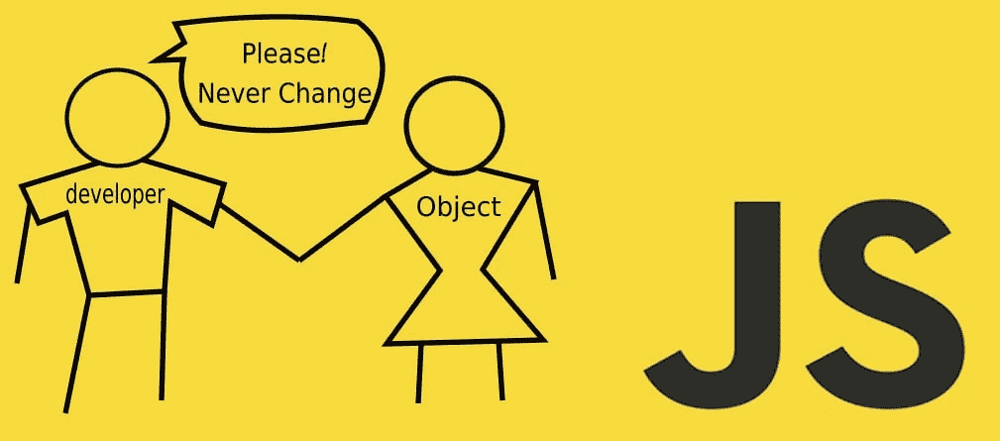
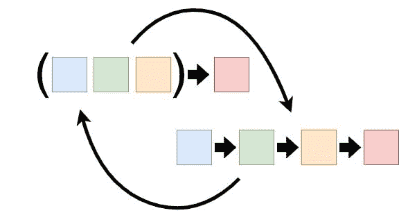

# JavaScript 中的函数式编程:面向初学者的 TypeScript

> 原文：<https://javascript.plainenglish.io/functional-programming-in-javascript-typescript-for-beginners-ab3a40a912f3?source=collection_archive---------5----------------------->

Photo by [Sigmund](https://unsplash.com/@sigmund?utm_source=medium&utm_medium=referral) on [Unsplash](https://unsplash.com?utm_source=medium&utm_medium=referral)

函数式编程是编程世界中最容易误导人的话题之一。你会发现多篇文章，搞不清楚。那么应该如何理解函数式编程呢？

TypeScript，或者说 JavaScript，并没有被设计成与[函数式编程(FP)](https://en.wikipedia.org/wiki/Functional_programming) 兼容。JavaScript 是一种基于[原型的](https://en.wikipedia.org/wiki/Prototype-based_programming)面向对象语言。每当你创建一个变量，它就被当作一个对象来使用。那么，问题是:JavaScript 如何支持函数式编程呢？要回答上面的问题，有[糖语法](https://stackoverflow.com/questions/50835572/)和自动换行。这些帮助开发人员不用太担心就可以编写函数式方法。让我们彻底了解他们。

**注意:** *所有代码示例都是用 TypeScript 编写的。可以使用*[*TypeScript Playground*](https://www.typescriptlang.org/play)*将 TypeScript 转换为 JavaScript 代码。*

# 基本原则

在进一步学习之前，您应该了解下面描述的一些基本原则。

1.  纯函数
2.  确定性函数
3.  高阶函数
4.  不变
5.  Currying 或部分功能
6.  功能组成

## 1.纯函数

纯函数是确定性函数，没有副作用，也就是说，对于相同的输入，输出总是相同的。同时，它不会消耗任何其他全局变量。

**纯函数的例子:**

在这里，无论什么，对于相同的输入，输出将是相同的。

拥有一个纯函数的好处是容易理解和测试。然而，仅仅使用纯函数来构建一个完整的应用程序是非常困难的。我们也需要一些确定性函数。

**注:** [反应纯分量](https://reactjs.org/docs/react-api.html#reactpurecomponent)本质上是确定性的，但不是纯函数。它们有副作用，比如创建文档元素的 React.createElement。

## 2.确定性函数

确定性函数是指函数的输出总是确定的。这可能有副作用，但输出不应随时间而改变。同样的输入应该产生同样的输出。

**简单的例子:**

**另一个例子:**确定性函数会有副作用。也就是说，它可以访问全局变量。

非确定性函数的示例:

在上面的例子中，方法`rand`使用`Math.random`生成一个随机数。这个 API 的输出将是不确定的。

确定性函数的好处是它在任何语言中都很常见。它很容易创建和理解。然而，它有一些副作用。有时候，很难测试。

## 3.HOF:高阶函数

HOF 可以接受一个函数作为输入，也可以返回一个函数作为输出。

示例:

**注意:**在上面的例子中，`groupBy`是一个函数。您可能已经注意到，我没有使用关键字`function`来创建函数，因为我使用 lambda 作为函数，并将它赋给一个变量。在 ES6/ES2015 之后，JavaScript 引入了 lambda 的概念以及许多新的语法。大多数都是围绕实际实现的糖语法。这里可以阅读更多[。](https://www.w3schools.com/js/js_es6.asp)

`groupBy`是一个将输入`fn`作为函数，将`data`作为数组的函数。对数组中的所有项进行计算后，它返回一个由键和值组成的对象。

**注意:**和 HOF 一样， [HOC in React](https://reactjs.org/docs/higher-order-components.html) 是一个可以把另一个组件作为输入，并且可以返回另一个组件的组件。

## 4.不变

不变性是指一旦数据/变量被创建，就不能在一段时间内改变。这个想法是为了避免交叉共享环境中的数据竞争，比如异步编程，副作用。

JavaScript 确实有一些不变性 API。然而，这些还不够。让我们来看一些例子。

由于 JavaScript 是一种动态语言，也就是说，数据可以在运行时改变，这使得在 JavaScript 中实现不变性很困难。同时，并不是所有的成员/对象都支持不变性。可以使用[不可变-js](https://github.com/immutable-js/immutable-js) 。然而，我建议将不可变性作为一种实践，并且不要包含另一个库。

## 实现不变性的简单方法

**数组**:

**对象**

**地图**

## 5.Currying 或部分功能

Currying 是 FP 中的一种方法或技术，其中一个函数可以被组合成部分接受输入。也就是说，如果一个函数`sum`接受输入`a`和`b`作为参数，那么 currying 这个函数可以让这个函数`sum`接受一个参数`a`并返回另一个函数。稍后，我们可以使用新创建的函数进行求和。

**我们从例子来看:**

在上面的例子中，`split`函数接受令牌和字符串数据进行拆分。我们已经创建了一个函数`splitByHash`，其中已经定义了令牌。只需要一根绳子就能把它劈开。这里，`splitByHash`是部分函数。

**注意:**上面的例子很好地演示了部分函数。然而，创建这样的部分函数对于超过 2/3 的参数是不可伸缩的。我们可以使用一些基本的工具来创建一个部分函数或定制函数。

## 6.功能组成

函数合成是一个数学概念，其中一个运算取两个函数 f 和 g，并产生一个函数 h，使得 h(x) = g(f(x))。为简单起见，(g f)(x) = g(f(x))

**我们来看例子:**

在这个例子中，你可以看到，`multiplyAndAdd5`是从右向左组合的。它首先乘以 2(5x 2 = 10)。拿出来加 10。

**让我们看另一个例子:**获取活跃用户的平均年龄

在上面的例子中，为了获得活跃用户的平均年龄，我们必须调用多个方法。这很好。但是我们可以使用 compose 使其更具声明性。如果我们必须写一些功能性的东西，它看起来会像下面这样:

正如您所看到的，添加 compose 使得组合函数和创建另一个函数变得容易。可以在以后重复使用。

## 一些现实生活中的问题

现在既然知道了 FP 的基础，那就来举例探究一下吧。

在上面的例子中，首先，我们使用 rest API 获取一些 todos。之后，我们将根据 todo 的完成状态对其进行过滤。一旦我们都完成了 todos，我们就收集 id 并获取所有用户。

一切都好。然而，如果我们必须改变一个简单的行为，那就去找那些没有完成待办事项的用户。即使它只是不变，但会改变所有的编码声明。我们必须改变所有的变量名。这是一项乏味的工作。我们可以使用 FP 让这个程序更具声明性。为此，我们确实需要一些辅助方法:

**助手方法:** [30 秒的打字稿](https://decipher.dev/30-seconds-of-typescript/docs/)

现在让我们重写同样的程序

**注意:**函数式编程还有其他一些方面。我还没有涵盖所有的内容。原因是:要么对于本文的范围来说太复杂，要么与 JavaScript 本身无关。

**一些值得一提的概念:**

1.  功能数据结构
2.  无例外地处理错误
3.  严与懒(懒评)
4.  功能并行性(异步浮点)
5.  幺半群和函子
6.  副作用

## 从这里去哪里

正如我已经提到的，JavaScript 不是一种全功能语言。同时，作为 JavaScript 开发人员，我们必须在前端使用文档和窗口。所以我们不能完全忽略杂质。我们必须混合搭配。以这种方式编写函数使您的代码更具声明性和可读性。然而，就核心概念而言，它确实增加了一点代码的复杂性。也就是说，如果你知道上面描述的基本概念，你就可以开始编写函数式程序了。网上有多篇文章。如果你真的想学函数，我在下面列出了一些。我还会推荐用像 [Scala](https://www.scala-lang.org/) 、 [Clojure](https://clojure.org/) 、 [Haskell](https://www.haskell.org/) 这样的语言写一些代码。它将帮助你理解 FP 背后的核心概念和思想。

***注:*** *由于内容篇幅原因，我不得不把这个话题分成多篇文章。我将很快发表下一部分。*

## **参考文章**

1.  [JavaScript 函数式编程简介](https://opensource.com/article/17/6/functional-javascript#:~:text=Those%20first%2Dclass%20functions%20are,growing%20trend%20toward%20functional%20programming.)
2.  每个人都应该知道的 9 个函数式编程概念
3.  [理解关键的函数式编程概念](https://medium.com/swlh/understand-the-key-functional-programming-concepts-bca440f1bcd6)
4.  [30 秒的打字稿/](https://decipher.dev/30-seconds-of-typescript/docs/)
5.  [Scala-book/函数式编程](https://docs.scala-lang.org/overviews/scala-book/functional-programming.html)
6.  [函数式编程基本原理简介](https://www.freecodecamp.org/news/an-introduction-to-the-basic-principles-of-functional-programming-a2c2a15c84/)

*更多内容看* [***说白了。报名参加我们的***](http://plainenglish.io/) **[***免费每周简讯在这里***](http://newsletter.plainenglish.io/) ***。*****