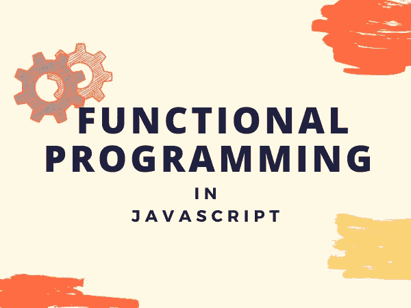
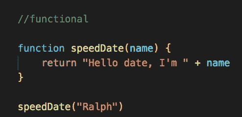
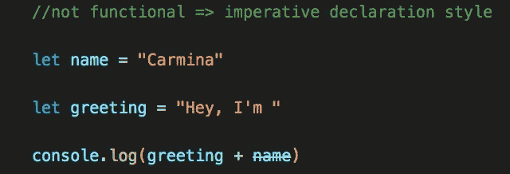
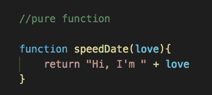
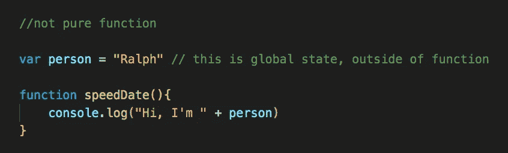
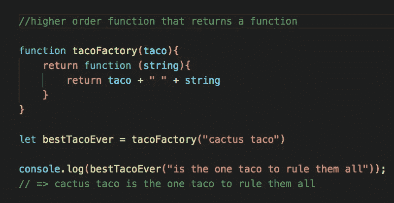
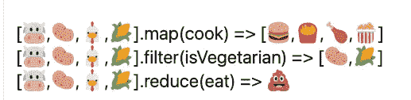

# 函数式编程与面向对象编程

> 原文：<https://javascript.plainenglish.io/functional-v-object-oriented-programming-part-i-what-is-functional-programming-217c66ca8801?source=collection_archive---------7----------------------->

## 第 1 部分:什么是函数式编程？

考虑到 JavaScript 的范围，我想我应该试着弄清楚什么是函数式编程和面向对象编程。让我们从全面理解函数式编程开始。

## **什么是函数式编程？**

一种编程范式。[范式是一种标准、观点或一套思想，一种模型。]它是一种编码风格，一种组织你的代码和接近代码的特定方式。你可能会说这更像是一种心态。

## **我们如何进行函数式编程？**

在函数式编程中，我们希望用函数来表达一切。这并不奇怪，但这是事实。当然，函数是接受输入并给出输出的东西。这让我们作为程序员去思考我们所有功能的*信息流*与 OOP(面向对象编程)中的对象可能如何交互或被操纵。是的，在函数式编程中，我们必须不断地考虑函数:接受输入并返回输出。

下面是函数式编程的一个例子:

下面是一个非函数式/命令式声明式编程的例子:

## **函数式编程中的纯函数**

我们希望避免副作用，只在函数式编程中使用纯函数。所以基本上副作用可能是函数除了接受输入和返回输出之外的任何事情。举个例子，如果我们有一个全局变量，一个函数接受了它，这个全局函数在函数之外，所以它从自身之外获取一些东西，并使用这些信息，这样它就不是一个纯函数了。

**纯函数**是那些不变异数据的函数。您可能会想，我们数据的 return 语句(就像打印到控制台的数据)实际上是用新的 return 语句改变输入数据吗？不不是的！返回状态发生在函数发生的那一边

纯功能代码示例:

非纯函数代码示例:

## **高阶函数**

我们的函数相互作用的另一种方式是高阶函数。这是指一个函数可以接受另一个函数作为输入，同时返回一个函数作为输出。这对于函数式编程来说非常重要，请参见下面的代码示例，以便更好地理解高阶函数可能是什么样子:

## **无迭代**

避免使用“for”或“while”来创建遍历列表的循环。相反，在函数式编程风格中，我们可能希望使用高阶函数，如。地图，。过滤器，。reduce(这些函数通常接受一个列表的输入，除了接受一个函数之外，我们还将对它做一些事情)

获取更多关于如何？地图，。过滤器，。减少所有工作，看看我熨斗学校的老师与我的同学分享的这张有用的/引起饥饿的图片:

使用很重要。地图，。过滤器，。因为它们不会变异或改变我们的数据。函数式编程的目标是我们真的不想改变我们的原始数据，因此，我们希望它是不可变的。这允许我们避免在程序运行过程中遇到更深层次的问题。想象一下，你有一个很大的程序，它的代码是很多年前写的，你遇到了一个很大的 bug，你不知道它的来源。啊！我们尝试过的避免这种错误的最真实的方法是确保我们没有改变我们的数据，因此是函数式编程！

## **使用 JavaScript 的函数式编程**

与使用 JavaScript 的面向对象编程相比，使用函数式编程可能更容易调试和维护代码/程序。对于 JS 中的面向对象编程，您会发现自己在使用‘this’，‘bind . this’，并且很容易通过将错误的东西绑定在一起而产生错误。

## *一个推荐*

在我找工作的过程中，我完成了一次 Skilled Inc .的模拟技术面试，我的面试官提到他更喜欢函数式编程，并建议将这作为你编程的主要方式。这让我考虑以后自己尝试一下。现在，我知道在我完全实现它之前，我还需要学习更多的 Javascript 和编程知识，但是我对它的前景感到兴奋。

## **面向对象编程怎么样？**

你有可以改变的对象和方法，这些对象彼此都有一定的关系。在我博客的第 2 部分，我将深入探讨面向对象编程，它是什么，以及它与函数式编程的比较。请继续关注第二部分。

快乐运转！