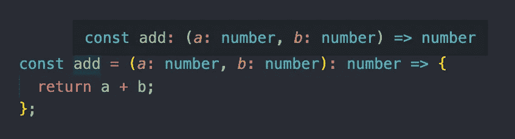
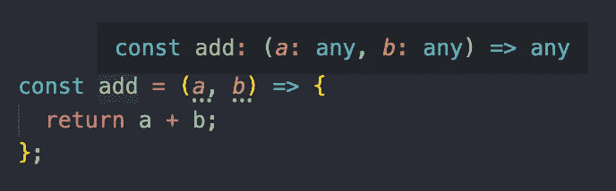
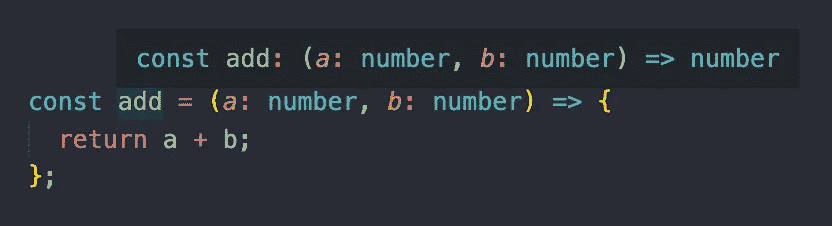
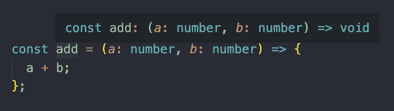
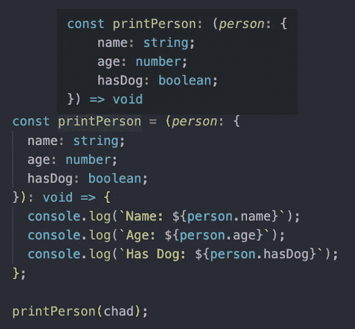
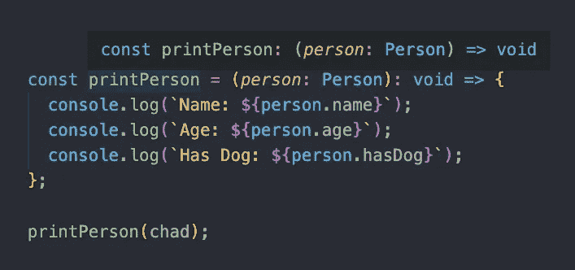

# 在 TypeScript 中一起工作的函数和接口

> 原文：<https://javascript.plainenglish.io/functions-and-interfaces-working-together-in-typescript-34d2abba3fc6?source=collection_archive---------10----------------------->

## 如何在 TypeScript 中向函数添加类型和使用接口


Photo by [Massimo Sartirana](https://unsplash.com/@sarti46?utm_source=medium&utm_medium=referral) on [Unsplash](https://unsplash.com?utm_source=medium&utm_medium=referral)

欢迎来到打字世界！JavaScript 语言的超集，其中每个值都有一个与之关联的类型。

如果您不熟悉 TypeScript，请查阅下面的文章，以获得类型注释和类型推断的介绍。

[](https://levelup.gitconnected.com/type-annotation-vs-type-inference-in-typescript-85ba2194ebe1) [## TypeScript 中的类型注释与类型推理

### 如何在 TypeScript 中向变量添加类型

levelup.gitconnected.com](https://levelup.gitconnected.com/type-annotation-vs-type-inference-in-typescript-85ba2194ebe1) 

在本文中，我们将看看如何在函数中处理类型。我们将首先看看如何注释函数类型，然后看看如何使用函数接口。

# 向函数添加类型

当向函数添加类型时，有两个地方需要注意。参数的类型和返回值的类型。

要注释参数的类型，只需在参数旁边添加一个冒号和类型。

要向输出中添加类型，请在参数列表后添加一个冒号，该冒号带有返回值的类型。下面的代码显示了一个带有类型注释的基本函数。现在，TypeScript 知道`add`函数将接受两个 number 类型的参数，并返回一个 number 类型的值。

```
const add = (a: number, b: number): number => {
  return a + b;
};
```



您也可以使用命名函数和匿名函数来做同样的事情。

```
function add(a: number, b: number): number {
  return a + b;
};const add = function(a: number, b: number): number {
  return a + b;
};
```

## 类型推理

参数没有类型推断，所以必须显式地对类型进行注释。正如您在下面看到的，如果我们不为参数添加类型，它将变成`any`，这是我们想要避免的。



输出中确实存在类型推断。在下面的例子中，我们将两个参数的类型标注为`number`，TypeScript 计算出返回类型也是`number`。



但是，在函数上标注返回类型是一个好主意，有助于防止将来出错。以下面的例子为例。

我们不注释输出的类型。我们还忘了添加`return`关键字。因此，TypeScript 假设我们正在返回类型`void`。如果我们真的想返回一个数字，TypeScript 不会显示错误。



# 将对象作为参数传递

如果我们想把一个对象作为参数传递给一个函数，我们该怎么做？假设我们有一个对象，名为`chad`,如下所示。它有一个`name`、`age`和`hasDog`属性。

```
const chad = {
  name: 'chad',
  age: 31,
  hasDog: true
}
```

如果我们想把这个对象传递给一个函数，我们需要为对象的每个属性标注类型。

```
const printPerson = (*person*: {
  name: string;
  age: number;
  hasDog: boolean;
}): void => {
  console.log(`Name: ${person.name}`);
  console.log(`Age: ${person.age}`);
  console.log(`Has Dog: ${person.hasDog}`);
};
```

现在，每当我们向`printPerson`函数传递参数时，它需要满足对象的类型。

参数必须是具有属性的对象，`name`为字符串类型，`age`为数字类型，`hasDog`为布尔类型。



我们可以用`chad`的参数调用`printPerson`，不会得到任何错误。TypeScript 检查了我们传入的对象是否具有匹配类型的所有所需属性。

# 使用接口

如您所见，需要大量代码来注释对象的类型。如果我们创建另一个函数，并希望将同一个对象作为参数传递，我们将需要再次重复类型注释。这导致了大量的重复代码。

相反，我们可以使用接口。当我们创建一个接口时，我们也在创建一个类型。

为了创建一个接口，我们将添加如下代码。在下面的例子中，我们正在创建一个名为`Person`的接口。它必须具有字符串类型的属性`name`，数字类型的属性`age`，布尔类型的属性`hasDog`。

```
interface Person {
  name: string;
  age: number;
  hasDog: boolean;
}
```

现在，我们可以将对象类型改为`Person`接口，而不是用对象类型来注释`printPerson`函数参数。

```
const printPerson = (*person*: Person): void => {
  console.log(`Name: ${person.name}`);
  console.log(`Age: ${person.age}`);
  console.log(`Has Dog: ${person.hasDog}`);
};
```



同样，我们可以用`chad`调用`printPerson`函数，因为它满足了`Person`接口所需的属性和类型。

你可以查看下面的完整代码。

# 结论

感谢阅读！我希望这篇文章有助于您理解如何注释函数以及如何使用函数接口。在使用 TypeScript 时，接口是必不可少的，它们还有许多其他用途。

你可以查看下面的文档。

 [## 手册-接口

### TypeScript 的核心原则之一是类型检查关注值的形状。这有时是…

www.typescriptlang.org](https://www.typescriptlang.org/docs/handbook/interfaces.html) 

在未来的文章中，我们将深入探讨更多的类型脚本，敬请关注！