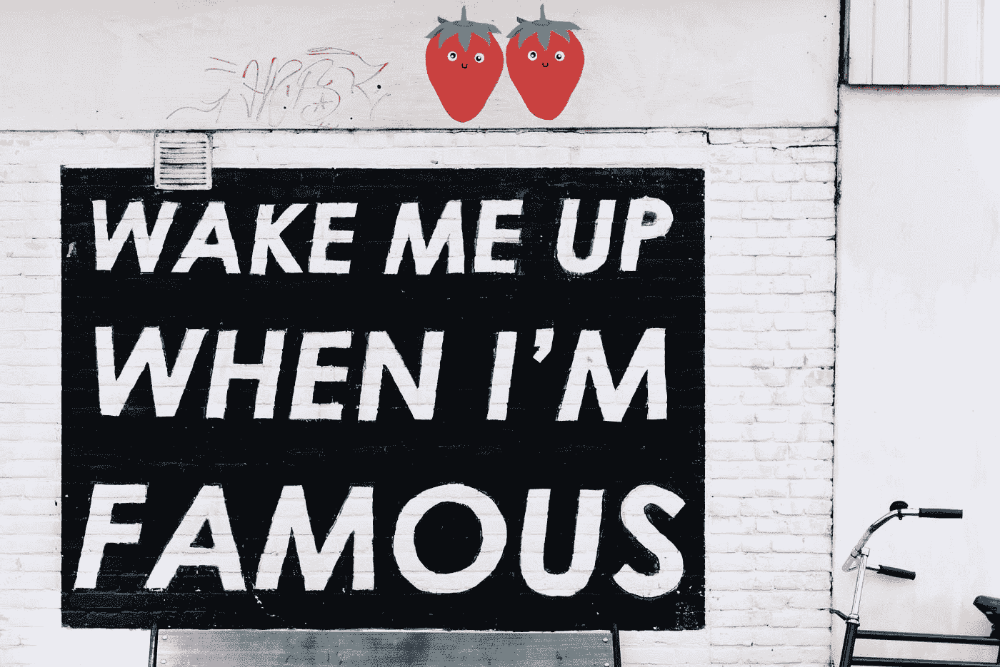

# 有趣和鼓舞人心的开发人员语录

> 原文：<https://javascript.plainenglish.io/funny-and-inspirational-quotes-for-developers-17a70d5783fa?source=collection_archive---------2----------------------->

## 激励和减轻你自己的编程报价



Photo by [Alice Donovan Rouse](https://unsplash.com/@alicekat?utm_source=medium&utm_medium=referral) on [Unsplash](https://unsplash.com?utm_source=medium&utm_medium=referral)

2021 年只剩下两个月了，像我一样，很多人都想享受这两个月，然后重新开始。

但是要设定目标，你需要动力吗？人们会引用激励性的话，但在这里我想出了一些有趣的话，你可以把它们和自己联系起来，也许会激励你在这个领域越来越多的成长。

## 那你还在等什么？我们结账吧。

```
Programmer's son asks his father: -Dad, why do the sun rise on the east and set on the west?
Father: It works? Don't touch it.
```

(**来源:** [Reddit](https://www.reddit.com/r/Jokes/comments/8zfcs7/programmers_son_asks_his_father_dad_why_do_the/) )

```
No matter how slick the demo is in rehearsal, when you do it in front of a live audience the probability of a flawless presentation is inversely proportional to the number of people watching, raised to the power of the amount of money involved.- Mark Gibbs
```

(【https://www.azquotes.com/author/38974-Mark_Gibbs】来源:)

```
‘Documentation is like sex: when it is good, it is very, very good; and when it is bad, it is better than nothing’ 
```

(**来源:**[https://scraper wiki . com/2011/05/documentation-is-like-sex-when-it-is-is-good-it-is-very-very-good-when-it-be-bad-it-be-聊胜于无/](https://scraperwiki.com/2011/05/documentation-is-like-sex-when-it-is-good-it-is-very-very-good-and-when-it-is-bad-it-is-better-than-nothing/) )

```
Nine people can't make a baby in a month.- Fred Brooks
```

(**来源:**[https://www.azquotes.com/quote/768897?ref=programming-funny](https://www.azquotes.com/quote/768897?ref=programming-funny))

```
A program is never less than 90% complete, and never more than 95% complete.
- Terry Baker
```

(**来源:**[https://software quotes . com/quote/a-program-is-never-less-90-complete-and-nev](https://softwarequotes.com/quote/a-program-is-never-less-than-90--complete--and-nev))

```
“Without requirements or design , programming is the art of adding bugs to an empty text file.” - Louis Srygley
```

(**来源:【https://twitter.com/codewisdom】T22)**

```
Most of you are familiar with the virtues of a programmer. There are three, of course: laziness, impatience, and hubris.- Larry Wall
```

(**来源:**[https://www.azquotes.com/quote/570105?ref=programming-funny](https://www.azquotes.com/quote/570105?ref=programming-funny))

```
“Always code as if the guy who ends up maintaining your code will be a violent psychopath who knows where you live.”
― Martin Golding
```

(**来源:**[https://www.goodreads.com/author/quotes/3243250.马丁 _ 戈尔丁](https://www.goodreads.com/author/quotes/3243250.Martin_Golding)

```
Beta. Software undergoes beta testing shortly before it's released. Beta is Latin for “still doesn't work”.
- Anonymous
```

(**来源:**[https://softwarequotes.com/quote/beta-软件-经历-beta-测试-不久-befo](https://softwarequotes.com/quote/beta--software-undergoes-beta-testing-shortly-befo) )

```
Measuring programming progress by lines of code is like measuring aircraft building progress by weight.- Bill Gates
```

(**来源:**[https://www.azquotes.com/quote/477670?ref=programming-funny](https://www.azquotes.com/quote/477670?ref=programming-funny))

```
It's not a bug - it's an undocumented feature.
- Anonymous
```

(**来源:**【https://softwarequotes.com/quote/it-s-not-a-bug】[-it-s-an-无证-特写-](https://softwarequotes.com/quote/it-s-not-a-bug---it-s-an-undocumented-feature-) )

```
The most likely way for the world to be destroyed, most experts agree, is by accident. That's where we come in; we're computer professionals. We cause accidents.- Nathaniel Borenstein
```

(【https://www.azquotes.com/quote/585176?ref=programming-funny】来源:)

```
“If debugging is the process of removing software bugs, then programming must be the process of putting them in.”― Edsger W. Dijkstra
```

(来源:[https://www . goodreads . com/quotes/1271018-if-debugging-is-the-process-of-removal-software-bugs-then](https://www.goodreads.com/quotes/1271018-if-debugging-is-the-process-of-removing-software-bugs-then))

```
Debugging is twice as hard as writing the code in the first place. Therefore, if you write the code as cleverly as possible, you are, by definition, not smart enough to debug it.- Brian Kernighan
```

(**来源:**[https://www.azquotes.com/quote/669106?ref=programming-funny](https://www.azquotes.com/quote/669106?ref=programming-funny))

```
“Walking on water and developing software from a specification are easy if both are frozen.”― Edward V. Berard
```

(**来源:**[https://www . goodreads . com/quotes/234986-walking-on-water-and-developing-software-from-a-specification-are](https://www.goodreads.com/quotes/234986-walking-on-water-and-developing-software-from-a-specification-are))

```
Programming today is a race between software engineers striving to build bigger and better idiot-proof programs, and the Universe trying to produce bigger and better idiots. So far, the Universe is winning.- Rick Cook
```

(**来源:**[https://www.azquotes.com/quote/668291?ref=programming-funny](https://www.azquotes.com/quote/668291?ref=programming-funny))

# 最后的想法

希望你喜欢这篇文章。程序员也可以从引用中获得乐趣。希望你喜欢。如果你想看更多这样的故事，请访问我的个人资料。

*更多内容请看*[***plain English . io***](http://plainenglish.io)