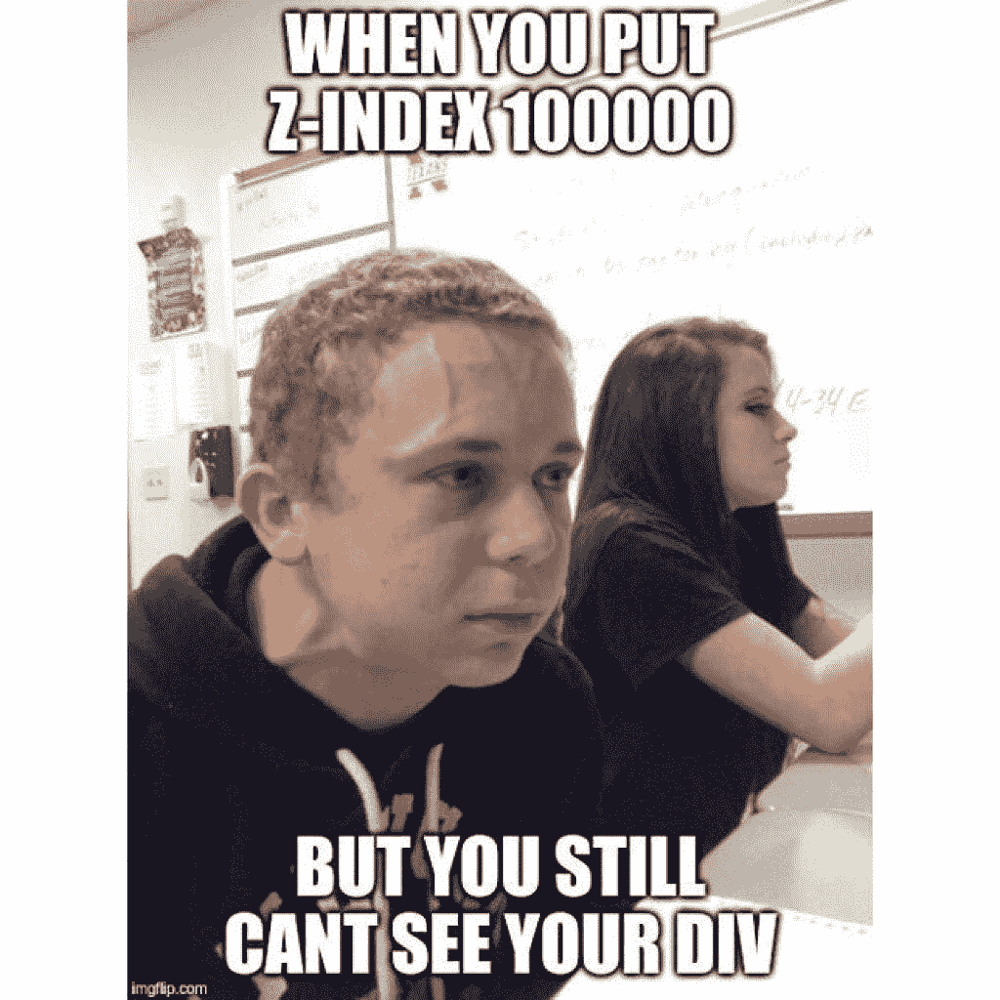
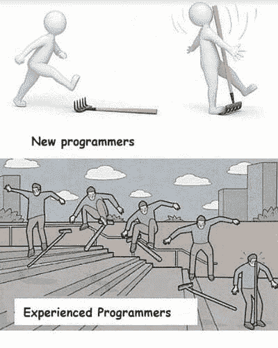

# 有趣的比较:程序员与普通人

> 原文：<https://javascript.plainenglish.io/funny-comparisons-programmers-vs-normal-people-3aa7002f62f0?source=collection_archive---------0----------------------->

## 程序员与现实世界有何不同

## 是什么让程序员与众不同？

[https://www.reddit.com/r/ProgrammingAndTech](https://www.reddit.com/r/ProgrammingAndTech)

程序员和正常人不一样。你相信这种说法吗？让我们来看看一些不同之处，以帮助您得出结论。

*(这是一篇幽默的文章，无意伤害任何社区。)*

# 正常人设置闹钟是为了记住起床时间…而程序员…

[https://www.reddit.com/r/ProgrammerHumor](https://www.reddit.com/r/ProgrammerHumor)

# 我们在这个区域处于什么位置？

[https://www.reddit.com/r/ProgrammerHumor](https://www.reddit.com/r/ProgrammerHumor)

# 一些常见问题…

[https://knowyourmeme.com/](https://knowyourmeme.com/)

# 在 COVID 时间内…

[https://aprogrammerlife.com/](https://aprogrammerlife.com/)

# 你如何定义树根？

[https://www.semicolonworld.com/humor](https://www.semicolonworld.com/humor)

# 调试…

[https://twitter.com/webclipse/status/665260017600196608](https://twitter.com/webclipse/status/665260017600196608)

# 程序员如何睡觉…

[https://www.reddit.com/](https://www.reddit.com/)

# 你怎么看字母表？

# 就寝时间…

# 笔记本电脑…

[https://aprogrammerlife.com/](https://aprogrammerlife.com/)

> **如果你喜欢这篇文章，请用这个链接加入 Medium，它帮助我得到一点钱。**

> [“从此链接加入](https://sheetalpatel93.medium.com/membership)”

# 你在想什么？

[https://www.pinterest.ca/](https://www.pinterest.ca/)

# 你喝咖啡还是茶？

# 是的，我们确实经常跑步…

[https://onsizzle.com/t/normal-people](https://onsizzle.com/t/normal-people)

# 数据库管理员如何看待关系…

[https://me.me/](https://me.me/)

# 正常人是怎么犯的？等等，程序员呢？

[https://memesuite.org/programming/110335/](https://memesuite.org/programming/110335/)

# 给你更多的编程笑话…

# 他们嫉妒我的幸福

[https://www.reddit.com/r/ProgrammerHumor/comments/oiiwi3/there_goes_away_one_more_sunday/](https://www.reddit.com/r/ProgrammerHumor/comments/oiiwi3/there_goes_away_one_more_sunday/)

# 不正确，但是让我们想想…

[https://www.reddit.com/r/ProgrammerHumor/comments/oinxee/the_truth_can_hurt_sometimes/](https://www.reddit.com/r/ProgrammerHumor/comments/oinxee/the_truth_can_hurt_sometimes/)

# 我到底做了什么来解决这个问题…也许什么也没做…

[https://www.reddit.com/r/ProgrammerHumor/comments/oimbw6/things_that_magically_work_but_you_dont_know_why/](https://www.reddit.com/r/ProgrammerHumor/comments/oimbw6/things_that_magically_work_but_you_dont_know_why/)

# 你需要学习交易…来处理 API

[https://www.reddit.com/r/ProgrammerHumor/comments/ohh9nv/200_ok/](https://www.reddit.com/r/ProgrammerHumor/comments/ohh9nv/200_ok/)

# 还有谁会因为认为警告有助于节省时间而忽视警告呢？

[https://www.reddit.com/r/ProgrammerHumor/comments/ofeexz/inner_peace/](https://www.reddit.com/r/ProgrammerHumor/comments/ofeexz/inner_peace/)

# 单元测试意味着增加覆盖率……(有时)

[https://www.reddit.com/r/ProgrammerHumor/](https://www.reddit.com/r/ProgrammerHumor/)

# 人工智能出错

[https://www.reddit.com/r/ProgrammerHumor/comments/ojf2eu/ai/](https://www.reddit.com/r/ProgrammerHumor/comments/ojf2eu/ai/)

# 重新编译…我怎么总是忘记？

[https://www.reddit.com/r/ProgrammerHumor/comments/ojdicf/it_happened_more_than_once/](https://www.reddit.com/r/ProgrammerHumor/comments/ojdicf/it_happened_more_than_once/)

# 一些噩梦…还是现实？

[https://www.monkeyuser.com/2019/great-expectations/?sc=true&dir=random](https://www.monkeyuser.com/2019/great-expectations/?sc=true&dir=random)

# 奖金时间

# 浏览量每天都在增加，是的，人们好奇的看着，怎么会有人这么做呢？英雄联盟

[https://www.facebook.com/ProgrammersCreateLife/](https://www.facebook.com/ProgrammersCreateLife/)

# 打算买床垫？像问答一样思考…这将有助于:D

[https://www.monkeyuser.com/](https://www.monkeyuser.com/)

# 这种情况经常发生…风扇会启动，声音会出现…

[https://www.quora.com/What-are-some-of-the-best-programmer-jokes-and-memes-out-there](https://www.quora.com/What-are-some-of-the-best-programmer-jokes-and-memes-out-there)

# 你的愿望是什么？无 Bug 代码？抱歉 404:未找到

[https://www.facebook.com/techindustan/](https://www.facebook.com/techindustan/)

# 那种只有你的人能理解你的感觉…

[https://www.facebook.com/programminggeeks.in](https://www.facebook.com/programminggeeks.in)

# 我感觉很幸运…哈哈

[https://www.reddit.com/r/ProgrammerHumor/comments/ort8im/i_got_your_back/](https://www.reddit.com/r/ProgrammerHumor/comments/ort8im/i_got_your_back/)

# 感觉棒极了…因为我现在必须开始…

[https://www.reddit.com/r/ProgrammerHumor/comments/oryzuy/github_stars_be_like/](https://www.reddit.com/r/ProgrammerHumor/comments/oryzuy/github_stars_be_like/)

# 如何知道自己写的代码好不好？让我们来看一个最好的测量结果…

[https://www.reddit.com/r/ProgrammerHumor/comments/os2nf8/how_code_reviews_happens/](https://www.reddit.com/r/ProgrammerHumor/comments/os2nf8/how_code_reviews_happens/)

# 如果你成为项目经理…

[https://www.reddit.com/r/ProgrammerHumor/comments/orwx1p/when_you_get_promoted_as_subproject_manager/](https://www.reddit.com/r/ProgrammerHumor/comments/orwx1p/when_you_get_promoted_as_subproject_manager/)

# LOL…在拥有严格的开发模式之前，这是我代码的内部状态…当一个新变量加入未使用的变量时…

[https://www.facebook.com/photo?fbid=899897387465482&set=gm.2799768736940435](https://www.facebook.com/photo?fbid=899897387465482&set=gm.2799768736940435)

# 作为一名初级开发人员，我学到的第一件事就是不要碰工作正常的东西…这会增加重新测试的工作量，还会损坏其他东西…

[https://www.facebook.com/javascriptJS/photos/1861659490638313](https://www.facebook.com/javascriptJS/photos/1861659490638313)

# 有时候我的 div 元素隐藏的方式让 z-index 也无济于事…:)

[https://www.facebook.com/javascriptJS/photos/1599789793491952](https://www.facebook.com/javascriptJS/photos/1599789793491952)

# 我的生活问题…

[https://www.facebook.com/DZoneInc/photos/a.336758034711/10159553517674712/](https://www.facebook.com/DZoneInc/photos/a.336758034711/10159553517674712/)

# 当我和朋友谈论 JavaScript 和 Java 时，这种情况经常发生

[https://www.facebook.com/yuva.krishna.memes/photos/a.105527467815845/385113166523939/](https://www.facebook.com/yuva.krishna.memes/photos/a.105527467815845/385113166523939/)

# 如果你参加所有的产品会议，这意味着你知道一切…你是救世主…

[https://www.facebook.com/yuva.krishna.memes/photos/a.105527467815845/384661446569111/](https://www.facebook.com/yuva.krishna.memes/photos/a.105527467815845/384661446569111/)

# 我们能不能停止维护这个软件…

[https://www.facebook.com/yuva.krishna.memes/photos/a.105527467815845/384653033236619/](https://www.facebook.com/yuva.krishna.memes/photos/a.105527467815845/384653033236619/)

# 其中一个拙劣的笑话…

[https://www.facebook.com/photo/?fbid=4381277188618065&set=gm.6507842149241514](https://www.facebook.com/photo/?fbid=4381277188618065&set=gm.6507842149241514)

# LOL…安全测试是最差的…

[https://www.facebook.com/photo/?fbid=1286443845117522&set=gm.847086009343989](https://www.facebook.com/photo/?fbid=1286443845117522&set=gm.847086009343989)

# 有意义的信息。

[https://www.facebook.com/codevweb95/photos/a.109799858049136/118691307159991/](https://www.facebook.com/codevweb95/photos/a.109799858049136/118691307159991/)

# 不同的体验，不同的击球方式…

[https://www.facebook.com/coder724/photos/gm.1181013739084032/395320245487954/](https://www.facebook.com/coder724/photos/gm.1181013739084032/395320245487954/)

# 你在寻找什么？用叉子移除孩子？

[https://www.facebook.com/coder724/photos/gm.1181201935731879/395512935468685/](https://www.facebook.com/coder724/photos/gm.1181201935731879/395512935468685/)

# 最后备注:请随意分享您宝贵的掌声和评论，这样我就可以在未来提供更多类似的内容。

> 如果你喜欢这篇文章，请用这个链接加入 Medium，它帮助我得到一点钱。

> ["从此链接加入](https://sheetalpatel93.medium.com/membership)"

# 进一步阅读

 [## 日常的编程笑话

### 最佳编程迷因汇编(第 4 部分)

javascript.plainenglish.io](/daily-dose-of-programming-jokes-6541eba98194)  [## 2021 年最佳编程幽默汇编

### 编程迷因可以减轻你的压力

blog.devgenius.io](https://blog.devgenius.io/best-programming-humor-compilations-2021-623473bfb0d)  [## 有趣的编程迷因会让你笑死

### 编笑话来点亮你的周五

blog.devgenius.io](https://blog.devgenius.io/funny-programming-memes-that-will-make-you-die-laughing-1ccd8e139040)  [## 编程迷因和幸福之间的联系

### 2021 年最佳编程迷因汇编

blog.devgenius.io](https://blog.devgenius.io/the-connection-between-programming-memes-and-happiness-d768ab85b83d)  [## 10 个能让你心情轻松的最佳编程笑话

### 你读过的关于编程迷因 2021 的最不可思议的文章

medium.com](https://medium.com/geekculture/10-best-programming-jokes-to-lighten-up-your-mood-8870dab2bff7) 

*更多内容尽在*[***plain English . io***](http://plainenglish.io/)