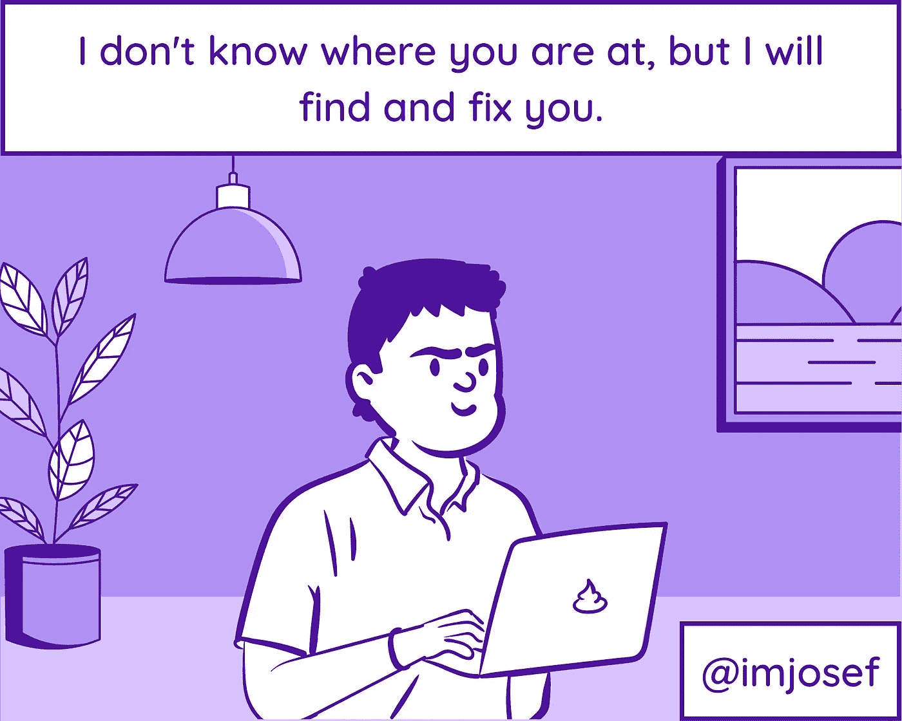

# 说你是开发者的有趣方式

> 原文：<https://javascript.plainenglish.io/funny-ways-to-say-that-youre-a-developer-d6e37d980541?source=collection_archive---------5----------------------->

## 实际上没有说你是一个开发者

Photo by [MayoFi](https://unsplash.com/@mayofi?utm_source=medium&utm_medium=referral) on [Unsplash](https://unsplash.com?utm_source=medium&utm_medium=referral)

编程并不适合每个人。

以我的妻子、家人和朋友为例。他们一直问我总是做什么，整天整夜地在笔记本电脑上打字，一直盯着它，然后突然大喊'是'或说，'啊哈！

另一方面，我不能理解为什么他们非常好奇，渴望知道它，即使我解释了很多次，我都不记得了。

所以，对于那些生活在代码世界中的人来说，这里有一些有趣的方法来告诉他们你是程序员而不告诉他们你是程序员。

# 1.Stackoverflow 就是答案

Photo supplied by the author

# 2.这是一个错误。不，这是一个功能

Photo supplied by the author

# 3.它在我的机器上工作

Photo supplied by the author

# 4.我已经几个星期没碰过那个代码了

Photo supplied by the author

# 5.编译是最好的借口

Photo supplied by the author

# 6.须藤，你愿意嫁给我吗？

Photo supplied by the author

# 7.你好世界

Photo supplied by the author

# 8.缺少分号

Photo supplied by the author

# 9.我会找到并修理你

Photo supplied by the author

# 10.我不知道我在做什么

Photo supplied by the author

# 11.它工作了。为什么？它不起作用。为什么？

Photo supplied by the author

# 12.如果有效，就不要再碰它了

Photo supplied by the author

# 13.我昨晚做了一个快速修复，但是当我重启的时候它坏了

Photo supplied by the author

# 14.我在脑子里工作

Photo supplied by the author

# 15.你输错了什么导致它崩溃？

Photo supplied by the author

有不同有趣的方式告诉你是一个开发者，而不告诉你是一个开发者。我很想听听你会怎么做。你会用什么？