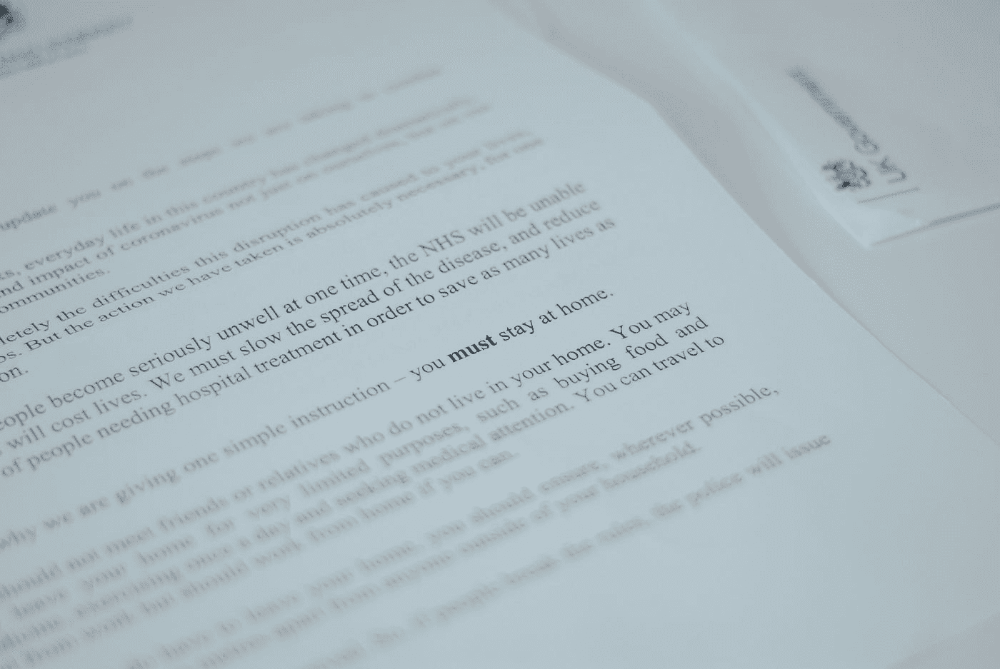

# Gatsby.js —页面过渡

> 原文：<https://javascript.plainenglish.io/gatsby-js-page-transitions-b84f8c54da71?source=collection_archive---------11----------------------->



Photo by [Hello I'm Nik 🎞](https://unsplash.com/@helloimnik?utm_source=medium&utm_medium=referral) on [Unsplash](https://unsplash.com?utm_source=medium&utm_medium=referral)

Gatsby 是一个基于 React 的静态网站框架。

我们可以用它从外部数据源创建静态网站等等。

在本文中，我们将看看如何用 Gatsby 创建一个站点。

# 过渡

我们可以在导航到不同页面时添加过渡。

为此，我们添加了`gsap`包和`gatsby-plugin-transition-link`插件。

我们通过运行以下命令来安装它们:

```
npm i gsap gatsby-plugin-transition-link
```

然后在`gatsby-config.js`中，我们加上:

```
module.exports = {
  plugins: [
    `gatsby-plugin-transition-link`
  ],
}
```

然后在我们的页面上，我们写道:

`src/pages/index.js`

```
import React from "react"
import AniLink from "gatsby-plugin-transition-link/AniLink"const IndexPage = () => {
  return <>
    <div>hello world</div>
    <AniLink paintDrip to="/foo">
      Go to foo
    </AniLink>
  </>
}export default IndexPage
```

`src/pages/foo.js`

```
import React from "react"
import AniLink from "gatsby-plugin-transition-link/AniLink"const FooPage = () => {
  return <>
    <div>hello world</div>
    <AniLink paintDrip to="/">
      Go to Index
    </AniLink>
  </>
}export default FooPage
```

`AniLink`组件是一个`Link`组件，当我们点击它时，它可以显示过渡效果。

`paintDrip`是效果名。它显示一种蓝色流下屏幕。

`to`有我们要去的网址。

# 自定义过渡

我们还可以添加自己的过渡。

我们通过运行以下命令来安装 React Post:

```
npm i react-post
```

然后我们写道:

```
import React from "react"
import { TransitionState } from "gatsby-plugin-transition-link"
import posed from 'react-pose';const Box = posed.div({
  hidden: { opacity: 0 },
  visible: { opacity: 0.6 },
})const IndexPage = () => {
  return <>
    <TransitionState>
      {({ transitionStatus, exit, entry, mount }) => {
        console.log("current page's transition status is", transitionStatus)
        console.log("exit object is", exit)
        console.log("entry object is", entry)
        return (
          <Box
            className="box"
            pose={
              mount
                ? 'visible'
                : 'hidden'
            }
          >
            <div>hello world</div>
          </Box>
        )
      }}
    </TransitionState>
  </>
}export default IndexPage
```

我们使用`react-pose`来创建`Box`组件。

`Box`组件分别在动画开始和结束时具有过渡效果。

然后我们添加`TransitionState`组件来添加我们的转换。

`transitionStatus`已经过渡的状态。

`exit`当过渡结束时，具有过渡状态的对象。

`entry`当转换开始时，具有转换状态的对象。

当页面已安装或已经安装时,`mount`为`true`。

当`mounted`为`true`或`false`时，我们分别设置`'visible'`或`'hidden'`类。

那么‘hello world’最后应该是`opacity`0.6 结尾。

# 从页面过渡中排除元素

我们可以从页面过渡中排除元素。

为此，我们写道:

```
module.exports = {
    plugins: [
       {
          resolve: "gatsby-plugin-transition-link",
          options: {
              layout: require.resolve(`./src/components/Layout.js`)
            }
       }
    ]
];
```

`src/components/Layout.js`不包含在任何页面过渡效果中。

# 结论

我们可以用 Gatsby 给页面添加页面过渡效果。

喜欢这篇文章吗？如果有，通过 [**订阅我们的 YouTube 频道**](https://www.youtube.com/channel/UCtipWUghju290NWcn8jhyAw?sub_confirmation=true) **获取更多类似内容！**