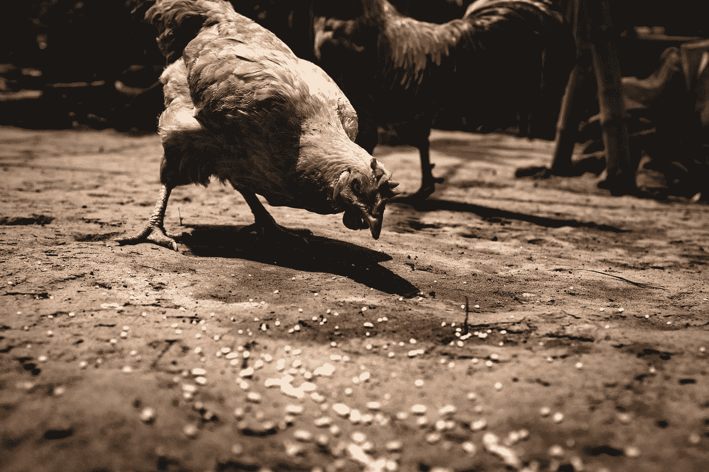

# Gatsby.js —网站地图和 RSS 源

> 原文：<https://javascript.plainenglish.io/gatsby-js-sitemap-and-rss-feed-4b3890050f3d?source=collection_archive---------17----------------------->



Photo by [Jesse Schoff](https://unsplash.com/@jesseschoff?utm_source=medium&utm_medium=referral) on [Unsplash](https://unsplash.com?utm_source=medium&utm_medium=referral)

盖茨比是一个基于反应的静态网站框架。

我们可以用它来从外部数据源创建静态网站等等。

在本文中，我们将了解如何使用盖茨比创建一个网站。

# 网站地图

我们可以使用`gatsby-plugin-sitemap`插件添加网站地图。

为此，我们写道:

```
module.exports = {
  siteMetadata: {
    siteUrl: `https://www.example.com`,
  },
  plugins: [`gatsby-plugin-sitemap`],
}
```

在`gatsby-config.js`中。

我们通过运行以下程序来安装插件:

```
npm i gatsby-plugin-sitemap
```

`siteUrl`有网站的基本网址。这是必需的。

我们将插件添加到`plugins`数组中。

然后当我们用`npm run build`进行生产制造时，我们会得到网站地图。

# 简单讯息聚合订阅

我们可以用`gatsby-plugin-feed`插件添加一个 RSS 源。

为此，我们写道:

`gatsby-config.js`

```
module.exports = {
  plugins: [
    `gatsby-transformer-remark`,
    `gatsby-plugin-feed`,
    {
      resolve: `gatsby-source-filesystem`,
      options: {
        name: `content`,
        path: `${__dirname}/src/content`,
      },
    },
  ],
  siteMetadata: {
    siteUrl: `https://www.example.com`,
  },
}
```

我们需要`siteMetadata.siteUrl`来生成 RSS 提要。

`gatsby-node.js`

```
const path = require("path")
const _ = require("lodash")
const { createFilePath } = require(`gatsby-source-filesystem`)exports.onCreateNode = ({ node, actions, getNode }) => {
  const { createNodeField } = actions
  if (node.internal.type === `MarkdownRemark`) {
    const value = createFilePath({ node, getNode })
    createNodeField({
      name: `slug`,
      node,
      value,
    })
  }
}exports.createPages = async ({ actions, graphql, reporter }) => {
  const { createPage } = actions
  const blogPostTemplate = path.resolve("src/templates/post.js")
  const result = await graphql(`
    {
      postsRemark: allMarkdownRemark(
        sort: { order: DESC, fields: [frontmatter___date] }
        limit: 2000
      ) {
        edges {
          node {
            fields {
              slug
            }
            frontmatter {
              tags
            }
          }
        }
      }
      tagsGroup: allMarkdownRemark(limit: 2000) {
        group(field: frontmatter___tags) {
          fieldValue
        }
      }
    }
  `)
  if (result.errors) {
    reporter.panicOnBuild(`Error while running GraphQL query.`)
    return
  }
  const posts = result.data.postsRemark.edges
  posts.forEach(({ node }) => {
    const slug = node.fields.slug
    createPage({
      path: slug,
      component: blogPostTemplate,
      context: { slug },
    })
  })
}
```

`src/templates/post.js`

```
import React from "react"
import { graphql } from "gatsby"export default function BlogPost({ data }) {
  const post = data.markdownRemark
  return (
    <div>
      <h1>{post.frontmatter.title}</h1>
      <div dangerouslySetInnerHTML={{ __html: post.html }} />
    </div>
  )
}
export const query = graphql`
  query($slug: String!) {
    markdownRemark(fields: { slug: { eq: $slug } }) {
      html
      frontmatter {
        title
      }
    }
  }
`
```

我们将`gatsby-plugin-feed`插件添加到`gatsby-config.js`中。

我们通过运行以下程序来安装插件:

```
npm i gatsby-plugin-feed
```

在`gatsby-node.js`中，我们进行 GraphQL 查询来获取降价帖子，并调用`createPage`来创建帖子。

`post.js`从`data`道具获取数据后显示帖子。

现在当我们运行`npm run build`时，我们看到`public/rss.xml`文件生成了。

# 结论

我们可以和盖茨比一起给我们的网站添加一个网站地图和 RSS 源。

喜欢这篇文章吗？如果是这样，通过 [**订阅我们的 YouTube 频道**](https://www.youtube.com/channel/UCtipWUghju290NWcn8jhyAw?sub_confirmation=true) **获得更多类似的内容！**