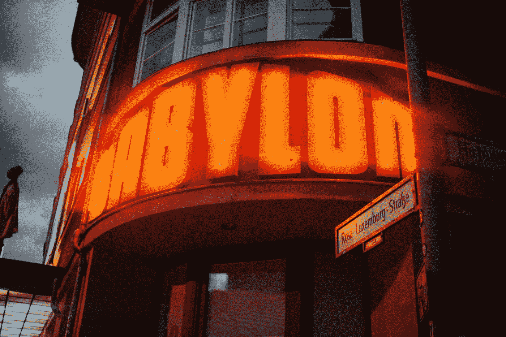

# Gatsby.js 样式组件

> 原文：<https://javascript.plainenglish.io/gatsby-js-styling-components-b6b0876716cb?source=collection_archive---------12----------------------->



Photo by [Patrick Reichboth](https://unsplash.com/@peetfolio?utm_source=medium&utm_medium=referral) on [Unsplash](https://unsplash.com?utm_source=medium&utm_medium=referral)

Gatsby 是一个基于 React 的静态网站框架。

我们可以用它从外部数据源创建静态网站等等。

在本文中，我们将看看如何用 Gatsby 创建一个站点。

# 使用 CSS 设置样式

我们可以将全局样式添加到`src/styles/global.css`文件中:

```
html {
  background-color: green;
}
p {
  color: maroon;
}
```

然后在`gatsby-browser.js`中，我们添加:

```
import "./src/styles/global.css"
```

导入全局样式。

然后这些样式将被应用到任何地方

# 布局样式

我们可以将样式添加到布局文件中，这样它们就可以应用到所有的子组件中。

例如，我们可以写:

`src/components/layout.css`

```
html {
  background-color: green;
}
p {
  color: maroon;
}
```

`src/components/layout.js`

```
import { Link } from "gatsby"
import React from "react"
import './layout.css'export default function Layout({ children }) {
  return (
    <div style={{ margin: `0 auto`, maxWidth: 650, padding: `0 1rem` }}>
      <Link to='/foo'>foo</Link>
      <Link to='/bar'>bar</Link>
      {children}
    </div>
  )
}
```

`src/pages/bar.js`

```
import React from "react"
import Layout from "../components/layout"export default function Bar() {
  return <Layout>
    <div>bar</div>
  </Layout>
}
```

`src/pages/foo.js`

```
import React from "react"
import Layout from "../components/layout"export default function Bar() {
  return <Layout>
    <div>bar</div>
  </Layout>
}
```

然后样式将被应用到`Foo`和`Bar`页面。

# 样式组件

我们可以使用样式组件库用 Gatsby 创建样式组件。

为此，我们运行:

```
npm install gatsby-plugin-styled-components styled-components babel-plugin-styled-components
```

安装所需的软件包。

然后在`gatsby-config.js`中，我们写道:

```
/**
 * Configure your Gatsby site with this file.
 *
 * See: https://www.gatsbyjs.com/docs/gatsby-config/
 */module.exports = {
  /* Your site config here */
  plugins: [`gatsby-plugin-styled-components`],
}
```

将插件添加到我们的项目中。

然后我们可以通过写来使用它:

`src/pages/index.js`

```
import React from "react"
import styled from "styled-components"
const Container = styled.div`
  margin: 3rem auto;
  max-width: 700px;
  display: flex;
  flex-direction: column;
  align-items: center;
  justify-content: center;
`
const Avatar = styled.img`
  flex: 0 0 100px;
  width: 96px;
  height: 96px;
  margin: 0;
`
const Username = styled.h2`
  margin: 0 0 12px 0;
  padding: 0;
`
const User = props => (
  <>
    <Avatar src={props.avatar} alt={props.username} />
    <Username>{props.username}</Username>
  </>
)
export default function UsersList() {
  return (
    <Container>
      <User
        username="Jane Doe"
        avatar="https://s3.amazonaws.com/uifaces/faces/twitter/adellecharles/128.jpg"
      />
      <User
        username="Bob Jones"
        avatar="https://s3.amazonaws.com/uifaces/faces/twitter/vladarbatov/128.jpg"
      />
    </Container>
  )
}
```

我们创建了`Container`组件，它是一个样式化的 div。

`Avatar`是一个样式化的图像。而`Username`是样式化的`h2`组件。

`User`由`Avatar`和`Username`组件组合而成。

# CSS 模块

我们可以在 Gatsby 项目中使用 CSS 模块。

要使用它，我们可以写:

`src/pages/index.module.css`

```
.feature {
  margin: 2rem auto;
  max-width: 500px;
  color: red;
}
```

`src/pages/index.js`

```
import React from "react"
import style from "./index.module.css"
export default function Home() {
  return (
    <section className={style.feature}>
      <h1>hello world</h1>
    </section>
  )
}
```

我们只是将 CSS 作为一个模块导入到组件中。

然后我们可以通过访问作为对象的`style`导入来应用类，将类名作为属性名。

# 结论

我们可以用 Gatsby 以各种方式设计我们的组件。

喜欢这篇文章吗？如果有，通过 [**订阅我们的 YouTube 频道**](https://www.youtube.com/channel/UCtipWUghju290NWcn8jhyAw?sub_confirmation=true) **获取更多类似内容！**