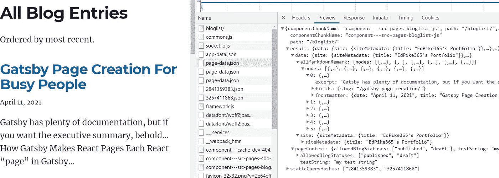
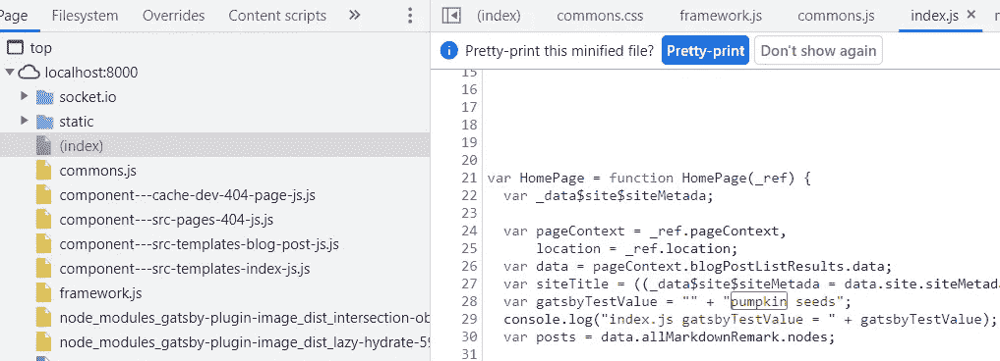
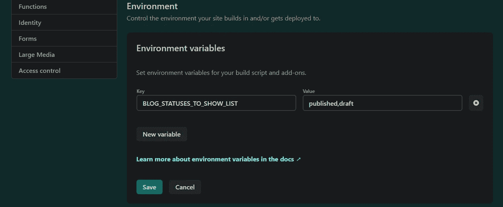
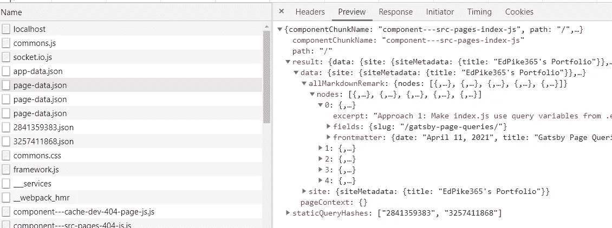

# 带有环境变量的 GatsbyJS 页面查询

> 原文：<https://javascript.plainenglish.io/gatsby-page-queries-with-environment-variables-1eae8557ee01?source=collection_archive---------5----------------------->

## 中间的，代码味的

## 实施降价发布工作流程时学习

我们将讨论的核心问题是在对`src\pages`文件夹中的页面进行页面查询时使用环境变量。这显然是一个常见的问题([例](https://github.com/gatsbyjs/gatsby/issues/10023))。在我让它工作之前，我确实很努力。我们还将讨论页面查询、变量和`createPage`动作。

## 降价发布工作流程:

我的博客使用 [Gatsby Starter Blog](https://www.gatsbyjs.com/starters/gatsbyjs/gatsby-starter-blog) ，它从 Markdown (MD)文件加载博客文章。它会列出并加载所有的博客文章，不管你是否写完了。

我想要一个标准的发布工作流程:文章将根据它们的“状态”显示在网站上。状态可以是“草稿”、“已发布”或“已存档”。

当我处于“gatsby develop”模式时，我希望发布“已发布”*和*“草稿”文章。然后，我可以在编辑/保存文章草稿时看到它们的样子。

当我运行`gatsby build; gatsby serve`时，我想只显示 status = "published "的文章。最好使用*环境变量(env vars)来完成。*当您想要存储根据您发布到的模式(开发与生产)或位置(中国与美国)而变化的信息(也称为变量)时，Env 变量最有用。

## **前台状态字段**

要添加一个发布工作流，首先我要在 index.md 文件的顶部为每篇文章的 [frontmatter](https://www.gatsbyjs.com/docs/how-to/routing/adding-markdown-pages/#frontmatter-for-metadata-in-markdown-files) 添加一个`status`字段。

下面的查询将读取`status`字段值。

## 在盖茨比中使用环境变量

我在 node 中使用环境变量，最流行的包是 [dotenv](https://www.npmjs.com/package/dotenv) 。盖茨比显然与 dotenv 同船；你只需要“激活”它。要激活环境变量，请在`gatsby-config.js`或`gatsby-node.js.`的顶部包含此代码

现在，Gatsby 将在站点的根文件夹中寻找两个可选文件:

*   `.env.development`:运行`gatsby develop`时加载数值
*   `.env.production`:运行`gatsby build`时加载数值

注意:对您的。env 文件需要 Gatsby 重启。

> 注意:。env 文件应该在本地 git 中 ***忽略*** 。这些文件通常最终保存着**秘密**，比如 api 密匙，它们不应该在你的 git repo 中。盖茨比把`.env.*`加到你的名字里。git 自动忽略文件。这意味着。env 文件不会在你的发布服务的 git repo 中，就像 [Netlify](https://docs.netlify.com/configure-builds/environment-variables/) 或 [Gatsby Cloud](https://support.gatsbyjs.com/hc/en-us/articles/360053096753-Managing-Environment-Variables) 一样，无法读取。要使 env 变量可用于您的发布服务，您需要将它们复制到发布服务。选项因发布服务而异。

## 在我们的代码中加入环境变量

我们将使用变量`arBlogStatusesToShow`过滤所有的博客文章，筛选出我们想要显示的内容。我们将根据环境变量`BLOG_STATUSES_TO_SHOW_LIST`填充`arBlogStatusesToShow`。我在那里添加了“_LIST ”,以确保任何使用该变量的人都知道它是一个字符串列表，而不是一个数组。

> 根据多年的经验，我建议使用描述性很强的变量和函数名。你的大部分代码将来会被其他人编辑，或者在你忘记发生了什么之后很久还会被你编辑。几乎没有人阅读文档，否则文档会不准确。代码是事实的基本来源，如果代码冗长且“像散文一样”，程序员会更快地找到它。

我的工作流程需要使用允许状态的**列表**对状态字段进行过滤。因此，我们将 BLOG _ status _ TO _ SHOW _ LIST = " published，draft "转换为下面第 7 行的 JavaScript 数组。

# Gatsby GraphQL 概述

在让我的代码工作之后，这是我对 Gatsby 中 GraphQL 变量的理解。有**两大类:**

1.**静态查询**(又名“组件查询”)只运行一次。不允许变量。我在工作流程中没有使用任何工具。

2.**页面查询**(又名“普通查询”)。这些有两种口味:

*   在`src\pages`文件夹中页面底部的页面查询。盖茨比自动在上面运行`createPage()`。**在自动构建期间，您不能将变量直接传递给这些查询。**
*   在`gatsby-node.js`中执行的页面查询。

`gatsby-node.js`中的页面查询可以通过以下方式创建页面:

*   使用`src\template`文件配合`createPage()`动作。
*   使用`deletePage()`删除`src\pages`页面，然后**用`createPage().` **重新创建**页面。这是在构建时将变量(包括 env vars)传递到** `**src\pages**` **页面的唯一方法。**

# **选项 1。使用 src \模板文件**

这种方法在 [Gatsby Starter 博客](https://www.gatsbyjs.com/starters/gatsbyjs/gatsby-starter-blog)中有很好的记录。下面，我们使用模板文件为每篇博客文章创建一个单独的页面。

注意第 10 行的过滤器代码。我不得不使用`JSON.stringify(arBlogStatusesToShow)`在查询中正确格式化 JavaScript 数组。

请注意下面第 4–6 行中 GraphQL 查询变量的使用。它们与上面传入的`context`对象中的值同名。 ***如果您想将值传递给查询，这是必需的。***

# **选项 2。使用 src \ pages 文件:删除然后重新创建**

我添加了页面`src\pages\bloglist.js`来演示一种将变量传递给页面查询的方法。

因为它在`pages`文件夹中，所以页面上的查询将在构建期间自动运行。届时，它将不会返回任何博客帖子，因为`allowedBlogStatuses` var 将是“未定义的”。

> ***理解页面文件夹自动查询解析和尝试运行是在没有访问传入变量的情况下发生的，这一点至关重要。我浪费了很多时间去寻找如何去做，因为我不相信这是不可行的。***

接下来，在下面的代码中，我们删除然后重新创建页面，并作为一个变量传入允许的状态数组。

注意事项:

*   使用这种方法，我不必`JSON.stringify()`数组。显然，当您使用`context`对象时，盖茨比会自动为您这样做。
*   上面的`src\pages\bloglist.js`页面使用的变量名是`allowedBlogStatuses`。我们传进去的是`arBlogStatusesToShow`。只要`context`对象左侧的变量名与页面查询中的变量名匹配，这就没问题。右边的名字是任意的，但是按照惯例，是一样的。当上下文变量的左侧和右侧相同时，您可以简单地陈述查询变量的名称，而不用赋值。
*   特别注意下面的`exports.onCreatePage`，第 3 行。

下图来自 Chrome 开发工具。它显示了在运行时通过`page-data.json`为`/bloglist/`实际传递到您的 web 页面的内容。它只包含你想要的博客文章。它还包括`testString`值。(点击放大):

# **选项 3。使用 src\templates 文件，传入查询结果**

在这种方法中，我将我的主页从`src\pages\index.js`移到了`src\templates\index.js`，向您展示文件位置是相当随意的。

***我还把 index.js 底部的 GraphQL 去掉了，页面上没有 GraphQL 查询。相反，我完全在`gatsby-node.js`中编写和运行查询，并通过`context`对象传入结果集`blogPostListResults`。***

`path: “/"` arg 将使模板成为[**www.edpike365.com/**](http://www.edpike365.com/)的主页

下面的代码没有使用`data`对象。它将是空的。`pageContext`对象将包含一个数据对象，该数据对象包含`data`通常包含的所有信息。

# 附录 a .神奇的“盖茨比 _”环境变量

以`GATSBY_`开头命名的 Env 变量将可用于您的服务器端 NodeJS 代码，就像任何 env 变量(gatsby-config.js、gatsby-node.js 和它们导入的任何代码)一样。

`GATSBY_` env var 的值被 ***也*** 注入到你的页面或者模板 JSX 中去，在**页面之前【JSX】*被发送到网页浏览器。**它们不会作为变量出现在 page-data.json 文件中。***

*在. env 文件中声明变量:*

*在你的 JSX 页面中使用它(第 8 行):*

*值被注入到源代码中。这是 Chrome 开发工具的截图。用`var gatsbyTestValue`标注第 28 行。*

**

> ***主要问题**:如果您的页面在`src\pages`中，`GATSBY_` env 变量在自动构建期间不可用于“页面内”查询。*

# *附录 b .部署到 Netlify*

*我在 Github 和 Netlify 上主持。我没有使用盖茨比 Netlify 插件。*

*存储环境变量有两个选项:*

## *选项 1: Netlify 配置文件*

*将您的 env 变量放在根文件夹中的一个`netlify.toml`文件中。它们将在`process.env`中可用，就像使用`.env`文件一样。但是，您的 git repo 中必须有这个文件。这不是首选，因为在某些时候您需要存储机密。*

## *选项 2: Netlify 构建设置*

*到了[app.netlify.com/sites/_your_project_name_/settings/deploys](http://app.netlify.com/sites/_your_project_name_/settings/deploys)*

*在该页面上，转到 **>构建&部署>环境>编辑设置**按钮*

> *明白了:不要把“值”放在引号中。当您引用 process.env 变量时，会为您添加它们。我使用了一个数组，所以它看起来像这样:*

**

# ***附录 c .在客户端 JSX 中使用查询过滤结果***

*我认为值得一提的是我一路走来学到的一些东西。谢天谢地，我在发布我的发布工作流的这个版本之前发现了它。*

*在这种方法中，`index.js`页面上的查询没有过滤器。您将获得页面的“数据”对象中的所有博客条目，不管它们的`status`。这将发生在`src/pages`自动构建期间。然后我根据全局`GATSBY_BLOG_STATUS`环境变量过滤它们。*

*将 var 添加到您的`.env.development`文件中。别忘了重启盖茨比:*

*然后添加一个过滤函数:*

*这似乎行得通；当您查看网页时，它只显示“已发布”和“草稿”博客文章的摘要。但是，它有一个可伸缩性问题，您可以在下面的 page-data.json 中看到:*

**

*正如你在 Chrome 开发工具“网络>预览”标签中看到的，`result.data.allMarkDownRemark.nodes`包含博客条目摘要。可惜的是，它包含了 ***所有*** 的博客文章， ***不计地位*** 。因此，即使我的“存档”博客帖子也会在那里。*

*每次网站加载时，我的所有博客条目的摘要都会通过网络发送(尽管有存储空间)。随着我博客的增长，这将成为一个严重的问题。*

*另一方面，如果我希望能够在运行时进行过滤，我可以让它们都可用。我甚至可以把它们都添加到 Redux 商店。*

## *结论*

*嗯，就这些。我希望这有所帮助！有什么想法吗？如果是这样，一定要在评论里继续讨论。*

**更多内容看* [***说白了. io***](https://plainenglish.io/)*