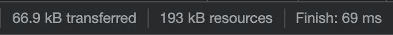
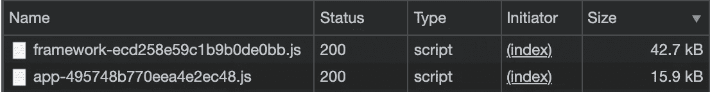
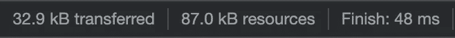
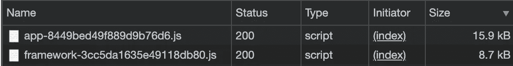

# 如何通过启用 Preact 支持来缩减 Gatsby 包的大小

> 原文：<https://javascript.plainenglish.io/gatsby-preact-bfe5543bf27b?source=collection_archive---------8----------------------->

## 无需重写您的代码库


Source: the author

我们知道 React.js 不是免费的——它附带了许多千字节的包大小。然而，也有 Preact，把 React.js 放在严格的饮食上。

虽然许多人仍然不承认 Preact 的潜力，但我承认了。我将一些页面从 React 转移到 Preact，无需重写代码，从而节省了 50 到 100 千字节的包大小。

这里是如何让你的盖茨比大小使用 Preact 而不是 react。

首先，我们需要安装插件:

```
npm install gatsby-plugin-preact preact preact-render-to-string
```

然后，我们得到了 Preact 在船上。是时候告诉盖茨比应该利用它了。

在`gatsby-config.js`中，确保将其添加到插件中。

```
plugins: [`gatsby-plugin-preact`]
```

下次运行应用程序时，将使用 Preact。只要你不需要 React-exclusive 特性，Preact 没有提供，你就不需要重写任何东西。无论是功能组件还是基于类的组件，使用或不使用钩子，Preact 都能帮你搞定。

想看看例子吗？

在构建和提供默认 Gatsby 页面时，我们看到以下大小:



包含 React.js 基础的框架文件和包含我们应用程序背后的逻辑的应用程序文件是最重要的部分。

切换到 Preact 后，同一个页面变得简单多了:



正如您所看到的，我们的页面已经变得非常小了——尽管除了配置文件之外，我们没有对代码基础做任何更改。甚至没有必要改变进口。正如[官方页面](https://github.com/gatsbyjs/gatsby/tree/master/packages/gatsby-plugin-preact)所说:

> 为用 Preact 替换 React 提供插件支持

感谢您的阅读！

关于 Preact & Gatsby 的更多信息:

[](/next-js-preact-f993c95a3f93) [## 想让你的 Next.js App 更快？启用预先支持(方法如下)

### 如何在你的 Next.js 应用上启用 Preact 支持，并几乎免费节省几千字节。

javascript.plainenglish.io](/next-js-preact-f993c95a3f93) [](/astro-next-js-gatsby-3517e0dc884) [## 我使用 Astro、Next.js 和 Gatsby 构建了相同的应用程序——区别如下

### 管束尺寸、结构和特征

javascript.plainenglish.io](/astro-next-js-gatsby-3517e0dc884) 

*更多内容尽在*[***plain English . io***](http://plainenglish.io/)