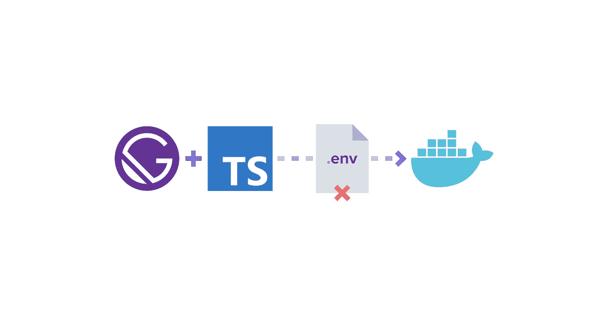
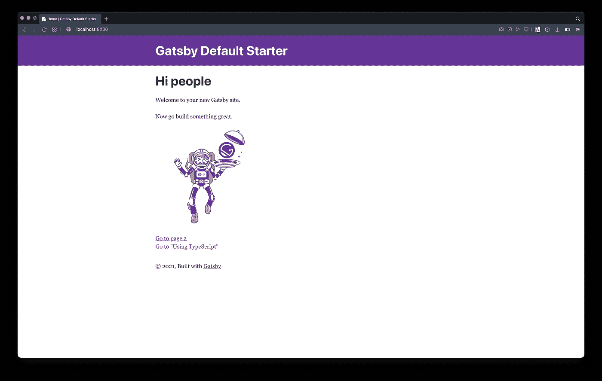
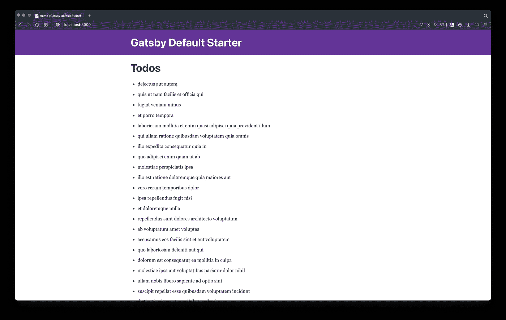
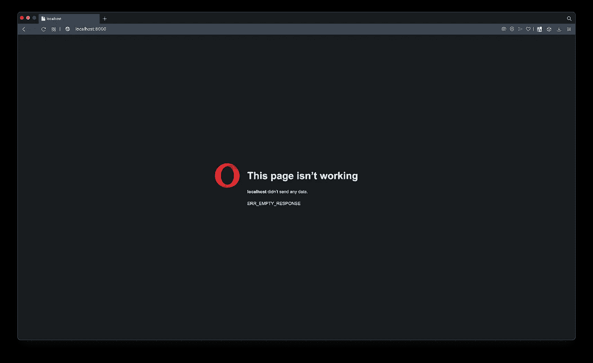
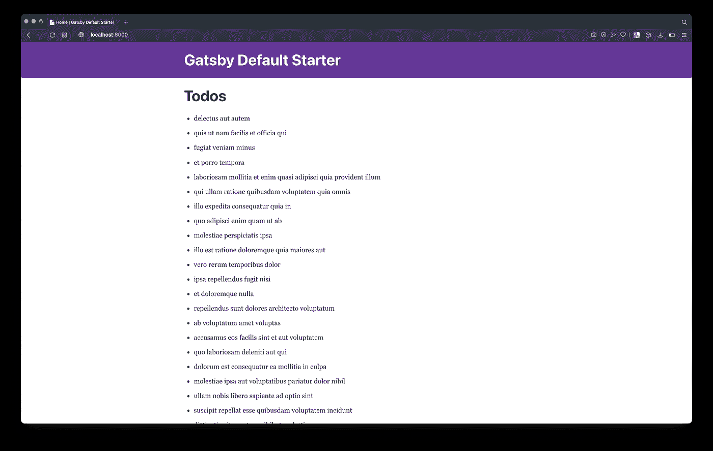

# Gatsby 类型脚本 Docker 环境变量替代

> 原文：<https://javascript.plainenglish.io/gatsby-typescript-docker-env-vars-alternative-fc7e322bc9e?source=collection_archive---------10----------------------->

## 让 TypeScript Gatsby 在 Docker 运行时使用环境变量



Getting TypeScript GatsbyJS To Work With Environment Variables At Docker Run Time

# 这是什么？

如果你还没有看过正规的 GatsbyJS 版本的问题和解决方案，我推荐你去看看原文。

[](https://codingwithmanny.medium.com/gatsby-docker-env-vars-alternative-e81802281999) [## Gatsby Docker 环境变量替代

### 让 GatsbyJS 在 Docker 运行时使用环境变量

codingwithmanny.medium.com](https://codingwithmanny.medium.com/gatsby-docker-env-vars-alternative-e81802281999) 

本文将特别关注设置相同的环境，但是具有 **TypeScript** 支持。

# 设置我们的 TypeScript 项目

使用 Gatsby CLI，我们将创建一个新项目。

```
gatsby new gatsby-ts-env-vars;
cd gatsby-ts-env-vars;
yarn develop;
```

一旦我们的项目设置好了，让我们添加必要的依赖项。

```
yarn add typescript gatsby-plugin-typescript;
yarn add -D [@types/react-helmet](http://twitter.com/types/react-helmet);
```

现在我们将配置 Gatsby 来支持 TypeScript。

**文件:**

```
module.exports = {
  siteMetadata: {
    title: `Gatsby Default Starter`,
    description: `Kick off your next, great Gatsby project with this default starter. This barebones starter ships with the main Gatsby configuration files you might need.`,
    author: `[@gatsbyjs](http://twitter.com/gatsbyjs)`,
  },
  plugins: [
 **`gatsby-plugin-typescript`,** // ... rest of code
```

现在我们已经安装了 TypeScript，让我们运行一个初始 init 来生成`tsconfig.json`文件。

```
./node_modules/.bin/tsc --init
```

我们需要对`tsconfig.json`文件做一个调整。

```
// "checkJs": true,
**"jsx": "preserve",**
// "declaration": true,
```

接下来，我们将所有文件更改为`tsx`文件。

```
/src/components/header.tsx
/src/components/layout.tsx
/src/components/seo.tsx
/src/pages/404.tsx
/src/pages/index.tsx
/src/pages/page-2.tsx
```

以及我们需要添加和调整的所有类型。

**文件:** `src/components/header.tsx`

```
import * as React from "react"
import PropTypes from "prop-types"
import { Link } from "gatsby"const Header = ({ siteTitle }**: { siteTitle: string }) => (**
```

**文件:**

```
/**
 * Layout component that queries for data
 * with Gatsby's useStaticQuery component
 *
 * See: [https://www.gatsbyjs.com/docs/use-static-query/](https://www.gatsbyjs.com/docs/use-static-query/)
 */import * as React from "react"
import PropTypes from "prop-types"
import { useStaticQuery, graphql } from "gatsby"import Header from "./header"
import "./layout.css"const Layout = ({ children }**: { children?: React.ReactNode}**) => {
```

**文件:**文件:`src/components/seo.tsx`

```
import * as React from "react"
import PropTypes from "prop-types"
import { Helmet } from "react-helmet"
import { useStaticQuery, graphql } from "gatsby"**interface SEOTypes {
  description?: string;
  lang?: string;
  meta?: [{
    name: string; 
    content: any; 
    property?: undefined;
  }],
  title?: string;
}**function SEO({ description, lang, meta, title }**: SEOTypes**) {

// ...return (
    <Helmet
      htmlAttributes={{
        lang,
      }}
      title={title}
 **titleTemplate={defaultTitle ? `%s | ${defaultTitle}` : ''}**
      meta={[
        {
          name: `description`,
          content: metaDescription,
        },
        {
          property: `og:title`,
          content: title,
        },
        {
          property: `og:description`,
          content: metaDescription,
        },
        {
          property: `og:type`,
          content: `website`,
        },
        {
          name: `twitter:card`,
          content: `summary`,
        },
        {
          name: `twitter:creator`,
          content: site.siteMetadata?.author || ``,
        },
        {
          name: `twitter:title`,
          content: title,
        },
        {
          name: `twitter:description`,
          content: metaDescription,
        },
      ].concat(**meta || []**)}
```

**文件:**

```
// Lowercase
 **formats={["auto", "webp", "avif"]}**
```

如果一切正常，我们应该能够执行`yarn develop`并看到以下内容:



Our local development environment working with TypeScript

# 创建我们的基础项目

现在我们已经有了 TypeScript 设置，让我们创建项目所需的基本文件，使事情类似于这个 Gatsby 环境变量文章的[非类型脚本版本。](https://codingwithmanny.medium.com/gatsby-docker-env-vars-alternative-e81802281999)

创建我们的环境变量文件:

```
mkdir static;
echo 'window.GATSBY_API_URL="[https://jsonplaceholder.typicode.com](https://jsonplaceholder.typicode.com)"' > static/env.js;
```

瞒着 g it

**文件:**

```
# dotenv environment variable files
.env*
static/env.js
```

**文件:**

```
import * as React from "react"import Layout from "../components/layout"
import SEO from "../components/seo"const IndexPage = () => {
 **const [todos, setTodos] = React.useState<[{
  title?: string}] | undefined>()** **React.useEffect(() => {
    fetch(`${window.GATSBY_API_URL}/todos`)
      .then(response => response.json())
      .then(json => setTodos(json))
  }, [])** return (
    <Layout>
      <SEO title="Home" />
 **<h1>Todos</h1>
      {todos && todos.length > 0 && (
        <ul>
          {todos.map((todo, key) => (
            <li key={`todo-${key}`}>{todo?.title}</li>
          ))}
        </ul>
      )}**
    </Layout>
  )
}export default IndexPage
```

增加对自定义`window`类型的支持。

```
mkdir src/types;
touch src/types/window.d.ts;
```

**文件:**

```
**interface Window {
  GATSBY_API_URL: string;
}**
```

复制添加我们的`env.js`文件所需的`html.js`文件。

```
cp .cache/default-html.js src/html.js
```

**文件:**

```
import React from "react"
import PropTypes from "prop-types"export default function HTML(props) {
  return (
    <html {...props.htmlAttributes}>
      <head>
        <meta charSet="utf-8" />
        <meta httpEquiv="x-ua-compatible" content="ie=edge" />
        <meta
          name="viewport"
          content="width=device-width, initial-scale=1, shrink-to-fit=no"
        />
 **<script src="/env.js"></script>**
```

如果我们运行`yarn develop`，我们现在可以看到事情正在进行。



Application working with our env.js file

# Docker 构建解决方案

下一步是用 docker 和所需的配置文件进行设置。

## 问题回顾

在上一篇文章中，我们检查了通过 docker 传递环境变量(最初设置 Gatsby 的方式)是不可行的，因为当我们运行 Docker 映像时，在 Gatsby 构建完成之前它不会工作。



Gatsby Docker still building

## 解决办法

我们将修改/添加 3 个文件。

```
mkdir docker;
touch docker/entrypoint.sh;
touch .dockerignore;
touch Dockerfile;
```

**文件:**

```
# SET DEFAULT ENV IF NOT SET
export GATSBY_API_URL="${GATSBY_API_URL:=unknown}";# CHECK IF FILES IS NOT CREATED, ELSE CREATE
cd /usr/share/nginx/html;if [ ! -f env.js ];
then
    echo "window.GATSBY_API_URL='$GATSBY_API_URL';" > env.js
fi;#̶ ̶B̶U̶I̶L̶D̶ ̶P̶R̶O̶J̶E̶C̶T̶
y̶a̶r̶n̶ ̶b̶u̶i̶l̶d̶;̶# KEEP NGINX DAEMON RUNNING
nginx -g 'daemon off;'; nginx -s reload;
```

**2021 年 7 月 9 日更新:**

感谢[埃塞基耶尔·冈萨雷斯·里亚尔](https://medium.com/u/91dfd1332931?source=post_page-----fc7e322bc9e--------------------------------)注意到`yarn build`不应该在这个文件中，并且在运行映像时会给出一个错误。这是因为在下面的`Dockerfile`中，我将该过程分为两步，构建和服务构建，其中不包含也不会识别第二步中`entrypoint.sh`中的`yarn build`。

```
/usr/local/bin/entrypoint.sh: line 13: yarn: not found
```

文章现在继续。

**文件:**

```
node_modules/
*/node_modules/
.git
public
.cache
package-lock.json
.env
static/env.js
```

**文件:**

```
# BUILD PROCESS
FROM node:12.18.4-alpine as build-stageRUN apk update; \
    apk add libpng-dev; \
    apk add autoconf; \
    apk add automake; \
    apk add make; \
    apk add g++; \
    apk add libtool; \
    apk add nasm;WORKDIR /usr/src/appCOPY package.json yarn.lock /usr/src/app/RUN yarn install --non-interactive --frozen-lockfileCOPY . ./RUN yarn run build --verbose# BUILT APP
FROM nginx:1.15.4-alpineWORKDIR /usr/share/nginx/htmlCOPY --from=build-stage /usr/src/app/public /usr/share/nginx/htmlCOPY $PWD/docker/entrypoint.sh /usr/local/binRUN chmod +x /usr/local/bin/entrypoint.shENTRYPOINT ["/bin/sh", "/usr/local/bin/entrypoint.sh"]EXPOSE 80CMD ["/bin/sh", "-c", "exec nginx -g 'daemon off;';"]
```

配置完成后，我们将构建它。

```
docker build . -t gatsby-building-ts
```

然后，当我们传递环境变量并运行图像时:

```
docker run -it -d -p 8000:80 -e GATSBY_API_URL=[https://jsonplaceholder.typicode.com](https://jsonplaceholder.typicode.com) --name gatsby gatsby-building-ts;
```



Docker environment variables being passed at run time

**项目资源库:**如果您有兴趣查看代码，您可以在这里获得所有内容。

[](https://github.com/codingwithmanny/gatsby-env-vars/tree/main) [## coding with Manny/Gatsby-env-vars

### 在 GitHub 上创建一个帐户，为 codingwithmanny/Gatsby-env-vars 的开发做出贡献。

github.com](https://github.com/codingwithmanny/gatsby-env-vars/tree/main) 

# 最后

下一步将是制作一个更真实的例子/实现，让它与 ***Auth0*** 一起工作。我应该很快就会写这篇文章了。

如果你从中获得了价值，请在 twitter 上分享🐦或者其他社交媒体平台。再次感谢您的阅读。🙏

也请在推特上关注我: [@codingwithmanny](http://twitter.com/codingwithmanny) 和 insta gram at[@ codingwithmanny](https://instagram.com/codingwithmanny)。

**延伸阅读:**

[](https://codingwithmanny.medium.com/gatsby-docker-env-vars-alternative-e81802281999) [## Gatsby Docker 环境变量替代

### 让 GatsbyJS 在 Docker 运行时使用环境变量

codingwithmanny.medium.com](https://codingwithmanny.medium.com/gatsby-docker-env-vars-alternative-e81802281999) [](https://codingwithmanny.medium.com/nodejs-typescript-docker-deployment-process-with-aws-ebs-14796cd78392) [## 使用 AWS EBS 的 NodeJS 类型脚本 Docker 部署流程

### 如何打包 NodeJS TypeScript 应用程序，将 Docker 映像构建并部署到 AWS Elastic Beanstalk

codingwithmanny.medium.com](https://codingwithmanny.medium.com/nodejs-typescript-docker-deployment-process-with-aws-ebs-14796cd78392) [](https://codingwithmanny.medium.com/automating-nodejs-ts-deployments-with-codepipeline-to-elastic-beanstalk-79664321ab91) [## 通过到 Elastic Beanstalk 的代码管道自动化节点 TS 部署

### 使用 AWS CodePipeline 到 Elastic Beanstalk Docker 设置连续部署

codingwithmanny.medium.com](https://codingwithmanny.medium.com/automating-nodejs-ts-deployments-with-codepipeline-to-elastic-beanstalk-79664321ab91)