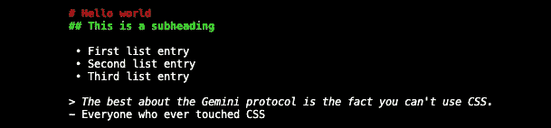

# 为轻量级互联网 Gemini 协议构建 Node.js 服务器

> 原文：<https://javascript.plainenglish.io/gemini-node-js-f5bff65e9dc1?source=collection_archive---------6----------------------->

## Java Script 语言

## 听说过双子座吗？这是它的工作原理


Source: the author

双子座协议？如果你从未听说过它，不要担心——很多人都不知道它。双子座协议建立在我们对互联网的不满之上，由 HTTP 协议驱动。

是的，我称之为双子座——一个协议。它不是网络的子集——它运行在自己的协议上，不能用普通的浏览器访问。
但是为什么呢？

双子座的目标不是取代我们所知道的互联网。在网络的目标差异中，Gemini 具有:

*   更多的隐私和安全。该协议要求使用 TLS 进行加密。不支持会导致隐私问题的复杂数据类型，如 CSS 或图像文件。CSS 是隐私问题？是的，这里是如何使用 CSS 进行[用户跟踪。](/tracking-with-css-ec98e3d81046)
*   客户端没有 JavaScript 这样的脚本。
*   最低限度的协议。目的是每个人都可以在这个互联网上建立一个存在，而不需要整个团队。例如，不可能进行缓存或压缩。客户机中的页面加载速度极快，即使在旧机器上也是如此。
*   页面的最小基础——带有最小标记的 Gemini 文件类型。

让我们用 Node.js 托管一个双子页面吧！我不会深入探究双子座独有的功能，因为我自己也是新手。

# 但是首先，安装一个 Gemini 客户端

我推荐使用 Amfora 作为客户端——至少我知道它在工作。在 macOS 上，可以用`brew install amfora`安装。对于其他平台，请查看 [GitHub repo](https://github.com/makeworld-the-better-one/amfora) 。对于其他受支持的客户端，请查看此[官方列表](https://gemini.circumlunar.space/software/)。

如果你不想永久安装任何东西，有一个可用的、第三方免费的 [Python 客户端](https://tildegit.org/solderpunk/gemini-demo-1/src/branch/master/gemini-demo.py)，大约 100 行代码。只需复制文件并用 Python 运行即可。

# 构建我们的服务器

构建 Gemini 协议服务器有很多服务器库。甚至还有一个针对 Node.js 的，更确切的说是针对 Express.js 的。

我们可以用`npm install gemini-server`安装。

在编写代码之前，我们需要为加密生成一个证书。您还记得，我说过 Gemini 强制使用 TLS 加密。生成证书很容易。OpenSSL 应该默认安装在 Linux 和 macOS 上。这里有一个关于如何在 Windows 上安装的[指南](https://www.cloudinsidr.com/content/how-to-install-the-most-recent-version-of-openssl-on-windows-10-in-64-bit/)。

一旦 OpenSSL 安装在您的机器上，运行:

```
openssl req -x509 -newkey rsa:4096 -keyout key.pem -out cert.pem -days 365 -nodes -subj '/CN=localhost'
```

然后，您应该有两个证书文件。让我们创建我们的 Express 服务器。

如您所见，服务器提供了一个名为`test.gemini`的文件——为了测试，我们需要创建一个。所谓的 Gemtext 非常简单。下面是一个包含标题、列表和斜体引用的小示例:

```
# Hello world
## This is a subheading* First list entry
* Second list entry
* Third list entry> The best about the Gemini protocol is the fact you can’t use CSS.
- Everyone who ever touched CSS
```

当您将 Gemtext 保存为`test.gemini`时，您就可以运行您的服务器了。不，我们不需要在`app.listen`函数中提供端口——默认情况下，服务器将运行在 Gemini 端口上。

跑`node <your-server-file>.js` —让我们看看我们的网站！

现在，启动您的 Gemini 客户端。如果你像我一样，使用 Amfora，在终端运行`amfora`打开它。一旦启动，只需按空格键并输入以下网址:`gemini://localhost/`

显然，我们在其他 Gemini 客户端中使用相同的 URL。在我推荐的 Python 客户端中，可以即时输入网址。

然后，页面应该会显示出来。在我的终端中，它看起来是这样的:



构建一个双子页面就是这么简单！如果你想主办它，它不会变得更加困难。因为可以通过域访问任何服务器端口，所以可以通过现有的域托管 Gemini 页面。我发现 Gemini 网站上的许多页面都是使用相同域名的普通互联网页面的副本。由于托管了两个 Express 实例，您可以轻松地在两个互联网中构建页面。

*更多内容请看*[***plain English . io***](http://plainenglish.io/)