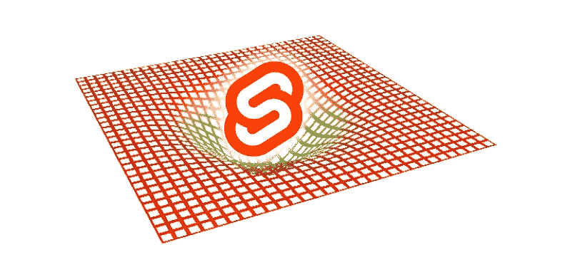
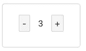
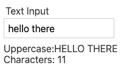
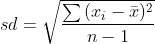
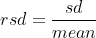
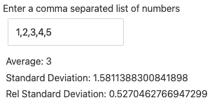
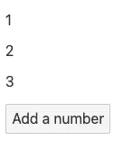
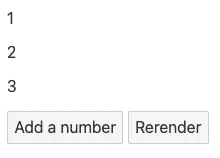

# 苗条反应性的一般理论

> 原文：<https://javascript.plainenglish.io/general-theory-of-svelte-reactivity-3e7ea51e0364?source=collection_archive---------3----------------------->



苗条使增加组件的反应几乎毫不费力。它提供了一个易于使用的语法，抽象了很多复杂性。在这篇文章中，我们将通过几个例子来讨论一些你在苗条时可能会遇到的陷阱。我们不深入研究，但主要关注实用的技巧和指针。

要想快速入门，我们就用 Svelte 团队提供的启动器吧。转到您的终端，运行下面的命令。打开你的浏览器，进入`[http://localhost:5000](http://localhost:5000)`，你应该会在屏幕上看到“HELLO WORLD”。

```
npx degit [sveltejs/template](https://github.com/sveltejs/template) my-svelte-project
cd my-svelte-project
npm install
npm run dev
```

接下来，导航到`src/App.svelte`并删除除了`<main>`标签之外的所有内容。保存后，服务器应该会自动更新页面，您现在应该会看到一个空白页。现在，我们准备好了！

# 默认情况下，分配的变量是被动的

首先，让我们创建一个带有递增和递减控件的简单计数器。

在`src`目录中，创建一个名为`components`的新目录，并在这个目录中创建一个名为`Counter.svelte`的新文件。`Counter.svelte`的代码如下所示。

将`Counter`组件导入到`App.svelte`并实例化它以查看结果。

```
<script>
  import Counter from './components/Counter.svelte';
</script><main>
  <Counter />
</main>
```

它应该看起来像这样。



Counter.svelte rendered on screen

单击增量或减量按钮会立即导致更新。在底层，Svelte 保持 DOM 与应用程序状态同步，并在变量的值改变时更新组件的值。

> 通常，对于赋值变量，您不需要任何额外的设置来使它们反应。直接更改变量值将自动导致更新。值得注意的是，这些必须是顶级变量(想想那些特定的瘦组件的“全局”范围的变量)。

# 结合反应性

在前面的示例中，我们通过使用 click 事件来更改变量的值，从而触发了一次更新。同样的技术可以用来触发输入元素的更新。然而，Svelte 提供了一个更符合习惯的选择。对于大多数输入元素，我们可以使用 Svelte 的`bind`指令将输入的值绑定到变量。每当输入值发生变化时，这有效地更新了变量的状态。

让我们创建一个简单的例子。在`src/components`中创建名为`Input.svelte`的新组件。该组件的代码片段可以在下面找到。

类似于我们如何实现**计数器**组件，在`App.svelte`中导入**输入**组件并实例化它。

```
<script>
  import Counter from './components/Counter.svelte';
  import Input from './components/Input.svelte';
</script><main><Input />
</main>
```

输出应该如下所示。



Input.svelte rendered on screen

您可能已经注意到，我们还添加了一些操作`textValue`的字符串方法。每当`textValue`的值改变时，作用于它的方法也会被调用。

> 当处理输入元素时，Svelte 的`bind`指令使得将变量绑定到输入值变得很容易。对输入的任何更改都会自动更新变量，反之亦然。

作为下一节的介绍，让我们打破**输入**组件。将以下更改添加到 **Input.svelte** 中。

```
// Within the <script> section add the following.let charCount = textValue.length;// Replace Characters: {textValue.length} withCharacters: {charCount}
```

再次测试应用程序。请注意，字符数不再更新。怎么回事？`charCount`不是应该自动更新到等于`textValue`的长度吗？当把一个变量赋给另一个变量时，反应性似乎不会传播。不过不要担心，Svelte 给了我们一种方法来实现这一点，我们将在下一节讨论这一点。

# 被动声明

在一个坚果壳中，**反应声明**，允许你声明变量，当一个值或它们引用的另一个变量改变时，这些变量将自动更新。

让我们通过修复前面的坏例子来看看这一点。简单的把`let`改成`$:`，这是声明一个反应变量的语句。再次测试组件以检查其是否工作。

```
$: charCount = textValue.length;
```

`$:`是由 Svelte 提供的一个抽象，使得实现值和逻辑的自动重新计算更加容易。因为 Svelte 编译成 JavaScript，所以性能几乎不会下降。

**反应声明**在处理依赖于其他变量的变量的计算时非常有用。为了说明这一点，让我们实现一个简单的计算器，它基于一组数字计算*相对标准偏差*。*相对标准偏差*通常用于测量数据的分散或扩散。它基本上是标准差(sd)与平均值(mean)的比值；你可以在这里找到更多信息。*标准差(sd)* 和*相对标准差(rsd)* 的公式如下所示。



standard deviation formula



relative standard deviation formula

在`src/components`中创建一个名为`RelativeStandardDeviation.svelte`的新组件，并复制下面的代码。

完成后，将其导入`App.svelte`并实例化。

```
<script>
  import RelativeStandardDeviation from './components/RelativeStandardDeviation.svelte';
</script><main>
  <RelativeStandardDeviation />
</main>
```

输出应该如下所示。



RelativeStandardDeviation.svelte rendered on screen

是时候简单解释一下了。我们创建两个函数，一个用于计算平均值*和一个用于计算标准偏差*。接下来，我们创建一个文本输入，它接受一串逗号分隔的数字。因为输入的值是一个字符串，我们需要把它转换成一个数字数组。我们通过将字符串拆分成一个数组并映射到每个值上，将每个值转换成一个数字来实现这一点。这个数组是用来执行计算的。可以通过限制输入只接受逗号分隔的数字来改进该组件，但这超出了本例的范围。

我们实际看到反应性声明的部分如下所示。

```
$: mean = getMean(numericArray);  
$: stdev = getStandardDeviation(numericArray);  
$: relstdev = stdev / mean;
```

`mean`和`stdev`都依赖于`numericArray`，T5 是从字符串转换成数字数组的数字输入。每当`numericArray`改变时，`mean`和`stdev`会自动重新计算。此外，因为`relstdev`也依赖于`mean`和`stdev`，其值也自动更新。

> 当您需要使声明具有反应性，并且每次它引用的变量值改变时都需要更新它的值时，请使用`$:`。

在前面的段落中，我明确说明了“声明”而不是“变量”。这是因为**反应声明**不仅仅处理变量，它们也处理语句。如果需要，您可以激活`console.log`或`if`模块。在这方面，它们比`let`更通用，尽管`let`也给了你某种形式的反应能力。

如果是这样的话，那么什么时候应该使用`let`，什么时候应该使用**反应声明**？以我个人的经验，你大概可以用**反应式声明**代替`let`。我经常发现自己从`let`开始，如果那不起作用，我就转而使用**反应声明**。

# 增加阵列的反应性

向阵列添加反应性可能与我们到目前为止讨论的略有不同。让我们创建一个简单的例子来说明这一点。

在`src/components`中创建一个名为`NumberArray.svelte`的新组件，复制下面的代码。

完成后，将其导入到`App.svelte`并实例化。

```
<script>
  import NumberArray from './components/NumberArray.svelte';</script><main>
    <NumberArray />
</main>
```

结果应该是这样的。



NumberArray.svelte rendered on screen

试着点击“添加一个数字”按钮，观察它没有做任何事情；至少屏幕上没有。

根据文档，Svelte 的反应是由赋值触发的，这意味着使用像`push`或`pop`这样的数组方法不会导致自动更新，即使它们在内部改变了数据。您可以通过检查控制台来验证这一点，以查看阵列是否确实被填充。当组件的底层数组数据发生变化时，有几种方法可以使组件更新，下面我们将讨论其中的一些方法。

**重新分配给自己**

第一种方法是将数组重新分配给它自己，尽管这种方法有些多余。编辑前面的示例，使其看起来像下面的代码。

如前所述，反应性是由分配触发的，因此基本上是将数组重新分配给它自己来更新组件。

**使用扩展运算符**

您还可以使用 spread 操作符(…)来实现同样的目的，但方式更为惯用。

试一试，你会得到和之前一样的结果。

阵列的反应性也遵循一般规则，即引用的变量必须是顶级变量。换句话说，我们在更新状态的函数调用中触发了副作用。有太多的副作用会使代码难以维护。幸运的是，Svelte 通过对每个组件的状态进行限定，使得这一点易于管理，如果您需要共享状态，您可以随时使用`stores`。

在我们结束这一部分之前，我想讨论一个你可能会遇到的常见的 footgun。在某些情况下，您可能希望将参数传递给用于更新状态的函数。您可以通过在匿名函数中调用 update 函数来实现这一点。让我们用当前的例子来证明这一点。

在`src/components`中创建一个名为`NumberArrayAsParameter.svelte`的新组件，并复制下面的代码。将此导入到`App.svelte`并实例化组件。

结果应该类似于前面的例子。您可能希望这样做，查看浏览器控制台，可以看到我们确实在更新阵列。那么，为什么我们没有看到更新呢？

在 JavaScript 中，传递给函数的数组是通过“引用”来传递的，更准确地说，它们是作为“引用的副本”来传递的，这一微小的区别造成了巨大的差异。因为我们得到了数组的一个副本，所以我们得到了值，并可以在函数范围内随意改变它。但是，这不会影响原始数组，因为原始数组保持不变。

我们可以通过在功能块中包含重新分配来轻松解决这个问题。编辑`addNumber`函数，看起来像下面的代码。

```
const addNumber = (*arr*) => {
  arr.push(arr.length + 1);
  console.log(arr);
  numbers = numbers;
}
```

当您遇到这类问题时，这种问题可能在您跟踪大量状态时发生，一种简单的故障排除方法是添加一个反应性的`console.log`语句来跟踪对原始数组的更改。对于我们当前的例子，您可以尝试将它添加到数组声明的正下方。只有当`numbers`的值改变时，该函数才会被调用。

```
$: console.log(numbers);
```

**重新渲染组件**

另一种强制数组更新的方法是重新渲染数组。实现这一点的最简单的方法之一是暂时从 DOM 中删除组件，然后在以后的某个时间返回它。在下面的例子中，我们添加了一个名为`isVisible`的布尔值，它在短暂的延迟后从`false`切换回`true`。这足以使组件使用新值重新呈现。

为了测试它，在`src`中创建一个名为`NumberArrayRerender.svelte`的新组件，并复制下面的代码。将组件导入到`App.svelte`，并实例化它以查看输出。

它应该看起来像这样。



NumberArrayRerender.svelte rendered on screen

如果您不想在每次点击时自动更新状态，并希望推迟更新，这可能会很有用。

> 综上所述，在处理数组(或对象)时，直接对数组进行变异会改变值，但不会更新组件。要触发更新，您需要执行分配/重新分配。

# 反应越快，责任越大

苗条使增加组件的反应变得非常简单。因为它有时太容易了，很容易忘记基础知识并遇到问题。在这篇文章中，我们讨论了一些在苗条身材中实现反应的方法，以及如何推理它们。虽然我们在这篇文章中讨论了很多话题，但主要思想可以总结为下面的陈述。

> 顶级变量的赋值和突变是理解 Svelte 反应模型的核心。为了触发更新，您可以直接更改顶级变量的值，或者在数组或对象的情况下，在更改它们的值后执行重新分配。Svelte 还提供了其他易于使用的抽象，如 **bind** **directive** 和 **reactive declarations** ，为您同步组件和应用程序状态。

感谢您的阅读，并希望您在您的苗条之旅中度过愉快的时光。

你可以在 https://github.com/kinxiel/general_theory_svelte_reactivity[找到例子的源代码。](https://github.com/kinxiel/general_theory_svelte_reactivity)

*更多内容请看*[***plain English . io***](http://plainenglish.io)