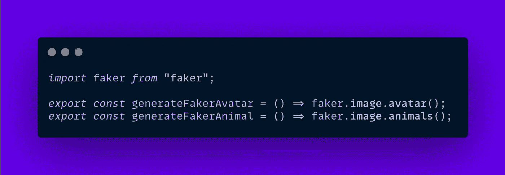
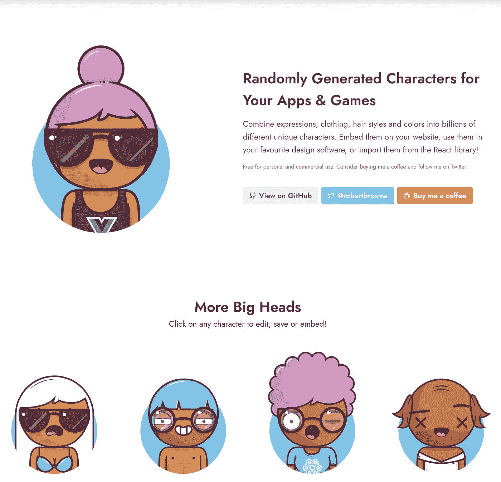
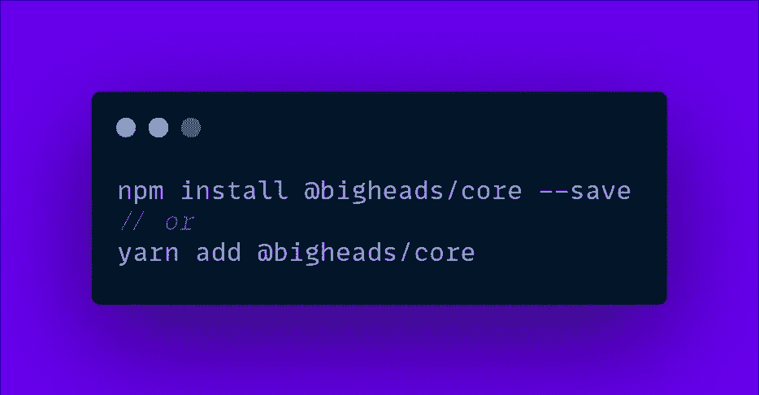
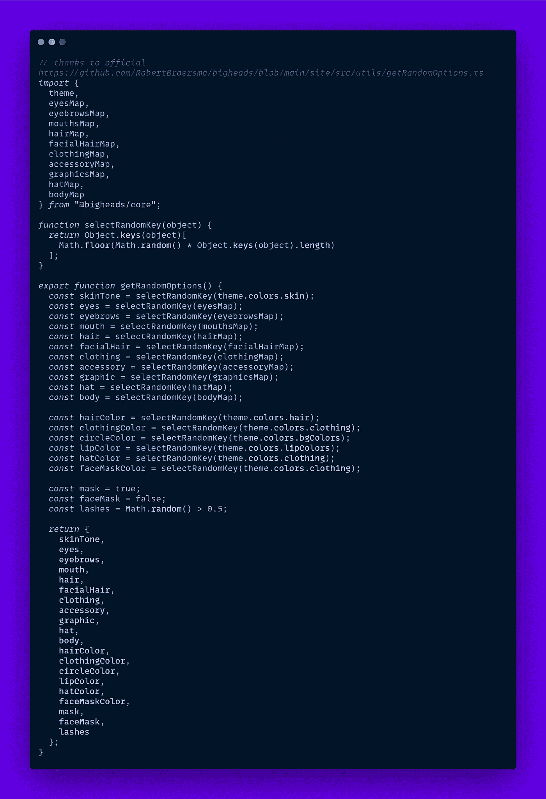
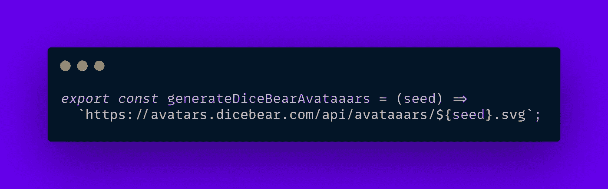
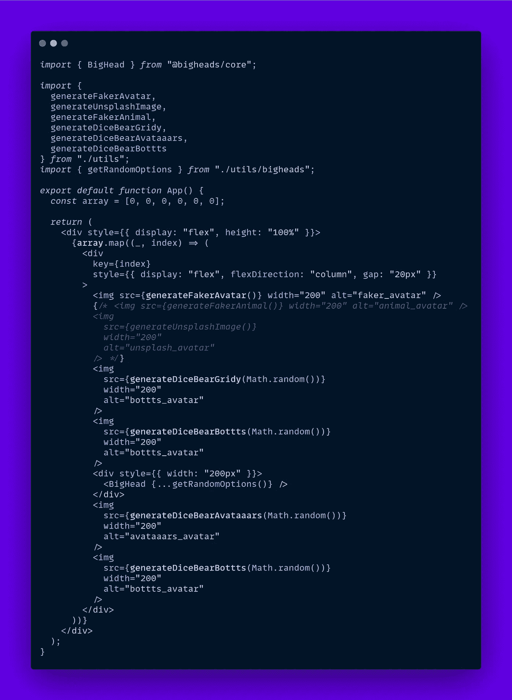

# 在 React 中生成随机头像

> 原文：<https://javascript.plainenglish.io/generate-random-avatars-in-react-8d4ac3072b93?source=collection_archive---------1----------------------->

## 时髦而复杂的随机化身生成 API

谁不喜欢模拟数据生成器呢？像 [Mockapi](https://mockapi.io/) 或者最近诞生了 [FakerCloud](https://fakercloud.com/) 的空前热门的 Faker 开源库这样的工具。

这些平台提供了生成许多 API 属性的方法，从简单的电子邮件或用户名到复杂的密码和地理坐标。

今天我将展示一些流行的 APIs 库来为你的下一个 React 项目生成头像图像。

# 1.[骗子](https://github.com/marak/Faker.js/)(走了)

> 最近**马拉克****Faker**&**Faker cloud**的作者/主要贡献者变得不守规矩，并且**将**的软件库全部移除。我在本文 **中更深入地讲述了这个故事。**

可能是最大的模拟数据生成库，支持从 PHP 到 JS 和 Python 的许多语言，它的 API 覆盖了所有可能的用例，包括动物或化身的图像。

让我们安装 faker JS 包:

生成这样的头像图像非常简单:

# 2. [Unsplash](https://unsplash.com/)

Unsplash 是一个令人惊叹的平台，展示了美丽的，免费使用的图像，我们可以在设计模型甚至最终产品中使用，当然这取决于给定的许可证。

我们还可以使用 [Unsplash Source API](https://source.unsplash.com/) 来完成基本任务，比如获取某个用户的图像，或者通过某个适合我们这个简单例子的查询。

如果你对官方的 Unsplash API 感兴趣，它可以完全控制平台管理的更多数据，你可以在这里注册成为开发者。

# 3.[大头头](https://bigheads.io/)

前面的两个例子带来了真实世界的头像，但是如果我们想要一个卡通风格的头像呢？

这里出现了具有风格化卡通外观的大头和许多生成时髦头的变体，唯一的缺点是缺乏直接随机的 API(或者至少我找不到一个)。

我们像往常一样安装库

为了生成随机的头像，我们需要能够混合被大头组件接受的随机属性，谢天谢地，在搜索了一点官方文件后，我设法找到了[这种方法](https://codesandbox.io/s/react-random-avatar-3o1t9?file=/src/utils/bighead.js):

有了它，我们可以像这样`<BigHead {...getRandomOptions()} />`展开道具。

# 4.[双柏头像](https://avatars.dicebear.com/)

如果大头还不够，那么派对的不速之客来了——dice bear。这个令人惊叹的库允许我们以 10 种不同的风格生成随机的头像:像素化的、卡通化的、只有首字母的、甚至是类似艺术的生成。

您可能已经认识到 Avataaars，它本身是另一个库，但是可以通过 DiceBear 随机生成 API 访问。

幸运的是，他们还提供了一个 URL:

最终代码:

如果你想查看这里的代码，请点击 [CodeSandbox](https://codesandbox.io/s/react-random-avatar-3o1t9?file=/src/App.js) 。

> 在 alexstreza.dev 查看我的更多作品。
> 
> 我希望你喜欢这个简短的化身生成器展示，如果你给这篇文章一个👏！

*更多内容请看*[***plain English . io***](http://plainenglish.io/)