# 使用 Node.js 为 web 应用程序生成 SSL 证书

> 原文：<https://javascript.plainenglish.io/generate-ssl-certificate-using-node-js-for-web-apps-73d452ad5898?source=collection_archive---------3----------------------->

## 在这里，您将了解如何使用 openssl 为 web 应用程序进行证书绑定

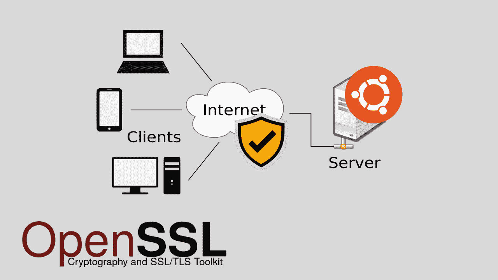

Some random dude on the Internet

嘿，这里的每个人，我会给你们一个关于一个带有 **SSL 证书**的 **Node.js 应用**的基本设置的提示。为此，我们将使用 [**OpenSSL**](https://en.wikipedia.org/wiki/OpenSSL) ，并为该应用程序使用 **Express** 和 **Nodemon** 。

你们一定都知道或者听说过“ [HTTPS](https://en.wikipedia.org/wiki/HTTPS) ”这个术语，是的，这是验证一个网站访问是否安全的东西。但是你有没有想过是什么让它变得安全可靠？？那么，在这里我将指导你如何使你的网站更加安全。这只是给你一个确切的概念，使用这个 OpenSSL 请不要进入生产环境。

在深入研究这个例子之前，让我们先看看一些术语，这样我们就不用每次都用谷歌搜索了。

*   **SSL** →安全套接字层，这是 TLS(传输层安全)的前身，无非是为网络上的安全通信而设计的加密协议。
*   **HTTPS** →超文本传输协议安全是 HTTP 的扩展或混合版本，即它是“HTTP”和“SSL / TLS”的组合，因此一个新协议的诞生被命名为 HTTPS。

好了，少学多做，让我们深入了解一下我们实际计划要做的事情。

这是您需要使用的先决条件:

*   [节点](https://nodejs.org/en/download/)。射流研究…
*   OpenSSL (如果你是 Linux 和 Mac 用户就不用担心这个了)
*   节点[表示](https://www.npmjs.com/package/express)
*   [节点门](https://www.npmjs.com/package/nodemon)
*   [Git](https://git-scm.com/downloads) (仅用于克隆 git repo)

嗯，我已经在 AWS EC2 实例上实现了这一点(我已经在免费层 EC2 实例上实现了这一点),您也可以免费做同样的事情。

为了获得证书，只需遵循以下 3 个步骤:

*   生成私钥
*   使用私钥创建 CSR(证书签名请求)
*   从 CSR 生成 SSL 认证。

是啊，就像看起来那么简单。

对于最佳实践，我们将创建一个文件夹，然后将所有内容放入该文件夹，例如，一旦您将项目克隆到您的本地机器或 EC2 实例中，它应该如下所示。

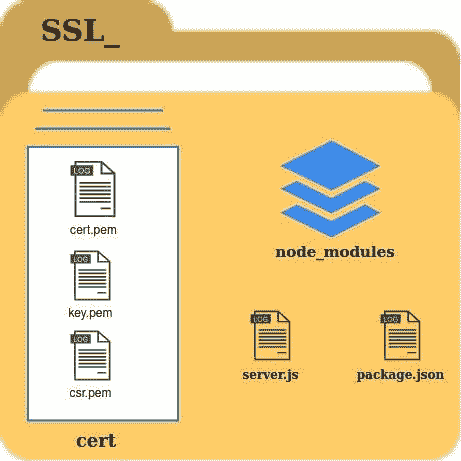

**Credit goes to Narendiran Krishnan itself**

好吧，我请求你们都不要试图使用我的**。pem** 文件，此外，我已经删除了 cert 文件夹中的所有文件，并且 **node_modules** 不会在那里，因为所有的依赖项都将被删除，我们将在这里从头开始创建，您可以使用此结构作为参考。

如果您没有克隆我的 git repo，那么只需创建如下目录:

*   ssl_
*   ssl_ →证书(在 ssl_)内

让我们只关注创建证书和密钥，然后继续讨论 node。

## 第一步:

移动到证书文件夹，然后您需要给出以下命令:

```
**Openssl {generate RSA} {output} {output file name with .pem extension}**
```

代码是:

```
**openssl genrsa -out key.pem**
```

发出该命令后，您应该会看到以下输出:

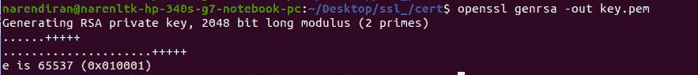

**Generate your RSA**

## **第二步**

在**步骤 1:** 之后，看下面的代码结构

```
**Openssl {new CSR sign in request} -key {that we have just now generated} {keyname} -out {output the certificate signing request} name {name with .pem extension}**
```

现在下一个命令如下:

```
**openssl req -new -key key.pem -out csr.pem**
```

一旦你发出这个命令，你应该看到下面的问题，请给出你的细节，而不是我的:

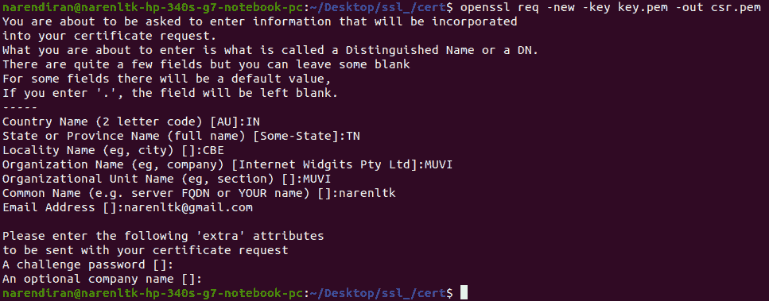

**generating csr.pem**

## 第三步:

一旦完成**步骤 2** ，剩下的工作就是从 CSR 创建一个 SSL 证书，这个证书是使用私钥创建的。

在开始编写代码之前，我们需要理解公钥标准，

*X509 →定义公钥证书的格式，X.509 证书用于许多互联网协议，包括 TLS/SSL，它是浏览网页的安全协议 HTTPS 的基础。它们也用于离线应用，如电子签名。*

现在让我们看看代码结构:

```
**Openssl {public key standards} {request} {number of days certificate will be valid} {pass in certificate signing request file} csr.pem (in our case) {signkey} {key which we generated in step 1} key.pem (in our case) {output} {name of the file with .pem extension}**
```

代码如下所示:

```
**openssl x509 -req -days 365 -in csr.pem -signkey key.pem -out cert.pem**
```

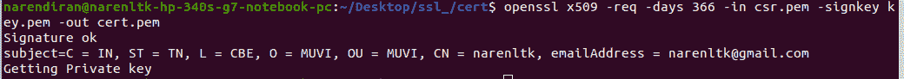

**creating an SSL certificate**

如果你到目前为止没有任何错误，那么你就正确地关注了我的博客。

是的，现在是胜利圈的时候了，因为你已经爬了一半了。

现在剩下的就是创建 Node.js 应用程序，并将其托管在 EC2 服务器实例中。

如果你刚刚克隆了我的 git repo，那么我已经给出了如何在我的 git repo 中运行该应用程序的详细信息，只要遵循它，不要遵循这些说明，因为我在这里是从头开始做事情的。

首先，我们需要在我们的 ssl_ folder 中执行 **npm 初始化**,给出以下命令，并根据您的意愿填写详细信息。

```
**npm init**
```

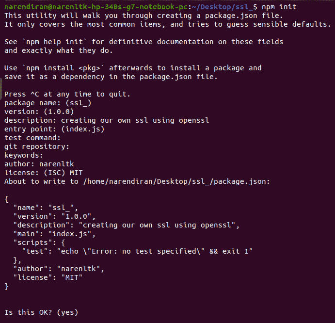

npm init

现在完成后，需要安装依赖项，如 node express 和 nodemon

代码如下。

```
**npm i nodemon express**
```

或者

```
**npm i -g nodemon express**
```

一旦您完成了这些，您需要在已经创建的 package.json 文件中进行如下更改，如下所示:

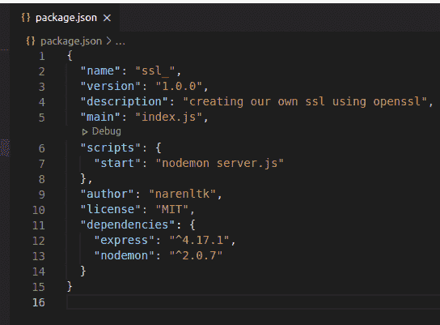

**package.json**

在这里，您可以单独在脚本中进行更改。

一旦你完成了依赖项，我就创建了一个 server.js 文件，如下所示

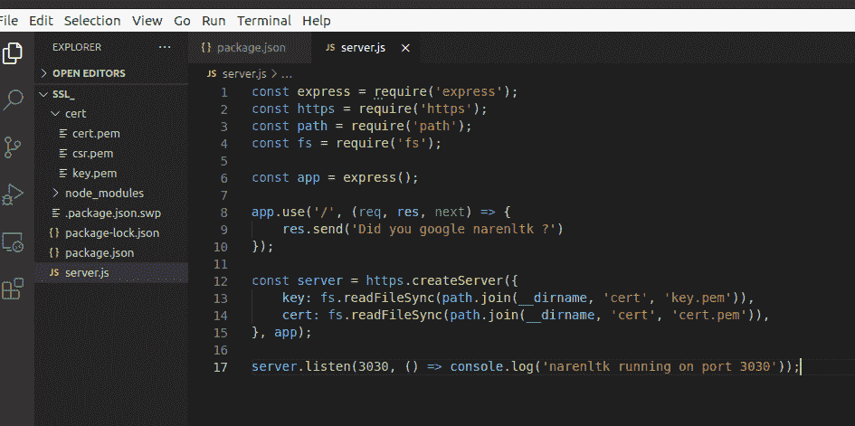

**server.js**

完成代码后，开始在终端中运行代码，如下所示，

代码是

```
**npm start** **or** **nodemon server.js** **or** **node server.js**
```

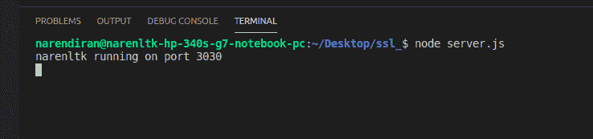

**node server.js**

好吧，它确实停在这里，要验证它，你需要访问本地主机并验证它。

*[***http://localhost:3030***](http://localhost:3030)*

**这将引发以下错误，**

**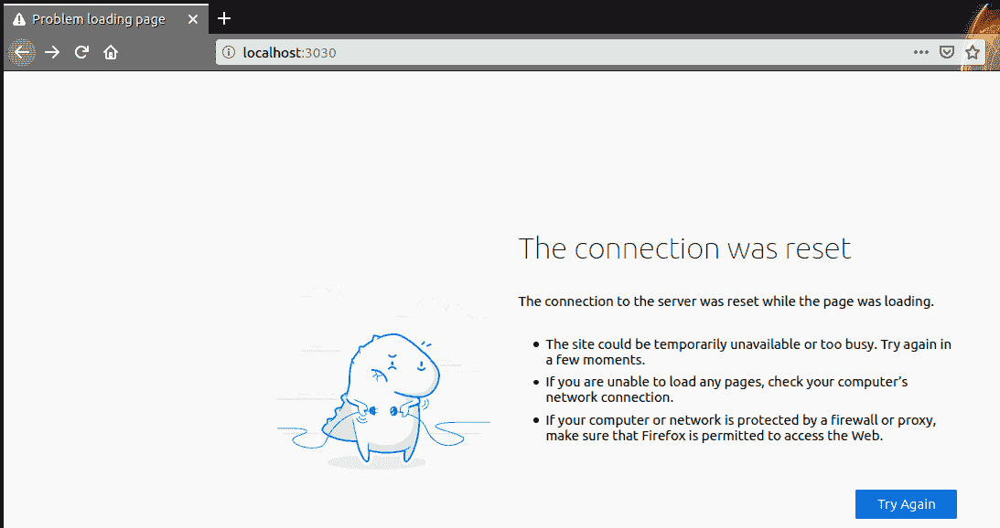**

****error****

**现在用“ [https://localhost:3030](https://localhost:3030) ”做同样的尝试，你会得到下面的错误。**

**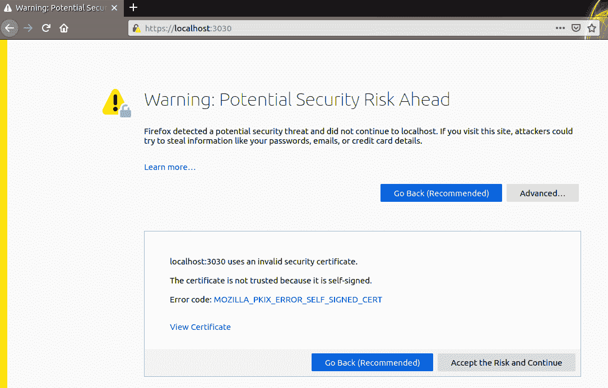**

**[**https://localhost:3030**](https://localhost:3030)**

**在这里你可以看到 Firefox 不允许你这样做，但同时你可以接受风险并继续，或者如果你仍然不满意，你可以查看证书并亲自验证。这将为您提供有效性的详细信息、公钥信息(即算法和密钥大小)以及指纹(即 **SHA-256 & SHA-1** 的详细信息)。**

**一旦您全部接受并继续操作，您将获得以下输出:**

**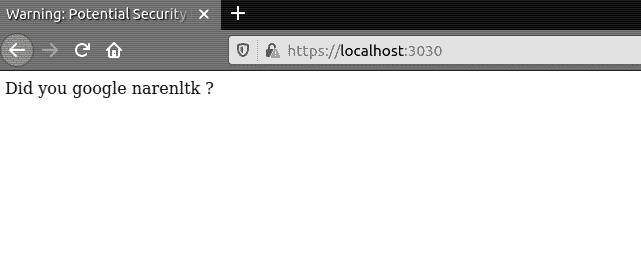**

****google narenltk****

**除此之外，人们很少使用 SSL，也就是说，他们使用 SSL 的地方如下:**

*   **Web 服务器**
*   **应用服务器**
*   **数据库**

**为什么我们要用 SSL 保护上面提到的服务？**

**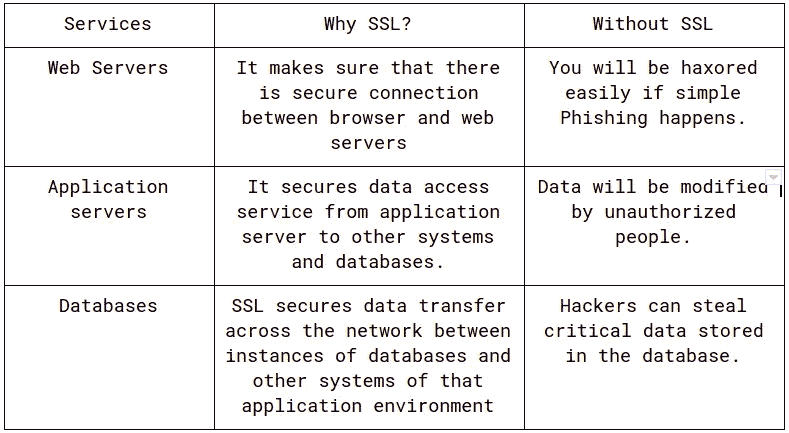**

****with and without ssl comparison****

**这种技术和代码可以在实时生产环境中使用，但是不能使用证书和密钥。我强烈推荐类似 [***亚马逊证书管理员***](https://aws.amazon.com/certificate-manager/) 的东西。**

**如果你想了解使用 opencv4nodejs 的视频流，看看下面的博客:**

**[](https://medium.com/swlh/video-streaming-using-opencv4nodejs-with-node-js-express-and-socket-io-3806abb049a) [## 使用 Opencv4nodejs 和 nodejs、Express 和 Socket IO 进行视频流传输

### 嘿，伙计们，欢迎来到 2021 年，我知道现在祝福大家已经很晚了！！！

medium.com](https://medium.com/swlh/video-streaming-using-opencv4nodejs-with-node-js-express-and-socket-io-3806abb049a) 

GitHub 链接如下:

[](https://github.com/narenltk) [## narenltk -概述

### 骗人的把戏。需要咖啡来提神吗...！！！narenltk 有 10 个可用的存储库。在 GitHub 上关注他们的代码。

github.com](https://github.com/narenltk) 

如果您希望保持联系:

[](https://www.linkedin.com/in/narenltk/) [## Narendiran Krishnan 印度卡纳塔克邦本加卢鲁|职业简介| LinkedIn

### 查看世界上最大的职业社区 LinkedIn 上 Narendiran Krishnan 的个人资料。纳伦德兰有 6 份工作…

www.linkedin.com](https://www.linkedin.com/in/narenltk/) 

你也可以用谷歌搜索“narenltk / narendiran krishnan”或者发邮件到→narenltk@gmail.com→乐意帮忙..！！！**