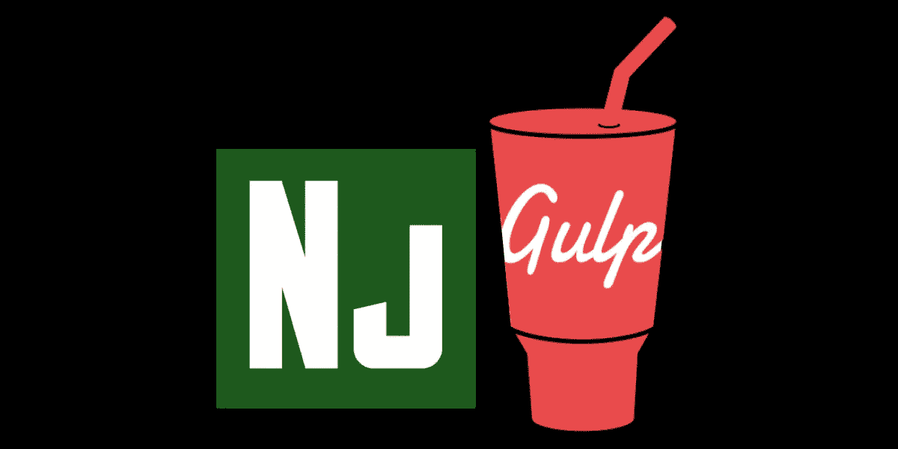

# 使用 Nunjucks 和 Gulp 生成静态站点

> 原文：<https://javascript.plainenglish.io/generate-static-sites-using-nunjucks-and-gulp-298fab58b9e3?source=collection_archive---------3----------------------->



Image created and edited by the Author

[Nunjucks](https://mozilla.github.io/nunjucks/) 是一个强大的 JavaScript 模板引擎。如果你做得正确的话，它的设置是非常简单的，并且它可以成为更复杂框架的一个很好的替代品，比如 [Gatsby](https://www.gatsbyjs.com) 或者 [Next.js](https://nextjs.org) 。作为一名前端开发人员，这对夫妇可以成为你的技术堆栈的一个很好的补充。

凭借每周超过 100 万次的下载量， [Gulp](https://gulpjs.com/) (或 gulp.js)仍然是开发人员中非常受欢迎的选择，使用它自动完成任务的好处数不胜数。

在这篇文章中，让我们回顾一下使用这些伟大的 JavaScript 工具来构建项目、自动化工作流和生成静态站点的步骤。

# 安装核心依赖项

初始化项目后，在 CLI 中运行:

```
*npm i gulp gulp-nunjucks-render -D*
```

包 [gulp-nunucks-render](https://www.npmjs.com/package/gulp-nunjucks-render) 是一个插件，它将 Nunjucks core 作为一个依赖项安装在引擎盖下，它将简化与 gulp 的集成，并且它也可以很好地与 Gulp 的最新版本(> 4.x.x)兼容。

# 项目结构

Nunjucks 对文件夹结构并不固执己见，它依赖于文件系统进行模板继承，关于这一点，请考虑下面的项目文件夹结构:

```
|-- .gitignore
|-- package.json
|-- gulpfile.js
|-- assets
|-- src
    |-- css
        |-- styles.scss
    |-- js
        |-- main.js
    |-- html
        |-- layouts
            |-- layout.html
        |-- pages
            |-- index.html
        |-- partials
            |-- header.html
            |-- footer.html
```

这个例子预期使用 [Sass](https://sass-lang.com) 和 vanilla Js，但是让我们把重点放在`src/html`文件夹上，所有的 Nunjuck 动作都将在那里发生。此外，在本例中，文件扩展名将保持为`.html`，但是您可以随意更改它:

> 虽然你可以自由地为你的 Nunjucks 模板文件使用任何你想要的文件扩展名，但是 Nunjucks 社区已经采用了. njk .—[mozilla.github.io/nunjucks](https://mozilla.github.io/nunjucks/templating.html)

# 布局、页面和局部

Nunjucks 完全是关于可重用性的，它们通过提供模板继承使这变得非常容易:

> 模板继承是一种使重用模板变得容易的方法。编写模板时，可以定义子模板可以覆盖的“块”。继承链可以有多长就有多长。”——[mozilla.github.io/nunjucks](https://mozilla.github.io/nunjucks/templating.html)

模板和内容块可以通过 [jinja2](https://jinja.palletsprojects.com/en/3.0.x/) 语法访问。它包含一个非常广泛的自定义标记 API，在这种情况下，让我们专注于以下模板标记:

```



```

标签可以接收任意参数，如变量、字符串或条件运算符。

下面是如何在您的`layout.html`中实现标签:

注意，我们将自定义变量传递给 Html head 元标记。这对于传递定制 SEO 和 OpenGraph 数据，以及关于页面的任何参数，如页面名称或页面路径，非常有用。

请记住，这些变量只能在构建时访问。

这是您在页面中填充布局动态信息的方式:

它的工作方式很简单，所有在`block`标签中的内容将替换布局中相同的`block`标签。

您的 partials 可以用普通的 Html 编写，尽管您可能想探索更多关于 Nunjucks 的语法，以包括一些条件呈现，如下所示:

在构建时，将使用页面中填充的变量值来解析条件。

# 用 Gulp 生成静态文件

使用 gulp.js，您可以自动执行预处理 Sass、优化资产、绑定 JavaScript 模块等任务，当然，还可以编译 Nunjucks 模板。这样做的目的是在开发时尽可能地节省时间，最终得到一个干净整洁的源代码。

您将把所有内容导出到一个`dist`文件夹中，该文件夹可以根据需要创建和删除多次。如果希望自动执行部署过程，可以稍后在服务器上定位 dist 文件夹。

在我们创建 gulp 任务之前，让我们添加两个新的依赖项，这将有助于我们保持输出的整洁:

```
*npm i del gulp-beautify -D*
```

现在在项目的根目录下创建一个`gulpfile.js`，并创建预处理 Nunjucks 所需的任务，如下所示:

您可以在以后扩展这个文件，以包含 Sass、images 等任务。

现在剩下要做的就是用运行脚本更新您的`package.json`:

```
"scripts": {
    "start": "gulp",
    "build": "gulp build"
},
```

会编译这些文件并监听你的 Nunjuck 文件的变化。

```
*npm run start*
```

`build`只会编译文件。

```
*npm run build*
```

# 持续部署

您可以利用 [Github](https://docs.github.com/en/actions/guides/about-continuous-integration) 、 [Gitlab](https://docs.gitlab.com/ee/ci/) 或 [Bitbucket](https://www.atlassian.com/continuous-delivery/tutorials) 与无服务器托管服务(如 [Netlify](https://www.netlify.com/products/workflow/) )的集成，并将其设置为自动化您的部署工作流。这将使你的项目的架构 100% JamStack。

# 结论

记住不要因为过度使用复杂的 JavaScript 库而使 web 应用程序过于复杂。大多数情况下，您不需要它们，而且它们会带来很大的开销，您稍后需要为维护、配置和优化支付这些开销。

如果你想了解更多关于 JamStack 和静态站点生成器的信息，请点击以下链接:

*   [https://jamstack.org](https://jamstack.org/)
*   [https://snipcart.com/blog/choose-best-static-site-generator](https://snipcart.com/blog/choose-best-static-site-generator)

下面是本文中构建的完整示例的链接:

*   [https://github.com/andresdhn/template-gulp-nunjucks](https://github.com/andresdhn/template-gulp-nunjucks)

希望这篇文章对你有所帮助。感谢您的阅读。

*更多内容看* [***说白了. io***](http://plainenglish.io/)