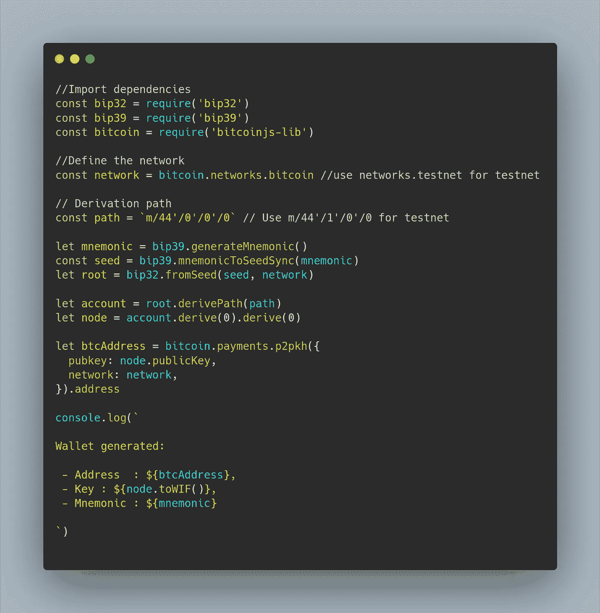

# 5 分钟内生成您自己的比特币钱包

> 原文：<https://javascript.plainenglish.io/generate-your-own-bitcoin-wallet-within-5-minutes-3c36176b47ee?source=collection_archive---------3----------------------->

## 使用 Node.js 生成 P2PKH 地址。


Photo by André François McKenzie on [Unsplash](https://unsplash.com?utm_source=medium&utm_medium=referral)

我们将看看如何使用一个简单的 Node.js 脚本创建自己的比特币钱包——Testnet 和 Mainnet。我们可以立即生成您想要的任意数量的钱包(公钥/私钥对)。我们不需要为此使用任何第三方区块链提供商，因为钱包生成部分是离线完成的。

为了运行本教程中给出的代码，我们需要在你的电脑上安装和配置 [Node.js](https://nodejs.org) ，这甚至不会超过 5 分钟。

不要在简介上浪费太多时间，让我们直接进入实现部分。

> 目前有三种类型的比特币地址(P2PKH、P2SH Bech32 ),我们将创建最广泛使用的地址格式——P2PKH

没有这些库，我们也可以从头开始创建钱包。但是它需要实现更多的加密算法。所以让我们保持简单。

# 步骤:

## #1.创建一个新目录并导航到它。

```
mkdir btc-wallet && cd btc-wallet
```

## #2.使用默认配置初始化新的 NodeJS 项目。

```
npm init --y
```

## #3.安装依赖项。

```
npm install bip39 bip32 bitcoinjs-lib --save
```

## #4.创建一个新文件“createWallet.js ”,并添加以下内容:



## #5.保存文件并运行命令。

```
node createWallet
```

# 输出🎉

输出将是这种格式(对于 testnet)。Mainnet 地址从 1 开始。

```
Wallet generated:- Address  : n3WbASeUNKN7skRrrGPQFNTR7emR5qHYSX,
- Key : cTytXtxMRDsVkwQjLgJh9ZXL8FQoxLri5x9Hb9....,
- Mnemonic : fashion famous energy hold badge notice able ...
```

密钥将以 WIF 格式打印，因为我们使用了`toWIF()`方法。我们也可以通过使用`toBase58()`方法获得`base58`格式。

酷毙了。我们已经生成了一个比特币钱包。只需摆弄一下这段代码，根据需要生成尽可能多的钱包。

> 你可以在这里找到完整的代码。

下次见！

*更多内容请看*[*plain English . io*](http://plainenglish.io/)