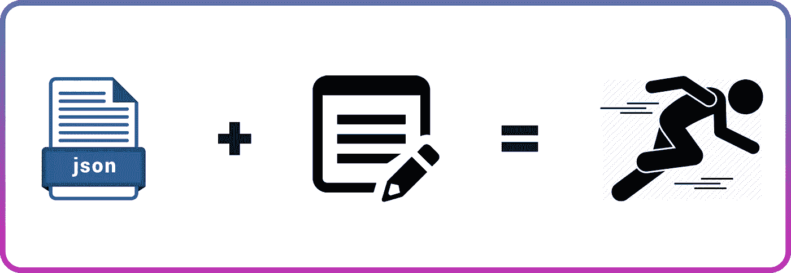

# 在 React 中生成 API 驱动的表单

> 原文：<https://javascript.plainenglish.io/generating-api-driven-form-in-reactjs-d07ed54ca3f2?source=collection_archive---------2----------------------->

## React 中填充表单的动态方法

Cover Image

# 介绍

我最近参与了一个项目，该项目要求 SuperAdmin 用户检查客户在入职过程中出现的注册错误。受影响的字段由内部系统标记，并作为 JSON 有效载荷返回给前端应用程序。我们有超过 100 个表单输入字段可能会受到影响。

考虑到这一点，我从一开始就知道在 ReactJs 中静态生成表单的典型方法不足以解决这个问题。

在本文中，我将向您展示从 JSON 有效负载动态生成表单输入的方法。

可以在这里 **查看 Vue.js 版本 [**。**](https://malomz.medium.com/generate-api-driven-forms-in-vue-a2a9cb263bd2)**

# **React 中的表单处理**

在开始之前，我们必须了解 react 中当前是如何处理表单的。react 中有两种处理表单的方式。

1.  **受控组件:**这种方法涉及父组件，它通过管理状态并根据用户输入更新状态来控制表单元素。这种方法是 ReactJs 团队推荐的方法。

Controlled Component

2.**非受控组件:**这种方法包括表单元素在内部存储自己的状态，表单数据由 DOM 本身处理。它使用[**ref**](https://reactjs.org/docs/refs-and-the-dom.html)**从 DOM 中获取表单值。**

**Uncontrolled Component**

# **动态生成表单**

**现在我们完全理解了 ReactJs 是如何处理表单的。我们现在可以修改我们的**受控组件**来从 JSON 响应中动态生成表单输入元素。**

****步骤 1** 创建一个`data.json`来模拟我们从一个端点得到的响应。**

**JSON response mock data**

**记住 JSON 文件的结构，我们可以编辑我们的受控组件，如下所示**

**Dynamic Form**

**让我们解释一下这段代码。我们遵循以下步骤:**

*   **导入的**使用 Effect** 钩子和 mock JSON 作为**响应**。**
*   **将应用程序状态修改为空对象。**
*   **基于来自 JSON 有效负载的响应，我们通过将**字段名**和**值**映射为 ***键值对*** 来动态填充状态空对象。这样，如果端点带有初始值，它将被填充到输入字段中。**
*   **修改了 **handleChange** 函数，以获取一个额外的参数(字段)并将其用作相应输入值的键。**
*   **通过表单元素映射显示**表单标签**、**输入类型**、 **onChange** 回调，以及相应的值。**

**有了这些，我们可以测试我们的表单并相应地提交它。**

**您可以在这个沙箱上查看完整的代码**

**Dynamic Form**

# ****结论****

**这种方法帮助我们动态地生成表单，而不会用外部库来膨胀我们的应用程序。**

**它也是可扩展的(以适应其他表单元素)、可维护的和更干净的方法。**

# **参考**

** [## 反应-一个用于构建用户界面的 JavaScript 库

### 反应使创建交互式用户界面变得毫无痛苦。为应用程序中的每个状态设计简单的视图，并做出反应…

reactjs.org](https://reactjs.org/)  [## 不受控制的组件-反应

### 在大多数情况下，我们建议使用受控组件来实现表单。在受控组件中，表单数据是…

reactjs.org](https://reactjs.org/docs/uncontrolled-components.html)  [## 形式-反应

### HTML 表单元素的工作方式与 React 中的其他 DOM 元素略有不同，因为表单元素自然会保留…

reactjs.org](https://reactjs.org/docs/forms.html#controlled-components)**