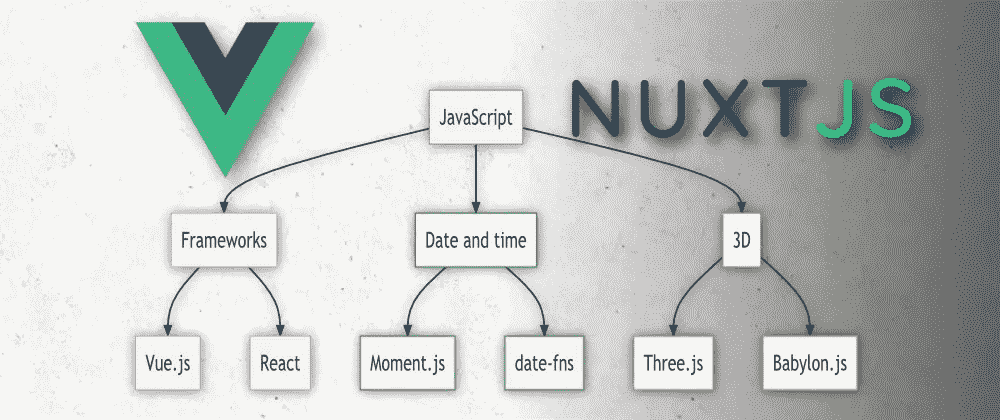
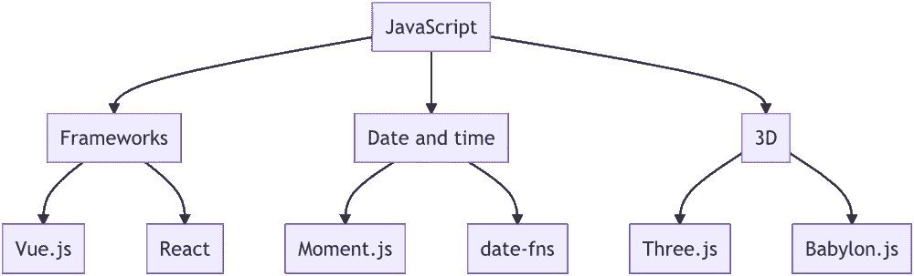

# 用 Mermaid 和 Vue/Nuxt 生成流程图

> 原文：<https://javascript.plainenglish.io/generating-beautiful-flowchart-diagrams-with-mermaid-and-vue-nuxt-dee432dba23d?source=collection_archive---------10----------------------->

嘿伙计们，今天我想向你们展示如何使用[Vue-美人鱼字符串](https://github.com/dword-design/vue-mermaid-string)和[Nuxt-美人鱼字符串](https://github.com/dword-design/nuxt-mermaid-string)在 Vue 或 Nuxt 应用程序中生成流程图。它们都有助于将精彩的[美人鱼](https://mermaid-js.github.io/)库集成到你的基于 Vue 的项目中。

# 设置

好吧，现在让我们坚持 Vue，稍后看看它如何为 Nuxt 工作。首先，我们需要安装组件。

有几种方法可以将组件添加到项目中。最快的解决方案是通过 CDN，如下所示:

注意，你还需要添加`mermaid`本身。

或者，通过软件包管理器安装它:

`npm install vue-mermaid-string`

并注册该组件。您可以在本地完成:

全球范围:

或者作为插件:

# 让我们画一些严肃的东西

好的，现在让我们开始画一个图表！因为可能大多数读者都是 JavaScript 爱好者，所以我们创建了一个小小的技术树用于演示😊。

下面是显示图表所需的代码。我们还添加了 [endent](https://github.com/indentjs/endent) 来简化多行字符串的使用。

这导致了下图:

太好了！您还可以编辑图字符串(例如节点标签)，它会相应地更新结果。

下一步，我们将更改每个库类型的颜色。我已经使用[调色板按钮](https://www.paletton.com/#uid=73+1p0k2O++00++00++7n++be+Z)生成了一个四色配色方案，并将颜色应用于相应的节点。

我将结果与源代码一起放入沙盒中，结果如下所示:

请随意玩沙盒，尝试不同的美人鱼字符串！

# 与 Nuxt 一起使用

如果你是一个 Nuxt 用户，在你的项目中添加一个模块，然后马上让所有的东西都可用，可能会更方便。还有 [nuxt-mermaid-string](https://github.com/dword-design/nuxt-mermaid-string) ，基本包裹了 vue 组件。

只需通过`npm install nuxt-mermaid-string`安装即可。

然后像这样加到你的`nuxt.config.js`里:

我们开始吧。剩下的工作方式如上！

# 结论

在本文中，我们了解了 Vue 和 Nuxt 应用程序中的图表生成。我希望你喜欢它，它对你有些用处！

你可以通过在 [vue-mermaid-string](https://github.com/dword-design/vue-mermaid-string) 和/或 [nuxt-mermaid-string](https://github.com/dword-design/vue-mermaid-string) 留下一个 GitHub 星来帮助我了解人们是否喜欢这些包🌟。

**如果你喜欢我正在做的事情，请关注我的** [**Twitter**](https://twitter.com/seblandwehr) **或查看我的** [**网站**](https://sebastianlandwehr.com) **。也可以考虑在** [**给我买杯咖啡**](https://www.buymeacoffee.com/dword)**[**PayPal**](https://www.paypal.com/paypalme/SebastianLandwehr)**或者**[**Patreon**](https://www.patreon.com/dworddesign)**进行捐赠。非常感谢！❤️****

***原载于*[*sebastianlandwehr.com*](https://sebastianlandwehr.com/blog/generating-beautiful-flowchart-diagrams-with-mermaid-and-vue-nuxt)**

**在建立投资组合网站时，不要再犯这 4 个错误了**