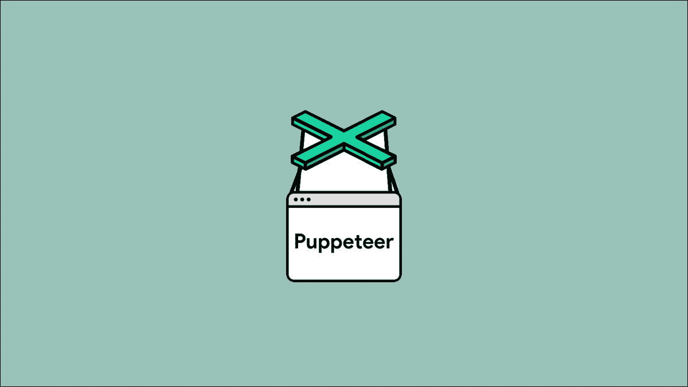

# 按需生成开放图形元图像

> 原文：<https://javascript.plainenglish.io/generating-open-graph-meta-images-on-demand-1baa5d12e6e?source=collection_archive---------10----------------------->

目前，web 开发领域的一个趋势是定制的、按需开放的图形元图像。

今天，您将学习如何建立自己的服务，并开始按需生成图像！

Picture by [Charisse Kenion](https://unsplash.com/@charissek)

# 打开图表什么？

如果你从未听说过开放图协议，让我尽快解释一下。

Open Graph 是脸书在 2010 年创建的协议。它的目标是简化和标准化我们向网页添加元数据的方式。元数据可以是任何东西，从你的页面标题到当有人分享你的链接时弹出的图像。

你将把这些`meta`标签放在你的 HTML 的头部，浏览器将能够理解你试图做什么。元数据已经成为 SEO(搜索引擎优化)的一个重要部分，因为它帮助搜索引擎确定你的页面是关于什么的。

Some basic metadata from [W3Schools](https://www.w3schools.com/tags/tag_meta.asp)

元数据真正强大的部分是添加图像的能力。很多像 Twitter、Discord 和 LinkedIn 这样的服务可以呈现特定的图片，让你的链接脱颖而出！看看这个不和谐的例子。

An example of an Open Graph image

虽然这很酷，但我们将会更上一层楼。

如果我们可以按需生成这些图像，并在其中加入一些变量，岂不是很酷？

一个完全可以实现的目标，让我们开始吧！

# 我们的目标

我想要模仿的——以一种非常简单的方式——是来自 Github 的开放图形图像。我仍然记得我第一次看到这些照片的时候，我真的对这些照片中的细节感到惊讶！

你可能会看到所有简单明了的主题，如标题和描述，但仔细看看底部。那个小条甚至显示了所用语言的分布！

虽然来自 GitHub 的那些看起来绝对令人惊叹，但我们将创建一些不那么复杂的东西。

我们今天要创造的是:

*   带有简单标题和副标题的图片
*   明/暗主题支持

The expected result!

# 一些急需的解释

虽然我很想详细解释每一步，但事情太多了，不能从头开始。这就是为什么我用最终结果创建了一个方便的[回购](https://github.com/driaug/og-image)。这样你就能确定你得到了想要的结果，并直接把它们变成你自己的！

你可以在这里找到回购:
【https://github.com/driaug/og-image 

如果你想玩我的主机版本，你可以在这里找到:
[https://og.driaug.com/Hi%20there!？subheader = Let % 27s % 20 generate % 20 our % 20 own % 20 images&theme = dark](https://og.driaug.com/Hi%20there!?subheader=Let%27s%20generate%20our%20own%20images&theme=dark)

## 它是如何工作的

我想你一定很好奇这一切是如何运作的。相信我，一旦我解释给你听，你可能会觉得和我了解它时一样愚蠢。

简而言之，这个生成器所做的就是接受来自 API 的请求，使用提供的变量生成一些定制的 HTML，呈现它，并使用[木偶师](https://pptr.dev/)截屏。仅此而已，别无其他！

在我们非常简单的例子中，我们将确切的字符串传递给 API。如果你不想让人们伪造元图像，这可能是你想要避免的。

幸运的是，你有无限的可能性！您可以做的是传递一个 ID，而不是传递确切的字符串。一旦解析了 ID，您就可以从数据库中获取记录，并从中获得所有详细信息！

## 我如何使用这些图像？

当您想要将图像添加到元数据中时，需要添加两个重要的标签。

A simple example of meta images

我们需要为 Open Graph 协议和 Twitter 添加一个标签。Twitter 使用他们自己的图像标准，因为他们有一些非常酷的额外功能，你可以添加，但我们稍后会回到他们身上。

您的标签的内容键需要包含图像，或者在我们的例子中，包含生成图像的 URL，这给了我们类似的东西。

Our dynamic meta images

## 我能把这个变成我自己的吗？

是的，你可以！你可以叉回购，并为你的博客创建自己的元图像，启动…

因为这个想法和资源库最初是由 Vercel 创建的，所以我建议你也在他们的平台上托管它，它是免费的，而且速度非常快！

首先，你需要将[回购](https://github.com/driaug/og-image)分叉，这样你就有了自己的个人拷贝。

在那之后，你需要做的就是去[https://vercel.com/new](https://vercel.com/new)把那个库链接到一个新项目，瞧，你已经准备好了！

如果你想定制输出，这也是非常容易的！您可能希望更改的一些关键文件有:

*   这个文件负责处理传入的请求并解析参数，如标题、副标题和主题。这里需要记住的重要一点是，如果你想添加更多的参数，你还需要改变`api/lib/types.ts`中的`ParsedRequest`类型！
*   `api/lib/template.ts`，这个文件为图像生成样式和 HTML。在这里你可以放上你自己的设计。
*   `api/fonts`，这个文件夹包含了图像中使用的字体。您可以添加自己的字体，也可以依赖默认的 web 字体。

## 为什么 Twitter 有自己的标签？

正如你在前面的例子中看到的，Twitter 需要一个单独的图片 meta 标签。这是因为 Twitter 在开放图协议的基础上有一些额外的怪癖和特性。

他们提供给你能力来指定他们想要你渲染的卡片类型，有各种选项可以选择，比如一个摘要卡片或者一个大图片。你可以在[他们的开发者文档页面](https://developer.twitter.com/en/docs/twitter-for-websites/cards/guides/getting-started)上找到所有细节！

祝你有激动人心的一天！💛

*更多内容尽在*[***plain English . io***](http://plainenglish.io/)