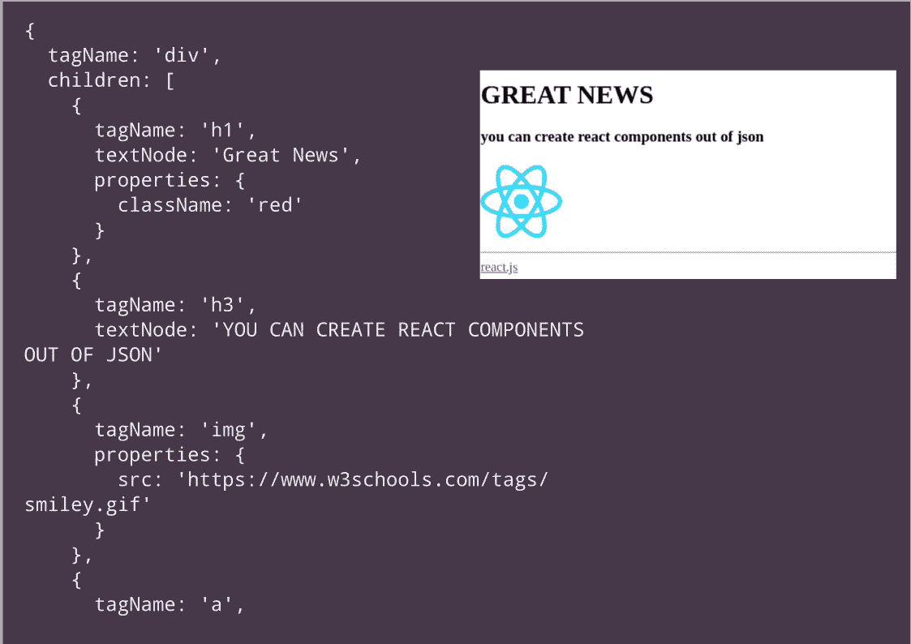

# 从 JSON 生成 React 组件

> 原文：<https://javascript.plainenglish.io/generating-react-components-from-json-850d25a5cd67?source=collection_archive---------5----------------------->



JSON to UI with React

2017 年，我写了一篇[文章](https://harin76.medium.com/generate-vue-js-components-from-a-json-javascript-dom-structure-a76534478d15)，演示了从 JSON 或 Javascript 对象表示生成用户界面。我在 VueJs (2.x)中提出了这个概念。该解决方案的核心是一个递归函数，它接受一组节点并生成 HTML 组件。这个想法对于实现诸如内容管理系统之类的工具很有用。我确实用这个概念为一个无代码平台合成了定制页面。

我喜欢 VueJs，它有一点优雅。ReactJs 是另一个出色的框架。ReactJs 的架构(DOM diffing 和 patching)与 VueJs 非常相似。这两个框架在基于浏览器的前端开发领域都有重大贡献。

我想赶上反应堆的世界。最好的方法就是开着它转一圈。我想在 ReactJs 上重写我最初的 VueJs 文章。令我惊喜的是，事情最终变得简单了。

这是我们将呈现的 JSON 用户界面定义。

```
{
  "tagName": "div",
  "children": [
    {
      "tagName": "h1",
      "textNode": "Great News",
      "properties": {
        "style": {
          "textTransform": "uppercase"
        }
      }
    },
    {
      "tagName": "h3",
      "textNode": "YOU CAN CREATE REACT COMPONENTS OUT OF JSON",
      "properties": {
        "style": {
          "textTransform": "lowercase"
        }
      }
    },
    {
      "tagName": "img",
      "properties": {
        "src": "data:image/svg+xml;base64,PHN2ZyB4bWxucz0iaHR0cDovL3d3dy53My5vcmcvMjAwMC9zdmciIHZpZXdCb3g9Ii0xMS41IC0xMC4yMzE3NCAyMyAyMC40NjM0OCI+CiAgPHRpdGxlPlJlYWN0IExvZ288L3RpdGxlPgogIDxjaXJjbGUgY3g9IjAiIGN5PSIwIiByPSIyLjA1IiBmaWxsPSIjNjFkYWZiIi8+CiAgPGcgc3Ryb2tlPSIjNjFkYWZiIiBzdHJva2Utd2lkdGg9IjEiIGZpbGw9Im5vbmUiPgogICAgPGVsbGlwc2Ugcng9IjExIiByeT0iNC4yIi8+CiAgICA8ZWxsaXBzZSByeD0iMTEiIHJ5PSI0LjIiIHRyYW5zZm9ybT0icm90YXRlKDYwKSIvPgogICAgPGVsbGlwc2Ugcng9IjExIiByeT0iNC4yIiB0cmFuc2Zvcm09InJvdGF0ZSgxMjApIi8+CiAgPC9nPgo8L3N2Zz4K",
        "width": "100px",
        "height": "100px"
      }
    },
    {
      "tagName": "hr"
    },
    {
      "tagName": "a",
      "properties": {
        "href": "#"
      },
      "textNode": "react.js"
    }
  ]
}
```

**递归函数**

在 VueJs 示例中,“createComponent”函数有两个参数

1.  一组节点
2.  渲染功能

功能没有变化。在 ReactJs 实现中，我们将对 [React.createElement](https://reactjs.org/docs/react-api.html#createelement) 的引用作为第二个参数传递。我做了一点调整，以满足 React 要求，即子元素应该有唯一的键。下面是修改后的“createComponent”实现。

```
// A helper to recursively create DOM nodes
// first argument is a set of nodes
// Second argument is a render function
function createComponent(dNode, h) {
  // Handle empty elements and return empty array in case the dNode passed in is empty
  if (_.isEmpty(dNode)) {
    return [];
  }
  // if the el is array call createComponent for all nodes
  if (_.isArray(dNode)) {
    return dNode.map((child) => createComponent(child, h))
  }
  let children = []; 

  // If the node has children render them too
  if (dNode.children && dNode.children.length > 0) {
    dNode.children.forEach((c) => {
      if (_.isString(c)) {
        children.push(c)
      } else {
        children.push(createComponent(c, h))
      }
    });
  } // Need to clone 
  const properties = _.cloneDeep(dNode.properties) || {}

  // To satisfy React warning that children should have a key
  properties.key = Date.now() +  '.' + Math.random(1000)
  return h(
    dNode.tagName,
    properties, 
    children.length > 0? children : dNode.textNode
  )
}
```

react 实现非常简单。功能组件‘ui engine’返回使用 [React.createElement](https://reactjs.org/docs/react-api.html#createelement) 创建的组件。“UIEngine”接受 Javascript 对象或数组作为属性。它使用了 VueJs 示例中几乎没有变化的“createComponent”函数。

```
function UIEngine({nodes}) {
   // The second parameter to the createComponent is 
   // the React.createElement
   return createComponent(nodes, React.createElement)
}
```

“UIEngine”是一个常规的 react 组件，可以在 JSX 中呈现，如完整的示例所示。

```
 return (
          <div>
            <UIEngine nodes={nodes} />
          </div>
        )
```

这里是代码的链接。

**完整代码供大家参考**

```
<!DOCTYPE html>
  <html lang="en">
  <head>
    <meta charset="UTF-8">
    <meta name="viewport" content="width=device-width, initial-scale=1.0">
    <title>Document</title>
  </head>
  <body>
    <div id="root"></div>
    <script src="[https://cdn.jsdelivr.net/lodash/4/lodash.min.js](https://cdn.jsdelivr.net/lodash/4/lodash.min.js)"></script>
    <script src="[https://unpkg.com/react@16.12.0/umd/react.development.js](https://unpkg.com/react@16.12.0/umd/react.development.js)"></script>
    <script src="[https://unpkg.com/react-dom@16.12.0/umd/react-dom.development.js](https://unpkg.com/react-dom@16.12.0/umd/react-dom.development.js)"></script>
    <script src="[https://unpkg.com/@babel/standalone@7.8.3/babel.js](https://unpkg.com/@babel/standalone@7.8.3/babel.js)"></script>
    <script type="text/babel">

// A helper to recursively create DOM nodes
// first argument is a set of nodes
// Second argument is a render function
function createComponent(dNode, h) {
  // Handle empty elements and return empty array in case the dNode passed in is empty
  if (_.isEmpty(dNode)) {
    return [];
  }
  // if the el is array call createComponent for all nodes
  if (_.isArray(dNode)) {
    return dNode.map((child) => createComponent(child, h))
  }
  let children = []; 

  // If the node has children render them too
  if (dNode.children && dNode.children.length > 0) {
    dNode.children.forEach((c) => {
      if (_.isString(c)) {
        children.push(c)
      } else {
        children.push(createComponent(c, h))
      }
    });
  }// Need to clone 
  const properties = _.cloneDeep(dNode.properties) || {}

  // This is to satisfy React warning that children should have a key
  properties.key = Date.now() +  '.' + Math.random(1000)
  return h(dNode.tagName, properties, children.length > 0? children : dNode.textNode)
}      

      // The UI Engine component, takes a Javascript object/array or nodes as prop and renders it
      function UIEngine({nodes}) {
        return createComponent(nodes, React.createElement)
      }

      // An application component consuming the UiEngine
      function App() {
        const nodes = {
          tagName: 'div',
          children: [
            {
              tagName: 'h1',
              textNode: 'Great News',
              properties: {
                style: {'textTransform': 'uppercase'}
              }
            },
            {
              tagName: 'h3',
              textNode: 'YOU CAN CREATE REACT COMPONENTS OUT OF JSON',
              properties: {
                style: {textTransform: 'lowercase'}
              }
            },
            {
              tagName: 'img',
              properties: {
                src: 'data:image/svg+xml;base64,PHN2ZyB4bWxucz0iaHR0cDovL3d3dy53My5vcmcvMjAwMC9zdmciIHZpZXdCb3g9Ii0xMS41IC0xMC4yMzE3NCAyMyAyMC40NjM0OCI+CiAgPHRpdGxlPlJlYWN0IExvZ288L3RpdGxlPgogIDxjaXJjbGUgY3g9IjAiIGN5PSIwIiByPSIyLjA1IiBmaWxsPSIjNjFkYWZiIi8+CiAgPGcgc3Ryb2tlPSIjNjFkYWZiIiBzdHJva2Utd2lkdGg9IjEiIGZpbGw9Im5vbmUiPgogICAgPGVsbGlwc2Ugcng9IjExIiByeT0iNC4yIi8+CiAgICA8ZWxsaXBzZSByeD0iMTEiIHJ5PSI0LjIiIHRyYW5zZm9ybT0icm90YXRlKDYwKSIvPgogICAgPGVsbGlwc2Ugcng9IjExIiByeT0iNC4yIiB0cmFuc2Zvcm09InJvdGF0ZSgxMjApIi8+CiAgPC9nPgo8L3N2Zz4K',
                width: '100px',
                height: '100px'
              }
            },
            {
              tagName: 'hr'
            },
            {
              tagName: 'a',
              properties: {
                href: '#'
              },
              textNode: 'react.js'
            }
          ]
        };
        return (
          <div>
            <UIEngine nodes={nodes} />
          </div>
        )
      }ReactDOM.render(<App />, document.getElementById('root'))
    </script>
  </body>
  </html>
```

本文展示了 VueJs 和 ReactJs 框架在内部工作方式上的相似之处。在不修改任何定制递归呈现函数的情况下，我们创建了一个组件，可以从 ReactJS 中的 JSON/Javascript 对象呈现 UI。它还演示了如何重新合并存储在 JSON 中的 UI 组件。让我知道你对这篇文章的看法。如果你喜欢这篇文章，请分享。

**参考文献**

 [## 从 JSON / JavaScript DOM 结构生成 Vue.js 组件

### 有时我们需要存储文档结构并重新创建它的能力。例如，当我们创建所见即所得…

harin76.medium.com](https://harin76.medium.com/generate-vue-js-components-from-a-json-javascript-dom-structure-a76534478d15) 

反应创造元素—[https://reactjs.org/docs/react-api.html#createelement](https://reactjs.org/docs/react-api.html#createelement)