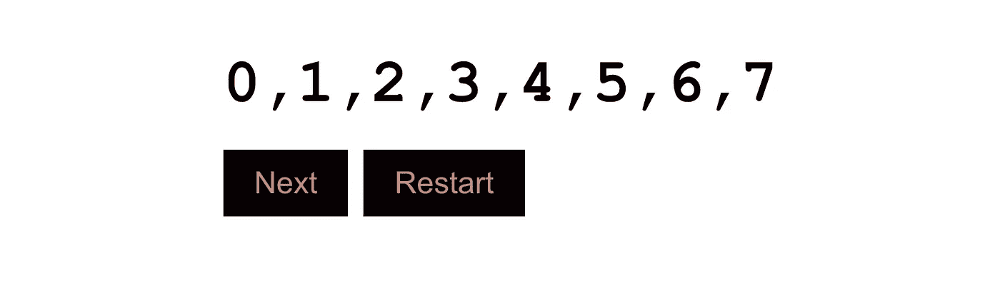

# 算法可视化生成器

> 原文：<https://javascript.plainenglish.io/generator-for-algorithm-visualization-e7ffa15f0277?source=collection_archive---------4----------------------->


Photo by [Mockup Graphics](https://unsplash.com/@mockupgraphics?utm_source=medium&utm_medium=referral) on [Unsplash](https://unsplash.com?utm_source=medium&utm_medium=referral)

写算法很好玩吧？尤其是在你努力工作后一切都解决了。到那时，你可能想知道如何将作品绘制到屏幕上，包括所有的中间结果。

当您调试代码时，似乎很容易在某处放置一条`console.log`消息来确认代码逻辑。当您完成代码时，您最终得到了代码的最终输出。但是我们如何通过显示所有的中间结果来可视化代码的逻辑呢？假设我们有一个如下的`fn`算法。

```
function fn() {
  const n = 8
  const arr = new Array(n).fill(0)
  for (let i = 0; i < n; i++) {
    arr[i] = i
    **console.log(arr)**
  }  
}
```

上面的`fn`算法遍历一个大小为 8 的数组，并用它的索引逐一初始化每个元素。你可以用一行代码写出这个算法。毫无疑问:)

# 可视化结果

如果我们想按照我们编写`fn`函数的方式来可视化结果，它会将我们引向语句`console.log`。因为那是我们将中间结果输出到物理*终端的地方。*如果现在我们想将它们输出到另一个媒体，如 *DOM* ，该怎么办？这可能会导致一些问题。

我们的`fn`功能可能最多需要 1 *ms* 才能完成。但是在 1 *ms* 内无法捕捉到任何屏幕动画，原因很简单，如果事情发生得太快，我们所能看到的就是最后一帧。为了确保我们可以看到所有的帧，我们需要能够控制播放速度，例如，像慢动作一样放慢播放速度。或者，如果可能的话，我们需要能够将时间定格在一个单独的画面上，并停留在那里。而且，我们也不想播放这个动画来阻塞电脑的运行。当我们观看动画时，我们希望继续与这台计算机的其他设备和应用程序进行交互。

技术上我们可以在`console.log`之后增加一些延迟？这是可行的，但是在减慢播放速度的同时，也减慢了功能本身的速度。更不用说，这会让你的计算机运行得更慢，因为你的代码是以串行方式运行的，任何速度的降低都会被叠加。这就是为什么我们要学习更快的算法:)

那么，我们如何在不降低机器速度的情况下降低进程速度呢？或者，我们甚至不想减慢这个过程，相反，当我们得到中间结果时，我们想把控制权交给另一个设备。无论该设备决定减速、加速、存储结果还是显示结果，都取决于该设备。这里的想法是停止工作，做点别的。我们的编程语言中有类似的机制吗？

## 使用发电机暂停

是的，我们有发电机可以帮忙。许多语言都实现了这个特性，这里我们将使用 JavaScript 作为我们的语言:

```
**function*** genFn() {
  const n = 8
  const arr = new Array(n).fill(0)
  for (let i = 0; i < n; i++) {
    arr[i] = i
    **yield** arr
  }  
}
```

上面的`genFn`和我们原来的`fn`挺像的。该函数有一个装饰器`*`，表明它是一个生成器。它还有一条专线`yield`来代替我们的`console.log`。

这个`yield`语句做了两件事。第一件事是从函数返回。我们知道`return`的作用是停止你在当前函数中正在做的事情。

`yield`语句还配备了特殊的权力。这一站不是永久的停留。更准确地说，它表现得更像暂停。函数实例不会像在常规函数中那样被销毁。事实上，如果函数在将来再次被调用，它可以从上次返回的地方恢复！是的，听起来很神奇，这就是它的作用。我们可以用下面的例子来证明:

```
const fn = getFn()
fn.next()   // fn.value returns the arr
fn.next()   // and this happens
...         // again and again
fn.next()   // for eight times
```

我们首先通过`getFn`生成一个`fn`，如果你调用`fn.next()`，你会得到一个中间`arr`，因为`fn`在看到一个`yield`时会暂停并返回。在我们的例子中，您可以调用`fn.next()`八次。另一个有趣的事实是，如果你不调用`fn.next()`或者停止调用它，你将不会得到更多的结果。在某种程度上，我们神奇地将代码分成八部分，如果我们完成了一部分，有人(主线程)可以检查我们——我们到了吗？如果没有，我们继续。

> 为了找到更多关于发电机的信息，这里是 MDN 的文章。

## 渲染到屏幕上



我们有八个部分，现在在每个部分之后，我们可以自由地做我们想做的任何事情。在我们的例子中，我们希望将结果呈现到屏幕上。在这里，我将使用 *React* 作为我们的渲染器，但是您可以随意插入自己的渲染器:

```
const App = () => {
  const [fn, setFn] = useState(**genFn()**)
  const [count, setCount] = useState(0) const res = **fn.next()**
  const arr = res.done ? null : res.value
  if (!arr) return null

  const onNext = () => { setCount(count+1) }
  const onRestart = () => { setFn(**genFn()**) }

  return (
    <>
      <h1>{arr.join(',')}</h1>
      <button onClick={onNext}>Next</button>
      <button onClick={onRestart}>Restart</button>
    </>
  )
}
```

上面的代码设置了两个按钮: **Next** 按钮呈现下一步， **Restart** 按钮重新启动整个算法。在每次渲染时，它从`fn.next()`获取一帧数据。而如果算法还没有完成，我们可以从`fn.value`中获取`arr`并显示到包裹在`h1`标签中的屏幕上。

> 请在 [CodePen](https://codepen.io/windmaomao/pen/jOGVBKa) 随意使用在线示例。

# 摘要

这里我们使用一个生成器来帮助我们将所有中间结果显示到屏幕上。

我们在这里学到的是，如果你能设法将一项任务分成多个部分，或者如果这项任务由多个部分组成，那么当你完成一部分时，你可以暂停。这给了你在暂停期间做其他事情的灵活性。完成后，您可以继续开始其余部分。这不是我们正常做事的方式吗？:)

*更多内容看* [***说白了. io***](http://plainenglish.io/) ***。*** *报名参加我们的**[***免费每周简讯点击这里***](http://newsletter.plainenglish.io/) ***。****