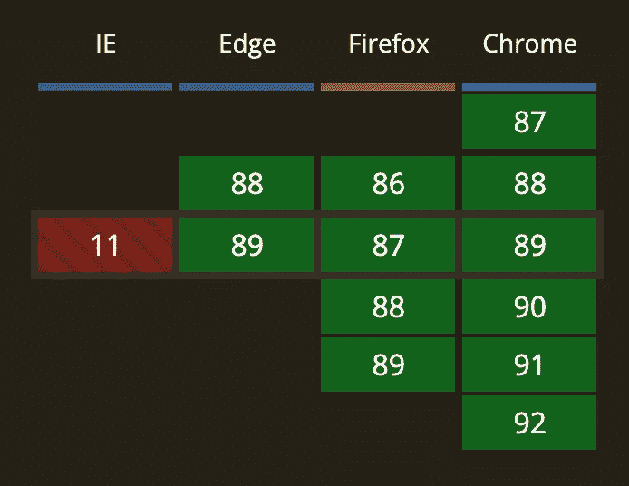
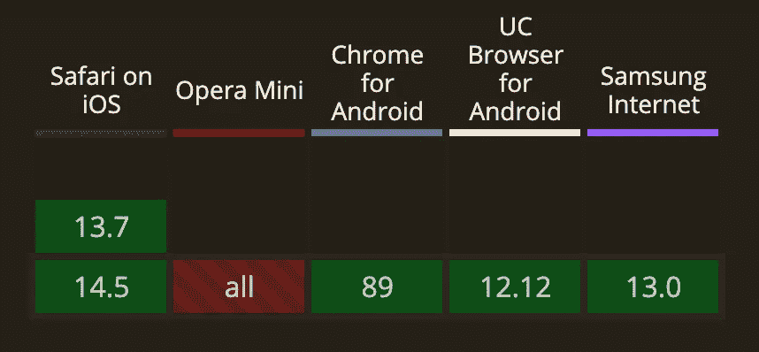

# 生成器函数:无人问津的强大 JavaScript 工具

> 原文：<https://javascript.plainenglish.io/generator-function-the-powerful-javascript-tool-nobody-is-talking-about-cd0fc17312c4?source=collection_archive---------12----------------------->


Photo by [Kevin Ku](https://www.pexels.com/@kevin-ku-92347?utm_content=attributionCopyText&utm_medium=referral&utm_source=pexels) from [Pexels](https://www.pexels.com/photo/black-farmed-eyeglasses-in-front-of-laptop-computer-577585/?utm_content=attributionCopyText&utm_medium=referral&utm_source=pexels)

任何面试过 web 开发人员职位的人都知道，他们可能会发现挑剔的考官会询问与 Javascript 相关的详细理论问题。

通常，在那些时刻我会对自己说:*“但是我真的需要记住一个我在 JavaScript 中永远不会用到的函数的准确名称来准备这次面试吗？”*

然而，今天我们既没有谈论理论，也没有谈论任何隐藏在 MDN web 文档中的东西。

今天，我们将讨论*生成器函数*，它是迭代器的强大替代品，提供了一组工具来使我们的代码执行得更好，并使它更有效、更易读。

## **什么是发电机功能？**

*生成器函数*是一种特殊类型的函数，由 ES6 引入，作为迭代器的“工厂”运行。

事实上，它们是可以退出以便以后进入的函数，为函数随后被调用时保持函数的上下文。

**快速举例** 举个快速的例子，想想当你决定下午下班休息，在 PlayStation 上玩个游戏。

休息(不幸的是)不会持续很久，所以你不得不保存你的游戏并在晚上下班后继续。

这样，就像一个*生成器函数*一样，我们在游戏中执行动作，保存我们游戏的状态，退出函数，然后在那天晚上返回函数，从我们离开的地方继续。

## **如何使用生成器功能？**

要声明一个*生成器函数*，需要使用下面的保留关键字`**function***`，它返回一个*生成器*类型的对象。

在下面的例子中，我们有一个不立即运行的函数生成器。事实上，该函数返回一个迭代器对象，并且只从第一个被调用的`next()`开始，生成器主体将一直执行到第一个`yield`表达式。

```
function* increment(i) {
  yield i;
  console.log("hello");
  yield i + 10;
  console.log("world!");
  yield i;
}const generator = increment(5);console.log(generator.next().value); // *output: 5*console.log(generator.next().value);
// *output: hello 15*console.log(generator.next().value); 
// *output: world! 5*console.log(generator.next().value); 
// *output: undefined*
```

此外，一些读者肯定已经注意到只有 3 个 *yield* 关键字，而生成器函数被调用了 4 次。

事实上，一旦所有的值都被“消耗”完，要再次生成这些值，就必须创建一个新的生成器对象。

函数返回的*生成器对象*符合 iterable 协议和 iterator 协议。

事实上，对象生成器的方法有:

*   `Generator.prototype.next()`:返回一个由`yield`表达式产生的值。
    每次调用`next()`都会返回一个具有两个属性的对象:

```
{
   value: any,
   done: boolean
}
```

*value* 属性当然包含值，相反, *done* 属性指示生成器是否已经结束执行并且不再生成任何值。

**记住:** 如果你想停止一个生成器的执行，你也可以*返回*并且 *done* 属性将变成`true`，阻止任何更多的值生成。

```
function* increment(i) {
  yield i;
  yield i + 10;
  return 'stop'; // *Generator ends here*
  yield i; // *Will never be executed*
}const generator = increment(5);console.log(generator.next().value); // *output: 5*console.log(generator.next().value); // *output: 15*console.log(generator.next().value); // *output: stop*console.log(generator.next().value); // *output: undefined*
```

*   `Generator.prototype.return()`:返回给定值，完成生成器。

正如我们在前面的例子中看到的，通过调用*生成器对象的`return()`函数，*我们将 *done* 属性设置为`true`。

*   `Generator.prototype.throw()`:抛出一个错误给生成器，stoppen done ovviamente l ' esecuzione。

## 为什么用生成器而不用迭代器？

在解释原因之前，这里有一个关于迭代器的理论思考:

> 当一个对象知道如何一次访问一个集合的元素时，它就是一个**迭代器**,保存着关于它在序列中当前位置的信息。

ES6 引入生成器的原因总是一样的:试图简化开发人员的工作，删除繁琐的预防措施和代码行，否则开发人员每次都必须编写代码。

事实上，尽管实现迭代器很有用，但是需要特别注意迭代器内部状态的管理，很明显，生成器的内部状态由函数接管。

## 使用示例

例如，不禁止在另一个生成器函数中调用一个生成器函数，同时仍然保留状态并遵守我们上面已经提到的规则。

```
function* double(i) {
  yield i * 2;
}function* increment(i) {
  yield i;
  yield* double(i);
  yield i + 10;
}const generator = increment(5);console.log(generator.next().value); // *output: 5* console.log(generator.next().value); // *output: 10* console.log(generator.next().value); // *output: 15* console.log(generator.next().value); // *output: undefined*
```

另一种可以使用的方法是将参数传递给函数生成器。

```
function* logGenerator() {
  console.log(yield);
  console.log("hello");
  console.log(yield);
}const generator = logGenerator();generator.next('Kristine'); // *output: Kristine*
generator.next('Paul'); // *output: hello Paul*
generator.next('The end'); // *output: undefined*
```

**斐波那契数列**

几乎我们所有人都知道*斐波纳契数列，*其中每个数字都是前面两个数字的和，从 0 和 1 开始。

下面是通过*生成器函数*实现的算法。

```
function* fibonacci() {
  let fn1 = 0;
  let fn2 = 1;
  while (true) {
    let current = fn1;
    fn1 = fn2;
    fn2 = current + fn1;
    const reset = yield current;
    if (reset) {
        fn1 = 0;
        fn2 = 1;
    }
  }
}const sequence = fibonacci();console.log(sequence.next().value); // *output: 0* console.log(sequence.next().value); // *output: 1* console.log(sequence.next().value); // *output: 1* console.log(sequence.next().value); // *output: 2* console.log(sequence.next().value); // *output: 3* console.log(sequence.next().value); // *output: 5
...* console.log(sequence.next(true).value); // *output: 0* console.log(sequence.next().value); // *output: 0* console.log(sequence.next().value); // *output: 1* console.log(sequence.next().value); // *output: 1* console.log(sequence.next().value); // *output: 2*
```

## 发电机的优势

在最明显的优势中，当然有数据的 ***懒惰评估*** 。

事实上，通过生成器函数，我们可以在必要的时候请求计算，请求服务器等等。

让我们想象一个应该返回 5 的倍数的函数。

它们将是无限的，函数将返回一个 *Javascript 堆内存不足错误*。

相反，通过利用生成器函数，只有在真正必要时才可以请求我们感兴趣的数的倍数，节省了存储效率，只有在我们需要时才推迟计算。

## 要记住的事情

**仅一次性访问**

一旦您用完了所有的值，如果您想再次生成值，您必须创建一个新的生成器对象。

**桌面支持**



[caniuse.com](https://caniuse.com/es6-generators)

**移动支持**



[caniuse.com](https://caniuse.com/es6-generators)

如果你喜欢这篇文章，请按👏按钮，这将鼓励我写其他文章。

如果你有任何问题，请随意提问。非常感谢你的阅读！

*更多内容请看*[***plain English . io***](http://plainenglish.io/)