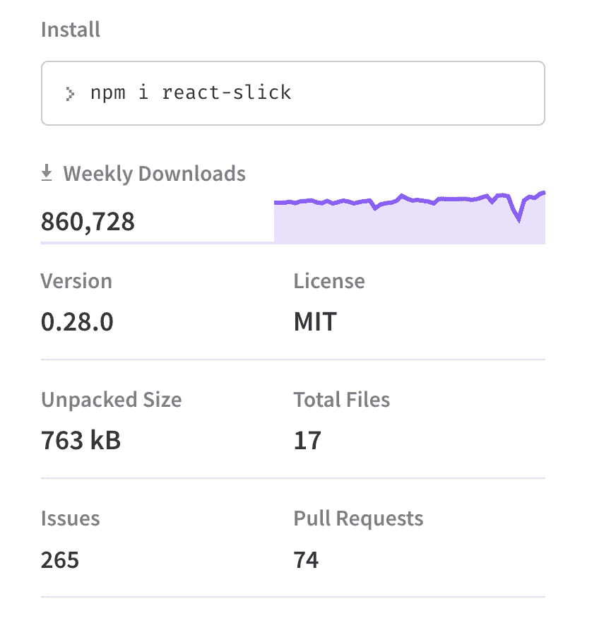
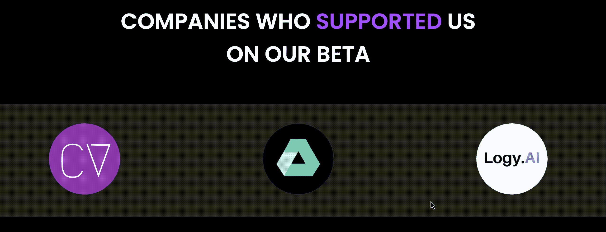

# 为您的 React 网站获得一个完美的旋转木马滑块

> 原文：<https://javascript.plainenglish.io/get-a-perfect-carousel-slider-for-your-react-website-d20c91c5b2f9?source=collection_archive---------15----------------------->



react-slick npm package

对于一个网站来说，轮播是非常重要的，无论你是希望包含你的合作伙伴还是你的客户评价，轮播是一个可以帮助你满足所有这些需求的元素。

欢迎来到您的完美反应转盘滑块快速指南。所以，不要再浪费时间了，让我们开始吧…

# 什么是反应滑头

[react-slick](https://www.npmjs.com/package/react-slick) 是一个非常棒的 npm 包，旨在快速完成你的网站轮播。让我们不要忘记它的每周下载统计，这使它成为最受欢迎的传送带之一。

# 那么它是如何开始的呢

因此，最初对于 onTribe 的最新网站，我们尝试使用 brainhubeu 的[react-carousel](https://www.npmjs.com/package/@brainhubeu/react-carousel)来支持我们的测试版公司。该软件包确实有很好的文档，但不幸的是在自动播放方面没有响应。

因此我们决定用 react-slick！

# 让我们开始实施吧

所以试用 react-slick 时，请不要忘记将 CSS 文件(粗体)与 react 和包导入一起包含进来。

```
import React from "react";
import Slider from "react-slick";// Import css files
**import "slick-carousel/slick/slick.css";
import "slick-carousel/slick/slick-theme.css";**
```



Find more here: [https://ontribe.in/](https://ontribe.in/)

假设导入上述包、CSS 文件和图像文件后，您的代码如下所示:

正如你所看到的，在`**ModifiedCarouselSlider.js**`文件中我们的滑块道具发生了变化

默认情况下，您的图像大小是 1px，在您的`**`标签中添加一个类名不会造成任何不同😵。

别担心，我们还是会去你漂亮的旋转木马。

但是这个包有自己的样式组件，改变它的样式属性可以帮助你得到完美的滑块。

请遵循下面的 **CSS** 文件，该文件实现了具有适当图像大小和隐藏箭头的 React 滑块。


是的🙌！我们完了🎉

我也建议把这个查一下[。因为我们中的许多人会快速浏览 GitHub 上的文档并遇到错误。](https://codesandbox.io/s/ppwkk5l6xx)

## 在你离开之前

嘿！我叫[**Dhairya ost wal**](https://medium.com/u/ceb423b9eddd?source=post_page-----d20c91c5b2f9--------------------------------)，是一名计算机专业的学生，目前从事前端开发 [@ontribe](https://ontribe.in/) 。

我很想在评论中听到你对我作品的看法。

***在***[***LinkedIn***](https://www.linkedin.com/in/dhairyaostwal/)***，***[***insta gram***](http://instagram.com/dhairyaostwal/)***，***[***Medium***](https://medium.com/@dhairyaostwal)***，***[***GitHub***](https://github.com/dhairyaostwal)