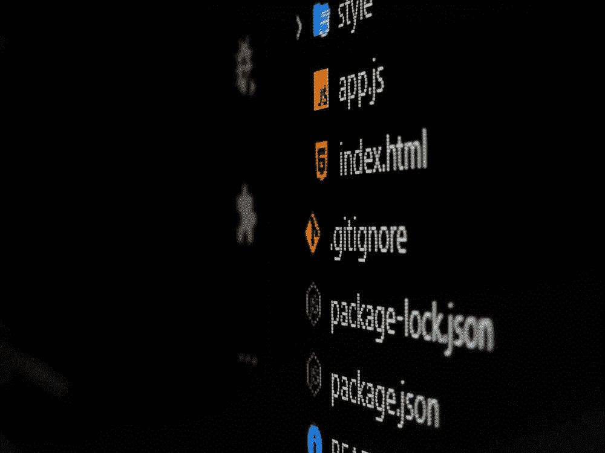

# 一步一步的指南，以优化您的网页与吞咽

> 原文：<https://javascript.plainenglish.io/get-better-at-optimizing-your-web-page-75e81c544a02?source=collection_archive---------12----------------------->

## 使用该工具可以轻松优化 CSS & SCSS、图像和 JavaScript 脚本！



Photo by [Gabriel Heinzer](https://www.instagram.com/h3ga2879/)

今天我们来谈谈任务跑步者。任务运行器本质上是可以优化网页的 CSS 文件、SASS 文件、JavaScript 脚本和图像的工具。它通过各种优化技术来减小这些项目的文件大小。

这包括但不限于:

*   删除注释
*   删除空白和换行符
*   缩短变量名
*   将 SCSS 转换为 CSS
*   将 RGB 颜色值转换为十六进制
*   串联文件

这可能看起来不多，但是执行这样的操作可以显著减少网页的加载时间。

您完全可以自己执行这些优化技术，不需要任务运行人员的帮助，但是这个过程会很快变得繁琐和耗时。相反，通过向任务执行者寻求帮助来避免这一切。

# 吞咽

本文选择的任务运行程序是 Gulp。其他流行的任务运行程序包括 npm 脚本和 Grunt。

让我们开始吧。

## 安装 Node.js

要入门，Gulp 需要安装 [Node.js](https://nodejs.org/en/) 。下载吧。完成后，打开命令提示符。Windows 上的命令提示符如下所示:


Command Prompt on Windows

在命令提示符下，输入:

```
npm install -g gulp
```

这将在全球范围内安装 gulp，并使您将来的所有项目都可以使用它。

## 创建项目文件夹

接下来，我们将为我们的项目创建一个项目文件夹。您可以在命令提示符、文本编辑器或传统的文件浏览器应用程序中完成此操作。我将使用文件浏览器应用程序。


为我们的项目创建文件夹后，我们希望命令提示符能够访问我们的项目。要在命令提示符下访问该文件夹，只需编写

```
cd placeholder
```

将“placeholder”替换为项目文件夹的路径。例如，我的看起来是这样的:

```
cd C:\Users\kyled\OneDrive\Desktop\ProjGulp
```

一旦你这样做了，我们就准备开始这个项目的工作。

## 将插件安装到项目中

使用命令提示符，我们将为您的项目安装插件。这些安装需要 npm 软件包管理器的帮助。

让我们开始吧。

```
npm init
```

该命令将为您的项目创建一个 package.json 文件。它保存了关于项目的元数据信息。一旦您编写了这个命令并按下 enter 键，命令提示符将要求您输入关于项目的元数据，例如名称、描述和版本。您可以花时间输入元数据，或者只需单击 enter 跳过它。

不过，别担心。如果您愿意，以后您总是可以输入信息。

```
npm install --save-dev gulp
```

这个命令将把 gulp 安装到您的项目中。

```
npm install --save-dev gulp-imagemin
```

这个命令将安装一个可以压缩你的图片的插件。这个插件只压缩以下数据类型的图像:png、jpeg、gif 和 svg。

```
npm install --save-dev gulp-uglify
```

这个命令将安装一个可以压缩你的 JavaScript 文件的插件。

```
npm install --save-dev gulp-minify-css
```

这个命令将安装一个可以压缩你的 CSS 文件的插件。

```
npm install --save-dev gulp-sass
```

这个命令将安装一个插件来压缩你的 SCSS 文件并将它们转换成 CSS。

```
npm install --save-dev gulp-concat
```

该命令将安装一个插件，可以将文件组合在一起，这也有助于优化。当文件连接在一起时，它减少了服务器检索网页资源的请求数量。

你必须安装所有这些软件包吗？一点也不。只安装那些您的项目可能受益的。例如，如果您的页面不包含图像，那么您就不需要 imagemin。

## gulpfile.js

在 Visual Studio 代码或您选择的文本编辑器中打开项目文件夹。创建名为 gulpfile.js 或 Gulpfile.js 的脚本。

这个文件很重要，因为当您在命令提示符下编写任何与 gulp 相关的命令时，都会运行这个文件。这个文件将描述您希望 gulp 执行的任务。

让我们开始吧。

我们将开始把我们以前安装的插件很好地利用起来。首先，我们将声明依赖关系。这将放在 gulpfile 的最上面。

```
const gulp = require('gulp');
const concat = require('gulp-concat');
const imagemin = require(‘gulp-imagemin’);
const uglify = require(‘gulp-uglify’);
const sass  = require(‘gulp-sass’);
const css = require(‘gulp-minify-css’);
```

这实质上是将这些插件引入我们的代码，并给它们一个我们可以在代码中使用的可用形式。例如，如果我们想使用 gulp-uglify 插件，我们将把常量变量称为‘uglify’。

现在，有趣的部分是:创建任务。

## gulpfile:创建任务

下一节将对文件的结构做一些假设。假设您的项目结构如下所示:


在您的项目文件夹中，将有一个名为“src”的文件夹。这个“src”文件夹将包含单独的文件夹来组织不同类型的文件，如 CSS、HTML、图像、脚本和 sass。

这在以后会很重要。

事不宜迟，让我们开始创建任务。

**复制 HTML 文件**

```
gulp.task(‘copyHTML’, function(){ gulp.src('src/*.html') .pipe(gulp.dest(‘dist’));});
```

该任务将把我们项目的 HTML 文件复制到一个名为 dist 的新目标文件夹中。dist 将包含我们项目的所有优化的 css、html、图像和 js 文件。因为 HTML 只是一种描述网页内容的标记语言，所以它不能被优化。因此，我们只是将 HTML 文件复制到 dist 文件夹中。这意味着 src 将包含您的 HTML 文件的副本，dist 也将包含一个副本。

需要注意的是，任务通常会遵循相同的模板并使用相同的功能。在我们继续创建其他任务之前，这里有一个正在发生的事情的分类。

首先，我们首先突出显示 gulp 描述或创建我们的任务的函数‘task()’。接下来，我们继续讨论“task()”函数的两个参数:一个字符串和一个函数。该字符串将是我们分配给任务的名称。第二个参数描述了在命令提示符下调用任务时我们希望发生的操作。

例如，如果在命令提示符中写入以下内容，将执行该任务。

```
gulp copyHTML
```

上面任务声明的下一行提供了文件的源。我们说的任务是将 HTML 文件复制到 dist 文件夹。因此，正在复制的文件的源在这一行中声明。在这种情况下，源是 src 文件夹中包含文件扩展名的所有文件。html”。

最后，还有 gulp 的管道功能。这实际上是说目的地是一个名为 dist 的文件夹。因为我们只是从一个文件夹到另一个文件夹复制文件，这个任务看起来很简单。在其他任务中，正如您将看到的，将有一个额外的管道函数，它将在将源文件的副本通过管道传输到目标文件夹之前对其进行操作。

**压缩图像**

```
gulp.task(‘imageMin’, function(){ gulp.src (‘src/images/*’) .pipe(imagemin()) .pipe(gulp.dest(‘dist/images’));});
```

这个任务将使用我们之前安装的 imagemin 插件优化图像。该任务将使用“src”文件夹中的“images”文件夹来查找需要压缩的图像。压缩后，它会将压缩图像存储在“dist”文件夹中的“images”文件夹中。

您可以在命令提示符下输入以下命令来调用此任务。

```
gulp imageMin
```

**压缩 JavaScript 文件**

接下来，我们对脚本进行优化。

```
gulp.task('minify’, function(){ gulp.src(‘src/js/*.js') .pipe(uglify()) .pipe(gulp.dest(‘dist/js’));});
```

这和前面的过程是一样的。但是，它将使用丑插件来压缩脚本，并将优化后的脚本存储在' dist '文件夹的' js '文件夹中。

您可以在命令提示符下使用以下命令来调用此任务。

```
gulp minify
```

**优化 SCSS 文件**

接下来，我们有 SCSS 文件的优化。

```
gulp.task(‘sass’,function(){ gulp.src(‘src/sass/*.scss’) .pipe(gulp.dest(dist/css));}
```

它将删除空白、换行符和 RGB 值等。它还会将 SCSS 文件转换成 CSS 文件。该目的地与其他目的地类似，将位于 dist 文件夹中的一个文件夹中。

可以在命令提示符下使用以下命令调用此任务:

```
gulp sass
```

**串联脚本**

如前所述，减少项目中的文件数量可以缩短加载时间。对于我们将要创建的 concat 任务，我们将把所有的 javascript 脚本合并成一个脚本。

```
gulp.task(‘scripts’, function(){gulp.src(‘src/js/*.js’).pipe(concat()).pipe(gulp.dest(‘dist/js’));});
```

与前面的任务类似，该任务将从 src 文件夹中获取脚本，使用插件操作它们，并将优化的版本发送到 dist 文件夹。

以下命令是如何在命令提示符下调用此任务的:

```
gulp scripts
```

**组合命令**

假设您想要优化所有文件。您真的需要编写四个不同的命令来实现这一点吗？号码

在声明这四个任务之后，我们可以创建一个默认任务。在命令提示符下执行以下命令时，将调用默认任务:

```
gulp
```

这将使我们的项目更容易优化。它看起来会像这样:

```
gulp.task(‘default’, ['copyHTML’,’imageMin’, ‘minify’, ‘sass’,]);
```

第二个参数是提供一个函数数组，在调用这个任务时执行。

**观看项目**

如果您对项目中的任何文件进行了更改或添加了图片，这些更改只会反映在您的 src 文件夹中。请记住，dist 文件夹本质上是 src 文件夹的优化版本。这个 dist 文件夹是在命令提示符下调用这些 gulp 命令的直接结果。

因此，当您对项目进行任何更改时，dist 文件夹不会自动调整和优化文件的更新版本。您必须再次调用这些 gulp 命令。

为了避免这样做并使优化自动化，您可以创建一个观察任务。监视任务将监视您的文件夹。如果进行了任何更改，它将自动调用必要的任务来优化文件的更新版本。

如果你正在寻找 gulp 提供的更多插件，你可以查看他们的[文档](https://gulpjs.com/plugins/)。

希望这个指南能帮助你采取措施来优化你的网页！让我知道，如果你有任何其他的优化技巧。我很想收到你的来信！

*更多内容看* [*说白了。在这里注册我们的*](http://plainenglish.io/) [*免费周报*](http://newsletter.plainenglish.io/) *。*