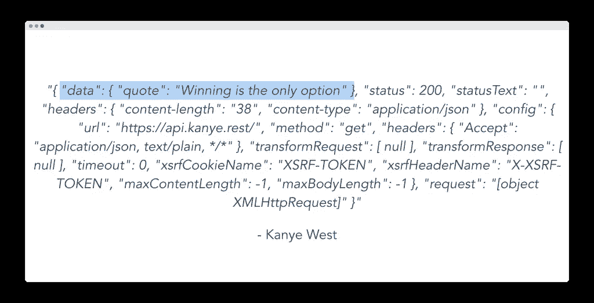

# 使用 Vue.js 和 Axios 获取 Kanye West 报价

> 原文：<https://javascript.plainenglish.io/get-kanye-west-quotes-w-vue-and-axios-cf11e5e3197f?source=collection_archive---------16----------------------->

## Vue.js 初学者指南


> Axios 是最流行的 Javascript HTTP 请求库之一，通常用于调用 Vue 应用程序内部的 API。

在本文中，我们将在 Vue 3 应用程序中使用 Axios 制作一个 Kanye West 报价生成器。我们不仅将从叶本人那里获得一些深刻的灵感，而且我们将学习如何将我们的 Vue 应用程序与 API 连接起来，甚至学习如何使用可重用的 API 调用更好地组织 Vue 项目。

让我们直接进入代码。

## 设置我们的第一个基本 HTTP 请求

我们要做的第一件事是在终端中将 Axios 安装到我们的项目中

```
npm install axios
```

然后，我们可以进入 Vue 组件内部，像这样导入 axios。

```
<script>
import axios from 'axios'

export default {
  setup () {

  }
}
</script>
```

接下来，在我们的设置方法中，让我们用 Kanye REST API 的 URL 运行`axios.get` 来获得一个随机报价。之后，我们可以使用一个`Promise.then`来等待我们的请求给我们一个响应。

```
<script>
import axios from 'axios'

export default {
  setup () {
     axios.get('https://api.kanye.rest/').then(response => {
        // handle response
     })
  }
}
</script>
```

好了，现在我们从 API 中得到一个响应，但是让我们来看看它实际上是什么。为此，我们将它存储为一个名为`quote`的 ref。

```
<script>
import axios from 'axios'
import { ref } from 'vue'

export default {
  setup () {
     axios.get('https://api.kanye.rest/').then(response => {
        // handle response
        quote.value = response
     })
     return {
      quote
     }
  }
}
</script>
```

最后，让我们在模板中用斜体打印出来，并用引号括起来。当然，我们需要对这段引文进行一些归因。

```
<template>
  <div>
    <i>"{{ quote }}"</i>
    <p>- Kanye West</p>
  </div>
</template>
```

好的——让我们看看浏览器里有什么。



**我们可以在这里看到我们的报价，但是还有所有这些额外的信息，比如我们请求的响应代码。**

对于我们的 Kanye 报价生成器，我们只对这个`data.quote`值感兴趣——所以回到我们的脚本部分，让我们指定我们想要访问`response`上的哪个属性。

```
axios.get('https://api.kanye.rest/').then(response => {
        // handle response
        quote.value = response.data.quote
})
```

好的，如果我们回去，我们会看到我们只得到报价。太棒了。


## 将 Axios 与 async/await 配合使用

我们在 Vue 应用中使用 Axios 的另一种方式是使用`async` / `await`模式。

在 setup 中，让我们从注释掉当前的 GET 代码并创建一个名为`loadQuote`的异步方法开始。在内部，我们可以使用相同的`axios.get`方法，但是这次我们想使用`async`来等待它完成，然后将结果存储在一个名为`response`的常量中。

然后，我们再一次设置`quote`的值。

```
const loadQuote = async () => {
      const response = await KanyeAPI.getQuote()
      quote.value = response.data.quote
}
```

就是这样。如果我们看看我们的应用程序，它的工作方式完全相同，但是在我们的代码中，我们使用的是 async/await 模式。


太棒了。

## Axios 中的错误处理

在 async-await 模式中，我们可以通过用`try`和`catch`包围我们的 API 调用来添加错误处理。就是这样。

```
try {
        const response = await KanyeAPI.getQuote()
        quote.value = response.data.quote
} catch (err) {
        console.log(err)
}
```

使用原始的 promises 语法，我们可以在 API 调用后添加一个`.catch`来捕获来自请求的任何错误。

```
axios.get('https://api.kanye.rest/')
      .then(response => {
        // handle response
        quote.value = response.data.quote
      }).catch(err => {
      console.log(err)
})
```

## 发送发布请求

现在我们知道了如何用 Axios 发送 GET 请求，让我们看看如何发送 POST 请求。

为了在本教程中做到这一点，我们将使用 [JSONPlaceholder 模拟 API 调用](https://jsonplaceholder.typicode.com/)。


如果我们查看他们的[文档](https://jsonplaceholder.typicode.com/guide/)，他们会给我们一个`/posts` POST 请求。


好的——让我们制作一个触发 API 调用的按钮。在我们的模板中，让我们制作一个按钮，上面写着*“创建帖子”*，当它被点击时，它调用一个叫做`createPost`的方法。

```
<template>
  <div>
    <i>"{{ quote }}"</i>
    <p>- Kanye West</p>
    <p>
      <button @click="createPost">Create Post</button>
    </p>
  </div>
</template>
```

好的——我们可以开始写我们的脚本，创建这个`createPost`方法，并从`setup`返回它。

在这个方法中，类似于我们的 GET 请求，我们只需要说`axios.post`，传入我们的 URL，也就是`https://jsonplaceholder.typicode.com/posts`，然后我们就可以从他们的文档中复制并粘贴占位符数据。

```
const createPost = () => {
      axios.post('https://jsonplaceholder.typicode.com/posts', JSON.stringify({
          title: 'foo',
          body: 'bar',
          userId: 1,
      })).then(response => {
        console.log(response)
      })
}
```

好吧，让我们试试这个。

如果我们点击我们的按钮，我们会看到我们的控制台正在记录大量的信息，告诉我们我们的 post 请求是成功的。


太棒了。

## 专业技巧:用 Axios 编写可重用的 API 调用

我在项目中用来帮助组织所有 api 调用的一个技巧是创建一个包含我的 API 调用的`src/services`文件夹。

这些文件有两种类型:

*   `API.js`–创建 Axios 实例的文件，该实例定义了将用于所有路线的`baseURL`
*   `*{specific functionality}*API.js`–更具体的文件，可用于将 api 调用组织成**可重用模块**

这有几个好处。首先，通过创建一个用于创建 axios 实例的`API.js`文件，这意味着您的基本 URL 被设置在一个地方——这意味着如果您想在 dev 和 prod 服务器之间切换，**您只需更改该文件中的代码。**

因此，让我们创建我们的`services/API.js`文件，并将我们的 Axios baseURL 设置为 Kanye REST API 的默认值，除非我们传入另一个值。

```
import axios from 'axios'

export default(url='https://api.kanye.rest') => {
    return axios.create({
        baseURL: url,
    })
}
```

这就是那个文件，接下来让我们制作一个`KanyeAPI.js`文件和`import API from './API'`。这里，我们希望导出不同的 API 调用。

调用`API()`给了我们一个 Axios 实例，我们可以在其上调用`.get`或`.post`！这是得到我们随机报价的代码。

```
import API from './API'

export default {
    getQuote() {
        return API().get('/')
    },
}
```

然后，在`App.vue`中，让我们的组件通过可重用的 API 调用使用这个新文件，而不是自己创建 Axios。

```
const loadQuote = async () => {
      try {
        const response = await KanyeAPI.getQuote() // <--- THIS LINE
        quote.value = response.data.quote
      } catch (err) {
        console.log(err)
      }
}
```

就是这样！如果我们加载我们的应用程序，我们仍然可以完美地加载报价。

**现在，让我们把这个我们的** `**createPost**` **移入它自己的可重用方法。**

回到`KanyeAPI.js`，让我们将`createPost`添加到导出默认值中，这将把 post 请求的数据作为参数传递给我们的 HTT 请求。

类似于我们的 GET 请求，我们想要返回我们的 API 来获取一个 axios 实例，但是这次我们需要覆盖默认的 URL 值并传入我们的 JSONplaceholder url。然后，我们可以像以前一样调用 Axios post。

```
export default {
    getQuote() {
        return API().get('/')
    },
    createPost(data) {
        return API('https://jsonplaceholder.typicode.com/').post('/posts', data)
    }
}
```

**就这么简单。**

回到`App.vue`，我们可以这样调用我们的新 post 方法。

```
const createPost = () => {
      const response = await KanyeAPI.createPost(JSON.stringify({
          title: 'foo',
          body: 'bar',
          userId: 1,
      }))

      console.log(response)
}
```

现在，当我们点击我们的按钮时，我们将看到我们专用的 API 文件正在工作——给我们一个 201 代码，意味着我们有一个成功的 post。

## 就是这样！

将我们的 API 调用从这些 Vue 组件中转移到它们自己的文件中的好处是，我们现在可以在应用程序中的任何地方使用这些 API 调用。它让我们创建更多可重用和可伸缩的代码。

希望这对你有所帮助，祝你编码愉快！

## 完成 Vue 和 Axios 代码

```
<template>
  <div>
    <i>"{{ quote }}"</i>
    <p>- Kanye West</p>
    <p>
      <button @click="createPost">Create Post</button>
    </p>
  </div>
</template>

<script>
import axios from 'axios'
import { ref } from 'vue'
import KanyeAPI from './services/KanyeAPI'
export default {
  setup () {

    const quote = ref('')

    const loadQuote = async () => {
      try {
        const response = await KanyeAPI.getQuote()
        quote.value = response.data.quote
      } catch (err) {
        console.log(err)
      }
    }

    loadQuote()

    // axios.get('https://api.kanye.rest/')
    //   .then(response => {
    //     // handle response
    //     quote.value = response.data.quote
    //   }).catch(err => {
    //   console.log(err)
    // })

    const createPost = () => {
      const response = await KanyeAPI.createPost(JSON.stringify({
          title: 'foo',
          body: 'bar',
          userId: 1,
      }))

      console.log(response)
      // axios.post('https://jsonplaceholder.typicode.com/posts', JSON.stringify({
      //     title: 'foo',
      //     body: 'bar',
      //     userId: 1,
      // })).then(response => {
      //   console.log(response)
      // })

    }

    return {
      createPost,
      quote
    }
  }
}
</script>

<style>
#app {
  font-family: Avenir, Helvetica, Arial, sans-serif;
  -webkit-font-smoothing: antialiased;
  -moz-osx-font-smoothing: grayscale;
  text-align: center;
  color: #2c3e50;
  margin-top: 60px;
}
</style>import axios from 'axios'

export default(url='https://api.kanye.rest') => {
    return axios.create({
        baseURL: url,
    })
}import API from './API'

export default {
    getQuote() {
        return API().get('/')
    },
    createPost(data) {
        return API('https://jsonplaceholder.typicode.com/').post('/posts', data)
    }
}
```

[如果你有兴趣了解更多关于 Vue 3 的知识，请下载我的免费 Vue 3 备忘单，里面有一些基本知识，比如组合 API、Vue 3 模板语法和事件处理。](https://learnvue.co/vue-3-essentials-cheatsheet/)

*更多内容请看*[***plain English . io***](http://plainenglish.io)