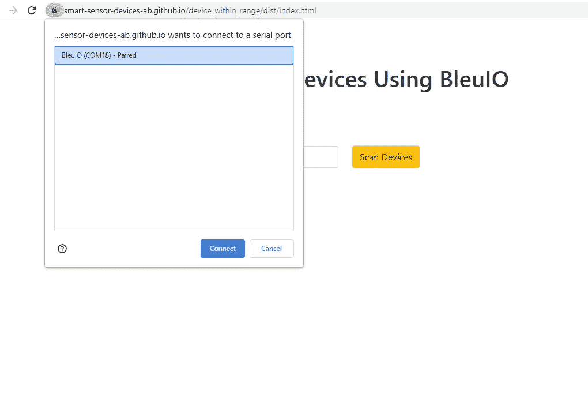
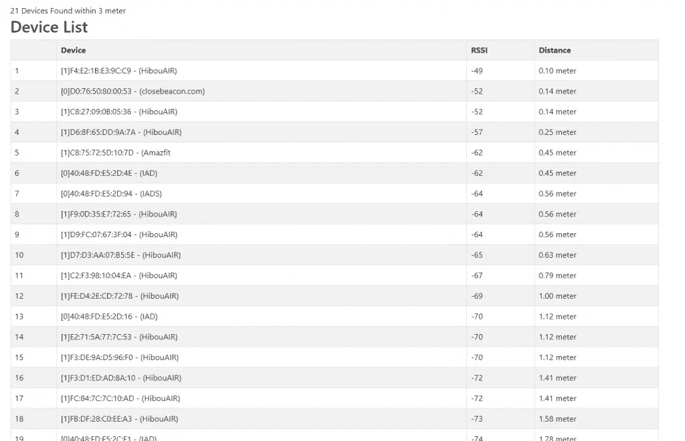

# 使用蓝牙低能耗进行位置分析(JavaScript)

> 原文：<https://javascript.plainenglish.io/get-nearby-ble-devices-within-range-b82163e78c99?source=collection_archive---------9----------------------->

使用 RSSI 值可以测量到蓝牙设备的距离。以下脚本将帮助您在所选范围内找到附近唯一的 BLE 设备。

该脚本使用众所周知的 RSSI 到距离公式扫描给定范围内附近唯一的蓝牙设备。

**要求**

*   你需要一个 https://www.bleuio.com/ BLE USB 加密狗
*   要运行这个脚本，您需要一个 web 应用程序捆绑器。可以用 parceljs。【https://parceljs.org/getting_started.html 

**指令**

git clone[https://github . com/smart-sensor-devices-ab/device _ within _ range . git](https://github.com/smart-sensor-devices-ab/device_within_range.git)

进入终端中的文件夹类型

包裹 index.html

该脚本将在五秒钟内扫描范围内的附近设备。您可以根据需要更新该值。

您也可以从以下网站在线运行该脚本

[https://smart-sensor-devices-ab . github . io/device _ within _ range/dist/index . html](https://smart-sensor-devices-ab.github.io/device_within_range/dist/index.html)

** *确保您的 BleuIO 加密狗已连接*

阅读更多关于如何计算距离的信息

 [## 如何根据 BLE 信标的 RSSI 值计算距离

### 我相信很多人都在研究 BLE 技术，甚至是像室内定位这样的项目…

iotandelectronics.wordpress.com](https://iotandelectronics.wordpress.com/2016/10/07/how-to-calculate-distance-from-the-rssi-value-of-the-ble-beacon/) 

*更多内容看* [***说白了就是***](https://plainenglish.io/) *。报名参加我们的* [***免费周报***](http://newsletter.plainenglish.io/) *。关注我们* [***推特***](https://twitter.com/inPlainEngHQ) *和*[***LinkedIn***](https://www.linkedin.com/company/inplainenglish/)*。加入我们的* [***社区不和谐***](https://discord.gg/GtDtUAvyhW) *。*