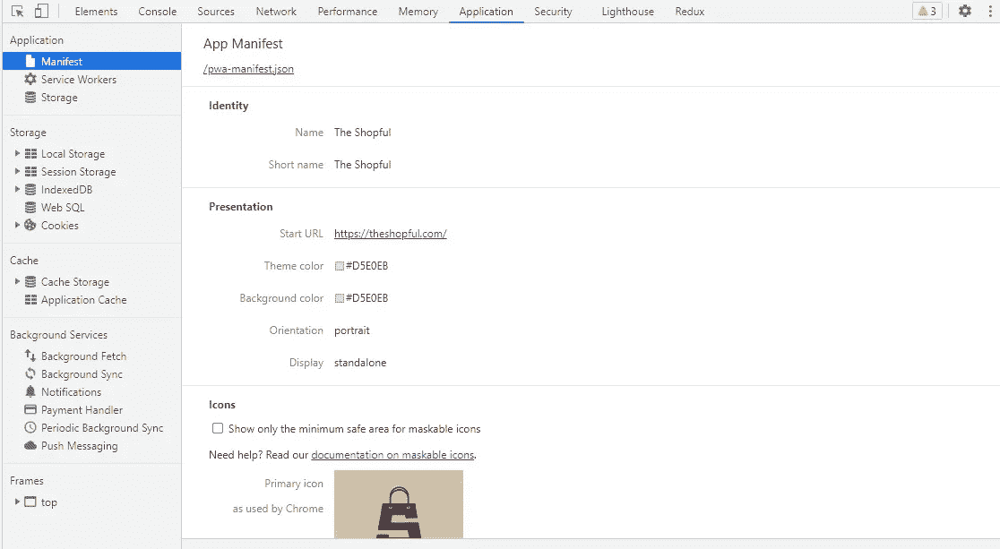
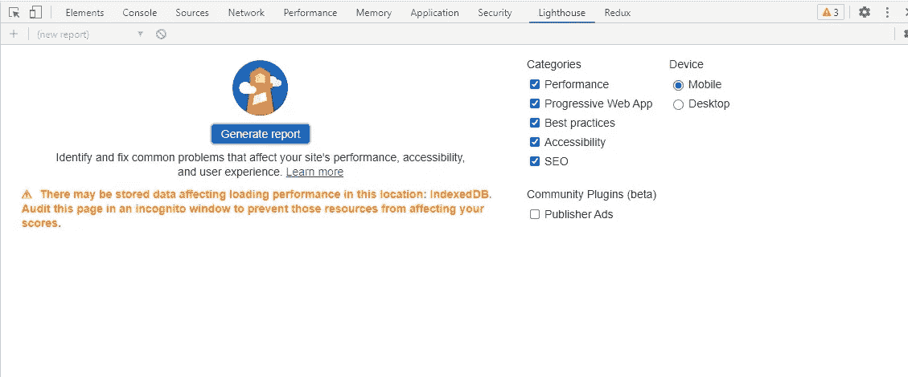
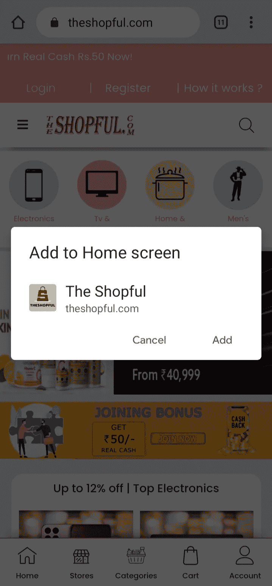

# 从渐进式网络应用(PWA)开始

> 原文：<https://javascript.plainenglish.io/get-started-with-progressive-web-app-pwa-c61324778385?source=collection_archive---------14----------------------->

## 了解如何构建渐进式网络应用程序(PWA)，以及如何将任何网站转换为 PWA。


Photo by [Tim Bennett](https://unsplash.com/@timbennettcreative?utm_source=medium&utm_medium=referral) on [Unsplash](https://unsplash.com?utm_source=medium&utm_medium=referral)

今天，我们将学习如何构建 PWA，以及如何将您现有的网站转换为 PWA。在进入这个话题之前，我们想了解一下渐进式网络应用(PWA)。

# 什么是 PWA？

一个进步的 web 应用程序(PWA)是一套移动 web 应用程序开发技术，需要构建感觉和外观都像本地应用程序的应用程序。使用网络堆栈(JS、HTML 和 CSS)，渐进式网络应用结合了丰富的功能和与本地应用相关的流畅用户体验。简而言之，PWA 是一款具有本地应用风格的网络应用:安装后，用户点击设备主屏幕上的图标，直接进入网站。

PWA 最大的特点是，它给了本地应用程序类似的体验，并且可以安装在你的手机上。我为我的电子商务商店[The shop full](https://theshopful.com)-开发了一个 PWA，它也可以在离线模式下工作，这给 PWA 增加了一个额外的优势。你可以检查我的应用程序作为 PWA 的实时例子。

# 如何创建 PWA

*   更新文档以支持 PWA 功能。
*   创建一个**服务工人. js** 文件。
*   创建 **manifest.json** 文件。
*   使用 Chrome 开发工具进行调试。

## 检查更新

对于静态网站，检查主 HTML 中的更新，并将应用程序注册到 **service-worker.j** 的文件中。

```
<script>
    if('serviceWorker' in navigator){
      navigator.serviceWorker.register('/service-worker.js');
    } else {
      console.log("Service worker is not supported");
    }
  </script>
```

## 服务行业人员

在项目根目录中创建一个 service-worker.js 文件，将静态内容存储在缓存中。您可以存储任何类型的文件，如 MP3、MP4 等。在缓存名称和缓存白名单中使用您自己的应用程序名称。

```
const CACHE_NAME  = 'The-Shopful';

/* Add relative URL of all the static content you want to store in
 * cache storage (this will help us use our app offline)*/
let resourcesToCache = ["./", "./img/logo.png", "./home.js", "./styles.css"];

self.addEventListener("install", e=>{
    e.waitUntil(
        caches.open(CACHE_NAME).then(cache =>{
            return cache.addAll(resourcesToCache);
        })
    );
});
```

添加然后添加两个事件侦听器:

```
self.addEventListener("fetch", e=>{
    e.respondWith(
        caches.match(e.request).then(response=>{
            return response || fetch(e.request);
        })
    );
});const cacheWhitelist = ['The-Shopful'];
self.addEventListener('activate', event => {
    event.waitUntil(
      caches.keys().then(cacheNames => {
        return Promise.all(
          cacheNames.map(cacheName => {
            if (cacheWhitelist.indexOf(cacheName) === -1) {
              return caches.delete(cacheName);
            }
          })
        );
      })
    );
  });
```

## 创建 manifest.json 文件

创建一个 manifest.json 文件，并将其链接到您的主 HTML 文档。

```
<link rel="manifest" href="manifest.json">{
    "name": "The Shopful",
    "short_name": "The Shopful",
    "start_url": "/",
    "background_color": "#D5E0E5",
    "theme_color": "#D5E0E5",
    "icons": [
        {
            "src": "img/logo.png",
            "sizes": "512x512",
            "type": "image/png",
            "purpose": "maskable any"
        },
        {
            "src": "img/title.png",
            "sizes": "192x192",
            "type": "image/png",
            "purpose": "maskable any"
        }
    ],
    "display": "standalone",
    "orientation":"portrait"
}
```

上面的 manifest.json 文件包含您的应用程序名称、图标和打开应用程序的 URL。

## 使用开发工具进行调试

现在打开你的 chrome 开发工具，检查是否检测到服务工作器和清单文件。您可以使用开发工具看到应用程序的名称和图标。然后，您可以设置初始化应用程序的闪屏颜色。通过单击灯箱按钮，您可以获得生成的 PWA 报告。



Source:https://theshopful.com



Source:https://theshopful.com

# 如何在设备上安装

在 chrome 上，您会看到要安装的加号添加按钮。否则，请单击右上角的 3 点按钮，然后单击“添加到主屏幕”选项以安装到您的移动设备中。

您也可以收到安装应用程序的提示。



# 结论

我希望你玩得开心，并找到一些你今天学到的新东西，关于如何开发一个进步的网络应用程序(PWA)或将你现有的网站转换成 PWA。

谢谢你的阅读！