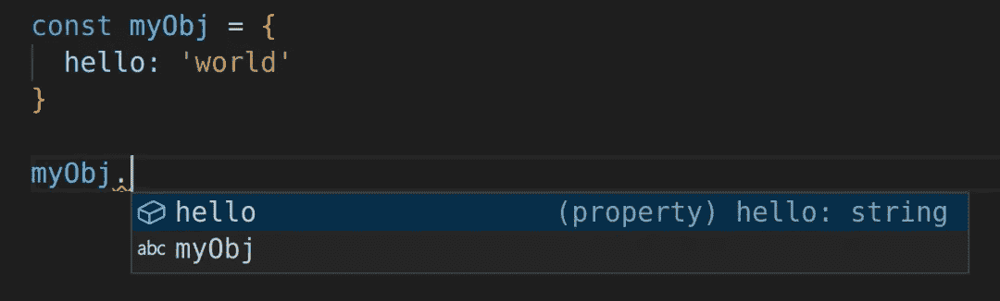
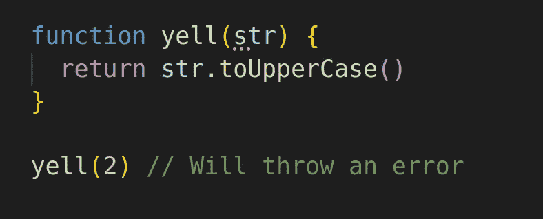
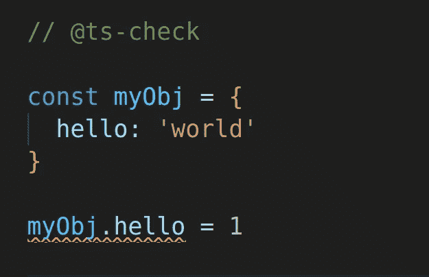
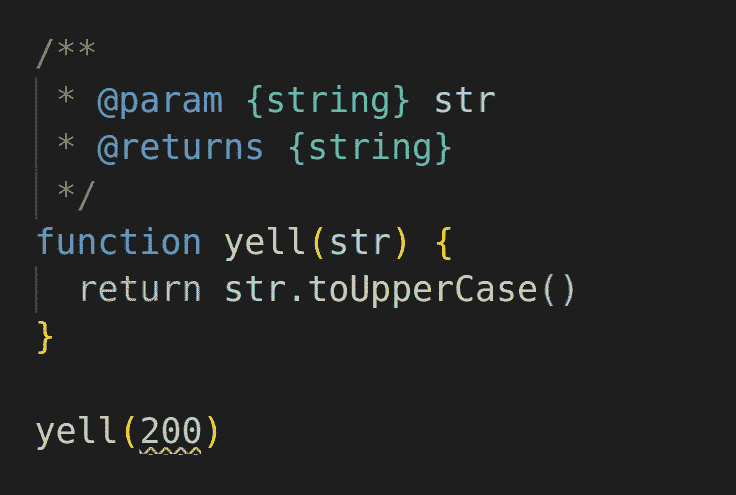
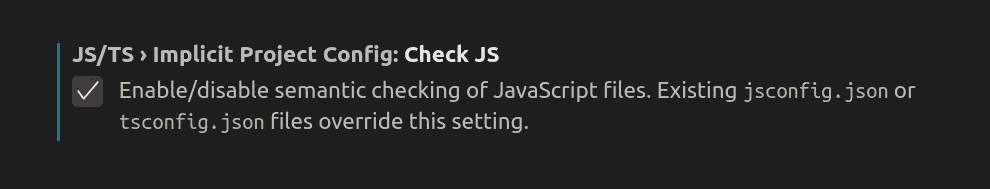
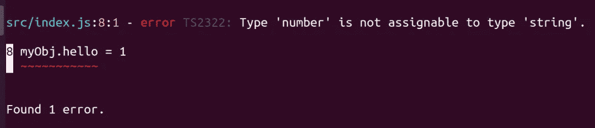

# 以最简单的方式开始使用 TypeScript

> 原文：<https://javascript.plainenglish.io/get-started-with-typescript-the-easy-way-1a74d723925?source=collection_archive---------12----------------------->


不可否认的是 [TypeScript](https://www.typescriptlang.org/) 已经在 JavaScript 社区站稳了脚跟。毫无疑问，它提供了像改进的[智能感知](https://code.visualstudio.com/docs/editor/intellisense)、[静态分析](https://en.wikipedia.org/wiki/Static_program_analysis)(又名“类型检查”)和内联文档这样的特性。

这些功能不是 TypeScript 独有的。它们是任何强类型语言的一部分，它们转化为生产力和代码质量的提高，例如:

*   使用键入时自动完成的代码建议更快地编写代码。
*   如果代码中有打字错误或错误，会发出警告。
*   更容易将新人引入代码库。
*   团队成员更好地协作，跨越他们没有编写的代码。
*   可以防止损坏的代码通过自动部署。
*   使维护旧代码变得更容易、更安全。
*   可用于自动记录您的项目。

这很好，但是我并不是想说服你使用 TypeScript。本文面向听说过 TypeScript 并对开始使用它感兴趣的 JavaScript 开发人员，或者已经尝试过 TypeScript 并希望从另一个角度了解它的任何人。

不像今天的许多教程，这一个将集中在最小化跟随的技术要求。我们将启动并运行 TypeScript，而无需打开终端、安装依赖项，甚至无需初始化 NPM 项目。在高级部分，我们需要做一点，但是对于大多数用户来说，你需要的只是作为你的编辑器的 Visual Studio 代码。

# 级别 1:在 JavaScript 文件中启用类型脚本

VS Code 席卷了整个科技界。如果你不熟悉，这是一个代码编辑器，但是我敢打赌，如果你经常写 JavaScript，你可能已经在使用它了。

你知道 VS 代码内置了 TypeScript 吗？这就是它如何能够提供一些基本的智能感知和自动建议。

例如，我们可以创建一个具有名为`hello`的属性的对象，并赋予它值`"world"`。当我们试图访问该对象的属性时，VS 代码会自动提示我们`hello`。不仅如此，它还会告诉我们属性`hello`是一个`string`。



这是一个非常基本的类型检查，非常有用。然而，如果我们启用了更好的类型检查，有几个错误仍然可以进入我们的代码库，这些错误本来是可以避免的。

例如，如果我们不小心将一个数字传递给了一个需要字符串的函数，我们可能会遇到问题。



VS 代码实际上有一个特性，可以让[对 JavaScript 文件](https://code.visualstudio.com/docs/nodejs/working-with-javascript#_type-checking-javascript)进行全面的类型检查。最棒的是它超级简单。您所要做的就是将这个注释添加到您想要添加类型检查的 JavaScript 文件的顶部:

有了这个注释，我们在文件中启用了更严格的类型检查。现在，如果我们在代码库中引入可能的错误，我们将会看到更多的提示。例如，如果我们试图用一个数字覆盖对象的`hello`属性，我们将得到一个警告，告诉我们“Type 'number '不能赋给 type 'string '”:



此时，我们前面的函数不会给我们任何提示，说明我们的代码有错误，那是因为 TypeScript 不知道输入只能是字符串。为了解决这个问题，我们可以用 [JSDoc](https://jsdoc.app/) 向 JavaScript 添加类型。

JSDoc 是一个通过使用注释向你的源代码添加上下文文档的系统，它可以用来自动生成文档网站。然而，我们今天最感兴趣的好处是 TypeScript 支持解析 JSDoc 注释。

对于我们的示例函数，我们可以告诉 TypeScript，`yell`函数的第一个参数是一个名为`str`的函数，并且是一种“字符串”类型。该函数的结果也是一个“字符串”。



现在，当我们试图向函数传递一个数字时，我们会看到一个红色的弯曲警告。将鼠标悬停在它上面，我们会看到警告，“类型为‘number’的参数不能赋给类型为‘string’的参数。”谢谢！

学习如何用 JSDoc 记录一切需要时间、学习和实践。这有点超出了今天主题的范围，但了解更多信息的一个好地方是 [jsdoc.app](https://jsdoc.app/) 。

# 级别 2:在 JavaScript 项目中启用 TypeScript

如果您和我一样，您将很快看到使用 JSDoc 记录代码的好处，同时在您出错时让 TypeScript 对您大喊大叫。但是，如果您从事大型 JavaScript 项目，用不了多久，您就会厌倦向每个文件添加`// @ts-check`。

幸运的是，VS Code 为[提供了一些方法，让它知道](https://code.visualstudio.com/docs/nodejs/working-with-javascript#_javascript-projects-jsconfigjson)你希望它在每个 JavaScript 文件上做那种类型脚本的事情。一种方法是将“检查 JS”配置设置为`true`。在`settings.json`文件中，设置为`"javascript.implicitProjectConfig.checkJs": true`



您可以在用户级别或工作区级别执行此操作，但只有您可以这样做。

如果您正在一个团队中工作，并且想要在项目级别上为每个人启用这个特性，您可以通过向您的项目的根文件夹添加一个`[tsconfig.json](https://www.typescriptlang.org/docs/handbook/tsconfig-json.html)`文件来实现。通常，我只是将同一个文件复制到每个项目中，但是让我们使用 TypeScript 初始化命令从头开始创建一个全新的文件:

这个文件可以用来配置一些选项，但是现在我们只对告诉 VS 代码使用 TypeScript 检查 JavaScript 文件的选项感兴趣。有关 tsconfig.json 配置选项的更多详细信息，请参见[www.staging-typescript.org/tsconfig](https://www.staging-typescript.org/tsconfig)。

```
{
  "compilerOptions": {
    "checkJs": true,               /* Report errors in .js files. */
  }
}
```

我更喜欢这样做，因为我领导一个团队，我不想向人们解释如何在他们的设置中启用类型检查。我们不需要担心保持每个人的编辑器设置同步。

现在，无论您喜欢哪种方式，您都可以让 TypeScript 检查所有 JavaScript 文件的潜在错误，而无需做任何其他事情。万岁！

JSDocs 支持多种内置类型:`string`、`number`、`boolean`、`array`、`promise`、`function`等。然而，在您想要创建基本原始值之外的类型定义之前，并不需要花费很长时间。例如，假设我们想要定义一个“狗”对象类型，它有一个“品种”、“年龄”和一个可选的“名称”属性。JSDoc 在那里还是可以支持你的。

我们可以这样定义类型:

```
/**
 * @typedef {object} Dog
 * @property {string} breed
 * @property {number} age
 * @property {string} [name]
 */
```

有几种不同的方法来定义对象，这是一种语法。我不想在定义类型的细节上花费太多时间。关于这方面的更多细节，请随意浏览 [JSDoc 文档](https://jsdoc.app/)。当您进入更高级的需求时，研究 TypeScript 的[泛型](https://www.typescriptlang.org/docs/handbook/generics.html)和[实用程序类型](https://www.typescriptlang.org/docs/handbook/utility-types.html)也是值得的。

我的观点是向您展示如何在您的代码库中导入类型定义。这花了我一点时间来学习，所以希望，我可以节省你一些搜索。

假设我们想用一个文件来定义一些全局类型。姑且称之为`types.js`。我们可以将我们的 Dog 类型定义放入其中，并从不同的文件中，通过引用其相对路径，我们可以在另一个文件中导入并使用该类型:

```
/** @type {import('./types).Dog} */
const myDog = {
  breed: 'Chiweenie',
  age: 4,
  name: 'Nugget'
}
```

如果我们发现自己在同一个文件的许多地方使用了`Dog`类型，我们可以通过在本地重新定义类型定义来节省一些输入:

```
/** @typedef {import('./types).Dog} Dog */

/** @type {Dog} */
const myDog = {
  breed: 'Chiweenie',
  age: 4,
  name: 'Nugget'
}
```

如果你在阅读这篇文章的时候已经尝试过了，你可能遇到了一个小问题。现在，我们不能从我们的`types.js`文件导入任何东西，因为那个文件不是 JavaScript 模块。我们的编辑会这么告诉我们，“File '/path/to/types.js '不是一个模块。”

解决方案是向该文件添加一个导出。您可以使用 CommonJS 或 ES 模块语法。导出的值无关紧要。甚至可以是`undefined`。例如，以下任何一行都可以(注意，您只需要一行):

```
// Works
module.exports = {}

// Sure
exports.merp = ''

// Why not?
export default = null

// Go for it
export const thingamabob = undefined
```

也可以从第三方库中导入类型定义。语法非常相似，但不是使用相对路径，而是通过名称引用库。例如，一个 [Vue.js](https://vuejs.org/) 组件可以使用以下类型:

```
/** @type {import('vue').Component} */
```

并非所有的库都提供类型定义。你只需要试着看看 VS 代码是否会自动推荐给你使用。但是如果你的库没有提供类型定义，那么在 definitelytyped.org[可能还有一个社区提供的类型包，所以也看看吧。VS 代码有一个特性叫做“](https://definitelytyped.org/)[自动类型获取](https://code.visualstudio.com/Docs/languages/javascript#_intellisense-is-not-working-for-external-libraries)”，它会自动为你寻找并安装社区类型定义。

最后，我将指出，如果您喜欢这种语法，也可以在 TypeScript 文件中编写类型定义。JSDoc 的导入看起来完全一样。唯一改变的是文件扩展名(以。ts)和语法。例如，如果我们想用 TypeScript 定义上面的全局类型，我们可以将文件名改为“type.ts ”,内容如下:

```
export interface Dog {
  breed: string
  age: number
  name?: string
}
```

# 级别 3:将 TypeScript 集成到 CI/CD 管道中

到目前为止，我们已经完成了以上所有工作，没有构建步骤，没有安装任何依赖项(除了我们的编辑器)，没有初始化 NPM 命令，甚至没有打开命令行。那是多么令人耳目一新啊！？！？它只是普通的旧 JavaScript，但是有超能力。

现在我们将开始探讨更复杂的问题。如果一个 bug 被引入到代码中，我们能阻止我们的代码被部署吗？

本节的其余部分将进行以下假设:

*   您可以轻松地使用命令行。
*   你对 [NPM](https://www.npmjs.com/) 有些经验(如果没有，你可以在[docs.npmjs.com/getting-started](https://docs.npmjs.com/getting-started)阅读 NPM 的入门页面)。
*   你熟悉 [CI/CD](https://en.wikipedia.org/wiki/CI/CD) (持续集成/持续交付)概念。
*   您已经有了一个用 [package.json](https://docs.npmjs.com/cli/v6/configuring-npm/package-json) 文件初始化的 NPM 项目[。](https://docs.npmjs.com/cli/v6/commands/npm-init)

我们的目标是从 CI/CD 环境中运行 TypeScript 编译器，以便系统知道我们的代码是否有类型错误。这意味着我们不能再仅仅依靠 VS 代码为我们提供 TypeScript，并告诉我们代码是否有错误。我们需要为 CI/CD 环境提供一个 TypeScript 版本和一个要运行的脚本。

我们要做的第一件事是在终端中运行这个命令(从与我们的项目相同的文件夹中):

```
npm install --save-dev typescript
```

这将在本地安装 TypeScript，并且还将通过将`"typecript"`包作为开发依赖项来更新 package.json 文件。这对于运行我们项目的任何其他计算机来说都是必要的，以便知道要安装什么依赖项。有了这些，TypeScript 现在就可以在不依赖 VS 代码的情况下用于项目了。

接下来，我们需要能够告诉计算机如何实际运行 TypeScript。我们可以用下面一行来更新 package.json 文件的 [NPM“脚本”](https://docs.npmjs.com/cli/v6/using-npm/scripts)部分:

这将添加一个名为“ts”的新脚本，它将运行“tsc”命令，这是 TypeScript 编译器。现在我们可以运行命令“`npm run ts`”，但是现在我们有两个错误。

1.  TypeScript 希望知道要运行的文件的路径。
2.  TypeScript 仅适用于。ts 文件，我们所有的文件都是。js 文件。

这是你需要自己做决定的地方。是继续写 JavaScript 文件，还是写 TypeScript 文件？

就我个人而言，我认为把所有东西都放在 JavaScript 中会让生活变得更简单。TypeScript 编译器很好地支持 JavaScript 文件，只是默认情况下没有启用。因此，在本教程的其余部分，我们将使用 JavaScript，但请记住，这是我的个人偏好(更多原因在最后)。

为了解决这些问题，我们需要明确地告诉 TypeScript 要检查哪些文件，并且我们需要使用`allowJs`配置来允许它在 JavaScript 文件上运行。假设我们的 JavaScript 是在`./src/index.js`的一个文件中编写的，我们有几个选择。

*   我们可以在 package.json 文件中的 NPM 脚本中添加“`--allowJs ./src/index.js`”
*   我们可以在每次调用 NPM 脚本时添加上面的命令:`npm run ts -- --allowJs ./src/index.js`
*   或者我们可以在项目的根目录中使用一个 [tsconfig.json](https://www.typescriptlang.org/docs/handbook/tsconfig-json.html) 文件。

因为我们已经有了一个 tsconfig.json 文件，所以让我们使用它。我们需要定义`"files"`数组，并将`"allowJs"`和`"noEmit"`设置为`true`:

```
{
  "files": ["./src/index.js"],
  "compilerOptions": {
    "checkJs": true,               /* Report errors in .js files. */
    "allowJs": true,               /* Allow parsing javascript. */
    "noEmit": true,                /* Do not emit outputs. */
  }
}
```

我们在这里将`"noEmit"`配置设置为`true`，因为 TypeScript 通常用于传输代码。这意味着它接受一些代码并以某种方式进行转换。通常这是接收一个 TypeScript 文件并返回一个 JavaScript 文件，但是因为我们的文件已经是 JavaScript 了，所以这会导致覆盖我们的文件。我们将在下一节研究如何做，但是现在让我们保持简单。

如果我们现在运行"`npm run ts`"命令，我们应该不会有任何配置错误。我们应该只看到与代码中的 bug 相关的错误。举一个我们之前的例子，试图覆盖一个定义为字符串的对象中的属性会产生一个错误。



太好了！现在，我们已经准备好将这种类型检查集成到我们的自动化部署流程中。我们需要做的就是确保部署过程调用我们的`"npm run ts"`命令，只要没有错误，它就会继续进行。

不幸的是，有太多的变量让我无法准确地告诉您如何将它集成到您自己的部署过程中。对每个人来说都会有些不同，但是如果你已经走了这么远，那么我认为你可以从这里开始。

我只想提最后一件事。TypeScript 是对测试套件的一个很好的补充，但它决不是自动化测试的替代品。TypeScript 可以消除进入代码库的几种不同类型的错误，但是如果你的项目依赖于自动化部署，你也应该使用[单元](https://en.wikipedia.org/wiki/Unit_testing)或者[集成测试](https://en.wikipedia.org/wiki/Integration_testing)。

例如，TypeScript 可能会阻止您在必须是数字的地方使用字符串，但我不认为它可以阻止您在只允许正数的地方使用负数。

这就是说，我建议在您的系统中实现静态分析和自动化测试。我最喜欢的测试 JavaScript 项目的工具是 [Jest](https://jestjs.io/) 。

# 级别 4:为开源库生成类型定义

作为一名 JavaScript 开发人员和一个开源 Vue.js 库的维护者，我可以很坦然地说，人们对开源库的期望很高。一个日益增长的期望是类型定义(有时被称为“类型脚本支持”)，要么在库中，要么通过像[definitelytyped.org](https://definitelytyped.org/)这样的社区项目。

好消息是，我们可以使用当前的设置，不需要太多的努力，告诉 TypeScript 为我们的项目创建类型定义文件。一旦我们完成，我们将能够发布我们的库，用户将拥有漂亮的类型定义，以帮助改善他们与我们的库交互的体验。

首先，我们需要对 tsconfig.json 文件做一些修改。我们想要移除`"noEmit"`设置(或者将其设置为`false`，将`"declaration"`和“emitDeclarationOnly”设置为`true`，并为`"outDir"`提供一个路径。

新文件应该大致如下所示:

```
{
  "files": ["./src/index.js"],
  "compilerOptions": {
    "checkJs": true,               /* Report errors in .js files. */
    "allowJs": true,               /* Allow parsing javascript. */
    "declaration": true,           /* Generates '.d.ts' file. */
    "emitDeclarationOnly": true,   /* Only generate '.d.ts'. No JS */
    "outDir": "./dist",            /* Send output to this directory. */
  }
}
```

您可以为`"outDir"`选择任何想要的路径，但这是必需的设置。这就是我们生成的类型定义文件所在的位置。我将`"emitDeclarationOnly"`设置为`true`,因为我们已经在使用 JavaScript，所以不需要编译步骤。每当我需要一个构建步骤时，我通常使用 [Babel.js](https://babeljs.io/) 和 [Rollup.js](https://www.rollupjs.org/guide/en/) ，但是今天我们保持简单。

既然我们的类型定义文件正在生成并被发送到一个`/dist`文件夹，我们就要完成了。最后一步是告诉 NPM 这些文件的存在，这样任何使用我们库的开发者都可以受益。我们需要修改我们的 package.json 文件。

要在 NPM 上发布任何内容，需要有`"name"`和`"version"`属性。我们还可以定义`"types"`(又名`"typings"`)属性来告诉 TypeScript 在哪个文件夹中查找我们库的类型定义文件。显然，如果你的类型定义文件(以`.d.ts`结尾)和你的代码在同一个文件夹中，这就不需要**了。尽管如此，还是建议显式声明你的类型定义将存在于何处，因为我们将上面的`"outDir"`设置为`/dist`文件夹，这就是我们将要使用的。**

现在我们的 package.json 文件可能看起来像这样:

```
{
  "name": "nuggetisthebest",
  "version": "1.0.0",
  "types": "dist",
  "scripts": {
    "ts": "tsc"
  },
  "devDependencies": {
    "typescript": "^4.1.3"
  }
}
```

有关向 NPM 发布库的更多信息，请参见 [NPM 文档](https://docs.npmjs.com/cli/v6/commands/npm-publish)。

# 结束语

那是一段相当长的旅程。我希望它足够彻底，可以学到一些东西，而不会让人不知所措。它或多或少地概述了我自己学习和使用 TypeScript 的个人历程。所以也不是完全没有个人观点和喜好。您的经验和偏好可能会有所不同。

另外值得一提的是，虽然我更喜欢通过 JSDocs 使用 TypeScript，但是使用`.ts`文件更常见。TypeScript 在很大程度上可以解析 JSDocs，但这不是一对一的关系。有一些细微的差别，在[打字稿文档](https://www.typescriptlang.org/docs/handbook/jsdoc-supported-types.html)中有更详细的描述。

我更喜欢 JSDocs 方法，原因如下:

*   不需要构建步骤。这只是普通的 JavaScript。
*   这意味着我可以将代码复制粘贴到任何 JavaScript 项目中。
*   没有新的语法，所以(对我来说)学起来更容易。
*   在我的代码中混入更少的噪声。

希望你今天学到了一些新东西，我回答了阅读这篇文章时出现的任何问题。如果没有，请在 Twitter 上联系我，这样我可以为你和其他可能有同样问题的人回答他们。

如果你喜欢这篇文章，请通过在 Twitter 上分享让我知道。如果你想知道什么时候有新文章发表，你也可以[关注我](https://twitter.com/stegosource)或者[订阅我的时事通讯](https://austingil.com/newsletter/)。

# 资源

*   [通过](https://code.visualstudio.com/docs/nodejs/working-with-javascript) [VS 代码](https://twitter.com/code)处理 JavaScript
*   [JSDoc cheat sheet](https://devhints.io/jsdoc)by[dev hints](https://twitter.com/devhints)
*   罗伯特·比格斯用 JSDoc 编写的安全类型 JavaScript
*   罗伯特·比格斯的 JavaScript 类型林挺

*原载于 https://austingil.com*[](https://austingil.com/typescript-the-easy-way/)**。**

**更多内容请看*[*plain English . io*](http://plainenglish.io/)*