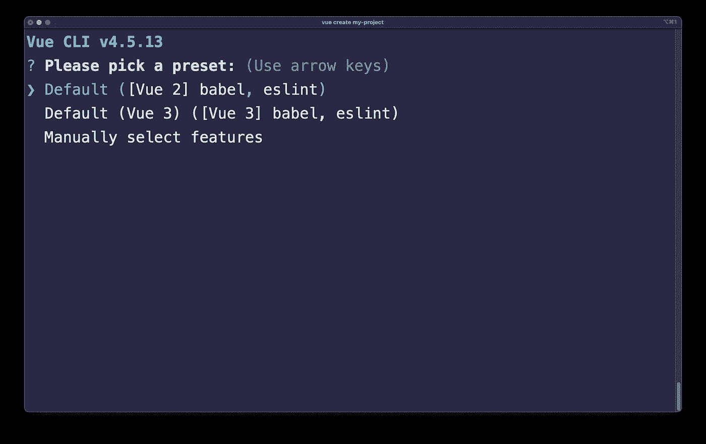
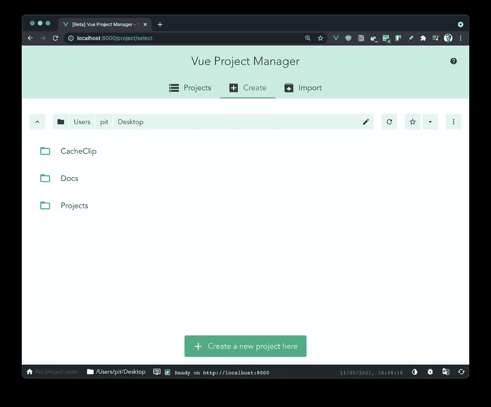
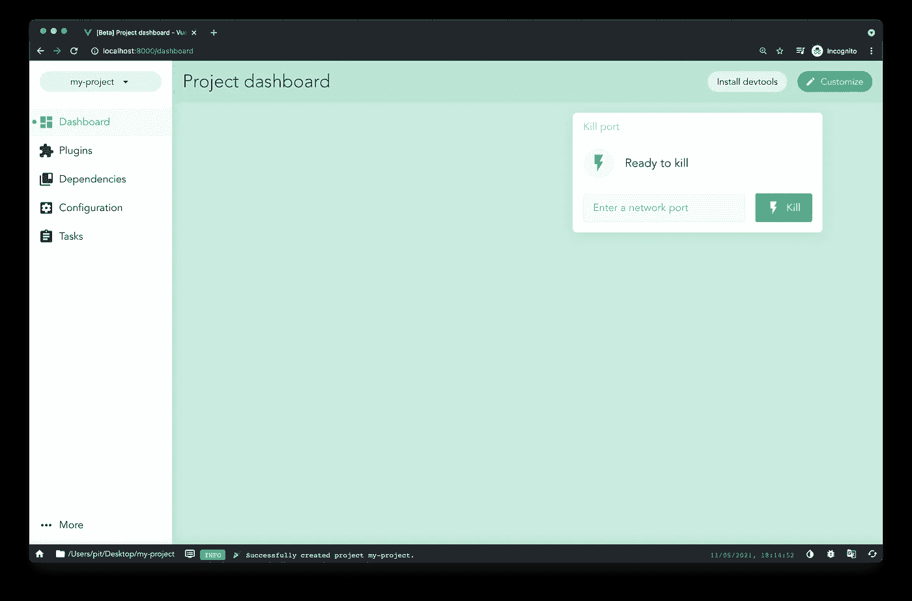

# 开始使用 Vue CLI 和 UI

> 原文：<https://javascript.plainenglish.io/get-started-with-vue-cli-and-ui-dbd48ab40efa?source=collection_archive---------15----------------------->

## 了解什么是 Vue CLI 和 UI 以及如何使用它们


Photo by [Pankaj Patel](https://unsplash.com/@pankajpatel?utm_source=medium&utm_medium=referral) on [Unsplash](https://unsplash.com?utm_source=medium&utm_medium=referral)

在这篇文章中，你将会学到关于 Vue **C** 命令 **L** ine **I** 接口。

Vue CLI 允许您创建预配置的 Vue 项目。另外，如果您喜欢图形用户界面，您可以使用 Vue GUI 来创建和配置您的项目。

# 先决条件

在跟随教程之前，你应该有关于终端和 Vue 的基本知识。此外，您应该在计算机上安装 Vue。您可以通过运行以下两个命令之一来检查是否安装了 Vue:

```
vue -V
```

或者

```
vue
```

`vue -V`输出您机器上的 Vue 版本。另一方面，`Vue`告诉您可用的 Vue 命令。

**如果您没有安装 Vue，运行上述任何命令时都会出现错误。然而，您将在本文后面看到如何安装和使用 CLI。**

# 什么是 Vue CLI

Vue CLI 是一个命令行界面，允许您从头开始创建和配置新的 Vue 项目。您可以使用 CLI，而不是从头开始项目并自己配置一切。

使用 CLI，您可以专注于构建应用程序，而不是花费宝贵的时间来配置它。因此，CLI 将为您完成所有工作，并允许您在几分钟内建立一个复杂的项目。



Figure 1

图 1 展示了运行中的 Vue CLI。有三个选项可供选择:

*   创建默认的 Vue 2 项目
*   创建默认的 Vue 3 项目
*   手动创建和配置项目

如果您选择最新的选项— *手动创建和配置项目*，您将需要回答一系列问题。这些问题的目的是根据您的需求配置项目。

因此，它允许您:

*   选择项目所需的特性——Babel、TypeScript、Vuex、PWA 支持等
*   选择是否需要 CSS 预处理程序。如果有，你可以选择你想要的。
*   添加棉绒和格式化程序。
*   将单元和/或 E2E 测试集成到您的项目中。
*   选择您想要开始使用的 Vue 版本— 2.x 或 3.x
*   选择是否使用类样式组件语法。
*   选择是否在 TypeScript 旁边使用 Babel。

Vue CLI Example

因此，您可以看到 CLI 的强大功能，以及它如何简化创建复杂项目的过程。想象一下手动设置一切所需的时间。

# 安装 Vue CLI

您可以通过运行以下任一命令在您的计算机上安装 Vue CLI:

```
npm i -g @vue/cli

// or

yarn global add @vue/cli
```

如果您喜欢 npm，请使用 npm。或者，如果你喜欢纱，就用纱。这两个命令都全局安装 CLI，这意味着您可以在计算机上的任何地方使用命令行界面。

```
vue create <project_name>
```

您可以使用上面的命令访问并运行 CLI。运行该命令后，将提示您一系列配置项目所需的问题。

**警告:**如果不想在机器上安装 CLI，可以使用`npx`。`npx`工具允许您从 NPM 注册表中使用 CLI 工具和其他可执行文件。也就是说，您可以在不安装它们的情况下使用它们。

```
npx vue create <project_name>
```

运行上述命令将启动 Vue CLI。您可以像安装在您的机器上一样使用它。

# 有用的命令

还有其他有用的命令可以和`vue create`命令一起使用。

## **默认配置**

您可以使用`-d`标志跳过问题，并使用默认预设创建一个 Vue 项目。

```
vue create -d my-project
```

如果您根本不想配置您的 Vue 应用程序，您可以使用默认设置。`-d`标志跳过所有提示，并立即创建应用程序。**需要注意的是**默认标志安装 Vue 2！

## **自定义预置**

另一个有用的标志是预设标志。您可以存储一个自定义配置，供所有 Vue 项目使用。

```
vue create -p my-preset my-project
```

当您使用相同的配置创建多个 Vue 项目时，此标志很有帮助。您可以保存一个预置，并将其用作所有后续 Vue 项目的默认设置，而不是一直回答 CLI 问题。

## **安装插件**

在创建一个 Vue 项目后，你可能想添加额外的插件。例如，假设您想要向项目中添加 TypeScript。

您可以使用`vue add`命令添加新插件。若要安装 TypeScript，您需要运行以下命令:

```
vue add typescript
```

同样，您可以在项目中添加其他插件！

## **更多命令**

上面的命令是我用得最多的。但是，您可以通过运行以下命令找到更多命令及其描述:

```
vue create -h

// or

vue -h
```

`vue create -h`命令告诉您创建 Vue 应用程序时可用的标志。另一方面，`vue -h`显示了可用于`vue`命令的标志，该命令用于创建项目、安装插件、构建应用程序等等。

# Vue GUI

那些更喜欢图形用户界面的人呢？Vue UI 是一个图形用户界面，您可以使用它来实现与 CLI 相同的功能。

您可以通过在终端中运行以下命令来打开 Vue GUI:

```
vue ui
```

一旦运行该命令，GUI 就会在端口`8000`上启动。您可以在`http://localhost:8000`访问 GUI，如下所示:



Figure 2

从那里，您可以像使用 CLI 一样创建和配置您的 Vue 项目。如果您点击图 2 中的按钮“Create a new project here ”,它将开始创建过程。

如果您遵循创建和配置过程，您将创建一个全新的 Vue 项目。图 3 展示了该项目的仪表板。

从仪表板中，您可以:

*   管理插件和依赖项
*   配置您的项目
*   运行`serve`、`build`、`lint`、`test`等任务。



FIgure 3

值得注意的是，您也可以导入和分析从命令行界面创建的 Vue 项目。此外，使用 Vue UI，您可以看到以下信息:

*   错误和警告的数量
*   资产、模块和依赖项大小
*   速度统计

如果想看用 UI 创建 Vue 应用的全过程，可以看下面的视频。

Vue UI Example

话虽如此，Vue UI 非常优秀，我鼓励你去尝试一下！它比 CLI 更直观，并且更易于创建、配置和管理 Vue 应用程序！

# 结论

至此，您应该能够熟练使用 Vue CLI 和 UI 来创建 Vue 应用程序。

在本文中，您将了解什么是 CLI 和 UI 以及如何使用它们。这只是一个介绍，但是还有更多关于 Vue CLI 的内容。如果你想深入了解它，我建议查看[官方 Vue 指南](https://cli.vuejs.org/guide/)。

*更多内容请看*[***plain English . io***](http://plainenglish.io)