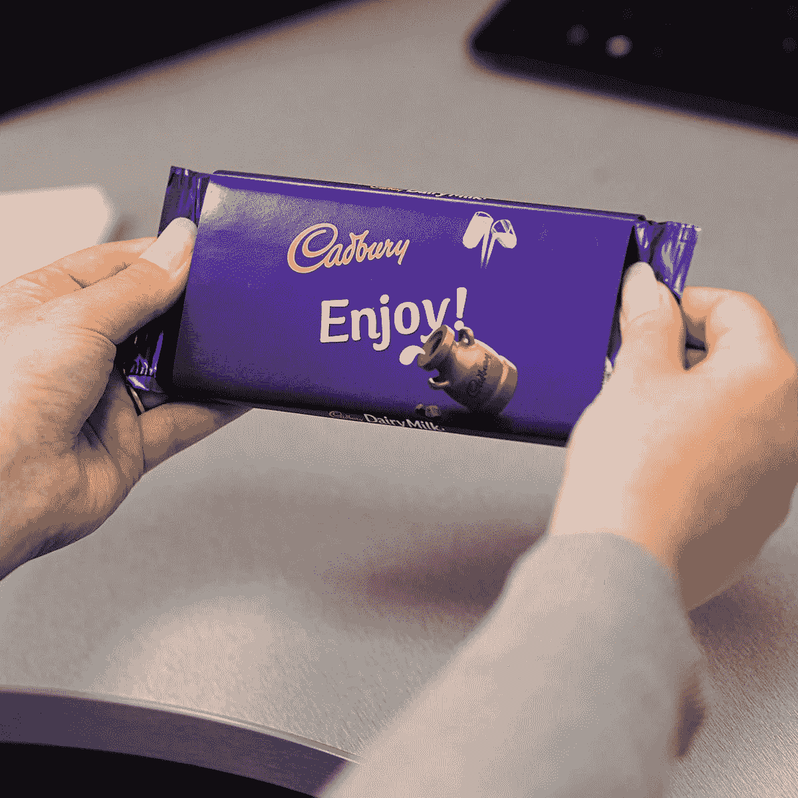
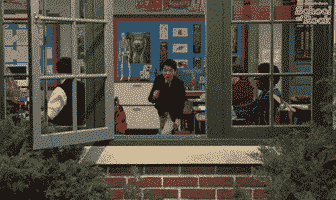

# 给自己一个甜蜜的反应导航条🍫

> 原文：<https://javascript.plainenglish.io/get-yourself-a-sweet-react-navbar-853d5fb2de52?source=collection_archive---------7----------------------->



当创建网页时，我总是先在导航栏上工作。这是为了确保我可以处理任何潜在的路线，并从上到下设计页面。在这篇博客中，我将介绍一种简洁的方式，你可以用一点消失(和出现)的动作来设计一个更现代的导航条！

## 玻璃态射👓



准备好跃入未来的设计与一些玻璃形态的吸引力！

现代设计的趋势是玻璃变形，或者换句话说，磨砂玻璃外观在许多领先的用户界面中很流行。为了达到这个效果，我们只需要一个 CSS 技巧— `backdrop-filter`。

下面的代码显示了我们需要使用的 CSS 属性和过滤器:

```
backdrop-filter: blur(20px)
```

就这么简单！我们使用模糊来创建磨砂玻璃外观，并调整像素来获得我们想要的模糊效果。

## 现在你看见我了，现在你看不见了！✨

如果你想让用户体验你的网站或网络应用程序，而没有任何导航条阻挡潜在的完整视图，那么这是你最好的解决方案之一！

我们想要创建一个导航条，它在向下滚动时消失，在向上滚动时出现。我们通过使用一些普通的 JavaScript 和 React 钩子来实现这一点。

首先，我们需要导入`useState`和`useEffect`，并设置如下所示的状态:

```
import React, { useState, useEffect } from 'react';
import '../../styling/navbar.css'; const NavBar = () => {  
  const [prevScrollPos, setPrevScrollPos] = useState(0);  
  const [visible, setVisibile] = useState(0); return (
    ...
  )}
```

然后我们添加一些样式来创建一个 navbar 消失时的平滑过渡，并将其添加到主 navbar div，如下所示:

```
import React, { useState, useEffect } from 'react';
import '../../styling/navbar.css'; const NavBar = () => {  
  const [prevScrollPos, setPrevScrollPos] = useState(0);  
  const [visible, setVisibile] = useState(0); const navbarStyles = { transition: 'top 0.6s' } return (
    <div className='nav-bar' style={{ ...navbarStyles, top: visible ? '0' : '-100px' }}>
    ...
  )}
```

根据导航条的长度，您将在三元运算符中相应地调整 falsy 值。由于我创建的导航条是`100px`，我已经将它设置为`-100px`，以便在向下滚动时完全隐藏导航条。

## 去抖⛹🏼

为了创建我们酷的导航条功能，我们将使用一个用普通 js 编写的助手方法。然后，我们将把它导入到我们的`NavBar`组件中加以利用。下面是 helper 方法的代码:

```
export function debounce(func, wait, immediate) { 
  let timeout; 
  return function() {  
    let context = this, args = arguments;  
    let later = function() {   
      timeout = null;   
      if (!immediate) func.apply(context, args);  
    };  
    let callNow = immediate && !timeout;  
    clearTimeout(timeout);  
    timeout = setTimeout(later, wait);  
    if (callNow) func.apply(context, args); 
  };
};
```

## 回过神来🏃🏽

现在，我们需要创建我们的`handleScroll`函数，使用`debounce`作为参数，使用`useEffect`来管理出现和消失行为:

```
import React, { useState, useEffect } from 'react';
import { debounce } from '../../utilities/helpers;
import '../../styling/navbar.css'; const NavBar = () => {  
  const [prevScrollPos, setPrevScrollPos] = useState(0);  
  const [visible, setVisibile] = useState(0); const navbarStyles = { transition: 'top 0.6s' } const handleScroll = debounce(() => {
    const currentScrollPos = window.pageYOffset;
    setVisibile((prevScrollPos > currentScrollPos && prevScrollPos - currentScrollPos > 70) || currentScrollPos < 10);
    setPrevScrollPos(currentScrollPos);  
  }, 100) useEffect(() => {    
    window.addEventListener('scroll', handleScroll);    
    return () => window.removeEventListener('scroll', handleScroll);
  }, [prevScrollPos, visible, handleScroll]); return (
    <div className='nav-bar' style={{ ...navbarStyles, top: visible ? '0' : '-100px' }}>
    ...
  )}
```

在我们的`handleScroll`函数中，我们将我们的滚动位置与之前的滚动位置进行比较，并给出我们希望导航条何时出现和消失的指针。在我们的`useEffect`函数中，我们根据在`handleScroll`中表达的滚动方向，寻找任何滚动以及导航条是否可见。

我希望这个小博客能在设计你自己的导航条时有所帮助，并给你的网站和/或网络应用程序带来更多的味道！

*更多内容尽在*[*plain English . io*](http://plainenglish.io/)