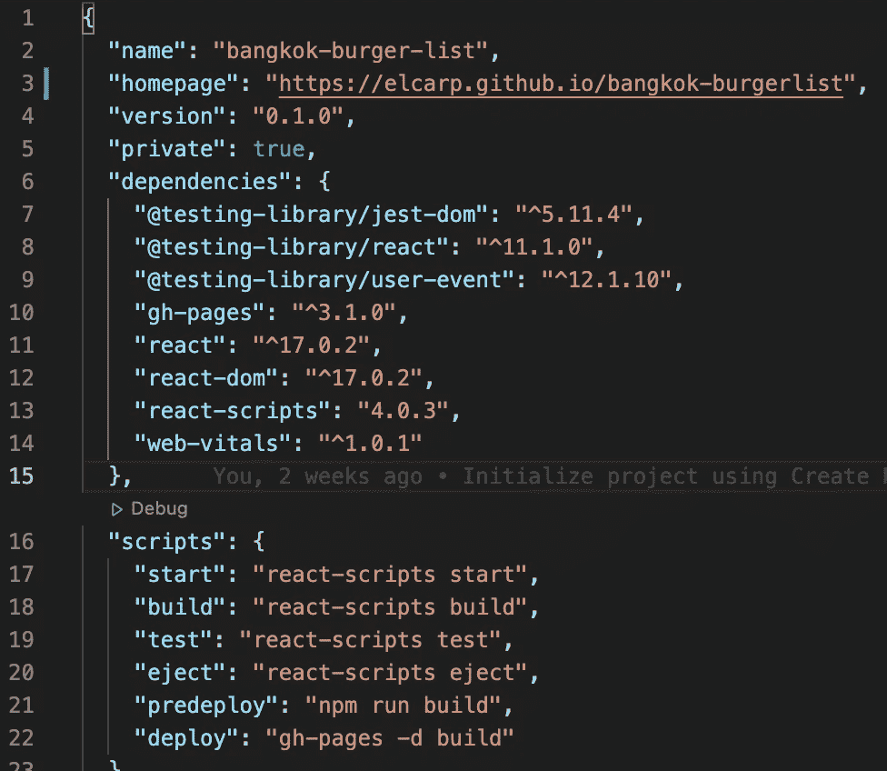
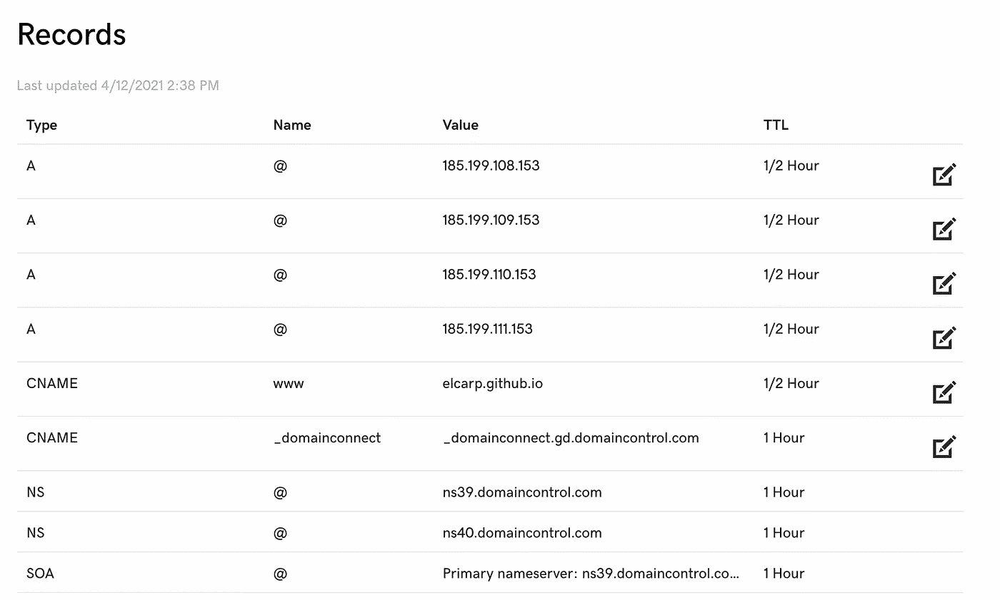
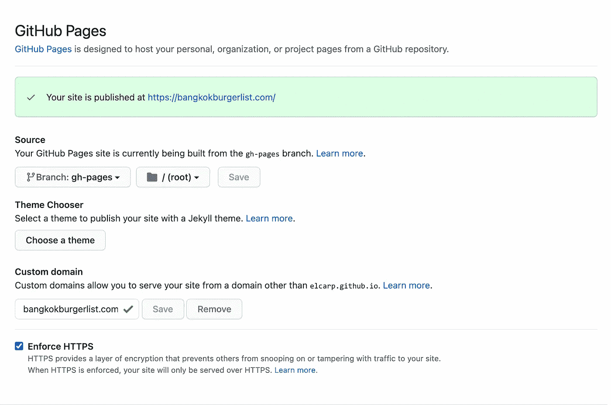
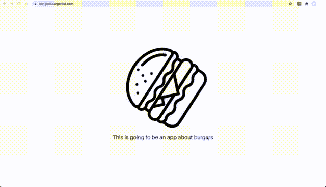

# 如何在几分钟内建立并运行一个带有自定义域的 React 站点

> 原文：<https://javascript.plainenglish.io/getting-a-react-site-with-custom-domain-up-and-running-within-minutes-8c8164b70fb4?source=collection_archive---------3----------------------->


Photo by [Ferenc Almasi](https://unsplash.com/@flowforfrank?utm_source=medium&utm_medium=referral) on [Unsplash](https://unsplash.com?utm_source=medium&utm_medium=referral)

我和朋友在外面讨论汉堡，并和他们分享了我在这个城市最确定的五大汉堡店。其中一个建议我把我的排名变成一个网站。出于好奇，我意识到我可以使用 React 和 Github 页面在几分钟内建立并运行它(当然还有一个关于汉堡的自定义域)。*接受挑战*。

这是一个关于使用 react-gh-pages 在几分钟内建立一个应用程序站点的教程。厉害的是， **如果你不介意你的资源库可以公开查看*，*** 这是完全**免费的**。因此，除了购买域名(每年花费不到一个汉堡)，我在几分钟内免费部署了一个应用程序。

***配料清单:***

*   自定义域(可选)
*   Github 帐户/完全空的 Github 存储库
*   安装了足够版本的 Node.js、npm 和`[create-react-app](https://github.com/facebookincubator/create-react-app)`。

1.  **获取自定义域(2 分钟)。我去了 Godaddy.com，找到了 bangkokburgerlist.com，并全力以赴。这代表了我在这里要做的事情。**
2.  **检查先决条件(1 分钟)。我遵循了 react-gh-pages 的教程，在这里可以找到:【https://github.com/gitname/react-gh-pages】T21，其中涉及到检查先决条件，我通过运行指定的命令来做到这一点。一切都好。**
3.  在 Github 上创建一个空的存储库。导航到您的 Github 帐户的“您的存储库”部分。点击绿色的“新建”按钮，键入一个存储库名称。确保下面没有被选中(所以没有 README.md，。gitignore，或者 license file added)，最重要的是确保你的库设置为 public 。当你完成这个过程后，将它设置为“private”会得到一个令人沮丧的 404 页面。
4.  创建应用程序。(30 秒)。运行:

```
npx create-react-app whatever-your-app-name-is
```

然后去那个文件夹

```
cd whatever-your-app-name-is
```

所以，在我的例子中，我写了`npx create-react-app bangkok-burger-list`，然后是`cd bangkok-burger-list.`

5.**将 Github pages 包作为开发依赖项安装(30 秒)。**

```
npm install gh-pages --save-dev
```

6.**打开项目文件夹，配置 package.json 文件(1 分钟)。**

在顶层添加这一行。

```
"homepage": "http://your-github-username.github.io/whatever-your-app-name-is"
```

在 scripts 属性中，添加这两行。

```
"scripts": {
  //...
  "predeploy": "npm run build",
  "deploy": "gh-pages -d build"
}
```

因此，您的配置应该如下所示



7.**在你的应用程序文件夹** (30 秒)**中创建一个 git 库。**

```
git init
```

它应该返回`Initialized empty Git repository in C:/path/to/whatever-your-app-name-is/.git/`

8.**将您在步骤 1 中创建的存储库作为“远程”添加到您的本地 git 存储库中** (30 秒)

```
git remote add origin https://github.com/your-user-name/whatever-your-app-name-is.git
```

现在，您的`-pages`包知道了您希望它在哪里部署您的应用程序，以及在哪里推送您的源代码。

9.**生成生产构建(1-10 分钟)。**在这里它变得非常令人兴奋！

```
npm run deploy
```

给它一两分钟(但不要太长)。您的页面将很快在[http://your-username.github.io/whatever-your-app-name-is](http://your-username.github.io/whatever-your-app-name-is)显示

一些文档说这个过程需要 10 分钟，但我认为平均下来不到 3 分钟。

如果您没有选择自定义域选项，恭喜您，您已经完成了！你现在可以开始开发这个非常酷的应用了。如果您这样做了，继续这个过程，将其连接到您的 Github 页面。

10.**指向您的域名。**需要增加 4 条 ANAME 记录，编辑您的 CNAME 记录。您的 CNAME 记录应该指向您的用户名 github.io，A 记录将指向:

*   185.199.108.153
*   185.199.109.153
*   185.199.110.153
*   185.199.111.153

您的设置应该如下所示:



11.**在 Github 页面设置中添加自定义域(1-30 分钟)。**在您的 Github 帐户中，导航到您的存储库设置→页面并滚动到“自定义域”部分。您可以在这里输入您的自定义域并保存。我将我的 TTL 设置为半小时，因此这一变化最多需要一小时来传播*(至少我认为这是这个意思)。*一旦该功能生效，您应该可以选择“强制 HTTPS”，您应该这样做，因为这是一个免费的 SSL 证书。您的屏幕应该如下所示:



12.**完成！**等等——不。所以大多数教程都是这样的，但是一个我们遗忘的非常重要的设置是我们的**包。所以进入你的项目的**包。json** 在你的本地并且改变“主页”设置从:**

```
"homepage": "http://your-github-username.github.io/whatever-your-app-name-is"
```

到

```
"homepage": "https://whatever-your-custom-domain-is.com"
```

没有这最后的改变，去我的域名不断打开一个悲伤的空白页。有很多有用的教程可以帮助你达到这个阶段，但是他们都没有提到这一点，至少对我来说是这样。有些人甚至把我送进了一个兔子洞，检查 StackOverflow，并进行各种其他更改。这解决了空白页的问题(至少对我来说)，几乎和将存储库设置为“公共”一样“没有废话”。

13.**好了，现在我们真的结束了！该使用您的应用程序了！**



**后记**:有时在部署之后，您需要在您的存储库的设置→页面和自定义域下继续添加域。只需重复第 11 步，只需几秒钟。

[*更多内容看 plainenglish.io*](http://plainenglish.io/)