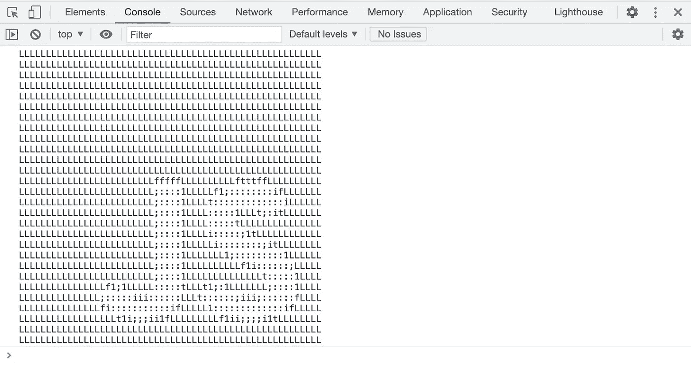

# 利用控制台 API 发挥创造力！

> 原文：<https://javascript.plainenglish.io/getting-creative-with-the-console-api-60253bfe75c5?source=collection_archive---------21----------------------->

**JavaScript 中的调试**一直与[控制台 API](https://developer.mozilla.org/en-US/docs/Web/API/Console) 密不可分，大部分时间只通过`console.log()`使用。但是，你知道事情不一定是这样的吗？难道`console.log()`还没有让你厌烦它的**单片**输出吗？你想让你的原木变得更好，更漂亮吗？如果是这样，请跟随我，因为我们将发现控制台 API 是多么丰富多彩和有趣！

# Console.log()

信不信由你，但是`console.log()`本身有一些你可能不知道的附加功能。当然，它的基本目的——**日志**——仍然没有改变。我们唯一能做的就是让它看起来更漂亮！让我们试试那个！

## 管柱接头

唯一与`console.log()`方法紧密相关的是，你可以用所谓的**字符串替换**来使用它。这基本上为您提供了在字符串中使用特定表达式的选项，这些表达式稍后将被所提供的参数替换。它看起来有点像这样:

不错吧。问题是字符串替换表达式有多种变体:

*   **%o / %O** —用于对象；
*   **%d / %i** —对于整数；
*   **%s** —用于字符串；
*   **%f** —用于浮点数；

但是，也就是说，你可能想知道为什么要使用这样一个特性？尤其是当您可以轻松地将多个值传递给日志时，如下所示:

同样，对于字符串和数字，可以只使用**字符串文字**！那么，交易是什么？首先，我要说的是，在做一些好的控制台日志记录时，您只是想要一些好的字符串，而字符串 subs 允许您轻松地做到这一点！至于上面的选择——你必须同意——你需要睁大眼睛寻找所有这些空间。有了接头，就方便多了。至于字符串文字 tho，它们还没有这些 subs 出现的时间长(惊讶！)，和…它们没有为对象提供相同的、漂亮的格式。但是，是的，只要你只处理数字和字符串，你可能更喜欢不同的方法。

## 半铸钢ˌ钢性铸铁(Cast Semi-Steel)

还有一个我们以前没有学过的类似 string-sub 的指令。这是`%c`，它允许你将 **CSS 样式**字符串应用到你记录的信息中！让我告诉你如何使用它！

上面的例子大量使用了`%c`指令。正如你所看到的，样式被应用到指令**之后的所有东西上。逃脱的唯一方法是使用另一个指令。这正是我们在这里所做的。如果您想使用普通的、无样式的日志格式，您需要传递一个空字符串。我认为，不言而喻，提供给`%c`指令以及其他字符串 subs 的值需要按照预期的顺序提交，一个接一个地作为进一步的参数。**

# 分组和跟踪

我们才刚刚开始，我们已经在日志中引入了 CSS 哇！控制台 API 还有哪些秘密？

## 分组

做太多的控制台日志记录并不真正健康——它会导致更差的可读性，因此……没有意义的日志。有一些适当的结构总是好的。有了`console.group()`，你就可以做到这一点。通过使用这种方法，您可以在您的控制台中创建更深层次的可折叠结构- **组**！这不仅可以让你隐藏，还可以组织你的日志。如果你想让你的组默认被折叠，还有一个`console.groupCollapsed()`方法。当然，根据常识，组可以任意嵌套。你也可以通过给你的组传递一个参数列表，让你的组有一个看起来像标题日志的东西(就像`console.log()`)。调用 group 方法后完成的每个控制台调用都将在创建的组中找到自己的位置。要退出它，你得用一个特殊的`console.groupEnd()`方法。简单吧？

我想你已经注意到了，你可以将所有提供的代码片段内的代码复制粘贴到你的控制台上，然后用你想要的方式来玩它们！

## 描摹

您可以通过控制台 API 获得的另一个有用信息是一个指向当前调用的路径(**执行路径** / **堆栈跟踪**)。你知道，代码中的列表放置了被执行的链接(例如函数链)以到达当前的`console.trace()`调用，因为这是我们正在讨论的方法。无论是检测**副作用**还是检查代码流程，这些信息都非常有用。只要把下面的片段放到你的代码中，就能明白我在说什么了。

# 控制台。XXX

你可能已经知道控制台 API 的一些不同的方法。我说的是那些给你的日志增加一些额外信息的。但是，让我们也快速浏览一下，好吗？

## 警告

`console.warn()`方法的行为就像 console.log(像大多数日志记录方法一样)，但是，除此之外，它还有自己的**类似警告的风格**。⚠在大多数浏览器中，它应该是黄色的，并在某处有一个警告符号(出于自然原因)。默认情况下，对该方法的调用还会返回**跟踪**，因此您可以快速找到警告(以及可能的 bug)来自哪里。

## 错误

与`console.warn()`类似，`console.error()`方法输出带有堆栈跟踪的消息，这是特别设计的。通常是红色的**加上一个错误图标。它清楚地通知用户有些事情不对劲。这里重要的一点是。error()方法**只是一个控制台消息**，没有任何附加选项，比如停止代码执行(为此你需要抛出一个错误)。只是一个简单的注意事项，因为许多新人可能对这种行为感到有点不确定。**

## 信息和调试

还有两种方法可以用来给你的日志添加一些顺序。我们正在谈论`console.info()`和`console.debug()`。这些输出并不总是有独特的风格——在一些浏览器中，它只是一个**信息图标**。相反，这些方法以及之前的方法允许您对控制台消息应用特定的类别。在不同的浏览器中(例如在我基于 Chromium 的浏览器中), dev-tools UI 为您提供了一个选项，让您选择某个**类别的日志**来显示，例如错误、调试消息或信息。只是多了一个组织功能！

## 维护

甚至有一个特定的控制台 API 方法，为您提供任何条件日志记录的快捷方式(**断言**)。叫`console.assert()`。就像标准的`console.log()`方法一样，它可以接受无限个参数，不同之处在于第一个参数必须是一个**布尔值**。如果它解析为真，那么断言保持安静，否则，它**记录错误**(同。error()方法)与所有传递的参数一起发送到控制台。

而且，在所有这些混乱之后，你可能想让你的控制台留言板看起来干净一点。没问题！只需使用`console.clear()`方法，就能看到你所有的旧日志都消失了！这是一个非常有用的特性，它甚至在大多数浏览器的控制台界面中都有自己的按钮(和快捷方式)!

# 时机

控制台 API 甚至提供了一小组与**计时**相关的函数。在他们的帮助下，您可以对部分代码进行快速而粗略的性能测试。就像我之前说的，这个 API 很简单。首先使用`console.time()`方法，该方法可以将一个可选参数作为给定计时器的标签**或标识。所提到的计时器就在调用该方法的时刻启动。然后你可以使用`console.timeLog()`和`console.timeEnd()`方法(带有可选的标签参数)来记录你的时间(以**毫秒**为单位)并相应地结束相应的计时器。**

当然，如果您正在进行一些真正的基准测试或性能测试，我会推荐使用专门为此目的设计的[性能 API](https://developer.mozilla.org/en-US/docs/Web/API/Performance_API) 。

# 包括…在内

如果您有如此多的日志，以至于您不知道代码的给定部分已经执行了多少次——您已经猜到了！—有这样的 API！`console.count()`方法可能做了它能做的最基本的事情——它统计**被调用了多少次**。当然，您可以传递一个可选参数，为给定的计数器提供一个标签(默认为 default)。您可以稍后用`console.countReset()`方法重置选择的计数器。

就我个人而言，我没有看到这些特定特性的很多用例，但有这样的东西存在是件好事。也许只是我…

# 桌子

我认为这是控制台 API 最被低估的特性之一(除了前面提到的 CSS 样式)。在调试和检查**平面**或**二维** **对象**和**数组**时，向您的控制台输出真实的、**可排序表格**的能力会非常有用。是的，没错——你实际上可以在你的控制台上显示一个表格。它所需要的只是一个简单的带有一个参数的`console.table()`调用——很可能是对象或数组(原始值只是被正常记录，多于 2 维的结构被截断成更小的对应物。只要试一下下面的片段就能明白我的意思了！

# 控制台 ASCII 图片

没有 **ASCII 艺术**游戏机艺术就不一样了！在[图像到 ascii 码](https://github.com/IonicaBizau/image-to-ascii)模块(可以在 [NPM](https://www.npmjs.com/package/image-to-ascii) 上找到)的帮助下，你可以轻松地将普通图像转换成它的 ASCII 码副本！除此之外，该模块提供了许多**可定制的设置**和选项来创建您想要的输出。下面是这个库的一个简单例子:

有了上面的代码，你就可以创建一个**惊艳的 JS logo** ！

ASCII art JS logo

在 CSS 样式、一些填充和背景属性的帮助下，您还可以将一个**完整的图像**输出到您的控制台！例如，你可以看看 [console.image](https://github.com/adriancooney/console.image) 模块(在 [NPM](https://www.npmjs.com/package/console.image) 上也有)来玩这个功能。但是，我仍然认为 ASCII 更加……**时尚**。

# 现代日志

正如您所看到的，您的日志和调试过程作为一个整体不必如此单色！世上有比简单的`console.log()`更多的美好。有了这篇文章中的知识，选择权就在你手中！你可以继续使用传统的`console.log()`和你的浏览器提供的不同结构的非常好的格式，或者你可以用上面描述的技术给你的控制台增加一些新鲜感。不管怎样，只要**继续享受乐趣**...即使你在和一只非常讨厌的虫子战斗！

我希望你喜欢这篇文章，它能让你学到一些新东西。一如既往，考虑与他人分享**，这样任何人都可以让他们的控制台**充满色彩**，并通过**反应**或**评论**将**您的意见**留在下面！还有，**在 Twitter 上关注我** [，或者在我的脸书页面上关注我](https://twitter.com/areknawo)！再次感谢你的阅读，下一集再见！**

***更多内容请看*[***plain English . io***](http://plainenglish.io/)**